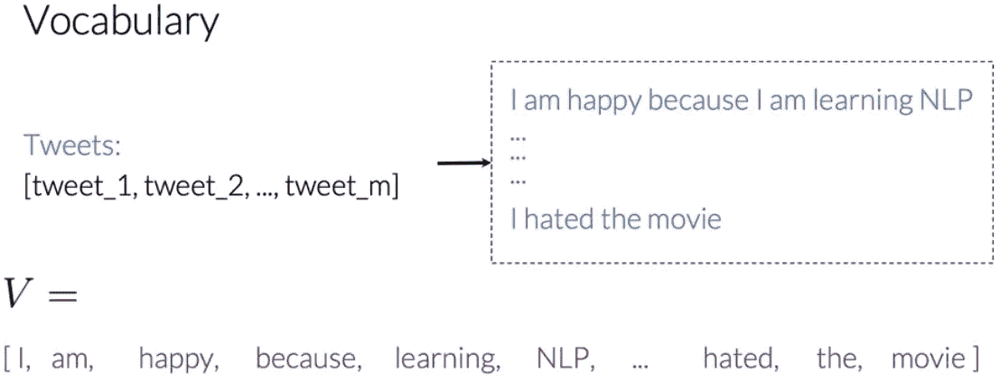
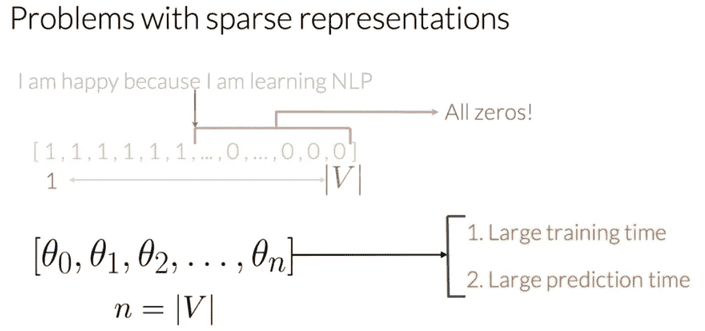

# 基于逻辑回归的情感分析(上)

> 原文：<https://medium.com/analytics-vidhya/sentiment-analysis-with-logistic-regression-part-1-a2759f155b09?source=collection_archive---------18----------------------->

情绪分析在当今非常有用，因为它允许我们获得特定主题背后的更广泛观点的概览。例如，分析顾客评论可以帮助我们了解顾客对我们产品的正面或负面感受。人类很容易理解文本的意思。然而，如果我们依靠人工来对大量给定文本的情感进行分类，显然是没有效率的。相反，我们可以应用 NLP 技术进行大规模情感分析。

对于这个话题，我将要谈论的是:

*   第 1 部分:用逻辑回归进行情感分析
*   第二部分:逻辑回归回顾

这篇文章是“用逻辑回归进行情感分析”的第一部分。

*免责声明:本文基于 Coursera 上* ***自然语言处理与分类和向量空间*** *课程的第一周。学分以下的大部分数字归课程版权所有。*

**在这里查看我的最终项目** *:* [*点击链接*](https://github.com/KarenJF/deeplearing_nlp/blob/master/c1_nlp_classification_vec_spaces/week1/C1_W1_Assignment.ipynb)

# 第 1 部分:用逻辑回归进行情感分析

在第 1 部分中，我将介绍在推文中使用逻辑回归进行情感分析的过程，也就是识别正面推文和负面推文。

在高层次上，我们可以按照以下步骤使用逻辑回归来执行情感分析:

*   预处理文本，使其清晰易读
*   创建字典映射，将文本表示为数字向量
*   提取有用的特征来表示给定的文本
*   对我们创建的特征执行逻辑回归，以预测给定文本的情感。

# **1。有监督的 ML(培训)**

在受监督的机器学习中，我们有输入特征 X 和一组标签 y。现在，为了确保我们根据数据获得最准确的预测，我们的目标是尽可能降低错误率或成本。

*   我们使用特征 X 来运行我们的预测函数。
*   我们运行预测函数，该函数接收参数数据以将特征 X 映射到输出 Y hat。
*   当期望值 Y 和预测值 y hat 之间的差异最小化时，实现了从要素到标注的最佳映射，这通过比较输出 Y hat 与目标 Y 的接近程度来实现。
*   我们更新参数并重复整个过程，直到成本最小化。

*自然语言处理与分类和向量空间课程第 1 周的图片*

# 2.情感分析

根据维基百科的介绍，“**情感分析**(也称意见挖掘或情感 AI)是指利用自然语言处理、文本分析、计算语言学、生物统计学对 ***情感状态和主观信息*** 进行系统的识别、提取、量化和研究。”

一个简单的例子是:

*   给出一条推文:“我很开心，因为我在学 NLP。”
*   **的目标**是预测这条推文是正面还是负面的。

**问题是我们如何预测推文是正面的还是负面的？**

*   **方法:**预测正面或负面，这看起来像是一个二元分类问题。在机器学习中，我们并不总是需要使用花哨的深度学习技术。相反，如果我们可以使用 NLP 技术从文本中提取简单但有用的信息，我们就可以建立一个简单的逻辑回归模型来相当准确地识别正面或负面的推文。

*自然语言处理与分类和向量空间课程第 1 周的图片*

我们可以采取的步骤有:

*   首先，我们将处理训练集中的原始推文，以提取有用的特征。
*   然后我们将在最小化成本的同时训练逻辑回归分类器。
*   最终我们将能够做出预测。

*自然语言处理与分类和向量空间课程第 1 周的图片*

# 3.词汇和特征提取

**动机**:因为我们知道计算机和数字一起工作，而文本不是数字。在我们开始从推文中提取特征之前，我们需要考虑如何在计算机中表示文本？

为了将文本表示为向量，我们首先必须建立一个词汇表，这将允许我们将任何文本或任何推文编码为一组数字。

## 词汇

**定义:**给定一个文本列表，词汇 V 将是我们拥有的文本列表中的唯一单词的列表。

*   为了得到这个列表，我们可以使用的一个简单的方法是:遍历所有文本中的所有单词，并保存搜索中出现的每个新单词。

*自然语言处理与分类和向量空间课程第 1 周的图片*

## 特征抽出

为了从词汇表中提取特征，我们必须检查词汇表中的每个单词是否都出现在文本中。

*   如果是，那么我们将为该特性赋值 1。
*   如果没有，则赋值为 0。

**这种非零值相对数量较少的表示称为稀疏表示。**

例如，我们的示例文本的表示将有两个 1 和许多 0。这些对应于推文中没有的词汇表中的每个独特的单词。

*自然语言处理与分类和向量空间课程第 1 周的图片*

**问题** :
通过这种方法，我们立刻看到了一些问题:

*   这种表示将具有与整个词汇表的大小相等的多个特征。
*   对于每条 tweet，这会有很多等于 0 的特性。
*   利用稀疏表示，逻辑回归模型将不得不**学习 n+1 个参数**，其中 n 将等于词汇表的大小。*我们可以想象，对于大词汇量来说，这将是一个问题。*

*自然语言处理与分类和向量空间课程第 1 周的图片*

正如我们在上面看到的，随着 V 变大，向量变得更加稀疏。此外，我们最终拥有更多特性，并最终训练θV 参数。这可能导致更长的训练时间和更长的预测时间。总而言之:

*   训练你的模型会花费大量的时间
*   做预测要花费比必要时间多得多的时间。

**有没有更好的方法从文本中提取有用的特征？**

# 4.负频率和正频率

从文本中创建特征有许多创造性的方法。一种方法是获得正负频率。

## 正负计数

**目的:**我们可以学习将计数作为特征生成到逻辑回归分类器中。

*   具体来说，给定一个单词，我们希望跟踪它作为正面类别或负面类别出现的次数。
*   使用这两个计数，我们可以提取特征并将其用于逻辑回归分类器。

获取计数的步骤:

*   在训练数据集中有一组语料库。与该语料库相关联，我们将拥有一组独特的单词——词汇表。
*   对于情感分析，假设我们在这种情况下有两类——积极的或消极的。
*   对于每一个类，为了得到我们词汇中任何一个单词在每一个类中的出现频率，我们必须计算它在该类中出现的次数。请注意，我们不把它算在整个训练集中。

下面是一个**正面推文词频**的例子:

*自然语言处理与分类和向量空间课程*第一周的图片

下面是**负面推文词频**的例子:

*自然语言处理与分类和向量空间课程第 1 周的图片*

**综上**:下面是各班词频的样子。实际上，这个表是一个从词类到词频的字典映射。所以它将单词和它对应的类别映射到它在类别中出现的频率或次数。

*自然语言处理与分类和向量空间课程第 1 周的图片*

# 5.基于频率的特征提取

之前，我们提到我们基于 V 词汇提取特征，这意味着我们的逻辑回归需要学习 V 特征。当 V 变大时，这将是个问题。

我们可以通过**使用我们创建的频率表**将一个单词表示为 3 维向量来降低 V 维。这样做，我们的逻辑回归分类器将有更快的速度，因为我们只需要学习 3 个特征，而不是学习 V 个特征。

## 三维向量特征提取

我们可以提取特征来表示一条推文，如下所示:

*   偏见术语
*   出现在 tweet 上的词汇的正频率之和。
*   出现在 tweet 上的词汇的负频率总和。

因此，为了提取这种表示的特征，我们只需要对单词的频率求和。

*自然语言处理与分类和向量空间课程*第一周的图片

## 让我们看一个例子:我很难过，我没有学习 NLP

*   得到正频率之和= 8

第一周的图片*分类和向量空间课程的自然语言处理*

*   得到负频率之和= 11

*自然语言处理与分类和向量空间课程*第 1 周的图片

*   因此，在这个例子中，tweet 可以表示为:

*自然语言处理与分类和向量空间课程第 1 周的图片*

# 6.预处理

**动机**:在我们开始为 NLP 项目建立任何模型之前，大部分时间是对文本进行预处理，使其变得干净，以便能够从中提取有价值的特征。

我们会采取一些常见的步骤来清理文本。

## A.预处理:停用词和标点符号

删除所有对推文没有重要意义的词，也就是停用词和标点符号。在实践中，我们会将我们的推文与两个列表进行比较——停用词和标点符号。这些列表通常要大得多。

*   去掉停用词后，句子的整体意思可以毫不费力地推断出来。
*   请注意，在某些情况下，我们不必删除标点符号。因此，我们应该仔细考虑标点符号是否为特定的 NLP 任务添加了重要信息。

*自然语言处理与分类和向量空间课程第 1 周的图片*

## B.预处理:句柄和 URL

推文和其他类型的文本通常有句柄和 URL，但这些对情感分析任务没有任何价值，所以我们也可以消除它们。

*自然语言处理与分类和向量空间课程第 1 周的图片*

## C.预处理:词干和小写

*   **词干化**:NLP 中的词干化就是简单地将任何单词转化为**它的基本词干**，我们可以将它定义为用来构造单词及其派生词的字符集。**因此，当我们对语料库中的每个单词执行这一过程时，词汇量将显著减少。**
*   小写:为了进一步减少你的词汇量而不丢失有价值的信息，你必须将你的每一个单词都小写。

在此之后，我们的推文将被预处理成一个单词列表[tun，great，ai，model]。下面我们可以看到我们如何消除句柄，将其标记为单词，删除停用词，执行词干处理，并将所有内容转换为小写。

*自然语言处理与分类和向量空间课程*第 1 周的图片

**综上**，预处理时，我们通常执行以下操作:

*   消除句柄和 URL
*   将字符串标记成单词。
*   删除“and，is，a，on 等”等停用词
*   词干化或将每个单词转换成词干。像舞者一样，跳舞，跳舞，变成“跳舞”。您可以使用 porter stemmer 来处理这个问题。
*   将所有单词转换成小写。

# 7.把所有的放在一起

之前，我们讨论了

*   执行情感分析方法(使用逻辑回归)。
*   提取有用的特征来表示推文
*   构建模型前预处理文本的常见步骤。

在本节中，我们**对它们进行总结，并把它们放在一起**。

*   **预处理**:对于每条 tweet，我们将 tweet 预处理成包含所有相关信息的单词列表。
*   **创建字典**:有了这个单词列表，我们就能够使用频率字典映射得到一个很好的表示。
*   **提取特征**:最后，得到一个带有偏差单位和两个附加特征的向量，存储流程 tweet 上的每个单词出现在正面 tweet 上的次数之和，以及每个单词出现在负面 tweet 上的次数之和。

*自然语言处理与分类和向量空间课程第一周的图片*

实际上，我们必须在一组 m 条 tweets 上执行这个过程。

*自然语言处理与分类和向量空间课程第 1 周的图片*

最后我们会有一个矩阵，X 有 m 行和三列，每一行包含每一条推文的特征。

*自然语言处理与分类和向量空间课程第 1 周的图片*

就是这样！我们已经讲述了如何使用逻辑回归来预测推文的正面和负面情绪。在下一篇文章中，我将回顾逻辑回归。

*最初发表于*[*【https://github.com】*](https://github.com/KarenJF/deeplearing_nlp/blob/master/c1_nlp_classification_vec_spaces/week1/README.md)*。*