# 基于逻辑回归的情感分析(下)

> 原文：<https://medium.com/analytics-vidhya/sentiment-analysis-with-logistic-regression-part-2-5306cff5256b?source=collection_archive---------16----------------------->

在[使用逻辑回归的情感分析(第一部分)](/analytics-vidhya/sentiment-analysis-with-logistic-regression-part-1-a2759f155b09)中，我们讨论了如何使用逻辑回归进行情感分析的整体方法。在这篇文章中，我们将回顾什么是逻辑回归。

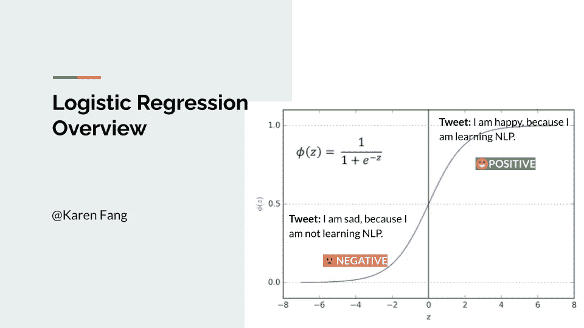

这篇文章是“用逻辑回归进行情感分析”的第二部分。在这篇文章中，我将谈论:

*   逻辑回归概述
*   训练逻辑回归
*   检验逻辑回归
*   逻辑回归成本函数

*免责声明:本文基于 Coursera 上* ***自然语言处理与分类和向量空间*** *课程的第一周。学分以下的大部分数字归课程版权所有。*

**在这里查看我的最终项目** *:* [*点击链接*](https://github.com/KarenJF/deeplearing_nlp/blob/master/c1_nlp_classification_vec_spaces/week1/C1_W1_Assignment.ipynb)

# 第二部分:逻辑回归回顾

## 1.逻辑回归概述

之前(参见[第 1 部分](/analytics-vidhya/sentiment-analysis-with-logistic-regression-part-1-a2759f155b09))，我们已经学习了如何预处理我们的数据并为我们的情感分析提取特征。我们可以用逻辑回归来预测结果。那什么是逻辑回归？在高层次上，**逻辑回归利用了一个 sigmoid 函数，它输出 0 到 1 之间的概率。**

*   在逻辑回归 H 中用于分类的函数是 **sigmoid 函数**，它取决于参数θ和特征向量 Xi，其中 I 用于表示第 I 个观察值或数据点。
*   视觉上，当θ转置 X 的点积接近负无穷大时，sigmoid 函数接近 0，当θ转置 X 接近无穷大时，sigmoid 函数接近 1。
*   对于分类，需要一个阈值。通常，它被设置为 0.5，并且该值对应于θ转置和等于零的 X 之间的点积。

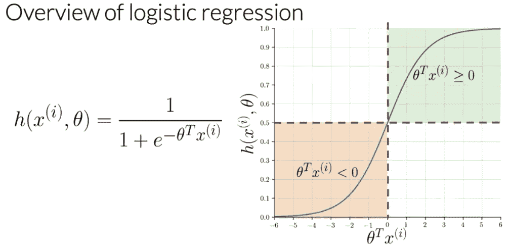

图片来自自然语言处理第一周的分类和向量空间课程

注意，作为

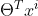

*   越来越接近负无穷大，sigmoid 函数的分母越来越大
*   结果，乙状结肠变得更接近 0。

另一方面，作为

*   越接近正无穷大，sigmoid 函数的分母越接近 1。
*   结果，乙状结肠也变得更接近 1。

**示例**:现在给定一条 tweet，我们可以将其转换为一个向量，并通过 sigmoid 函数运行它，以获得如下预测:

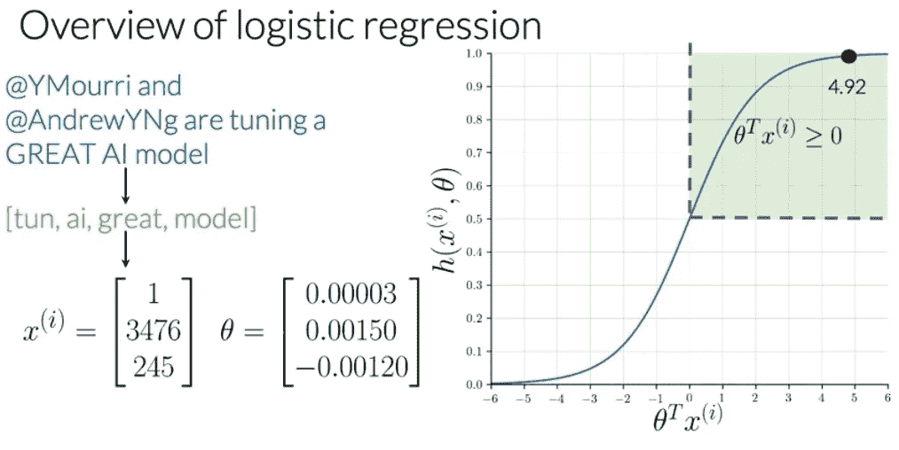

图片来自自然语言处理第一周的分类和向量空间课程

## 2.逻辑回归:培训

为了训练逻辑分类器，我们可以使用梯度下降来迭代，直到我们找到最小化成本函数的参数集θ。

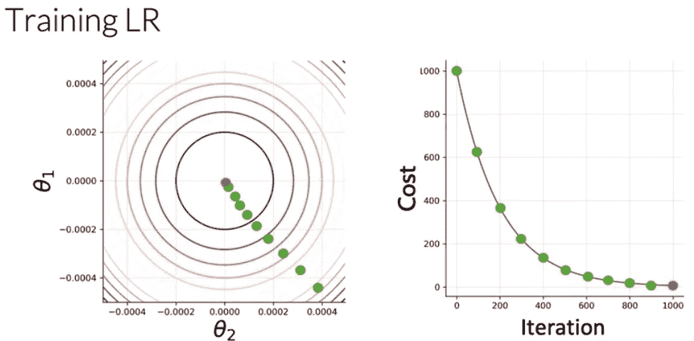

图片来自自然语言处理第一周的分类和向量空间课程

训练逻辑分类器，我们使用梯度下降:

*   首先，我们必须初始化参数向量θ。
*   然后，我们使用逻辑函数来获得每个观察值。
*   然后，我们计算成本函数的梯度并更新参数。
*   最后，我们将能够计算成本 J，并根据停止参数或最大迭代次数来确定是否需要更多的迭代。

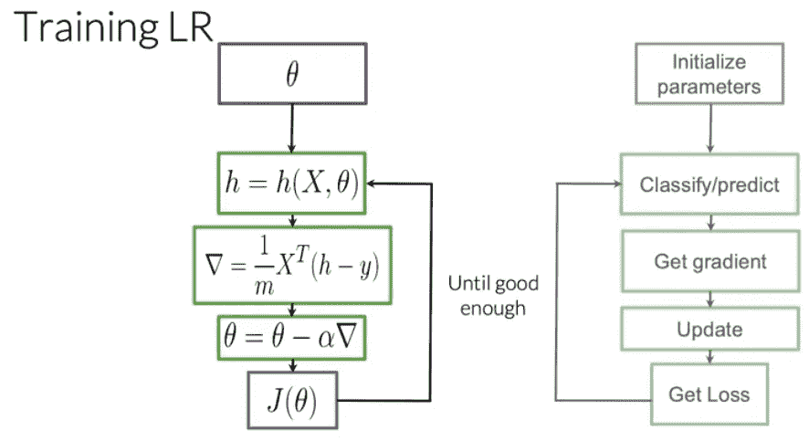

图片来自自然语言处理第一周的分类和向量空间课程

## 3.逻辑回归:测试

为了测试我们的模型，我们将在模型上运行我们的数据子集，称为**验证集**，以获得预测，并将其与真实标签进行比较，以计算模型的准确性。

*   首先，我们计算预测，这是 sigmoid 函数的输出。
*   然后，我们将输出与阈值进行比较。通常我们设定阈值= 0.5。如果输出> = 0.5，我们会将预测分配到一个正类。否则，我们会把它分配到一个负类。
*   最后，我们将有一个填充了 0 和 1 的向量，分别表示预测的负样本和正样本。

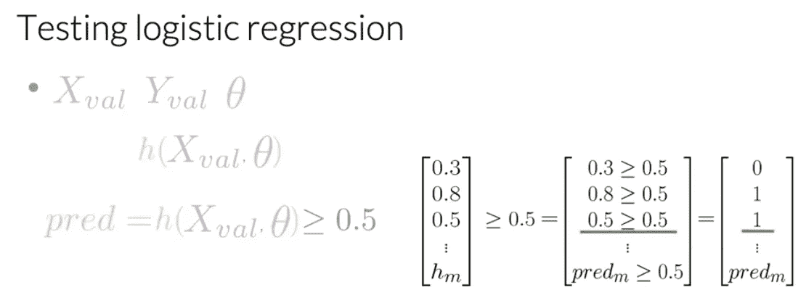

图片来自自然语言处理第一周的分类和向量空间课程

*   最后，我们可以计算模型在验证集上的准确性。准确度是模型预测与验证集中标签数量的真实标签相匹配的次数。此指标给出了您的逻辑回归对未知数据正确工作的估计时间。

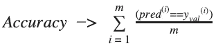

## 4.逻辑回归:成本函数

逻辑回归成本函数定义为:

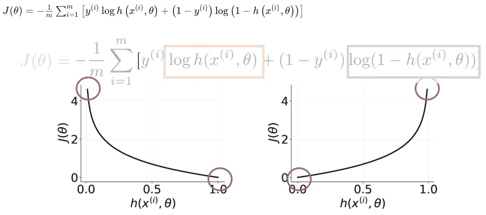

图片来自自然语言处理第一周的分类和向量空间课程

*   如果 y = 1，我们预测的值接近于 0，成本接近于无穷大。
*   如果 y = 0，我们预测它接近 1，成本也接近无穷大。
*   另一方面，如果预测等于标签，成本接近于零。
*   我们正在尝试最小化成本函数，以使预测尽可能接近标签。

## 5.高级主题:逻辑回归成本函数的数学推导

让我们编写一个函数，将两种情况(1 和 0)压缩成一种情况。

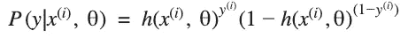

从上面可以看出，当 y = 1 时，我们得到 sigmoid 函数 h(x(i)，theta)，当 y = 0 时，我们得到(1-sigmoid)。

*   这是有意义的，因为两个概率等于 1(即，对于一个类分类，预测是 1 或 0)。
*   在任何一种情况下(1 或 0)，我们都希望通过使 sigmoid 函数 h(x(i)，theta)尽可能接近 1 来使其最大化。

现在我们想找到一种方法来模拟整个数据集，而不仅仅是上面的一个例子。为此，我们将可能性定义如下:

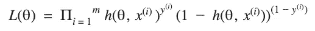

∏符号告诉我们，我们将各项相乘，而不是相加。**注意**如果我们弄乱了一个例子的分类，我们最终会弄乱总体可能性得分，这正是我们想要的。我们希望让模型适合所有数据点都相关的整个数据集。

**一个问题**是当 m 变大时，L(θ)趋于零，因为两个数 h(x(i)，θ)和(1-h(x(i)，θ))都在 0 和 1 之间。

*   由于我们试图最大化 L(θ)中的 sigmoid，所以我们可以引入 log，并且只最大化函数的 log。
*   引入日志可以让我们把一个产品的日志写成每个日志的总和。

我们可以将等式改写如下:

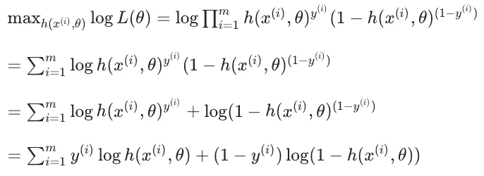

图片来自自然语言处理第一周的分类和向量空间课程

因此，我们现在除以 m，因为我们想看到平均成本。

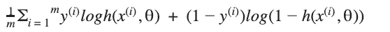

记住我们在上面的等式中最大化了 sigmoid。**事实证明，最大化一个方程等于最小化它的负值。**因此，我们添加了一个负号，并最终最小化了成本函数。

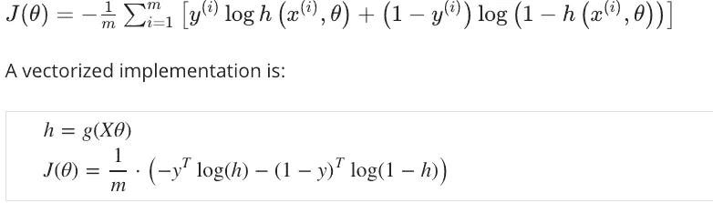

图片来自自然语言处理第一周的分类和向量空间课程

*原载于*[*https://github.com*](https://github.com/KarenJF/deeplearing_nlp/blob/master/c1_nlp_classification_vec_spaces/week1/README.md)*。*