# 基于朴素贝叶斯的情感分析

> 原文：<https://medium.com/analytics-vidhya/sentiment-analysis-with-na%C3%AFve-bayes-131bdc1737e3?source=collection_archive---------6----------------------->

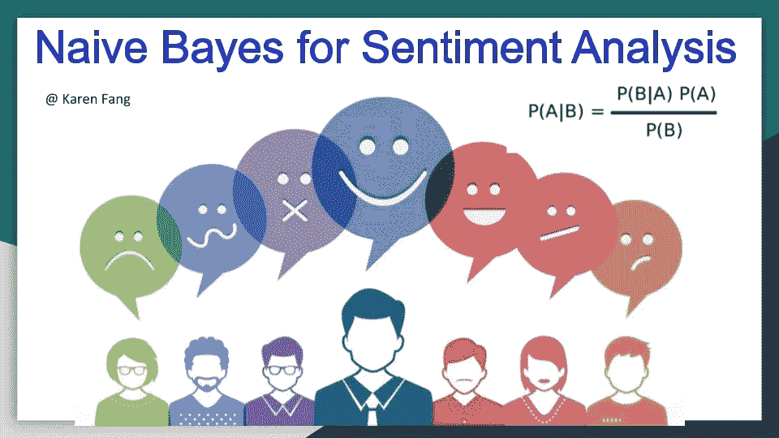

在[使用逻辑回归的情感分析(第一部分)](/analytics-vidhya/sentiment-analysis-with-logistic-regression-part-1-a2759f155b09)中，我们讨论了如何使用逻辑回归进行情感分析的整体方法。在这篇文章中，我们将讨论如何用朴素贝叶斯进行情感分析。

对于这个话题，我将要谈论的是:

*   介绍概率和贝叶斯法则
*   贝叶斯法则是什么
*   用于情感分析的朴素贝叶斯
*   处理数值下溢的对数似然
*   训练朴素贝叶斯
*   朴素贝叶斯模型的推断和检验
*   朴素贝叶斯假设
*   可选:朴素贝叶斯应用程序
*   可选:错误分析

*免责声明:本文基于 Coursera 上* ***自然语言处理与分类和向量空间*** *课程的第二周。学分以下的大部分数字归课程版权所有。*

**在这里查看我的最终项目** *:* [*点击链接*](https://github.com/KarenJF/deeplearing_nlp/blob/master/c1_nlp_classification_vec_spaces/week2/C1_W2_Assignment.ipynb)

# **1。概率和贝叶斯法则**

**简介:**想象一下，我们有一个庞大的推特语料库，可以分为积极情绪或消极情绪，但不能两者都是。在这个语料库中,“快乐”这个世界有时被标记为积极的，有时被标记为消极的。

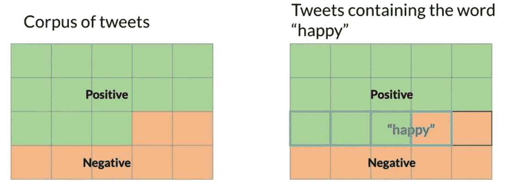

图片来自自然语言处理与分类和向量空间课程第 2 周

我们如何计算正面推文或负面推文的**概率**？

概率:考虑概率的一种方法是计算事件发生的频率。

*   事件的概率(正或负)= #特定事件/事件总数。
*   所有类别的所有概率之和必须等于 1。

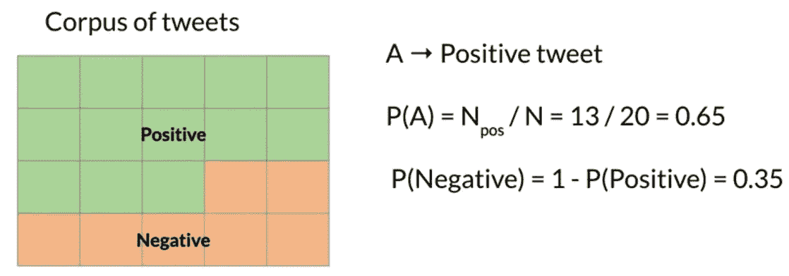

图片来自自然语言处理与分类和向量空间课程第 2 周

**相交概率**

为了计算两个事件发生的概率，比如下图中的“快乐”和“积极”，我们将寻找事件的交集或重叠。在这种情况下，红色和蓝色的盒子在 3 个盒子中重叠。所以答案是 3/20。

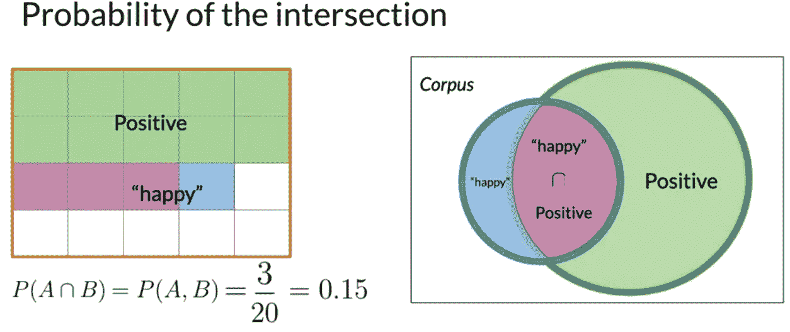

图片来自自然语言处理与分类和向量空间课程第 2 周

# **2。贝叶斯法则**

为了理解贝叶斯法则，我们先来谈谈**条件概率**。

**条件概率**帮助我们缩小样本搜索空间。当我们关注条件概率时，我们关注的不是整个语料库，而是条件部分内的语料库。

*   比如说我们想得到 P(正|“快乐”)，我们只看“快乐”词语料库内部的正词#而不是整个语料库，如下图。

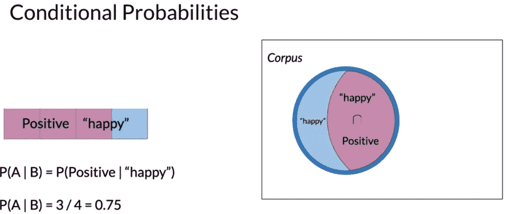

图片来自自然语言处理与分类和向量空间课程第 2 周

**总之**，条件概率可以解释为知道事件 A 已经发生的结果 B 的概率。换句话说，看集合 A 的元素，一个也属于集合 b 的几率。

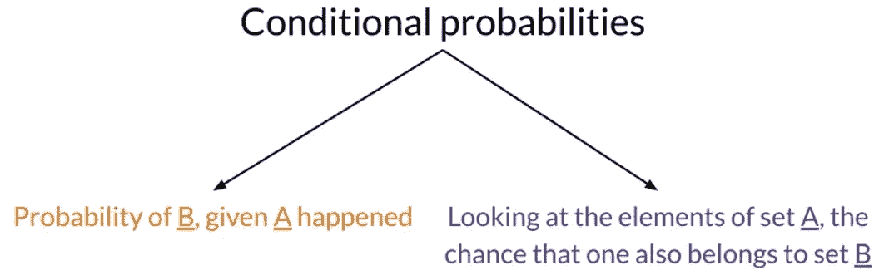

图片来自自然语言处理与分类和向量空间课程第 2 周

在数学公式中，P(A|B) = P(A & B) / P(B)。

例如，如果我们想得到 P(正|快乐)，我们只需要搜索蓝色的圆圈。

*   分子是“积极”和“快乐”相交的红色部分
*   分母将是蓝色部分，即语料库中所有“快乐”的单词。

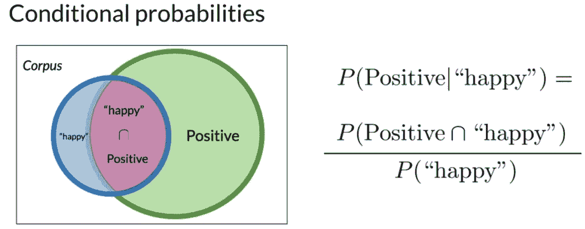

图片来自自然语言处理与分类和向量空间课程第 2 周

**推导贝叶斯法则**

给定两个等式:

1.  P(A|B) = P(A&B)/P(B)
2.  P(B|A) = P(A&B)/P(A)

请注意，相交概率 P(A&B)存在于两个公式中，因此我们可以使用公式 2 来替换 P(A&B)。然后，我们可以使用第二个公式将 P(A|B)解释为:

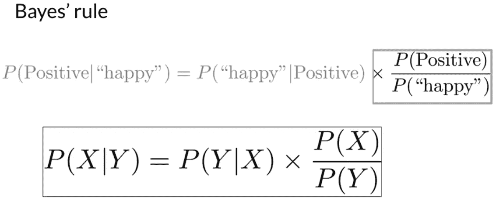

图片来自自然语言处理与分类和向量空间课程第 2 周

**总之:**

*   贝叶斯法则是基于条件概率的
*   P(X|Y) = P(Y|X)*P(X)/P(Y)

# **3。用于情感分析的朴素贝叶斯**

**简介:**朴素贝叶斯是监督机器学习的一个例子。之所以称之为幼稚，是因为这种方法假设**我们用于分类的特征都是独立的**，而事实上很少是这样的。然而，正如我们将会看到的，作为一种简单的情感分析方法，它仍然工作得很好。

**方法:**

**第一步:**我们从两组语料开始，一组是正面推文，另一组是负面推文。

**第二步:**提取词汇或语料库中出现的所有不同单词及其计数。换句话说，我们计算一个词在正面语料库和负面语料库中的每次出现的字数。

第三步:对正面语料库和负面语料库中的所有单词求和。请参见下面的前 3 个步骤的说明。

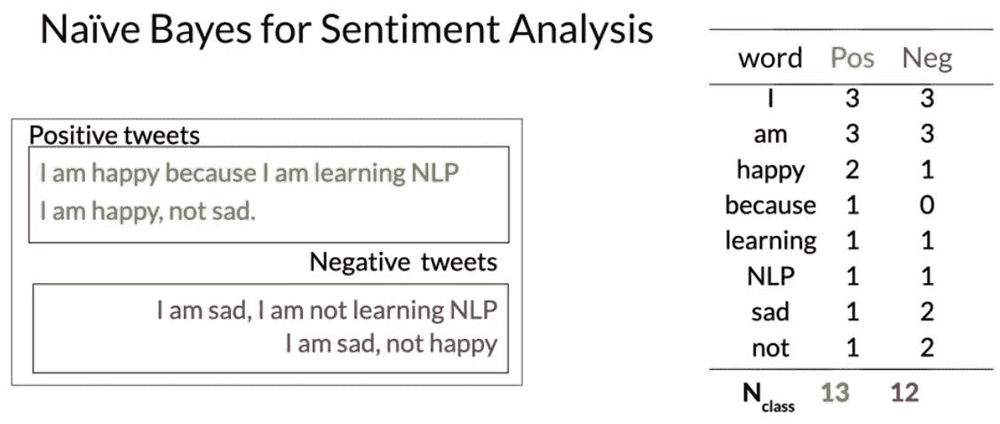

图片来自自然语言处理与分类和向量空间课程第 2 周

**第四步:**我们得到每个类中每个单词的**条件概率**。每类中条件概率的总和= 1。

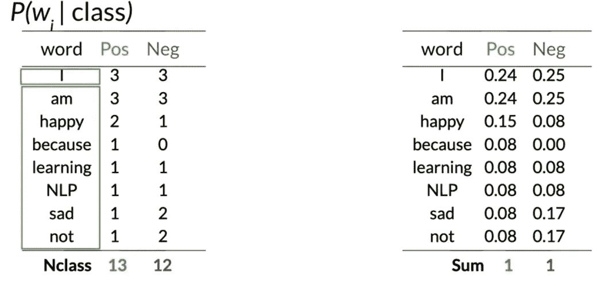

图片来自自然语言处理与分类和向量空间课程第 2 周

第 4 步的一些重要注意事项，请参照下图:

*   许多单词有一个**几乎相同的**条件概率。像我，am，学习，NLP。同样可能的话不会给情绪增加任何东西。它们被认为是中性词。
*   有些词在不同类别的概率之间有**显著差异**，比如“开心”、“伤心”、“不”。这些被认为是表达一种或另一种情绪的权力词汇。他们在决定推特情绪方面有很大的影响力。
*   有些词只出现在一个类中，比如“因为”。当这种情况发生时，我们没有办法比较正负类，这将成为后面概率计算的一个问题。**为了避免这种情况，我们将使用拉普拉斯平滑技术来平滑概率函数，这将在后面的部分中讨论。**

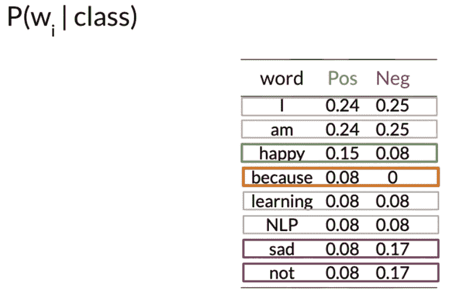

图片来自自然语言处理与分类和向量空间课程第 2 周

**步骤 5:** 根据我们在步骤 4 中得到的条件概率表，计算二元分类的朴素贝叶斯推理条件规则。那是给定的新推文，

*   我们将计算单词在正类中的概率，而不是在负类中的概率。
*   如果比率大于 1，那么它是一种积极的情绪，否则它是一种消极的情绪。

参见下图中的示例:

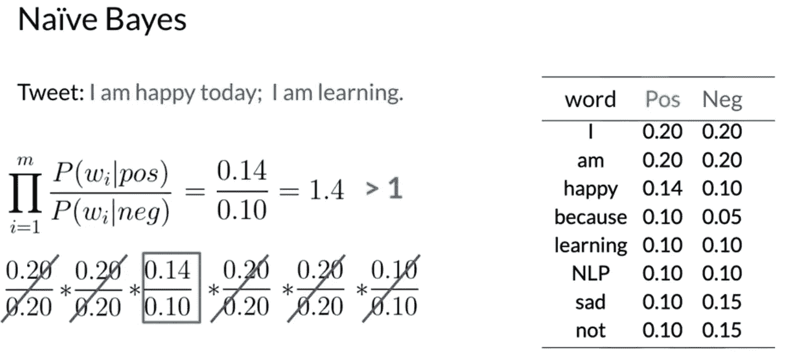

图片来自自然语言处理与分类和向量空间课程第 2 周

**拉普拉斯平滑**

**动机:**从上一节的步骤 4 中，我们看到有时我们会有概率在一个类中，但在另一个类中为零。当我们稍后在步骤 5 中计算朴素贝叶斯推理规则时，这会产生一个问题。为了避免这种情况，我们将使用一种叫做**拉普拉斯平滑**的技术。

拉普拉斯平滑方法:请按照下面的图片

1.  我们不是只计算一个单词在给定类中出现的次数，而是简单地在分子中加 1 以避免一个单词出现 0 次。
2.  将所有频率(分子)加 1 将导致概率不能被 N 个类别正确地标准化。由于整个词汇中有 V 个唯一词，我们将在分母中增加一个新项，这是整个词汇中唯一词的数量(V ),以说明分子中增加的额外项。
3.  调整后，每列(类)中的所有概率的总和仍为 1。

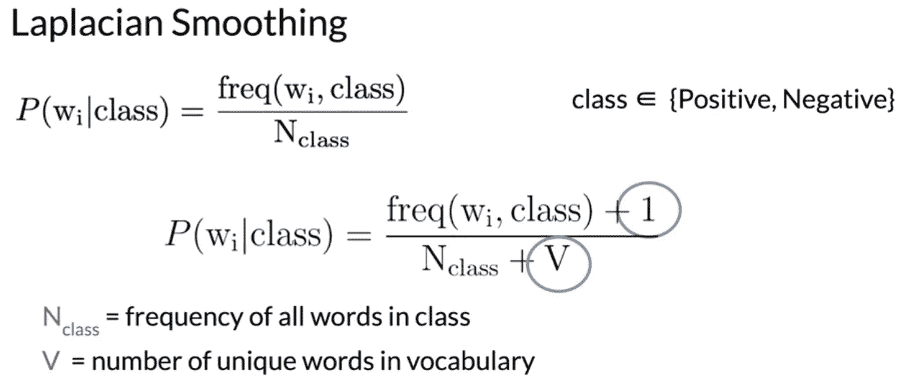

图片来自自然语言处理与分类和向量空间课程第 2 周

**示例:**使用前面的条件概率表，看看我们如何应用拉普拉斯平滑来固定否定类中“因为”的零概率。

*   先算一下独特词在整个词汇中的#吧。在这种情况下，V = 8
*   对每个类别中的每个单词应用拉普拉斯平滑公式。比如 P(I |“Po”)=(3+1)/(13+8)= 0.19
*   请注意，通过将 V 添加到每个类的分母来进行规范化，将导致每个类中的概率之和= 1，这正是我们想要的。

图片来自自然语言处理与分类和向量空间课程第 2 周

# **4。对数可能性**

**动机:**词语可以有多种不同的情感含义。但出于情感分类的目的，它们都被简化为:中性、积极和消极。所有这些都可以通过使用我们在上一节中创建的条件概率表来识别。

**概率比**

取积极类中每个词的概率与消极类中该词的概率之比，我们可以识别该词的情感意义。例如，对于概率的比率

*   它越大于 1，这个词就越积极。
*   如果比率= 1，这个词是中性的
*   它越接近 0，与那个词相关的负的就越多

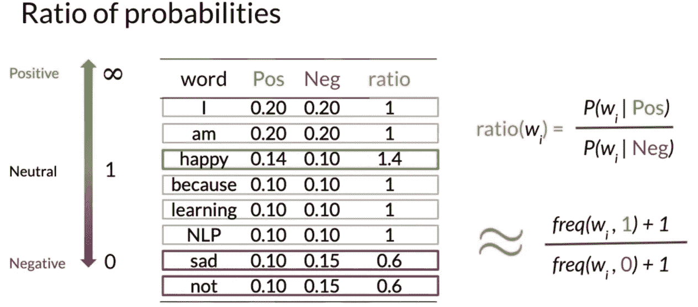

图片来自自然语言处理与分类和向量空间课程第 2 周

**朴素贝叶斯的推断**

这个比率(在上一节中)对于二元分类的朴素贝叶斯推断是非常重要的。在实际应用中，朴素贝叶斯推理表示为:

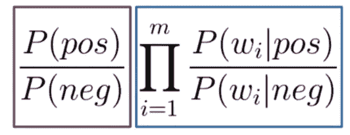

图片来自自然语言处理与分类和向量空间课程第 2 周

*   第一部分是正面推文与负面推文在整个语料库中的比例。当我们在现实生活中有一个不平衡的数据集时，这就变得很重要。
*   第二部分是 N 类中每个单词的概率比。
*   这两部分合起来就是完整的朴素贝叶斯二元分类公式。

**总结一下:**

*   “朴素贝叶斯”是一种简单、快速且强大的方法，我们可以用它来快速建立基线模型。
*   这是一个用于分类的概率模型。

**对数可能性**

**动机:**情感概率计算需要将 0 到 1 之间的多个数值相乘。在他们的计算机上执行这样的乘法有数字下溢的风险，因为返回的数字太小，不能存储在你的设备上。

**方法:**为了避免这种情况，我们可以将对数应用于概率的乘积。使用 log apply，我们可以将乘法转换为加法，这有助于解决数字下溢问题。

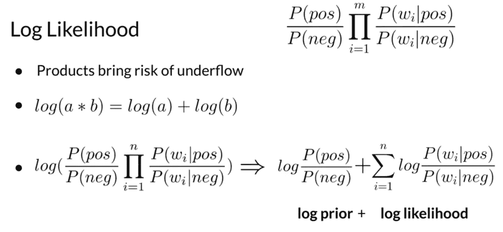

图片来自自然语言处理与分类和向量空间课程第 2 周

举例说明，**给出:**“我快乐，因为我在学习”

**第一步:**计算每个单词概率比的对数

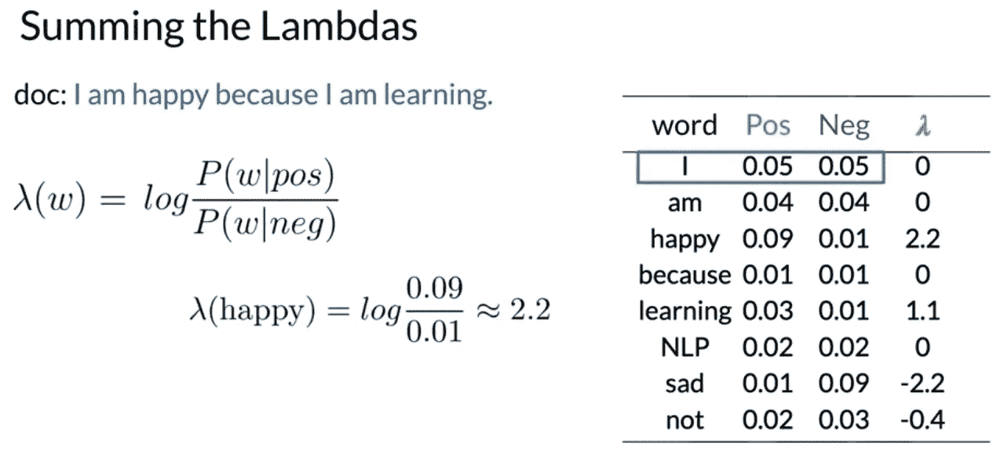

图片来自自然语言处理与分类和向量空间课程第 2 周

**第二步:**一旦我们有了每个词的λ比率，我们就可以通过计算句子的对数似然来推断新的推文。下面是一个例子。

*   由于对数似然= 3.3，大于 0，我们可以推断这条推文是正面的。

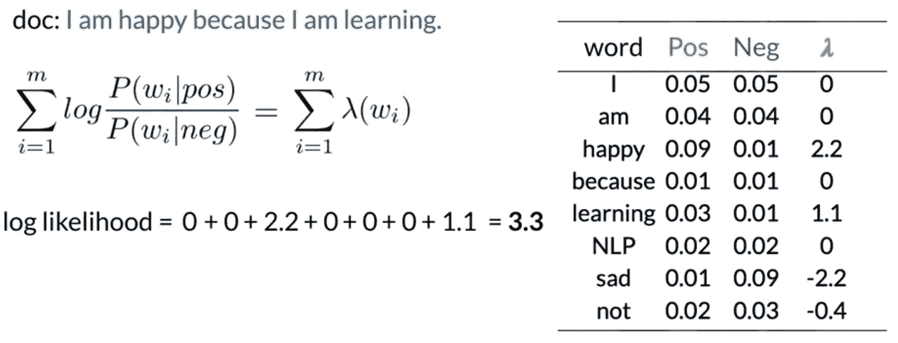

图片来自自然语言处理与分类和向量空间课程第 2 周

**注:**

*   在我们应用对数之前，概率的比率在 0 到正无穷大之间。
*   请注意，在对数之后，比率现在在负无穷大到正无穷大之间。

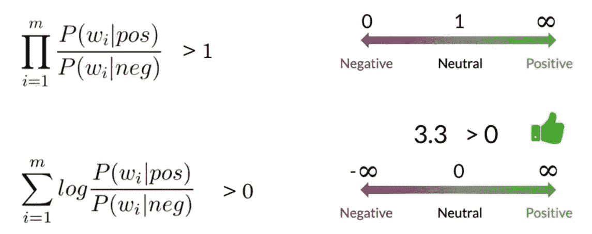

图片来自自然语言处理与分类和向量空间课程第 2 周

**总结一下:**

*   词语常常在情感上模棱两可，但通常我们可以将它们简化为三类:**中性、积极和消极**。
*   我们可以测量单词在这三个类别中的位置，以便进行二进制分类。
*   为此，我们可以计算每个类别中每个单词的条件概率比。
*   为了**避免数值下溢**乘以 0 和 1 之间的许多概率，我们也可以将比率表示为**对数**，称为λ。
*   我们将句子中每个单词的对数可能性相加，以推断它们的情感。如果对数可能性> 0，则情绪积极，< 0 then negative sentiment. = 0 neutral.

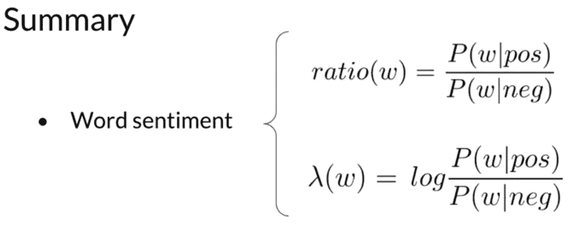

image from week 2 of Natural Language Processing with Classification and Vector Spaces course

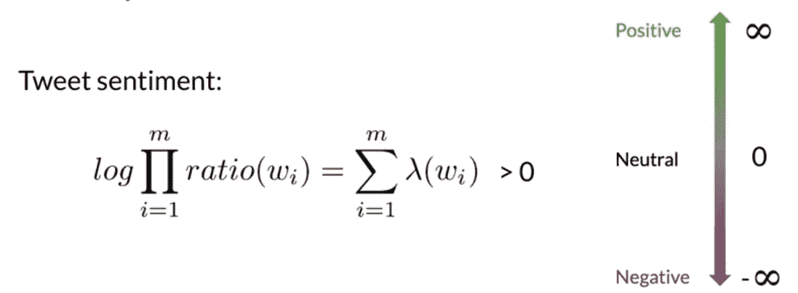

image from week 2 of Natural Language Processing with Classification and Vector Spaces course

# **5。训练朴素贝叶斯**

与逻辑回归或深度学习不同，在训练朴素贝叶斯模型时不涉及梯度下降。相反，我们只是计算语料库中单词的频率。

**训练朴素贝叶斯的 6 个步骤**

**步骤 0:** 收集并标注语料。对于情感分析，这一步意味着识别积极和消极的推文

第一步:对推文/句子进行预处理

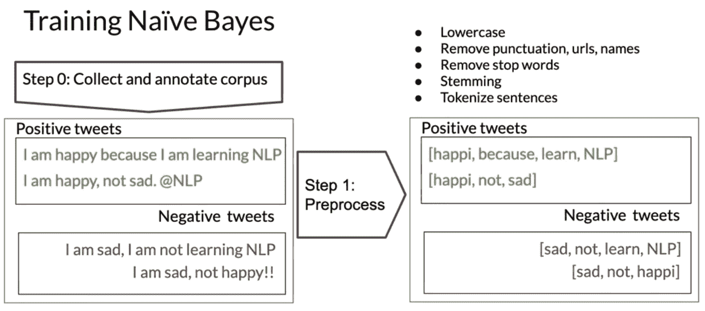

图片来自自然语言处理与分类和向量空间课程第 2 周

**第二步:**计算单词词频表。

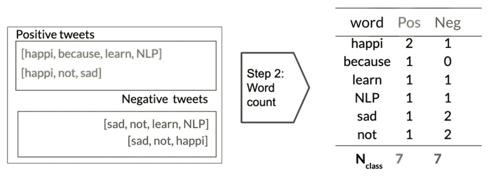

图片来自自然语言处理与分类和向量空间课程第 2 周

**步骤 3:** 通过应用拉普拉斯平滑，按类别计算每个单词的条件概率。

**步骤 4:** 获取每个单词的 Lambda，这是每个单词按类别的概率比的对数

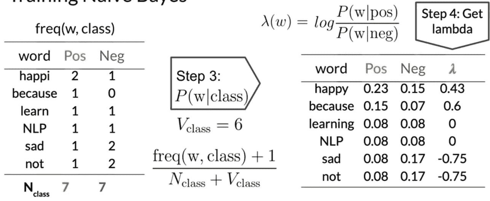

图片来自自然语言处理与分类和向量空间课程第 2 周

**第五步:**得到 log 先验的估计，即正文档数/负文档数之比的 log。对于平衡数据集，此对数先验= 0。对于不平衡的数据集，这个术语将变得很重要。

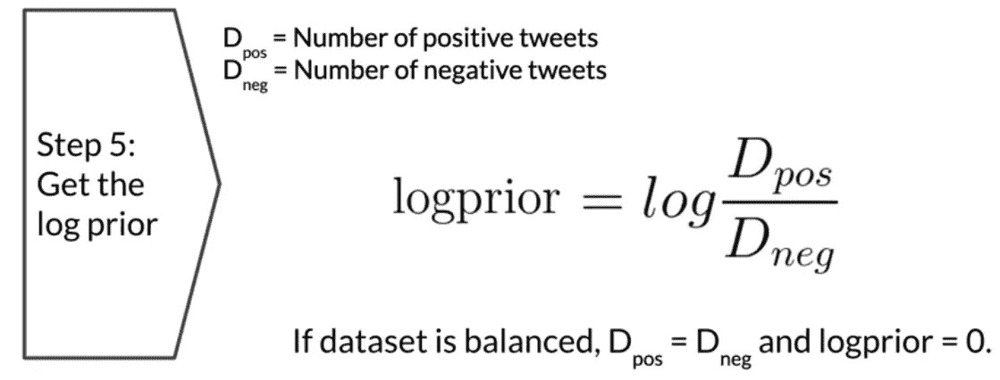

图片来自自然语言处理与分类和向量空间课程第 2 周

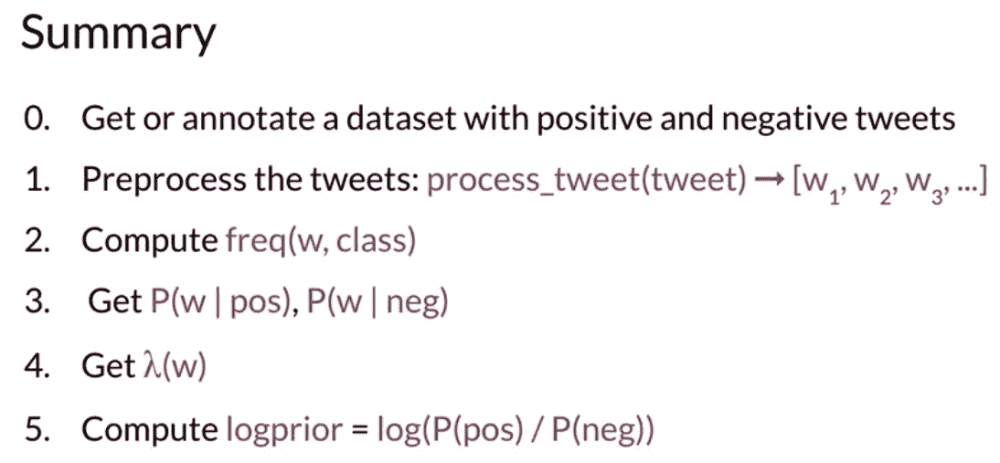

图片来自自然语言处理与分类和向量空间课程第 2 周

# **6。测试朴素贝叶斯**

**使用朴素贝叶斯进行预测**

对于任何给定的新文档，我们计算对数似然。请注意，对于在词汇表中找不到的单词，我们认为它们是中性的，它们不会在计算中增加任何权重。我们只是不为这些单词添加任何数字。

*   如果得分> 0，则为阳性
*   如果分数= 0，那么它是中性的
*   如果分数< 0, then it’s negative.

image from week 2 of Natural Language Processing with Classification and Vector Spaces course

**测试朴素贝叶斯**

在预测了验证集中每个文档的情感之后，我们可以将预测值与真实值进行比较，以计算这个朴素贝叶斯模型的准确性度量。

*   准确性度量= #预测与真实标签的匹配/#验证集中的文档

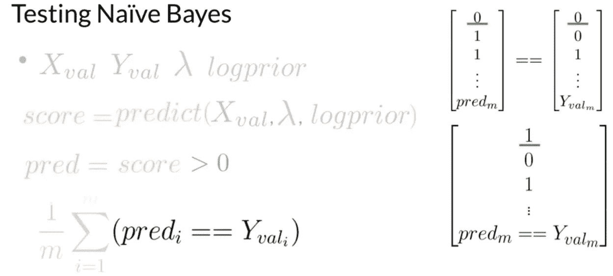

图片来自自然语言处理与分类和向量空间课程第 2 周

**总之**

*   使用 lambda 和 logprior 预测验证集中未知数据的情绪。
*   通过计算准确度度量，将预测与真实标签 Yval 进行比较。
*   对于没有出现在 lambda(w)中的单词，我们将它们视为中性单词，它们不会向对数似然计算添加任何值。

# **7。朴素贝叶斯假设**

朴素贝叶斯是一个简单而快速的模型，因为它不需要任何自定义参数。之所以称之为幼稚，是因为它对数据做了简单的假设。

**假设 1:独立性**

第一个假设是与每个类别相关的预测器或特征之间的**独立性。朴素贝叶斯假设一段文本中的单词是相互独立的，但事实通常并非如此。**

例如:撒哈拉沙漠阳光明媚，天气炎热。

*   这里“晴朗”和“炎热”两个词经常一起出现，所以它们很可能不是独立的。
*   此外，“阳光明媚”和“炎热”通常指海滩或沙漠。因此，在现实世界中,“阳光明媚”、“炎热”和“沙漠”这三个词可能并不相互独立。
*   但是朴素贝叶斯假设它们是独立的。

**潜在问题:**结果，这将导致潜在地低估或高估按类别的单个单词的条件概率。

**假设 2:语料库中的相对频率，尤其影响验证集(真实单词数据)。**

朴素贝叶斯的另一个问题是它依赖于训练数据集的分布。

*   一个好的数据集将包含与随机样本相同比例的正面和负面文档。然而，大多数可用的标注语料库是人工平衡的。
*   在现实世界中，正面文档比负面文档出现得更频繁，例如非垃圾邮件比垃圾邮件出现得更多。
*   假设现实表现为我们的“平衡”训练数据集，将导致非常乐观或非常悲观的模型。

**总之:**

1.  独立性的假设在现实世界中是很难保证的。尽管如此，这个模型在某些情况下还是很有效的。
2.  类的相对频率影响模型。例如，大多数可用的带注释的语料库是人工平衡的。然而，在现实世界中，数据可能会更加嘈杂。

# **8。朴素贝叶斯的应用**(可选)

**动机:**

1.  当我们使用朴素贝叶斯来预测文档的情感时，我们实际上做的是通过使用类中单词的联合概率来估计每个类的概率。
2.  朴素贝叶斯公式就是这两个概率的比值，先验和似然的乘积。
3.  除了情感分析，我们还可以使用条件概率之间的比率。

举个例子，

*   **作者识别**。例如，假设我们有一个由不同作者写的文档组成的大型语料库。我们可以训练一个朴素贝叶斯模型来识别一个文档是由一个还是另一个作者写的。
*   **垃圾邮件过滤**。利用来自发件人、主题和内容的信息，我们可以决定一封电子邮件是否是垃圾邮件。

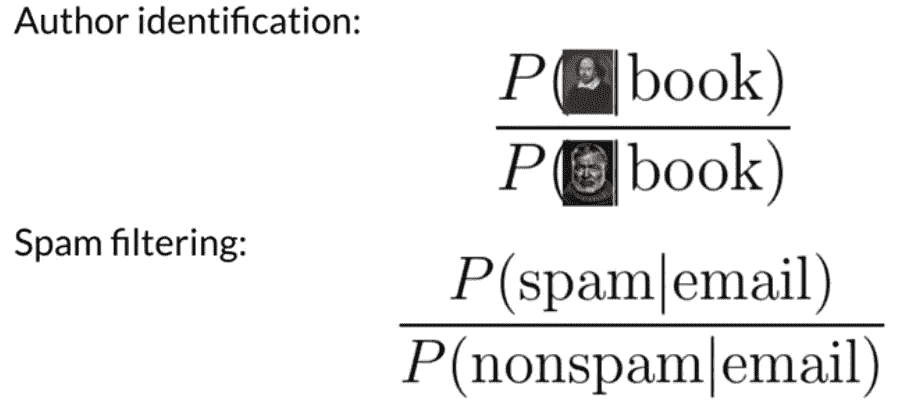

图片来自自然语言处理与分类和向量空间课程第 2 周

*   **信息检索**。朴素贝叶斯最早的用途之一是过滤数据库中相关和不相关的文档。给定查询中的关键字集，我们只需要计算给定查询的文档的可能性。我们事先不知道什么是不相关的，或者相关的文档是什么样的。因此，我们可以计算数据集中每个文档的可能性，然后根据可能性存储文档。我们可以选择保留前 M 个结果或可能性大于某个阈值的结果。

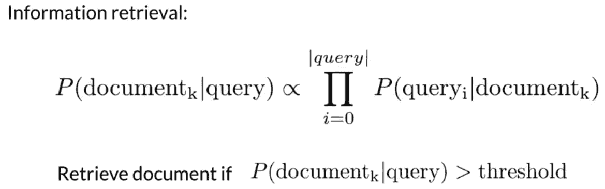

图片来自自然语言处理与分类和向量空间课程第 2 周

*   **消歧词**。例如，我们可以通过计算单词“bank”在不同类别中的可能性来识别单词“bank”在文档中是指河流还是钱。

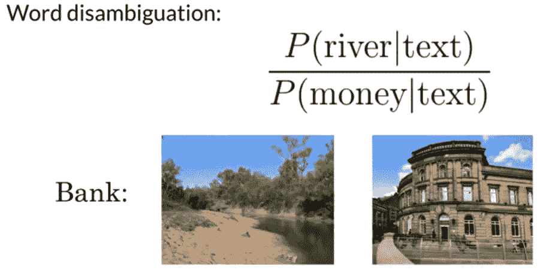

图片来自自然语言处理与分类和向量空间课程第 2 周

# **9。误差分析(可选)**

**动机:**无论我们用什么 NLP 方法，都会发现自己面临一个错误，比如一个分类错误的句子。在这里，我们将讨论这些问题可能导致的模型预测中的一些错误。

1.  **作为错误来源的处理:**仔细检查实际文本和预处理文本。

*   去掉标点符号可以代表不同的意思。比如:我敬爱的奶奶:(。在我们去掉标点符号后，可以很容易地将这句话归类为正面，但实际上它可以与悲伤脸标点符号一起非常负面。
*   删除单词。比如:“这样不好，因为你的态度连好都没有接近”。在我们去除一些停用词后，句子可以预处理为[好，态度，接近，好]，很容易归类为积极的。但事实上它可以是非常消极的。

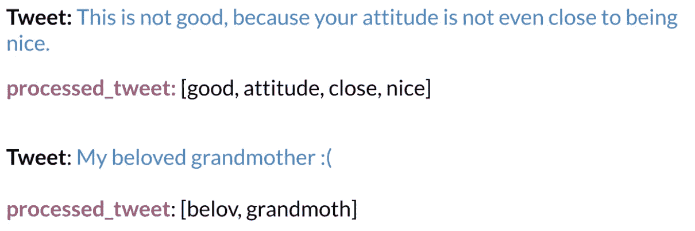

图片来自自然语言处理与分类和向量空间课程第 2 周

**2。语序**会影响句子情绪。考虑以下 2 句话:**而非**的顺序对两句话的分类非常重要。很明显，第一句话很正面，第二句话很负面。朴素贝叶斯模型可能会将他们归类为具有相同情感的人。

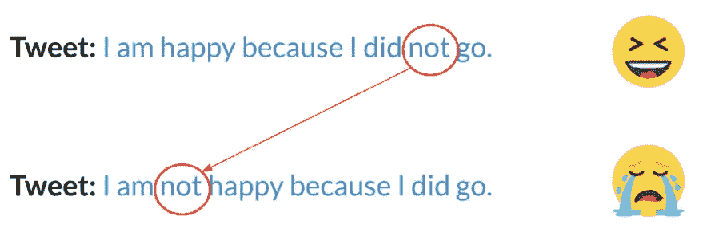

图片来自自然语言处理与分类和向量空间课程第 2 周

**3。对抗性攻击。**

对抗性包括讽刺，讽刺和委婉语。有时，在我们对文档进行预处理后，我们会得到一个主要是否定词的列表，但实际上真正的句子可能不是否定句。例如

*   **实际句子:**是一部强大到可笑的电影。情节扣人心弦，我一直哭到结尾！
*   **处理过的句子**:【嘲讽，权力，电影，剧情，握，哭，结束】

正如我们所看到的，在预处理之后，朴素贝叶斯模型会将这个句子归类为否定句，因为它包含许多否定词。然而，这句话是积极的，因为它表达了作者多么喜欢这部电影。

就是这样！我们已经介绍了**如何使用朴素贝叶斯预测推文**的正面和负面情绪。一如既往，请随时检查我的最终项目，如何把所有这些代码( [*点击链接*](https://github.com/KarenJF/deeplearing_nlp/blob/master/c1_nlp_classification_vec_spaces/week2/C1_W2_Assignment.ipynb) *)*

希望你喜欢这个阅读！:)