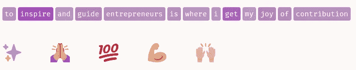
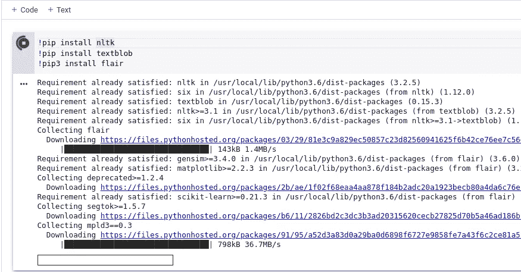
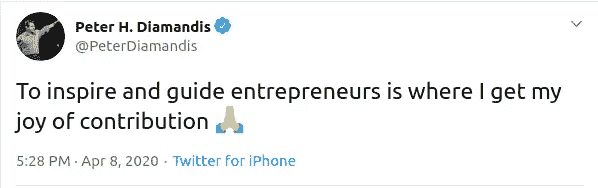
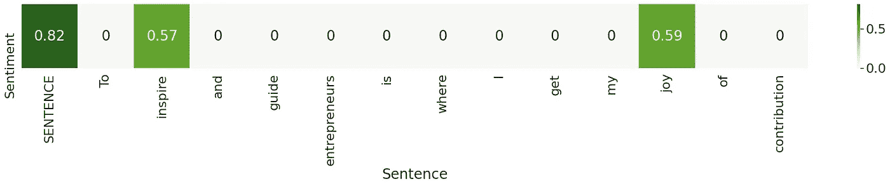
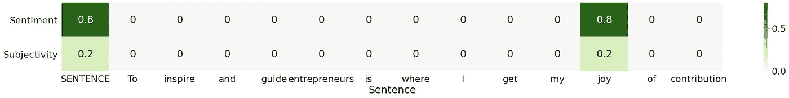
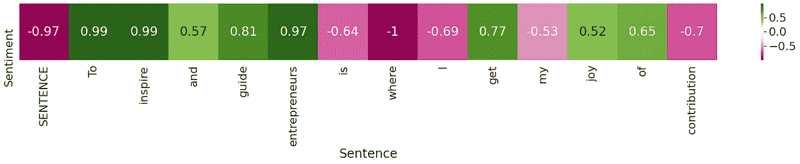

# 使用 NLTK、TextBlob 和 Flair 进行情感分析

> 原文：<https://medium.com/analytics-vidhya/sentiment-analysis-with-nltk-textblob-and-flair-a321d1460867?source=collection_archive---------6----------------------->



# 介绍

如果你曾经对情感分析或自然语言处理(NLP)模型如何帮助你确定一个特定的文本块是否有积极、消极或中性的情感感到好奇，本指南将帮助你开始。在我们开始之前，让我们先来讨论一下如何运行下面的代码示例。[谷歌合作者](https://colab.research.google.com/notebooks/intro.ipynb)提供在谷歌云服务上执行代码的笔记本。我强烈推荐给初学者。如果你有谷歌账号，你可以在你的硬盘里找到它。否则，您可以在本地机器上使用 [Conda](https://www.anaconda.com/distribution/) 环境和`pip install`模块。此外，我将使用 [seaborn](https://seaborn.pydata.org/) 进行可视化。



下面这篇文章的目的是教读者三种常用的方法来开始情感分析。我会提供一些代码，你将能够在 Colab 或 Conda 环境中运行。此外，我将讨论如何解释情感指标，并做一些可视化。这篇文章是为那些刚刚开始进入这个迷人的话题的人而写的，绝不是一个深入的探讨。最后，鉴于情绪分析通常用于推文，我选择了一条我特别喜欢的推文。



# NLTK

从文本中提取情感分数的一种流行方法是 NLTK Vader。Vader 是一个基于词汇和规则的情绪分析工具，专门针对社交媒体平台上最常见的情绪进行校准。当计算一个`polarity score`时，Vader 输出四个度量:`compound, negative, neutral`和`positive`。`compound`分数计算所有词汇等级的总和，在`-1 (most negative)`和`+1 (most positive). Positive`之间标准化，`negative`和`neutral`代表属于这些类别的文本的比例。

NLTK 代码示例

```
OUTPUT:
{‘neg’: 0.0, ‘neu’: 0.571, ‘pos’: 0.429, ‘compound’: 0.8176}
```



NLTK 可视化

# 文本 Blob

另一种以直接方式提供文本处理操作的技术称为 TextBlob。以下方法不同于 Vader，它返回一个带有`polarity`和`subjectivity`分数的`namedtuple`。主观性得分将在`[0.0, 1.0]`之间。得分`0.0`表示文本非常客观，得分`1.0`表示文本非常主观。`polarity`得分在`[-1.0, 1.0]`之间，当得分低于零时表示负面评价，当得分高于零时表示正面情绪。

TextBlob 代码示例

```
OUTPUT:
Sentiment(polarity=0.8, subjectivity=0.2)
```



TextBlob 可视化

# 天资

最后， [Flair](https://github.com/flairNLP/flair) 允许您将最先进的自然语言处理(NLP)模型应用于文本部分。它的工作方式与前面提到的模型完全不同。Flair 利用预先训练的模型来检测正面或负面的评论，并在标签后面的括号中打印一个数字，这是一个预测置信度。

Flair 代码示例

```
OUTPUT:
[NEGATIVE (0.9654256105422974)]
```



Flair 可视化

# 结论

使用自然语言处理模型对特定文本进行情感分析对于数据科学来说是一个强大的工具。例如，使用这些情感分析工具向 [pandas DataFrame](https://pandas.pydata.org/docs/reference/api/pandas.DataFrame.html) 添加特征，这是为了让机器学习模型预测在评论部分发布文本是否安全，这对初学者来说是一个好项目。我鼓励读者尝试自己运行代码，并将包括我的 Colab [笔记本](https://colab.research.google.com/drive/1EBRj83Lx8u2VjblyCSqec5u37MRRrhnF)。

## 参考

1.  休顿，C.J .和吉尔伯特，E.E. (2014 年)。 [VADER](https://www.nltk.org/_modules/nltk/sentiment/vader.html) :一个基于简约规则的社交媒体文本情感分析模型。第八届网络日志和社交媒体国际会议。密歇根州安阿伯，2014 年 6 月。
2.  [TextBlob](https://textblob.readthedocs.io/en/dev/) ，2017，[https://textblob.readthedocs.io/en/dev/](https://textblob.readthedocs.io/en/dev/)
3.  天赋:一个用于最先进的自然语言处理的易用框架。计算语言学协会北美分会 2019 年会议录(演示)。2019.