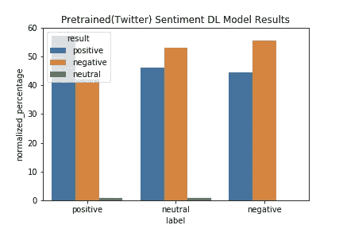

# 使用 SparkNLP 进行情感分析—再简单不过了

> 原文：<https://medium.com/analytics-vidhya/sentiment-analysis-with-sparknlp-couldnt-be-easier-2a8ea3b728a0?source=collection_archive---------5----------------------->

## 一个使用 sparkNLP 库的小型情感分析项目


[https://www.youtube.com/watch?v=SPmxsRDSmTc](https://www.youtube.com/watch?v=SPmxsRDSmTc)

自然语言处理是一项令人兴奋的技术，因为每天都有突破，当你考虑我们如何表达自己时，没有限制。当涉及到情感分析时，它变得更加复杂。比方说，如果我们正在分析客户的反馈，客户可以在一句话中给出正面和负面的反馈，他们可以是讽刺的(！) :)而且会拼错等等。等等..那我们该怎么办？

*在我开始之前，我想提一下，在这个故事的结尾，你会发现一些我在学习 NLP 时看到的文章。这些只是小步骤，我在这个领域只是一个初学者…*

对于情感分析，如果数据被标记为你很幸运，你可以使用单词包/嵌入来表示文本数字，并训练分类器对你的测试数据进行预测。

如果数据没有被标记，你还是幸运的，因为我们有预先训练好的嵌入来帮助你使用聚类得到相当好的结果。

然而，如果你在 Spark 和 NLP 上稍微搜索一下，你可能听说过 sparkNLP。我们有 pyspark.ml 库但是我不得不说；sparkNLP 让一切变得前所未有的简单。

您所要做的就是安装 sparkNLP:

 [## 装置

### 让我们创建一个新的 Conda 环境来管理那里的所有依赖项。您可以使用 Python 虚拟环境，如果…

nlp.johnsnowlabs.com](https://nlp.johnsnowlabs.com/docs/en/install) 

并开始玩它。

**数据集:**

*请随意选择任何其他数据集，这些步骤会尽可能通用地解释。*

[](https://www.kaggle.com/adarshsng/title-and-headline-sentiment-prediction) [## 标题和标题情感预测

### 预测文章标题和标题的情感分数。

www.kaggle.com](https://www.kaggle.com/adarshsng/title-and-headline-sentiment-prediction) 

**环境:** AWS EMR 5.29.0 带 Spark 2.4.4，TensorFlow 1.14.0

(你可以在[https://github . com/JohnSnowLabs/spark-NLP/blob/master/readme . MD](https://github.com/JohnSnowLabs/spark-nlp/blob/master/README.md)中找到需求)

0.导入库和预训练的情感分析器模型:

```
import sparknlp
from sparknlp.pretrained import PretrainedPipeline
```

有两种方法可以导入预训练管线:

a.离线:

从:[https://github.com/JohnSnowLabs/spark-nlp-models](https://github.com/JohnSnowLabs/spark-nlp-models)下载分析 _ 感知 _ 使用 _ 推特压缩文件

解压缩并加载到 s3。

当你解压的时候，我建议你检查文件夹，看看有哪些阶段正在进行中。:)

```
pipeline = PretrainedPipeline.from_disk(*model_s3_location*)
```

b.在线:

```
pipeline = PretrainedPipeline("analyze_sentimentdl_use_twitter", lang="en")
```

我手动添加了 sparkNLP jar，如果您也选择这样做，在创建 sparkSession 时，请确保您使用以下设置，否则我会得到诸如“Table not initialized”(设置序列化程序可以解决这个问题)、由于内存或通用语句编码器(这是此管道中的一个阶段)导致的 java 错误等错误，当集群模式为“yarn”时会导致一些错误。

```
spark = SparkSession.builder.master("local[*]") \
.config("spark.driver.memory", "12g")\                                   .config("spark.kryoserializer.buffer.max", "2000M")\
.config("spark.jars", jar_location)\
.config("spark.serializer ", "org.apache.spark.serializer.KryoSerializer")\
.config("spark.sql.broadcastTimeout",  "360000")\
.getOrCreate()spark.sparkContext.addPyFile(jar_location)
```

1.  将数据集读入 Spark 数据帧，并根据需要进行预处理:

a.删除非 ascii 字符

b.去掉标点符号(标点符号在某些情况下可能有用！)

c.删除短于特定长度的文本

d.纠正拼写(您可以使用 sparkNLP 'check_spelling_dl '进行上下文保留拼写纠正)

2.只需在数据集上运行预训练管道:

```
# rename the text column as 'text', pipeline expects 'text' inputColdf_result = \
pipeline.transform(df.withColumnRenamed("Headline", "text"))
```

3.打印 Schema 并从情感输出列中提取结果:

```
# extract results from "sentiments" columndf_result\
.selectExpr("text","explode(sentiment) sentiments", "SentimentHeadline")\
.selectExpr("text","sentiments.result result", "SentimentHeadline")\
.createOrReplaceTempView("result_tbl_")# sentiment labels in training data are float, so we map them to 
# categorical classesspark.sql("""
    SELECT
        text,
        CASE WHEN SentimentHeadline>0 THEN 'positive' 
        WHEN SentimentHeadline<0 THEN 'negative'
        ELSE 'neutral'
        END AS label,
        result
    FROM
    result_tbl_""").createOrReplaceTempView("result_tbl")# below is optional , visualize predictions
# calculate normalized percentage of results per labelsdf_counts = spark.sql("""

    WITH counts_tbl AS
    (SELECT COUNT(*) as label_count, label FROM result_tbl GROUP BY      label)SELECT
        joined_.result, 
        joined_.label,
        100*COUNT(*)/joined_.l_count AS normalized_percentageFROM
       (SELECT counts_tbl.label_count l_count, result_tbl.* 
        FROM result_tbl
        JOIN
        counts_tbl 
        ON
        counts_tbl.label = result_tbl.label) joined_GROUP BY  joined_.result, joined_.label, joined_.l_count""")# visualize results per labelsimport seaborn as sns
import matplotlib.pyplot as plt
%matplotlib inlinep_Result = result_df_.toPandas()p = sns.barplot(x="label", y="normalized_percentage", hue="result", data=p_Result)plt.title('Pretrained(Twitter) Sentiment DL Model Results')
plt.savefig('analyze_sentiment.png')
```



看起来这条渠道可能对我的数据集没有太大作用，但很明显，正面标题大多是正面的，负面和中性标题大多是负面的。

您可以使用不同的数据集(例如，更“自然”语言的客户评论:)。您可以使用 sklearn 指标来评估混淆指标的结果，并通过添加更多清理、删除停用词等来重申。来提高产量。

您可以选择构建自己的管道，而不是使用预构建的管道。SparkNLP 有大量的模型、注释器供您试用。您可以使用 DocumentAssembler、Tokenizer、Normalizer、Lemmatizer 和单词嵌入(可能+句子嵌入)来构建文本的数字表示，并为您的目的训练任何分类器。(如果数据集未标记，您可以应用 Kmeans 聚类，并使用肘方法找到最佳 K，请参见最后的链接)。

这个故事很短，但是无论是自然语言处理还是情感分析都没有这个故事讲的那么简单。我需要说，这项工作可能只是自然语言处理基础知识的“a ”,对人们建立自己的嵌入，训练自己的深度学习网络深表敬意……但是，我再次希望这个故事能为自然语言处理建立一些热情:)

感谢您抽出时间！

***关于文本预处理、情感分析和 sparknlp 的一些文章:***

[](https://www.kdnuggets.com/2019/04/text-preprocessing-nlp-machine-learning.html) [## 关于自然语言处理和机器学习的文本预处理，你需要知道的是

### 数据科学家卡维塔·加内桑。根据最近的一些谈话，我意识到文本预处理是一个严重的…

www.kdnuggets.com](https://www.kdnuggets.com/2019/04/text-preprocessing-nlp-machine-learning.html) [](https://towardsdatascience.com/what-the-heck-is-word-embedding-b30f67f01c81) [## 什么是单词嵌入

### 透过神经网络的透镜看文本数据

towardsdatascience.com](https://towardsdatascience.com/what-the-heck-is-word-embedding-b30f67f01c81) [](https://towardsdatascience.com/how-to-train-custom-word-embeddings-using-gpu-on-aws-f62727a1e3f6) [## 如何在 AWS 上使用 GPU 训练自定义单词嵌入

### 语言很重要。人类用文字交流，文字承载着意义。我们能训练机器也学习吗…

towardsdatascience.com](https://towardsdatascience.com/how-to-train-custom-word-embeddings-using-gpu-on-aws-f62727a1e3f6) [](https://towardsdatascience.com/unsupervised-sentiment-analysis-a38bf1906483) [## 无监督情感分析

### 如何从没有任何标签的数据中提取情感

towardsdatascience.com](https://towardsdatascience.com/unsupervised-sentiment-analysis-a38bf1906483) [](https://www.kaggle.com/kyen89/1-sentiment-analysis-tf-idf) [## 1.情感分析:TF-IDF

### 使用 Kaggle 笔记本探索和运行机器学习代码|使用来自单词袋和爆米花袋的数据:)

www.kaggle.com](https://www.kaggle.com/kyen89/1-sentiment-analysis-tf-idf) [](https://www.kaggle.com/c/word2vec-nlp-tutorial) [## 一袋文字遇上一袋爆米花

### 使用谷歌的 Word2Vec 进行电影评论

www.kaggle.com](https://www.kaggle.com/c/word2vec-nlp-tutorial) [](https://towardsdatascience.com/text-classification-in-spark-nlp-with-bert-and-universal-sentence-encoders-e644d618ca32) [## 基于 Bert 和通用语句编码器的 Spark NLP 文本分类

### 用 Bert 和 Spark NLP 中的通用语句编码器训练 SOTA 多类文本分类器，只需几个…

towardsdatascience.com](https://towardsdatascience.com/text-classification-in-spark-nlp-with-bert-and-universal-sentence-encoders-e644d618ca32)