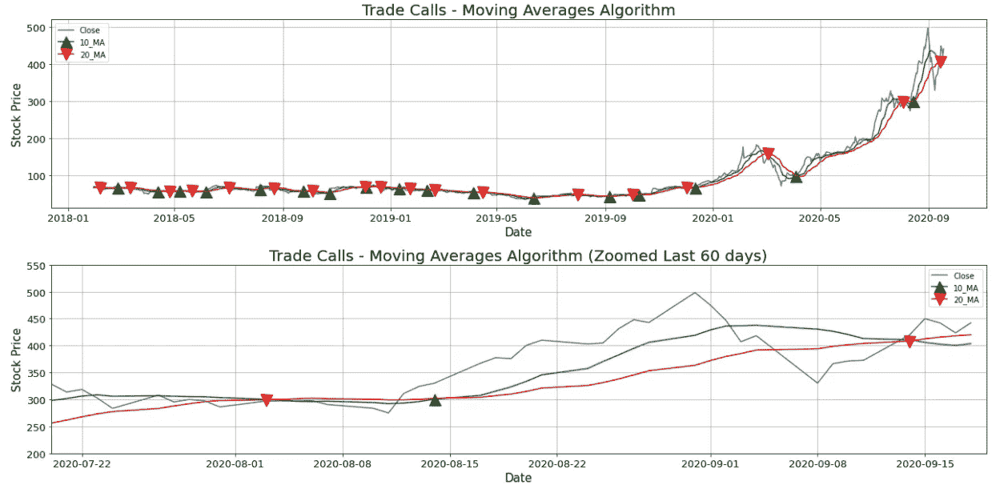
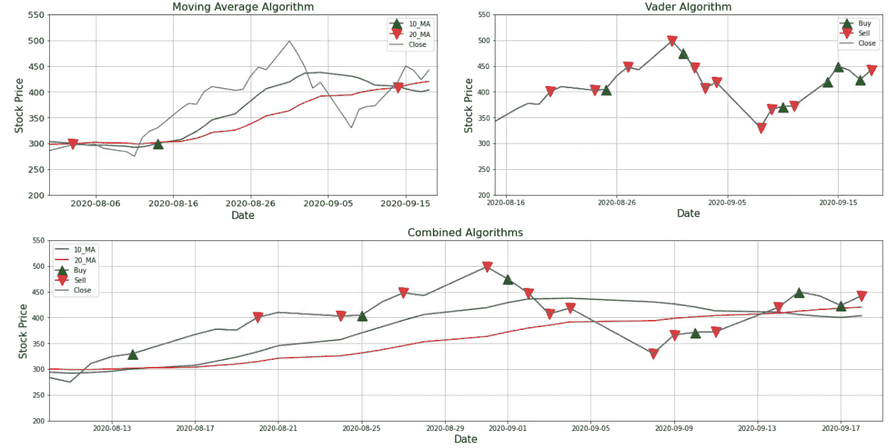

# 用 Vader 和算法交易进行情绪分析

> 原文：<https://medium.com/analytics-vidhya/sentiment-analysis-with-vader-and-algorithmic-trading-d7bef3c29c4b?source=collection_archive---------8----------------------->

斯蒂芬·道森在 [Unsplash](https://unsplash.com?utm_source=medium&utm_medium=referral) 上拍摄的照片

情绪分析最近变得越来越重要，因为它是在 Twitter 帖子分析的情况下，这是基于对文本的分析，其中积极或消极的情绪是根据某个短语或文本包含的单词来分配的。这种分析结合了自然语言处理(NLP)和机器学习的使用来为出版物分配分数，并且这些分数根据其出现的次数进行加权。

另一方面，算法或自动交易包括使用 Python 等软件在股票市场上以比人更有效的方式进行买卖操作。交易策略可以像你对股票市场的理解一样复杂，同样，使用机器学习和 NLP 可以改进交易算法，并增加通过分析最相关的新闻和预测股价的未来变化可以获得的好处。

> **算法交易**

首先，我们将使用一个基本的交易算法，在这种情况下，将使用 10 日和 20 日的移动平均线，在 10 日移动平均线与 20 日移动平均线交叉的情况下，这将意味着价格将下跌，必须卖出股票，否则，这将是必须买入股票的信号。

## **让我们开始编码**

*导入库并下载股票数据*

*数据集概述*

*我们将根据算法的动作创建交易电话，并将其可视化。*

我们可以看到，该算法虽然是基本的，但却给出了特斯拉价格趋势变化的良好信号。现在我们将看到最新公司新闻的情绪分析。

> **情感分析**

自然语言工具包库为此提供了必要的工具，它包括一个 Vader(方差感知词典和情感推理机),可以根据它包含的词典帮助对单词进行积极或消极的分类。为了能够进行情绪分析，有必要下载新闻，新闻应用编程接口([https://newsapi.org](https://newsapi.org/))允许下载与股票最相关的 100 条新闻。

## 让我们开始编码吧

*正如我们所看到的，我们在上个月得到了该股票最相关的消息，现在我们将*重新排列*数据框架，以便于分析。*

现在，我们可以根据新闻标题进行情感分析，但首先我们要创建一个函数，根据新闻发布的时间来判断交易电话是在当天还是第二天进行。

*既然我们有一天每个操作都要按照文章的时间来做，现在我们就要用 Vader 来计算情绪得分。*

*我们每个日期都有几条新闻，我们将根据每个日期的最小值和最大值计算一个新的分数。*

*现在，我们将使用情感分析得分作为根据可选阈值买入或卖出股票的信号，在这种情况下，0.3 将用作好消息或坏消息的参考点。*

*与移动平均线算法一样，我们将可视化股票买卖的时刻。*

*我们可以看到，与移动平均算法不同，情绪分析分数的使用允许更高频率的特斯拉股票交易。这意味着使用机器学习和自然语言处理可以改进交易算法。*

> **组合图**

*我们将分别绘制投资策略图和两者相结合的图，其中移动平均算法的优先级更高。*

*最后可以看到，情绪分析和移动平均线算法对股票应该买卖的时刻是一致的*。

> **结论**

*   情绪分析发现比基本移动平均线算法更高的交易点。
*   虽然它找到了更多的谈判机会，但结果并不总是如预期的那样
*   为了更好地识别情感，有必要增加带有金融词汇的 VADER 情感词典。