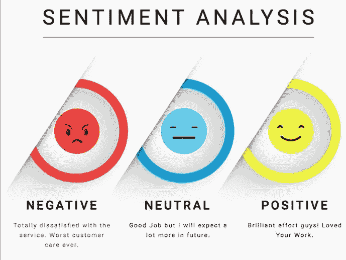

# 基于 VADER 的情感分析——标记未标记数据

> 原文：<https://medium.com/analytics-vidhya/sentiment-analysis-with-vader-label-the-unlabeled-data-8dd785225166?source=collection_archive---------2----------------------->



来源链接:[https://www.google.com/url?sa=i&URL = https % 3A % 2F % 2fwww . kdnugges . com % 2f 2018% 2f 03% 2 F5-things-sensation-analysis-class ification . html&psig = aovvaw 3 uygjyoiej2xtjwuqml 0 ST&ust = 1583602610275000&source = images&CD = vfe&ved = 0 caiqjrxqq](https://www.google.com/url?sa=i&url=https%3A%2F%2Fwww.kdnuggets.com%2F2018%2F03%2F5-things-sentiment-analysis-classification.html&psig=AOvVaw3UYgjYoiej2XtJwUQML0sT&ust=1583602610275000&source=images&cd=vfe&ved=0CAIQjRxqFwoTCODUhs6xhugCFQAAAAAdAAAAABAk)

*我热烈欢迎所有的读者！*

# 内容:

1.  **情感分析短评**
2.  **VADER**
3.  **与 VADER 的情感分析**
4.  **利弊**
5.  **其他情感分析库**

# 1)关于情感分析的简短说明:

在潜入 VADER 之前，让我们先了解一下**【情绪分析】**是什么？情感分析也被称为**‘意见挖掘’。**情感分析是将文本(单词、句子或文档)分析为“正面”、“负面”或“中性”。很少有分析师会不考虑“中性”这个标签，因为它仅仅取决于业务需求。情感分析用于分析电影评论、美食评论、演讲评论等的情感得分。

(注意:在少数情况下，电影评论、美食评论等可能没有直接的正面和负面评价。它可能有像 1，2，3，4，5…这样的等级，定义了文本评论的积极或消极的程度。基于业务需求和简单的分析，分析人员可以将评级范围设置为积极和消极。例如:如果我们有等级 1、2、3、4、5，analyzer 可能会将等级为 1、2 或 3 的审核设置为正面，否则设置为负面。)

# 2) VADER:

**VADER** 代表**“配价感知词典和情感推理机”。**(注意:在拼写‘情绪’中，第一个字母‘s’是小写字母，第二个字母‘E’是大写字母，这是正确的)。VADER 是一个基于词汇和规则的情感分析工具。它被用来分析一篇文章的情感。词典是基于语义标记为肯定或否定的词汇特征(词)的列表。甚至一个未标记的文本数据也可以用 VADER 情感分析器进行标记。

# 3)VADER 的情感分析:

## **3.1)安装 VADER 情绪分析仪:**

打开 cmd 提示符或 anaconda 提示符，输入**‘pip install Vader perspection’**


安装电梯

或者在下图所示的本地 jupyter 笔记本或你正在使用的任何其他笔记本中，只需输入**'！pip 安装 Vader perspection '**,运行生产线。(注意:因为我已经安装了它，所以它给出“要求已经满足…”)


安装电梯

## 3.2)编码部分:

**示例— 1**

我们首先需要导入 nltk(自然语言工具包)，然后下载‘Vader _ lexicon’。代码请参考下图。


下载维达 _ 词典

现在我们需要从 nltk 导入 VADER 情感分析。然后为导入的库创建一个实例。


导入 vader 情绪分析器

现在让我们用几个例子来看看 VADER 情绪分析器是如何工作的。我正在分析文本**‘我昨天去看电影了。太神奇了！每个人都演得很好。**

‘polarity _ scores(text)’用于分析文本数据。有关代码及其输出，请参考下图。


情感分析— 1

```
{'neg': 0.0, 'neu': 0.592, 'pos': 0.408, 'compound': 0.7345}
```

从上面的图片中，我们可以看到情感分数是字典格式的，其中键是标签，值是情感分数。这里， **neg —阴性，neu —中性，pos —阳性。**在情感分析词典的输出中，第四个关键字是**‘复合’**后跟一个分数。一般而言，复合得分被用作文本数据分析的阈值。我们甚至可以灵活地改变复合分数(阈值)并标记文本数据。这仅仅依赖于业务需求和领域知识。

**以下是大多数分析仪遵循的标准评分标准。**

1.  正面情绪:`compound`得分> = 0.05
2.  中性情绪:(`compound`得分> -0.05)和(`compound`得分< 0.05)
3.  负面情绪:`compound`得分< = -0.05

回到我们上面的例子，文本**‘我昨天去看电影了’的情感分数。太神奇了！'大家都演得不错'，**分别是{'neg': 0.0，' neu': 0.592，' pos': 0.408，' compound': 0.7345}。复合得分 0.7345 明确表示文本是正面的。的确，影评是正面的。万岁！VADER 情绪分析仪工作完美。

**示例— 2**

现在，让我们对文本数据进行一些更改，看看情感得分是如何反映的。我已经把文字**‘每个人都表现得很好’**换成了**‘上半场很好’。下半场很糟糕。整个文本数据读作**‘我昨天去看了电影。太神奇了！上半场很好。下半场很糟糕。**如果我们手动分析，可以说文评既有正面意义，也有负面意义。可以认为是有点中立的评论。看看这些分数是如何反映在下图中的。**


情感分析— 2

```
{'neg': 0.201, 'neu': 0.632, 'pos': 0.167, 'compound': -0.1531}
```

基于复合得分和标准得分度量，文本数据**‘我昨天去看了电影。太神奇了！上半场很好。‘后半段不好’，**可以贴上负面标签。

# 4)利弊:

## 优点:

1.  用 VADER 标记未标记的文本数据。
2.  我们可以利用更改复合分数(阈值)的灵活性，并标记数据。这仅仅依赖于业务需求和领域知识。
3.  减少手动操作。

## 缺点:

1.  分析的准确性有时不能很高。
2.  VADER 不能分析讽刺的文本。

例如:讽刺地说，如果一个人说‘哦！这部电影太棒了！。人类可以根据这个人的语气判断出这个评论是讽刺性的，我们会给这部电影贴上负面评论的标签。但机器会将其标记为阳性。

# 5)其他情感分析库:

除了用于文本数据情感分析的 **VADER** 之外，还有另一个 nltk 库**‘文本斑点’**可以用于文本的情感分析。文本斑点不限于情感分析。它甚至可以用于词性标注、文本翻译、字数统计等。参考下面的代码和我们可以用文本 blob 做什么的图片。


文本斑点

```
['__add__', '__class__', '__contains__', '__delattr__', '__dict__', '__dir__', '__doc__', '__eq__', '__format__', '__ge__', '__getattribute__', '__getitem__', '__gt__', '__hash__', '__init__', '__init_subclass__', '__iter__', '__le__', '__len__', '__lt__', '__module__', '__ne__', '__new__', '__reduce__', '__reduce_ex__', '__repr__', '__setattr__', '__sizeof__', '__str__', '__subclasshook__', '__weakref__', '_cmpkey', '_compare', '_create_sentence_objects', '_strkey', 'analyzer', 'classify', 'correct', 'detect_language', 'ends_with', 'endswith', 'find', 'format', 'index', 'join', 'json', 'lower', 'ngrams', 'noun_phrases', 'np_counts', 'np_extractor', 'parse', 'parser', 'polarity', 'pos_tagger', 'pos_tags', 'raw_sentences', 'replace', 'rfind', 'rindex', 'sentences', 'sentiment', 'sentiment_assessments', 'serialized', 'split', 'starts_with', 'startswith', 'strip', 'subjectivity', 'tags', 'title', 'to_json', 'tokenize', 'tokenizer', 'tokens', 'translate', 'translator', 'upper', 'word_counts', 'words']
```

我不打算在这个博客中讨论文本 blob 的细节。我打算写一篇关于“文本 Blob”的博客。

# 参考资料:

1.  [https://pypi.org/project/vaderSentiment/](https://pypi.org/project/vaderSentiment/)
2.  [https://www.udemy.com/share/101WNABEYTcVxUQX4=/](https://www.udemy.com/share/101WNABEYTcVxUQX4=/)
3.  [https://github.com/cjhutto/vaderSentiment#about-the-scoring](https://github.com/cjhutto/vaderSentiment#about-the-scoring)

# 帮我连接:

1.  **领英:**https://www.linkedin.com/in/sandeep-panchal-682734111/
2.  **GitHub:**https://github.com/Sandeep-Panchal

感谢大家阅读这篇博客。非常感谢您的建议！