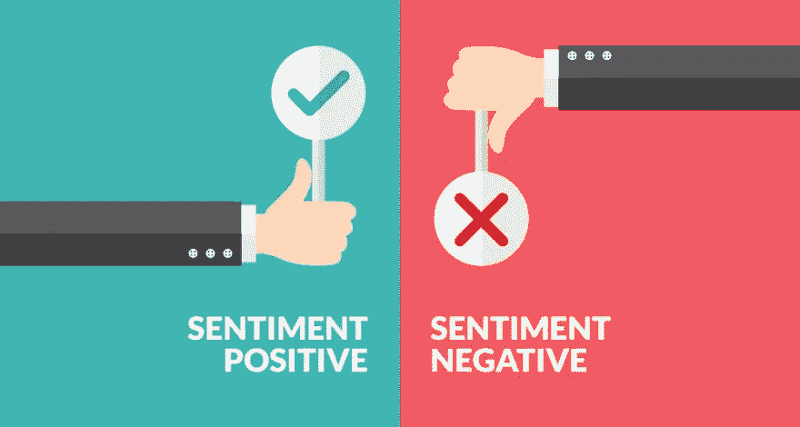
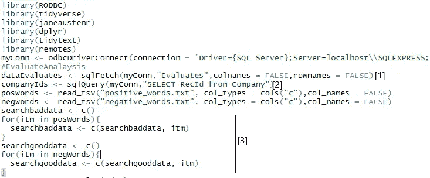
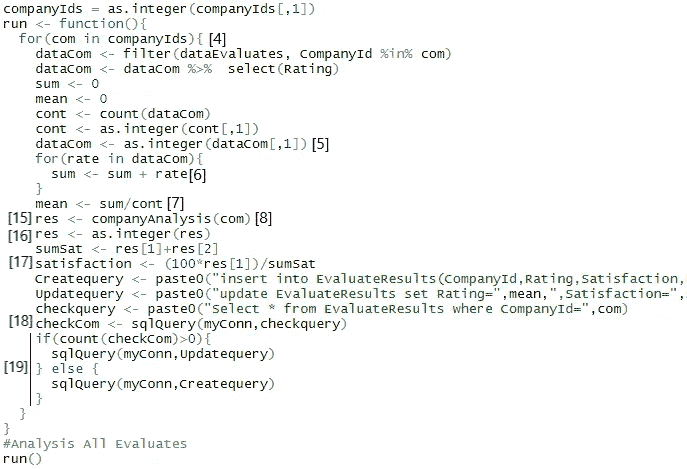
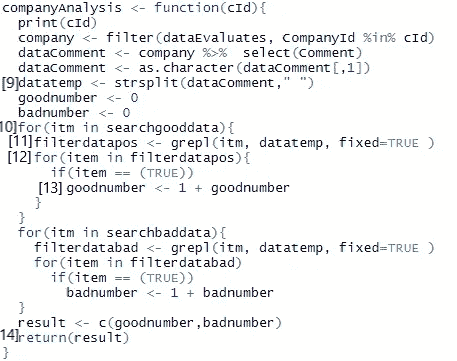
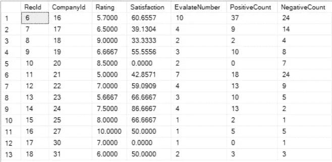

# 《没有图书馆的 R》中的情感分析

> 原文：<https://medium.com/analytics-vidhya/sentiment-analysis-without-library-5d8a1a72a54b?source=collection_archive---------19----------------------->

情感分析是 Python 和 R 与库一起使用的常用方法。在这里，我们将用我们开发的算法来检查我在没有使用“情绪分析”库的情况下编写的代码，希望对您有用。

我们有 3 个步骤，让我们依次解释；

1)为项目准备资料，开始着手。

从我们的数据库链接中，我们得到评论[1]和要分析的公司信息[2]，然后我得到单词来确定我们的正面和负面术语作为数据集。我们将这些数据集转移到我们在项目[3]中创建的列表中，我们的数据就准备好了。

2)主要功能

当我们的函数运行时，它将依次分析每个公司的评论，CompanyIds 为此循环[4]。我们有两种类型的评估:评论和评级。首先，我们找到评分的平均值，我们从 dataEvaluates 中获取评分数据，并将其转换为整数[5]。在我们的 dataCom 循环中，我们通过在“sum

3)情感分析功能

就像我们对评级所做的一样，我们选择评论数据，首先将其转换为字符，然后使用“strsplit()”[9]分隔单词。我们的下一个“for()”循环是相同的，一个查找肯定的单词，另一个查找否定的单词。我将只描述我们用来寻找积极词汇的循环，因为你会意识到我们无论如何也在用消极词汇做同样的事情。循环将为每个正单词运行一次[10]，然后我们将这个正单词传递给“grepl”函数[11]。(Grepl 函数逐个检查每个评论中的单词，并返回评论，正面单词为真，非正面单词为假。)然后我们用另一个“for()”循环[12]检查这个数据(filterdatapos)，它返回 true 或 false。对于返回 True 的注释，我们增加“goodnumber”变量[13]。在肯定词的循环结束后，我们找到我们拥有的“goodnumber”变量的值。当我们对否定词做同样的处理时，我们返回“好数字”和“坏数字”的值[14]。

现在，让我们继续我们在主函数中停止的地方，我们从分析中得到的值来到“res”变量[15]。我们将这些值转换成整数[16]。分析的最后一步是找到这两个值的比值，并得到一个结果。为此，我们使用一个简单的数学公式[17]找到了对公司所做评论的肯定率(%)。剩下的工作就是将我们的分析结果保存在数据库的另一个表中。我们用“checkquery”检查是否有先前保存的分析结果[18]，并向数据库发送“Createquery”或“Updatequery”查询[19]。

输出如下:

希望你能从中受益。