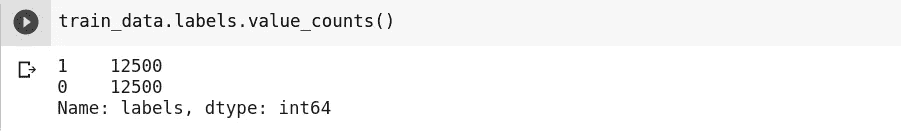

# 使用 Tfidf 的情感分类器

> 原文：<https://medium.com/analytics-vidhya/sentiment-classifier-using-tfidf-3ffce3f1cbd5?source=collection_archive---------0----------------------->


[图片来源](https://webhose.io/blog/api/how-to-use-rated-reviews-for-sentiment-classification/)

*本文是***NLP 入门系列*的第二篇。*** *既然我已经在* [***第一部分***](/@ajeet.singh.ec14/everything-to-get-started-with-nlp-3ccfbb7405a2?source=friends_link&sk=a66eaccadf8dcc00e4baf07d70ee1c33) *中解释了所有的理论，这里就不再解释了。*

> 注意:我假设你有一些 Python 编码的经验。

在这篇文章中，我们将制作一个情感分类器。所以没有进一步的告别，让我们开始吧。

# 数据集

第一步是下载数据集。这将会:

```
!wget [http://ai.stanford.edu/~amaas/data/sentiment/aclImdb_v1.tar.gz](http://ai.stanford.edu/~amaas/data/sentiment/aclImdb_v1.tar.gz)
```

你会得到这样的东西:


下载的数据集在一个 **tar** 文件中。让我们使用 **shutil** 模块提取它。`[shutil](https://docs.python.org/3/library/shutil.html#module-shutil)`模块提供了许多对文件和文件集合的高级操作。特别地，提供了支持文件复制和删除的功能。更多信息请点击[此处](https://docs.python.org/3/library/shutil.html)

```
import shutil
shutil.unpack_archive("aclImdb_v1.tar.gz", "/content/")
```

如果你做的一切都是正确的，你将有一个这样的文件结构:


## 数据集概述

*   这是 IMDB 电影评论数据集。多亏了斯坦福大学的研究人员，这个数据集被标注了正负标签。数据集可以通过[链接](http://ai.stanford.edu/~amaas/data/sentiment/)访问。
*   这个数据集包含 25000 个正面和 25000 个负面的例子，这些例子都预先标注了标签。这个数据集还包含未注释的例子，可供研究人员进一步使用。
*   在训练和测试文件夹中，我们将有 12，500 个正面和 12，500 个负面示例。请注意，每个例子是一个电影评论，它是在一个单独的文本文件中。所以我们将有 25K 个文本文件用于训练和测试。
*   数据集最多包含每部电影 30 条评论。确保没有一部电影变得更有影响力。
*   如果这部电影被给予超过 7 颗星，那么它是一个积极的评论，如果低于 4，那么消极的评论。
*   正反例数量相等，所以可以用准确率作为度量。

# 下载和导入包


托比·斯托达特在 [Unsplash](https://unsplash.com/s/photos/packages?utm_source=unsplash&utm_medium=referral&utm_content=creditCopyText) 上的照片

我们将下载 wordnet 和 stopwords 包。这两个包对于文本预处理都是必要的。这些是由 NLTK 提供的。

```
import nltk
nltk.download('wordnet')
nltk.download('stopwords')
```

让我们进口其他重要的东西。

```
import os
import pandas as pd
import numpy as np
from nltk.corpus import stopwords
from sklearn.feature_extraction.text import TfidfVectorizer
from sklearn.linear_model import LogisticRegression
```

# 数据集的数据帧

让我们从给定的数据集制作训练和测试数据帧。这里，我们将从文件夹中读取文件，并在数据帧中用相应的标签标记它们。例如，在 **Train** 文件夹内的 **pos** 文件夹中，我们有 12500 条评论。都是正面评价。我们将制作一个熊猫数据框架，它将有两列:
1。点评:文件的正文
2。标签:1
因为所有的评论都是正面的，所以我们将在**标签**列中有 12，500 行作为 1。

```
path = "/content/aclImdb/train/pos/"
temp = []for file in os.listdir(path):
    with open(os.path.join(path + file), "r") as f:
        temp.append(f.readlines()[0])pos = pd.DataFrame({"reviews": temp, 
               "labels": list(np.ones(len(first_1000), dtype=int))})
```

下面的图片会让事情变得清晰。如前所述，我们在**评论**栏中有电影评论，在**标签**栏中有 1ns。


现在，类似地为训练数据的负面评论创建一个数据框架，或者您可以直接合并到该数据集中。不管你最后做什么，你都应该有一个数据集 **train_data** (你可以选择任何你喜欢的名字)，其中前半行有正面评价，后半行有负面评价。尽管你也可以混淆这些行。无论你喜欢什么。

最后，您应该有类似这样的标签分布:



如你所见，我们有相同数量的正面和负面例子。同样，创建一个数据集 **test_data** 进行测试。

# 预处理


照片由[沙哈达特·谢穆尔](https://unsplash.com/@shemul?utm_source=unsplash&utm_medium=referral&utm_content=creditCopyText)在 [Unsplash](https://unsplash.com/s/photos/processing?utm_source=unsplash&utm_medium=referral&utm_content=creditCopyText) 上拍摄

我们将为以下预处理任务创建一些辅助函数:

***标记化***

```
def tokenize_data(dataset):
    tokenizer = nltk.tokenize.TreebankWordTokenizer()
    for i in range(dataset.shape[0]):
       dataset["reviews"][i] = tokenizer.tokenize(dataset["reviews"][i])
    return dataset
```

***停止字清除***

```
def remove_stop_words(dataset):
    stop_words = set(stopwords.words('english'))
    for i in range(dataset.shape[0]):
        dataset["reviews"][i] = ([token.lower() for token in dataset["reviews"][i] if token not in stop_words])

    return dataset
```

***规范化***

```
def normalize(dataset):
    lemmatizer = nltk.stem.WordNetLemmatizer()
    for i in range(dataset.shape[0]):
        dataset.reviews[i] = " ".join([lemmatizer.lemmatize(token) for token in dataset.reviews[i]]).strip() return dataset
```

***标点符号去除***

```
def remove_garbage(dataset):
    garbage = "~`!@#$%^&*()_-+={[}]|\:;'<,>.?/"
    for i in range(dataset.shape[0]):
    dataset.reviews[i] = "".join([char for char in dataset.reviews[i] if char not in garbage]) return dataset
```

> **请注意:**这种为相似的处理创建单独的函数是非常糟糕的编码实践。这只是为了解释清楚。我们可以用很少的步骤完成所有这些。并且肯定在具有非常低的计算复杂度的单个函数内。

创建这些函数后(可以在单个函数中完成)，将这些函数应用于数据集。

```
train_data = tokenize_data(train_data)
train_data = remove_stop_words(train_data)
train_data = normalize(train_data)
train_data = remove_garbage(train_data)test_data = tokenize_data(test_data)
test_data = remove_stop_words(test_data)
test_data = normalize(test_data)
test_data = remove_garbage(test_data)
```

数据集的状态应该是这样的。


该数据集仍未完全处理。因为这篇文章不是用于文本处理的，即使这么多的处理也会产生好的结果，所以我们将把进一步的处理留到以后。

# 特征抽出

现在让我们提取特征。我们将使用来自 [sklearn](https://scikit-learn.org/stable/) 库的[tfidf 矢量器](https://scikit-learn.org/stable/modules/generated/sklearn.feature_extraction.text.TfidfVectorizer.html)模块。我们可以创建自己的 tfidf 函数，但是创建已经存在并且运行良好的函数是徒劳的。

第一步是拟合矢量器。我们将在整个数据集上安装矢量器。这是所有评论(培训和测试)中的内容。我们可以仅在训练数据集上拟合矢量器，但这可能有负面影响。因为一些在训练中不存在的单词可以存在于测试数据集中。这个函数将为我们完成这项工作。

```
def fit_corpus(train_data, test_data):
    corpus = pd.DataFrame({"reviews": train_data["reviews"]})
    corpus.reviews.append(test_data["reviews"], ignore_index=True)
    tfidf = TfidfVectorizer(min_df=2, max_df=0.5, ngram_range=(1,2))
    tfidf.fit(corpus["reviews"])
    return tfidf
```

在拟合之后，我们将转换数据集。这个函数将我们的数据集转换成 tfidf 向量。

```
def transform_data(tfidf, dataset):
    features = tfidf.transform(dataset["reviews"])
    return pd.DataFrame(features.todense(), columns = tfidf.get_feature_names())
```

现在让我们调用上述两个函数并转换我们的数据集。此外，我们将培训和测试标签放在单独的变量中。

```
tfidf = fit_corpus(train_data, test_data)  #Fitting the vecorizertrain_features = transform_data(tfidf, train_data)  #transforming 
test_features = transform_data(tfidf, test_data)    #Train and Testtrain_labels = train_data["labels"]  #Taking lables in separate
test_labels = test_data["labels"]    #variables
```

数据集应该如下所示:


注意:列数可以变化

# 训练模型


克里斯·利维拉尼在 [Unsplash](https://unsplash.com/s/photos/graph?utm_source=unsplash&utm_medium=referral&utm_content=creditCopyText) 上的照片

因为我们已经将文本转换为特征，所以我们可以在训练数据集上应用任何分类模型。由于数据是长稀疏矩阵，简单的逻辑回归工作良好。

首先，我们将**初始化模型**:

```
clf = LogisticRegression(random_state=0, solver='lbfgs')
```

您可以从[文档](https://scikit-learn.org/stable/modules/generated/sklearn.linear_model.LogisticRegression.html)中了解更多关于物流管理的其他参数。

下一步是**根据训练数据拟合模型**。

```
clf.fit(train_features, train_labels)
```

看来我们结束了。我们制作了情感分类模型。

让我们给出一些输入并检查输出:


预测输出:0


预测产量:1

让我们检查一下测试数据集的准确性:


我们得到了 84.25 % 的**分。找到了。！！**


由[本·怀特](https://unsplash.com/@benwhitephotography?utm_source=unsplash&utm_medium=referral&utm_content=creditCopyText)在 [Unsplash](https://unsplash.com/s/photos/success?utm_source=unsplash&utm_medium=referral&utm_content=creditCopyText) 上拍摄

没有太多的预处理和一个基本模型，我们得到了很好的结果。ML 好容易啊！！！

如果你是这样想的，那么:

> ML 比分数多得多。通过使用一些预建的库来运行模型不是 ML。多探索，多学习。

我这么说是因为我们得到了那个精确度，因为数据集已经处于相当好的状态。如果你真的想挑战自己，那就试着提高分数。

您可以调整参数或使用不同的算法，或者进一步清理数据集。无论你喜欢什么。

> 只是不要[**过度拟合**](https://machinelearningmastery.com/overfitting-and-underfitting-with-machine-learning-algorithms/) 。

## 关于改进 Logistic 回归结果的几点注记

1.  玩符号化:表情符号、感叹词等的特殊符号。可以帮忙。这些是人们经常使用的一些标记，可以告诉你很多关于评论的观点。例如，一个微笑的表情符号可能是一个很好的评价指标，而悲伤或愤怒的表情符号可能指向一个不好的评价。
2.  尝试不同的模型，如 SVM，朴素贝叶斯等。
3.  扔掉 BOW，用深度学习。尽管深度学习对于这种情绪分析任务的准确性提高并不令人兴奋。

# 关于实现的一些注意事项

1.  这个 tfidf 矢量化和文本预处理需要大量的处理。尽量用 Google Colab。它是免费的，并提供 25GB 内存的 GPU 和 TPU 支持。
2.  但是如果你有其他资源，你可以随时使用它们。
3.  你可以在我的 Github 上找到代码。

[](https://github.com/AjeetSingh02/Overview_of_NLP/blob/master/sentimentClassification.ipynb) [## AjeetSingh02/Overview_of_NLP

### 此时您不能执行该操作。您已使用另一个标签页或窗口登录。您已在另一个选项卡中注销，或者…

github.com](https://github.com/AjeetSingh02/Overview_of_NLP/blob/master/sentimentClassification.ipynb) 

如果你喜欢这篇文章，那么你可以想按多少次拍手按钮就按多少次。还有，你可以在[**LinkedIn**](https://www.linkedin.com/in/singhajeet23/)**上联系我，或者在**[**GitHub**](https://github.com/AjeetSingh02)**上关注我。**

## 让我们进一步移动到[下一个](/@ajeet.singh.ec14/nlp-libraries-and-pretrained-models-94c9a53a295a?sk=f45c6cb78399e55b30eaf0ed7b647515) …

