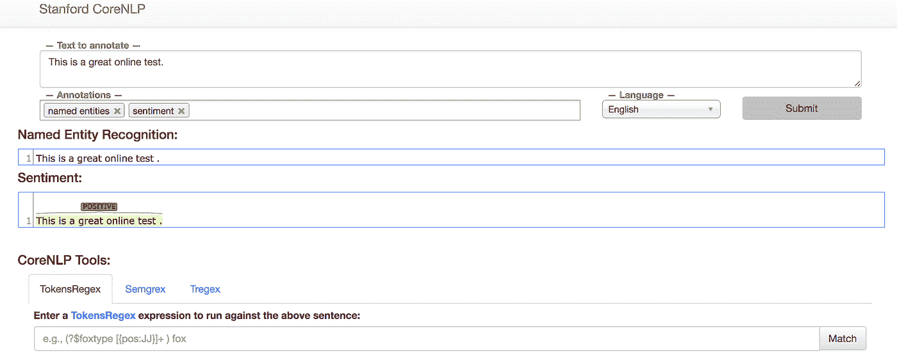
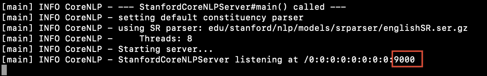
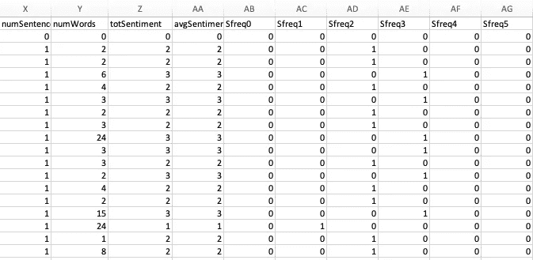

# 使用斯坦福 coreNLP (Python，Jupyter notebook)的情感特征提取

> 原文：<https://medium.com/analytics-vidhya/sentiment-feature-extraction-using-stanford-corenlp-python-jupyter-notebook-29a0d97ca76f?source=collection_archive---------3----------------------->

图:斯坦福 coreNLP 服务器

斯坦福 coreNLP 是基于 java 的。这篇文章是关于它在 jupyter notebook (python)中的实现。斯坦福 coreNLP 可以用来提取多个特征，这些特征可以用来训练任何基于文本的机器学习模型。在大数据上实现可能有点棘手。斯坦福 coreNLP 比 Vader 情感和文本 blob 表现得更好，因为该模型“实际上基于句子结构建立了整个句子的表示，而不是查看单个单词的情感。

# 安装斯坦福 CoreNLP

在您的终端中键入:

**$ wget**[https://NLP . Stanford . edu/software/Stanford-corenlp-full-2018-10-05 . zip](https://nlp.stanford.edu/software/stanford-corenlp-full-2018-10-05.zip)[https://NLP . Stanford . edu/software/Stanford-English-corenlp-2018-10-05-models . jar](https://nlp.stanford.edu/software/stanford-english-corenlp-2018-10-05-models.jar)

**$ unzip**Stanford-corenlp-full-2018–10–05 . zip
**$ mv**Stanford-English-corenlp-2018–10–05-models . jar Stanford-corenlp-full-2018–10–05

# 打开 Jupyter 笔记本(py)终端并启动服务器

在 jupyter 笔记本的终端启动服务器如下

在 9000 端口监听应该是可见的(见下文)

在 Jupyter 笔记本终端中打开一个新标签，安装 pycorenlp，如下所示:

**$pip 安装** pycorenlp

# 处理 Jupyter 笔记本 python 文件

现在用 python 内核创建一个新文件，类型如下

**设置**

**实现 Stanford coreNLP 并创建函数“standford _ 情操”**

# 获取每行的情感值。csv 文件

这里的“clean_text”是一个只包含字母数字字符(小写)的列。“范围”可以根据需要改变。我建议一次取 1000 以加快运行速度，否则服务器会超时

# 将结果保存到 CSV 文件

# 参考

 [## yaowser/yelp-initial

### permalink dissolve GitHub 是超过 5000 万开发人员的家园，他们一起工作来托管和审查代码，管理…

github.com](https://github.com/yaowser/yelp-initial/blob/feb5d289845905b782ee5709dae3e9f6e001ccce/yelp_updated_20180502/text2sentiment3.ipynb)  [## 使用斯坦福 CoreNLP 的自然语言处理

### 只用两行代码分析文本数据

towardsdatascience.com](https://towardsdatascience.com/natural-language-processing-using-stanfords-corenlp-d9e64c1e1024)