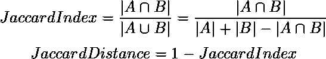
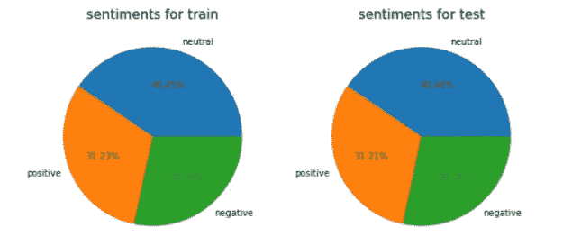
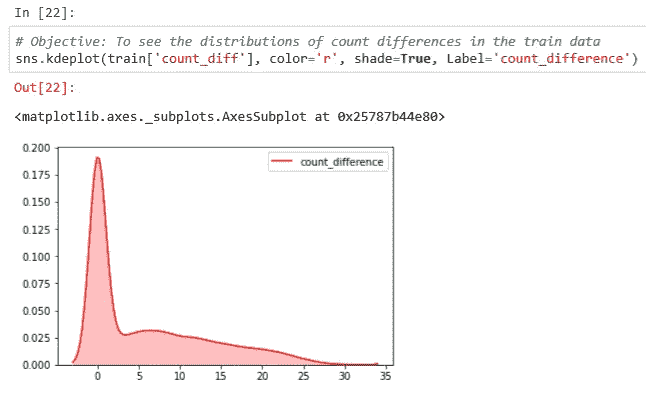
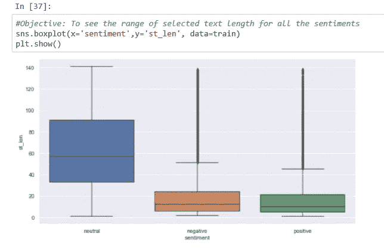
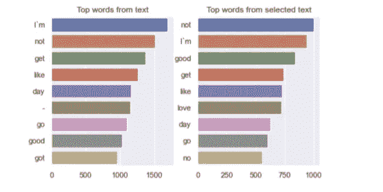
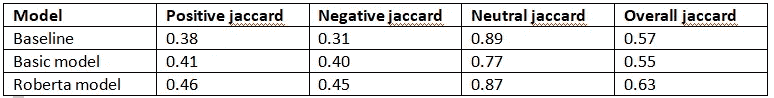

# 基于 roBERTa 的情感短语抽取

> 原文：<https://medium.com/analytics-vidhya/sentiment-phrase-extraction-using-roberta-f62dd14daa86?source=collection_archive---------6----------------------->

# **目录**

1.  商业问题

1.1 描述

1.2 目标

1.3 来源/有用链接

1.4 现实世界/业务目标和约束

2.机器学习问题

2.1 数据概述

2.2 将现实世界的问题映射到 ML 问题

2.2.1 机器学习问题的类型

性能指标

3.探索性数据分析

3.1 EDA 的观察

4.基本模型

4.1 基本模型的误差分析

5.罗伯塔模型

5.1 罗伯塔模型的误差分析

6.模型比较

7.未来的工作

8.参考

# **1。业务问题**

本案例研究试图解决的两个重要业务问题是:
1 .跟踪客户反馈。提供更好的产品分析。
在一般的情感分析中，我们只能了解客户在说什么，但当我们试图提取暗示这种情感的短语时，我们也可以通过提供更多关于它的见解来揭示他们为什么这么说。这将允许你真正采纳客户的反馈，同时改进你的产品。使用这种类型的分析来查看产品分析可以帮助您的公司了解什么是有效的，什么是无效的。

**1.1 描述**

Twitter 是一个微博平台，在这里人们可以表达他们对广泛领域的看法和感受。拥有超过 1.5 亿活跃用户的谷歌已经成为大公司和组织了解人们对其公司/组织看法的金矿。但是这里的问题来自于每天产生的大量数据。据报道，每天有 5 亿条推文产生。有了如此庞大的数据，不可能人工检查有多少人对他们的产品满意，有多少人不满意。这里，情感分析的概念进入了画面。如果我们能够以某种方式自动对推文的情绪进行分类，这将是公司了解他们的客户对他们的产品有多满意的一大飞跃。除了这种情绪，如果我们还可以指出暗示这种情绪的短语，这将使公司更容易理解客户对其产品不满意的地方。

你能从这个博客中学到什么？

*   使用 Huggingface 库的 roBERTa 模型进行文本抽取任务
*   如何微调预训练的 BERT 模型

**1.2 目标**

给定一条推文及其情感，我们需要从文本中提取暗示给定情感的短语

**1.3 来源/有用链接:**

数据来源:[https://www . ka ggle . com/c/tweet-情操-提取/概述](https://www.kaggle.com/c/tweet-sentiment-extraction/overview)

几篇有用的研究论文:

*   【https://arxiv.org/pdf/1911.00288.pdf 

本文介绍了可用于情感分析的不同特征选择技术和特征提取技术。在整篇文章中，它讨论了各种特征选择技术如何与不同的模型相结合，以及它们的性能得分。

*   [https://ieeexplore.ieee.org/abstract/document/8244338](https://ieeexplore.ieee.org/abstract/document/8244338)

本文使用深度卷积网络对 Twitter 数据进行情感分析。为了完成这项任务，他们在 200 亿 twitter 语料库的庞大数据集上进行了训练。每条 tweet 数据除了文本之外还增加了三个额外的特征。

*   [https://arxiv.org/ftp/arxiv/papers/1711/1711.08609.pdf](https://arxiv.org/ftp/arxiv/papers/1711/1711.08609.pdf)

在本文中，他们提出了一种通过使用词性标签和词典来提高预训练单词嵌入的准确性的方法。为了提高单词嵌入的准确性，他们在每个单词的单词向量末尾添加了这些特征。这个单词向量可以是 word2vec，也可以是 Glove。

**1.4 现实世界/业务目标和约束**

*   预测短语必须清楚地暗示情感
*   错误可能代价高昂，因为如果它错误地解释了短语，它可能会影响向客户提供的服务。
*   降低延迟，提供更快更好的客户服务

# **2。机器学习问题**

**2.1 数据概述**

*   训练数据和测试数据被分成两个文件
*   训练数据包含 4 列，而测试数据包含 3 列，目标变量缺失
*   训练数据包含 35k 个点，测试数据包含 27k 个点
*   它只包含一行空值

**2.2 将现实世界问题映射到 ML 问题**

**2.2.1 机器学习问题的类型**

我们正在处理的 NLP 问题可以与文本提取相关联，因为我们想要提取暗示给定情感的句子的短语

**2.2.2 绩效指标**

如 [Kaggle](https://www.kaggle.com/c/tweet-sentiment-extraction/overview/evaluation) 页面所示，Jaccard 指数可以作为一个性能指数。

**为什么将 Jaccard 分数作为这个问题的性能指标？**

分子|A∩B|计算一个项目在 A 和 B 中出现的次数。分母|A∪B|计算 A 和 B 中不同项目的总数。因此 J(A，B)是两个集合中共享项目的分数。它衡量我们预测的短语与实际选择的文本有多接近。
来源:[https://stats.stackexchange.com/a/309013](https://stats.stackexchange.com/a/309013)

但是这个标准有一个问题。如果我们将整个句子作为选择的文本打印出来，我们仍然会得到 0.55 的 Jaccard 分数，这确实是一个不错的分数。这是因为我们的数据集包含许多中性句子，其中选择的文本与实际推文完全相同。因此，为了避免这种情况，我们还可以考虑另一个指标，称为模糊比率。Fuzz ratio 计算将句子“a”改为句子“b”所需的编辑次数，并给出分数。

# **3。探索性数据分析**

该数据集不包含太多缺失值。只有一条推文没有正文。因此可以删除它，而不会对数据造成重大更改。我们通过检查推文中积极、消极和中性情绪的分布来开始分析。虽然中性推文的数量更多，但这个值并不太高。并且这种分布在测试和训练数据集中是相同的。然后，我们根据他们的情绪将推文分开，并分别为每种情绪绘制单词云。后来，我们检查了文本和所选文本之间的计数差异，并绘制了表示这种差异的图形。一个重要的观察结果是，大约 92%的人在中性推文中没有计数差异。

> 这意味着，如果情感是中性的，我们打印出与原文相同的选定文本，我们有 92%的机会是正确的

正面和中性文本的计数差异几乎相似。然后，我们开始分析文本中的热门词汇，并分别为每个情感类别选择文本。我们还检查了二元词，看看我们是否能得到一些模式。我们发现，这些数据可能是在母亲节前夕收集的，因为许多重名词显示了与之相关的词。在所有这些分析之后，我们对文本进行了预处理，例如将表情符号转换为文本，删除 URL、#标签等。

然后，我们还检查了所选文本开始的起始索引，并打印了前 10 个索引。正如所料，大多数句子从 0 索引开始。

由于这是一个有点棘手的问题，我们需要一个基线模型及其分数来比较我们的模型与基线模型相比表现如何。所以对于这个基线模型，我们使用了一个情感分析工具。要了解更多，你可以参考这篇文章。基于它产生的极性分数，我们打印出了所选文本的单词。

**3.1 来自 EDA 的观察结果**

*   数据包含的中性文本略多于正面和负面文本。

*   计算文本和所选文本之间的计数差异，并且大多数中性文本具有 0 计数差异。
*   这意味着在大多数情况下，选择的文本与原始推文完全相同

*   与中性文本相比，所选文本的长度对于正文本和负文本要小得多

*   像 I'm，good，get，day 这样的词是 text 和 selected text 的热门词。

*   大多数选定文本的索引从 1 开始。这是更多的中立贡献的 95%
*   大约 55%的情况下，所选文本从低于 20 的索引开始。大约 90%的情况下，指数低于 75。

# **4。基本型号**

作为我们的基本模型，我们决定使用多对多类型的 RNN 模型。在开始建模部分之前，我们已经完成了在 EDA 中完成的所有必要的预处理工作。这样做之后，我们需要将标签转换成由 LSTMs 处理的方式。为此，我们创建了一个 numpy 数组，其大小等于实际文本的长度。现在，如果对应于该索引的单词出现在所选文本中，则该数组中的值为 1，如果不存在，则为 0。

后来，我们用值=2 和最大长度 100 填充了这些标签。我们用 2 而不是 0 填充值的原因是，0 已经在标签中使用，表示该单词不在所选文本中。所以我们不能用 0 作为填充值。我们使用手套向量用于嵌入目的。在建模之前，我们稍微过采样正负点，这样模型就不会学习预测所有的点，因为很多中性文本都是这样的。现在到了建模部分。我们使用了手套嵌入和 2 个双向 LSTM 层，每个层有 128 和 64 个单元，还有 2 个脱落层。

深度学习最重要的一个方面就是损失的计算。我们需要非常小心，选择适合我们问题的完美损失函数。对于我们的问题类型，我们可以使用二进制交叉熵损失函数，但问题是，我们有许多填充值，这些值的损失不应计算，而必须被屏蔽。所以我们需要编写一个自定义的损失函数来屏蔽填充的值并计算损失。

后来，我们使用以下代码将标签解码为文本。

**4.1 基本模型的误差分析**

为了分析我们的基本模型所产生的误差，我们将数据分成 3 类 1 .低，2 .高。中号和 3 号。每个情感类的高 Jaccard 分数。如果 Jaccard 得分小于或等于 0.4，我们将其划分为低，如果得分在 0.4 和 0.75 之间，则划分为中，如果得分在 0.75 或以上，则划分为高。在每个类别下，我们计算了文本的长度、选定的文本以及它们之间的差异。我们观察到的一个常见模式是，随着文本和所选文本之间的差异增加，Jaccard 得分降低。结果，具有高 Jaccard 分数的点在他们的情感类别中具有最小的差异。很明显，该模型正在为文本长度较长而所选文本较小的推文而努力。

# **5。罗伯塔模型**

为了提高模型的性能，我们决定使用预训练的变压器模型。为此，我们使用 Huggingface 库，它允许我们使用不同的 BERT 预训练模型。这个库最好的部分是它允许我们从一个模型转换到另一个模型，只需要一行代码的改变，因此更容易尝试不同的模型并比较它们。在我们的案例中，roBERTa 模型给了我们最好的分数。这里我们用它来从文本中提取特征。在我们的架构中，我们结合了罗伯塔模型以及两个 1D 卷积层和两个漏失层。

除了架构方面，我们对这个模型做的另一个重要的改变是类标签。我们从准确性上注意到，该模型发现很难为所选文本中出现的每个单词预测 1。所以我们决定生成两个固定长度的数组，一个表示所选文本中起始单词的索引，另一个表示结束单词的索引。所以我们的任务是预测两个数组，一个代表开始，一个代表结束。

> 这个模型给了我们 0.629 的 Jaccard 分数，比我们的基本模型高 14.5%。

5.1 罗伯塔模型的误差分析

该模型正在犯我们在基本模型中看到的类似错误。如果文本和所选文本之间的差异增加，分数会降低。但一个值得注意的是，得分中等的中性文本比得分低的中性文本差异略大。

# 6.模型比较

# **7。未来工作**

*   该模型还可以使用 roberta 大模型进行改进。
*   我们还可以尝试卷积层的其他组合

# **8。参考文献**

*   [https://www.youtube.com/watch?v=XaQ0CBlQ4cY](https://www.youtube.com/watch?v=XaQ0CBlQ4cY)
*   [http://jalammar.github.io/illustrated-transformer/](http://jalammar.github.io/illustrated-transformer/)
*   [https://medium . com/analytics-vid hya/simplified-social-media-情操-分析-using-Vader-in-python-f 9 e 6 EC 6 fc 52 f](/analytics-vidhya/simplifying-social-media-sentiment-analysis-using-vader-in-python-f9e6ec6fc52f)

特别感谢

*   【https://www.appliedaicourse.com/ 

您可以在这里找到这个案例研究[的源代码](https://github.com/praneethsvp/Tweet-sentiment-phrase-extraction)

下面是一个使用 flask 部署代码的小视频。

## 最后，如果你觉得我的博客有用，鼓掌将是令人鼓舞的

你可以在这里找到我的简介:[https://www.linkedin.com/in/praneethsv/](https://www.linkedin.com/in/praneethsv/)