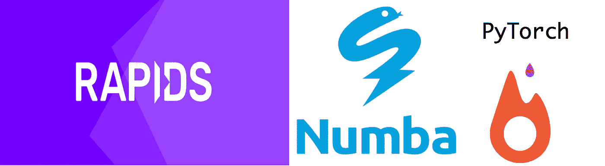

# 完全基于 GPU 的端到端情感文本分类管道

> 原文：<https://medium.com/analytics-vidhya/sentiment-text-classification-using-only-gpu-accelerated-libraries-35d7cbd6c55b?source=collection_archive---------6----------------------->



# 介绍

在这篇文章中，我将讨论我如何完全在 GPU 上实现情感文本分类管道。这之所以成为可能，仅仅是因为现有的开源 GPU 加速 python 库，即 [Rapids.ai](https://rapids.ai/) 和 [numba](https://numba.pydata.org/) 等。在这个例子中，我主要使用了`cuDF`、`nvStrings`、`numba`和`pytorch`。

**cuDF:** `cuDF`是一个用于数据操作和准备的 GPU 加速数据帧库。它是 RAPIDs 生态系统中的一个单独的包，提供了与`Pandas`非常相似的 python APIs。

**NV strings:**`nvStrings`[cus trings](https://github.com/rapidsai/custrings)的 Python 绑定)，在 GPU 上启用字符串操作。是的，你没看错！在这篇文章的后面，我们会对此进行更多的讨论。

**numba:** `numba`使用行业标准的`[LLVM](https://llvm.org/)` / `[NVVM](https://docs.nvidia.com/cuda/nvvm-ir-spec/index.html)`编译器库，在运行时将 Python 函数翻译成优化的机器代码。Python 中 Numba 编译的数值算法可以接近 C 或 CUDA 的速度。

**cuPy:** `CuPy`是 NumPy 兼容的多维数组在 CUDA 上的实现。CuPy 由核心的多维数组类`cupy.ndarray`和上面的很多函数组成。它支持`numpy.ndarray`接口的子集。

**pyTorch:** `pyTorch`是建立在 [torch](https://en.wikipedia.org/wiki/Torch_(machine_learning)) 之上的机器学习库。它得到了脸书人工智能研究小组的支持。经过最近的发展，它已经获得了很大的普及，因为它的简单性，动态图形，因为它是本质上的 pythonic。

## 问题陈述:

给定包含两列*评论*和*标签的 CSV 文件，评论*列包含电影的文本评论，标签包含`0`或`1`取决于评论的情绪。每一行包含一个训练示例。在这篇文章中，我将一步一步地描述建立 LSTM 模型来解决这类问题的过程。

## TL；速度三角形定位法(dead reckoning)

1.  利用 cuDF 的`read_csv()`，将单词向量和输入数据直接载入 GPU 内存。
2.  利用 cuStrings 的`nvstrings`操作输入文本数据和`nvcategory`词汇生成和单词到序列生成。
3.  利用`Numba`代替 *numpy* 存储输入 n array 和输出 n array。
4.  编写了一个自定义的实用程序方法来将 numba cuda 数组转换为 torch cuda 张量，因为这是 pytorch github 中的一个未解决的问题 [#23067](https://github.com/pytorch/pytorch/issues/23067) 。
5.  利用`pytorch`创建 LSTM 模型并进行训练和预测。

如果您观察到从数据加载开始直到训练/预测，**主机和设备内存之间没有一次数据传输，那么整个时间内，所有数据都驻留在 GPU 内存中**。这一点非常重要，因为我们知道主机和设备之间的数据传输非常耗时，会降低性能。

我已经包括了工作要点笔记本和 colab 笔记本。尝试一下…

# 1.加载单词向量

如果你不熟悉单词的矢量表示，我建议你去看看下面的博客。

[](https://www.tensorflow.org/tutorials/representation/word2vec) [## 单词的向量表示|张量流核心|张量流

### 在本教程中，我们来看看 Mikolov 等人的 word2vec 模型。

www.tensorflow.org](https://www.tensorflow.org/tutorials/representation/word2vec) 

在下载了一些预先训练好的单词向量(对于这篇文章的范围，我们将考虑 [GloVe](https://nlp.stanford.edu/projects/glove/) )之后，你可以使用`cudf.read_csv()`读取它们，并直接加载到 GPU 内存中。

```
pre_df = cudf.read_csv("glove.6B.50d.txt",
                       header=None,
                       delim_whitespace=True,
                       quoting=3)  #ignore quoting
print(pre_df.head())
```

一旦加载了单词向量，我们就可以对这些潜在的表示进行各种检查。一个非常简单的方法是找到相对于每个单词最近的单词，就是使用余弦相似度。对于这个任务，你可以编写 numba 内核，它将在 GPU 上运行。

```
@cuda.jit(device=True)
def dot(a, b, dim_size):
  summ = 0
  for i in range(dim_size):
    summ += (a[i]*b[i])
  return summ@cuda.jit(device=True)
def cosine_sim(a, b, dim_size):
  return dot(a,b, dim_size) / ( math.sqrt(dot(a, a, dim_size)) * math.sqrt(dot(b, b, dim_size)) )
```

`@cuda.jit()`是一个 numba 注释器，指导解释器生成 NVVM IR，然后在 GPU 设备上运行。

加载这些单词向量后，接下来我们将加载数据集并从每个训练示例中生成标记，然后将每个标记映射到一个唯一的整数 id。

# 2.正在加载电影评论数据集

对于这个例子，我从这篇[文章](https://www.analyticsvidhya.com/blog/2019/01/guide-pytorch-neural-networks-case-studies/)中借用了数据集。你可以从[这里](https://s3-ap-south-1.amazonaws.com/av-blog-media/wp-content/uploads/2019/01/train.csv)下载数据集。要读取输入数据集，可再次使用`cudf.read_csv()`…

```
sents = cudf.read_csv("train.csv",
                      quoting=3,
                      skiprows=1,
                      names=['review', 'label'])
print(sents.head())
```

这个`sents`数据帧包含两列:列*评论*包含电影的文本评论，列*标签*包含 0 或 1，指示评论是正面还是负面。

接下来，我们将对来自`sents`数据帧的每个训练句子进行预处理，标记化和填充，然后根据它们创建词汇。

# 3.使用 nvStrings 进行数据预处理

在加载了`sents` df 之后，我们需要将文本数据转换成我们的 LSTM 模型能够理解的东西。所以，我使用了手套词嵌入数据框架`pre_df`。在这里，nvStrings 拯救了我…

为了对评论进行预处理，*的*评论*列发送了* df，需要转换成 nvstrings 对象。为简单起见，将 nvstings 对象视为存储在 GPU 内存中的字符串列表。

```
# To get a nvstrings object from a cuDF column of "object" dtype
gstr = sents['review'].data
gstr.size()
```

文本格式化:文本数据包含许多特殊字符，为了格式化这些字符，我使用了 nvstrings 的`.replace()`方法。

```
# Utility method to clean the strings available in nvstring object 
def clean_sents(gstr):
  gstr = gstr.replace(r"[^A-Za-z0-9(),!?\'\`]", " ")
  gstr = gstr.replace(r"\'s", " \'s")
  gstr = gstr.replace(r"\'ve", " \'ve")
  gstr = gstr.replace(r"n\'t", " n\'t")
  gstr = gstr.replace(r"\'re", " \'re")
  gstr = gstr.replace(r"\'d", " \'d")
  gstr = gstr.replace(r"\'ll", " \'ll")
  gstr = gstr.replace(r",", " , ")
  gstr = gstr.replace(r"!", " ! ")
  gstr = gstr.replace(r"\(", " \( ")
  gstr = gstr.replace(r"\)", " \) ")
  gstr = gstr.replace(r"\?", " \? ")
  gstr = gstr.replace(r"\s{2,}", " ")
  return gstr.strip().lower()gstr = clean_sents(gstr)
```

**标记化和填充:**在清理评论之后，我们需要从文本中生成标记，以从 GloVe 中获得它们的潜在表示。因为不是所有的评论都包含相同数量的单词，所以需要填充，以便可以将其传递到 LSTM 模型的嵌入层中。

```
# setting the max length of each review to 20
MAX_LEN = 20
num_sents = gstr.size()# generate the tokens
seq = gstr.split_record(' ')# padding each strings if smaller or trim down if larger
for i in range(len(seq)):
  l = seq[i].size()
  if l<= MAX_LEN:
    seq[i] = seq[i].add_strings(nvstrings.to_device((MAX_LEN-l)*['PAD']))
  else:
    seq[i] = seq[i].remove_strings(list(range(MAX_LEN,l)))print(seq)
```

**Vocab 和 word_to_index:** 接下来，我们需要用所有可用的令牌创建 Vocab，并给它们分配一个整数 id。对于这个任务，我再次使用了`nvcategory`，它是*库*的一部分。然后，我们需要将 vocab 中的这些标记映射到相应的预训练单词向量。为此，我使用了 cuDF 的`merge`方法。

```
# generating the indices corresponding each token 
c = nvcategory.from_strings_list(seq)c.keys_size()   # total number of unique tokens
c.size()        # total number of tokens or vocabulary# creating gdf using unique tokens
sent_df = cudf.DataFrame({'tokens':c.keys()})
sent_df.head()all_token = vocab_df.shape[0]
print(all_token)# creating embedding matrix 
vocab_df = sent_df.merge(pre_df,
                         left_on='tokens',
                         right_on='0',
                         how='left')
vocab_df.drop_column('0')
vocab_df.drop_column('tokens')# filling the not found tokens with random vector
for c in vocab_df.columns:
  vocab_df[c] = vocab_df[c].fillna(cupy.random.normal(size=all_token)).astype(np.float32)# embedding matrix
vocab = vocab_df.as_gpu_matrix(order='C')
```

**X _ train 和 y_train 的准备:**这里我用 *numba* 来处理 GPU 中的 ndarrays。Numba 为数组操作提供了与 *numpy* 非常相似的 API。

```
# preparing the X_train 
X_train = cuda.device_array((num_sents, MAX_LEN), dtype=np.float32)
c.values(X_train.device_ctypes_pointer.value)
print(X_train.shape)# preparation of y_train
y_train = sents['label'].astype('float32').to_gpu_array()
print(y_train.shape)
```

接下来，我们建立一个非常简单的 LSTM 模型，第一层作为嵌入层，接着是 lstm 单元，然后是线性单元，最后是输出单元。

# 4.LSTM 建筑模型

现在，我们已经准备好 X_train，y_train 和嵌入矩阵，所以我们可以创建我们的神经网络结构。在这个例子中，我创建了一个玩具 LSTM 模型。

```
def create_emb_layer(weights_matrix, non_trainable=False):
  num_embeddings, embedding_dim = weights_matrix.shape
  emb_layer = nn.Embedding(num_embeddings, embedding_dim)
  emb_layer.weight = nn.Parameter(weights_matrix)
  if non_trainable:
    emb_layer.weight.requires_grad = Falsereturn emb_layer, num_embeddings, embedding_dimclass ToyLSTM(nn.Module):
  def __init__(self, weights_matrix, hidden_size, output_size, num_layers):
    super(ToyLSTM, self).__init__()
    self.embedding, num_embeddings, embedding_dim =
                    create_emb_layer(weights_matrix, True) self.hidden_size = hidden_size
    self.output_size = output_size
    self.num_layers = num_layersself.lstm = nn.LSTM(embedding_dim, hidden_size, num_layers,     batch_first=True)
    self.linear = nn.Linear(hidden_size, hidden_size//2)
    self.out = nn.Linear(hidden_size//2, output_size)
    self.relu = nn.ReLU()def forward(self, inp):
    h_embedding = self.embedding(inp)
    h_lstm, _ = self.lstm(h_embedding)
    max_pool, _ = torch.max(h_lstm, 1)
    linear = self.relu(self.linear(max_pool))
    out = self.out(linear)
    return out
```

这是模型的摘要:

```
ToyLSTM(
  (embedding): Embedding(2707, 50)
  (lstm): LSTM(50, 10, num_layers=3, batch_first=True)
  (linear): Linear(in_features=10, out_features=5, bias=True)
  (out): Linear(in_features=5, out_features=1, bias=True)
  (relu): ReLU()
)
```

# 5.培训和验证

此时，我们已经准备好了`X_train`、`y_train`和嵌入矩阵`vocab`，现在我们需要将它们转换成 torch 张量，这不是一件简单的事情。因为，没有 api 可以直接把 numba gpu 数组转换成 torch 张量(GitHub issue [#23067](https://github.com/pytorch/pytorch/issues/23067) )。所以，我写了一个自定义方法来将 cuda 数组转换成 torch cuda 张量，这要感谢`__cuda_array_interface__`。

使用这种方法，我将`X_train`、`y_train`和嵌入矩阵`vocab`转换为 torch cuda 张量，无需从设备向主机传输任何数据。如果你熟悉 GPU 范式，那么你一定知道，尽量减少主机和设备之间的数据传输有多重要。

```
#instantiate the model 
toy_lstm = ToyLSTM(weights_matrix=devndarray2tensor(vocab),
                   hidden_size=10,
                   output_size=1,
                   num_layers=3).cuda()#defining loss_function and optimizer
loss_function = nn.BCEWithLogitsLoss(reduction='mean')
optimizer = optim.Adam(toy_lstm.parameters())
```

接下来，我用 torch 的`DataLoader()` api 创建了一个“火车装载器”

```
train = TensorDataset(devndarray2tensor(X_train).to(torch.int64),
                      devndarray2tensor(y_train))
trainloader = DataLoader(train, batch_size=128)
```

现在，一切都准备好了，模型可以训练了…

```
for epoch in range(1, 25):
  #training part
  toy_lstm.train()
  for data, target in trainloader:
    optimizer.zero_grad()
    output = toy_lstm(data)
    loss = loss_function(output, target.view(-1,1))
    loss.backward()
    optimizer.step()
```

# 结论

这篇文章的关键是“ *GPU 不仅在 ML 模型训练和推理方面表现出色，而且可以有效地用于运行整个数据科学管道*”。只有随着 Rapids.ai、numba、cuPy 和其他 gpu 加速库的出现，这才有可能实现。因为所有这些库都是开源的，所以越来越多的新特性正在快速增加。

## 尝试一下:

e2e _ 文本 _ 分类 _gpu.ipynb

**谷歌 colab**:[https://colab . research . Google . com/drive/19 vvrdl-icydciavqbj 3 vbp 9 S1 hyaz 2 kt](https://colab.research.google.com/drive/19vvRdl-icydcIAVqBJ3VBP9s1HyAZ2KT)

如果您遇到任何问题或想分享一些建议，欢迎评论，谢谢:)

## 参考资料:

1.  [https://www . analyticsvidhya . com/blog/2019/01/guide-py torch-neural-networks-case-studies/](https://www.analyticsvidhya.com/blog/2019/01/guide-pytorch-neural-networks-case-studies/)
2.  [https://medium.com/rapids-ai](https://medium.com/rapids-ai)
3.  [https://medium . com/@ martinpella/how-to-use-pre-trained-word-embedding-in-py torch-71ca 59249 f 76](/@martinpella/how-to-use-pre-trained-word-embeddings-in-pytorch-71ca59249f76)
4.  [http://www . wild ml . com/2015/12/implementing-a-CNN-for-text-class ification-in-tensor flow/](http://www.wildml.com/2015/12/implementing-a-cnn-for-text-classification-in-tensorflow/)
5.  [https://discuse . py torch . org/t/creating-variable-from-existing-numba-cuda-array/14474](https://discuss.pytorch.org/t/creating-variable-from-existing-numba-cuda-array/14474)