# 基于 Pyspark 的多源社交媒体数据情感分析

> 原文：<https://medium.com/analytics-vidhya/sentimental-analysis-on-multi-source-social-media-data-using-pyspark-1723dcc58cf7?source=collection_archive---------8----------------------->

罗宾·沃拉尔在 [Unsplash](https://unsplash.com?utm_source=medium&utm_medium=referral) 上的照片

这个项目是关于**社交媒体分析**以及分析如何帮助我们了解什么对竞争对手及其受众有效。该项目侧重于了解人们对 2019 年人民院选举总理候选人的看法。

该项目的亮点:

1.  基于关键词搜索从 **twitter** 和 **Reddit** 删除数据
2.  从收集的数据中分析文本的**情感。**
3.  对收集的数据进行**处理**后获得有用的知识。
4.  比较当代**文本分类机器学习**算法和调整。

社交媒体为人们提供了一个平台来表达他们对某个话题、事件或产品的看法和想法。通过分析他们的情绪，我们可以知道他们对什么感兴趣，以及人们对这些话题的态度。如果一家公司推出了一款新手机。他们非常想了解人们对他们产品的看法和满意度。通过情感分析，公司可以了解人们的期望，并对未来的产品做出改变。以上只是我给出的一个例子，我的项目可能对它有用。

通常，当运行机器学习算法时，它涉及一系列任务，包括预处理、特征提取、模型拟合和验证阶段。例如，当对文本文档进行分类时，可能会涉及文本分割和清理、提取特征以及使用交叉验证来训练分类模型。尽管我们可以在每个阶段使用许多库，但是连接这些点并不像看起来那么简单，尤其是对于大规模数据集。大多数 ML 库不是为分布式计算设计的，或者它们不提供对管道创建和调优的本地支持。

1.  **数据收集**

数据收集涉及数据的准确获取；虽然方法可能因领域而异，但确保准确性的重点是相同的。无论研究领域或数据偏好如何，准确的数据收集对于确保研究的完整性至关重要。
在这个项目中，选择的社交媒体平台是 Twitter 和 Reddit。来自这些平台的数据可以使用各自的 API 收集，如 tweepy、PRAW 和 pushshift。

**1.1 推特数据收集**

在开始编码之前，你需要注册 Twitter API
[https://apps.twitter.com/](https://apps.twitter.com/)。这里我们需要注册一个应用程序来生成与我们的 API 相关联的各种密钥。Twitter API 可用于执行许多操作，如创建和搜索。

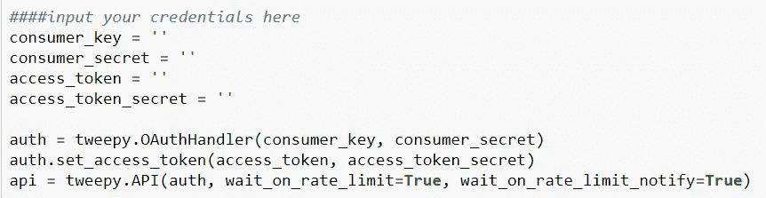

**令牌生成以访问 tweepy**

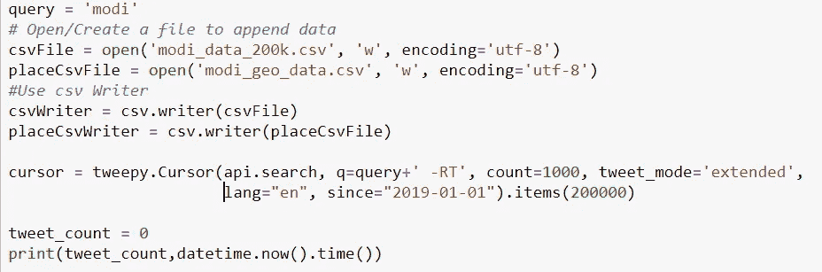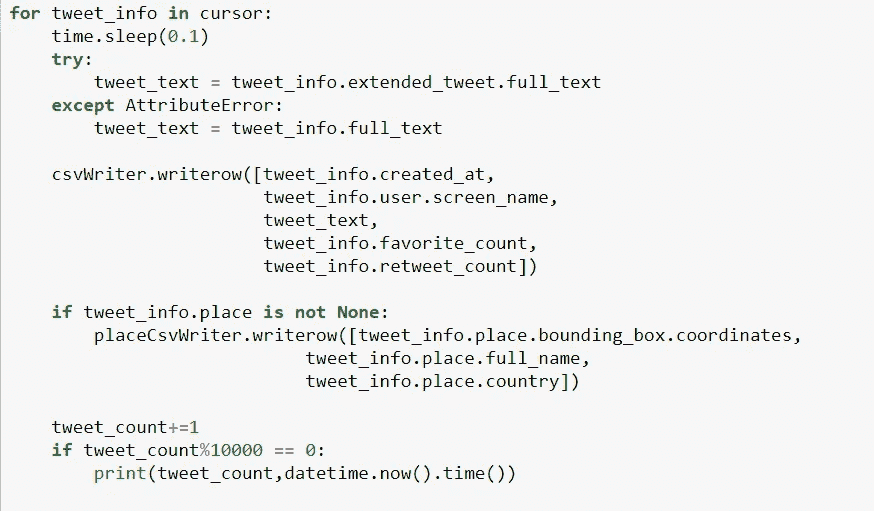

**从推特上删除推文**

**1.2 Reddit 数据收集**

Reddit 有一个类似于 tweepy 的 API，即 PRAW。顾名思义，PRAW 是 Reddit API 的 Python 包装器，可以从子编辑中抓取数据。

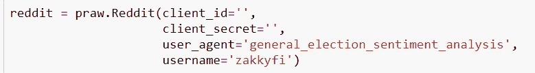

**生成客户端 Id 以访问 PRAW**

在它被用来抓取数据之前，我们需要验证我们自己。为此，我们需要创建一个 Reddit 实例，并为其提供 client_id、client_secret 和 user_agent。

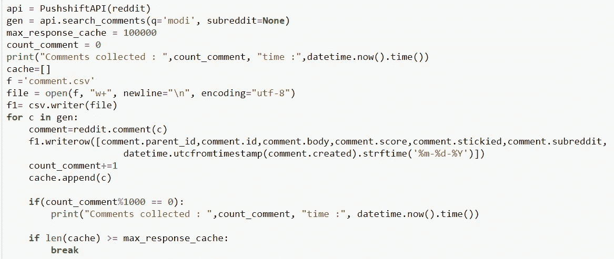

**来自 Reddit 的废弃评论**

PRAW 是使用 Python 从站点提取数据的主要 Reddit API。尽管有一些限制，包括提取特定日期之间的提交。出于这个原因，Pushshift 的 API 与 PRAW 一起用于访问 Reddit 的数据。search_comments 函数将在评论正文中搜索带有术语“modi”的最近评论。该搜索不区分大小写，因此它将查找任何出现的“modi”一词，而不考虑大小写。API 默认首先按照最近发表的评论进行排序。所有注释都返回到 CSV 文件中。

**2。数据预处理**

数据预处理是为分类清理和准备文本的过程。在线文本通常包含大量噪音和无用信息，如 HTML 标签、脚本和广告。另外，在词的层面上，文本中的很多词对它的大方向并不产生影响。保留这些单词使得问题的维数很高，因此分类更加困难，因为文本中的每个单词都被视为一维。

**2.1 Twitter 数据预处理。**

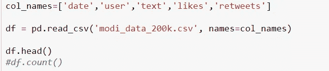

**表示熊猫框中的 CSV 文件**

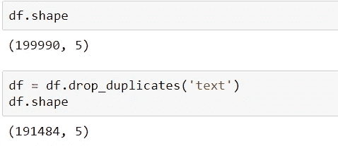

**包含文本的 Twitter 数据集的形状**

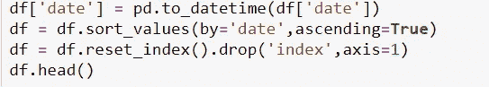

**按日期排序 twitter 框架的代码**

**2.2 Reddit 数据预处理。**

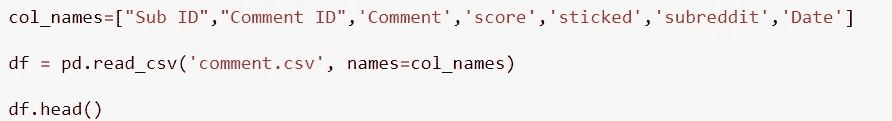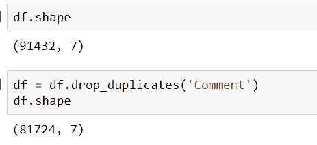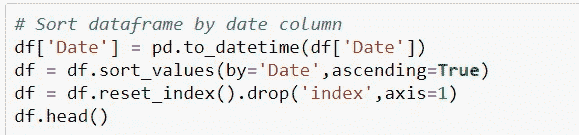

**在 Pandas 框架中表示 Reddit CSV 文件的代码**

**清除 Twitter 和 Reddit 数据框中的文本**

**3。情感标签**

在开发任何用于预测情感的模型之前，数据必须被标记，这个过程被称为情感标记。之后，数据集可以分为训练集和测试集。使用 python 库 TextBlob 来标注数据集。TextBlob 是一个用于处理文本数据的 Python 库。它提供了一个简单的 API，用于处理常见的自然语言处理(NLP)任务，如词性标注、名词短语提取、情感分析、分类、翻译等。

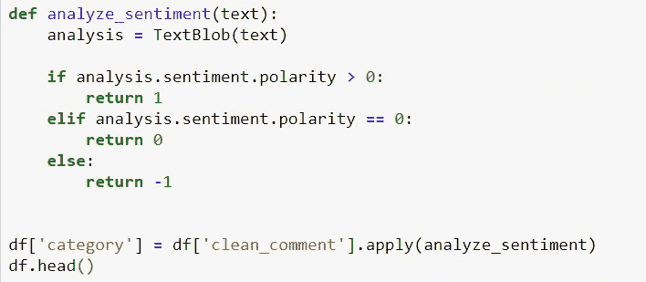

**使用文本斑点对清理后的文本进行情感标注**

情感属性返回情感(极性，主观性)形式的命名元组。极性是[-1.0 到 1.0]范围内的浮点值，其中 0 表示中性，+1 表示非常积极的情绪，-1 表示非常消极的情绪。主观性是一个浮动值，范围在[0.0 到 1.0]之间，其中 0.0 非常客观，1.0 非常主观。主观句表达一些个人感觉、观点、信念、意见和推测，而客观句是事实性的。TextBlob 继续寻找可以赋予极性和主观性的单词和短语，
，并对较长的文本进行平均。数据根据极性值进行标记。所有大于 1 的极性值被分类为+1 的正面情感，小于 0 的极性值被分类为-1 的负面情感，极性值为 0 的极性值作为中性情感 0 返回。

**4。数据可视化。**

**数据可视化**方法是指创建信息的图形表示。可视化在数据分析中发挥着重要作用，有助于通过利用复杂的数字或事实数据组来实时解释大数据。如今，各行各业的企业都可以随时获得看似无限的数据流，挑战在于数据解释，这是对单个组织及其宗旨、目标和长期目标最有价值的洞察。由于人类大脑处理信息的
方式，以图表或图形的形式呈现洞察力以可视化大量复杂的数据比依赖电子表格或报告更容易获得。可视化提供了一种快速、直观、简单的方式来普遍传达关键概念。

**数据可视化技术:图解、图表、图形。**

**用于数据可视化的 Python 库——Matplotlib、seaborn 和 folium。**

提取的 tweets 存储在 CSV 文件中，读取为 df，' numpy '用作' np '，这是 python 的一个包，用于通用数组处理。“Max”是 numpy 的一个方法，它返回数组的最大值。

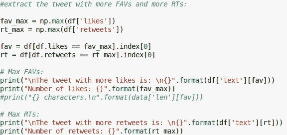

**数据的统计分析。**

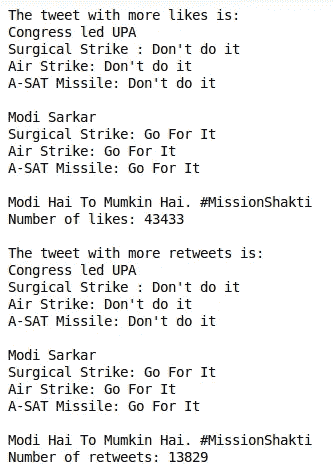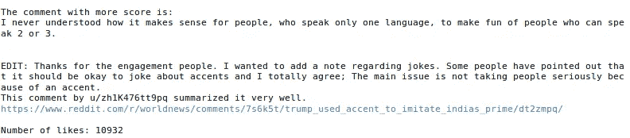

**Twitter 和 Reddit 数据集的统计分析。**

**时间序列图**

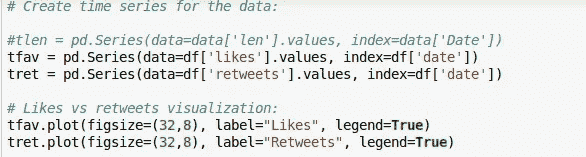

**绘制时间序列图的代码**

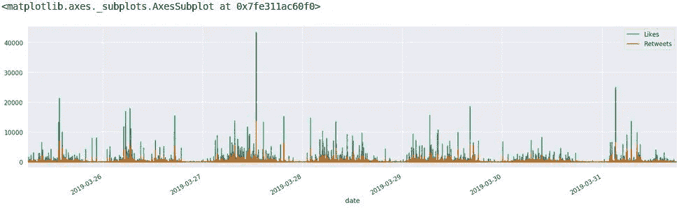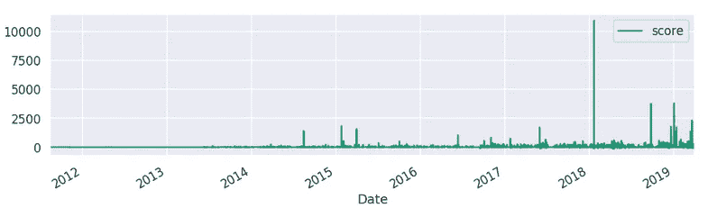

【Twitter 和 Reddit 的时间序列图

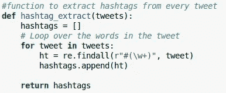

从推文中提取标签的代码。

创建一个“hastag_extract”方法，提取每条 tweet 中带有 hash tag 的所有单词，这是使用 python“Regex”完成的，用于描述字符串中的搜索模式(这里查找由符号“#”处理的单词)，并将获得的 hash tag 附加到列表“hashtags”中。

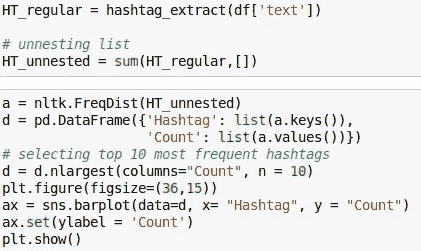

**绘制条形图的代码**

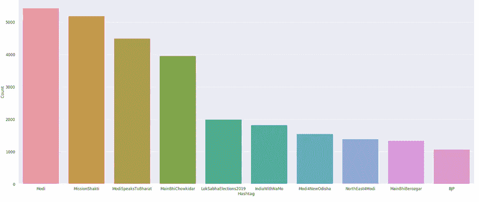

**描述标签最大使用量的条形图。**

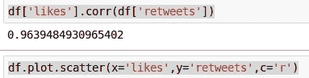

**绘制散点图的代码**

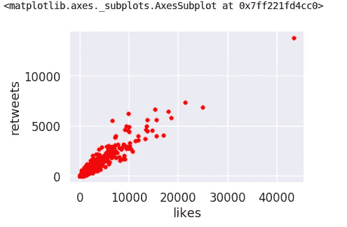

**散点图**

上面的散点图显示了赞 a 和推文转发之间的关联图。请注意，随着赞的增加，转发也在增加。

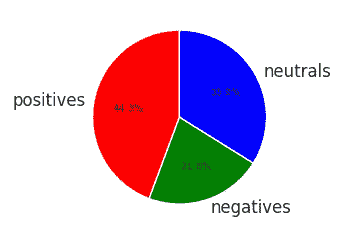

**推特**

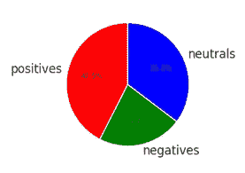

**Reddit**

上面的**饼状图**描绘了 Twitter 和 Reddit 上正面、负面和中立的推文和评论的百分比。

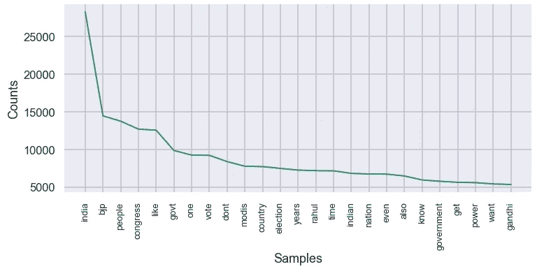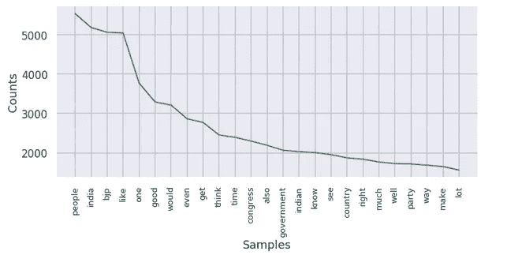

**显示单词等级的线图**

折线图，显示特定单词在推文中的使用次数(频率)。在收集到的推文中,“印度”被使用了超过 2.5 万次。在 Reddit 中,“People”是使用最多的，在大多数评论中都可以看到。

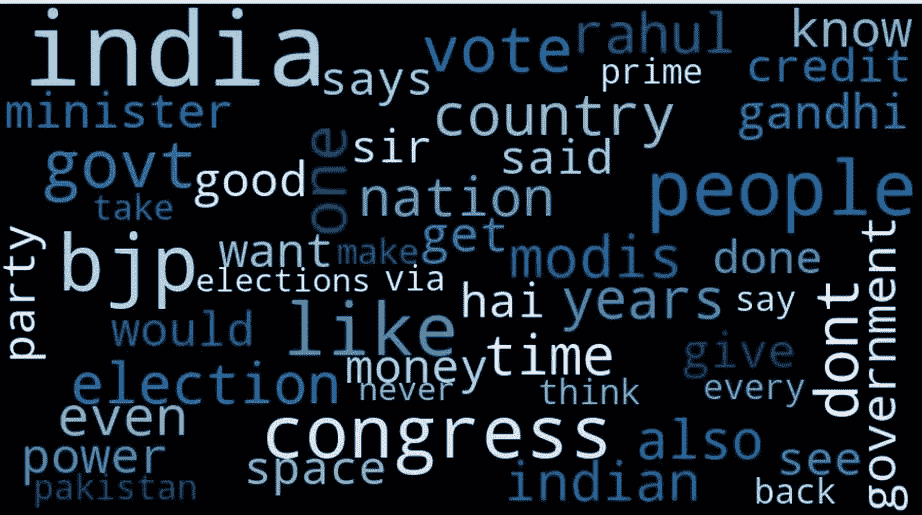

**Twitter 和 Reddit 的文字云**

上面的单词云描述了“印度”在推文中被使用的次数最多，颜色强度表明这个单词被使用的积极程度。

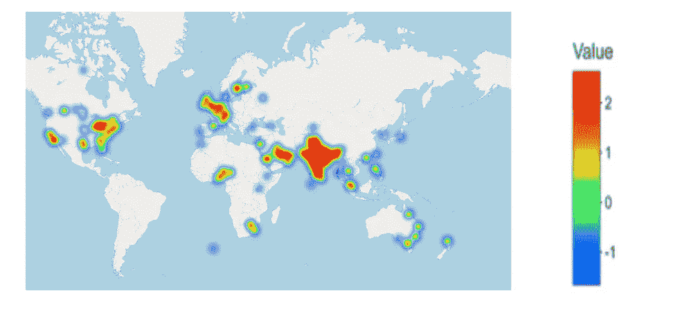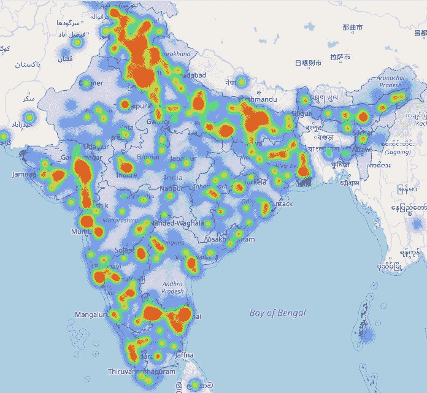

**全球和印度热图。**

**5。通过结果分析机器学习分类模型**

考虑到文献中可用的大量算法，将哪种模型类型应用于机器学习任务可能是一个令人生畏的问题。很难比较机器学习模型方法的相对优点，因为一个方法可以在某一类问题中胜过另一个方法，而在另一类问题中却总是落后。因此，在这个项目中，应用了四个这样的机器学习模型，以便在评估指标方面产生更好的结果。应用了四个机器学习分类模型，并且将比较它们的评估度量，例如模型的准确性预测。

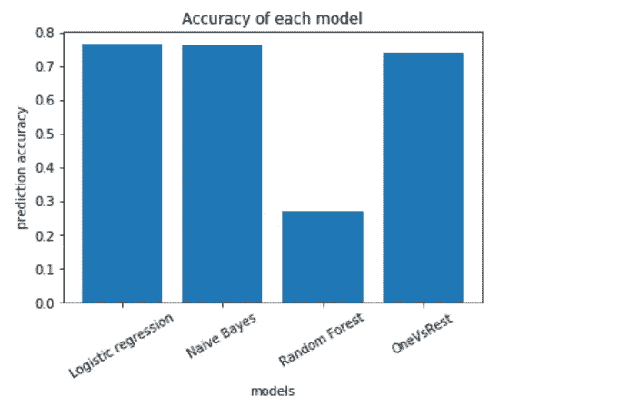

**每个训练模型的情感预测准确度的条形图。**

**6。结论**

在这个项目中，我们基于包含 2019 年印度大选中人们的推文和评论的数据集进行了大规模基准测试实验，最后我们比较了原始版本的随机森林与默认参数和逻辑回归、决策树以及 One-
Vs-Rest 分类器作为多类分类工具的预测性能。

大约 100 万条推文和 Reddit 评论使用熊猫图书馆合并，所有这些合并的推文和评论进一步存储在 **Spark 数据帧**中。使用 spark MllibLibrary 对这些 Spark 数据帧应用了机器学习模型，并预测了每个模型的准确性，如上图所示。根据在大约 80%的数据集中测量的考虑的准确性，逻辑回归和朴素贝叶斯机器学习算法比 one-Vs-Rest 和随机森林执行得更好。

**整个项目的 Github 链接。**

 [## chai thanya 21/使用 Pyspark 对多社交媒体数据进行情感分析

### 在这个迷你项目中，我选择了对 Twitter 和 Reddit 等社交媒体网站进行情感分析，以获得…

github.com](https://github.com/chaithanya21/Sentiment-Analysis-using-Pyspark-on-Multi-Social-Media-Data) 

**LinkedIn 个人资料**

 [## Chaithanya Kumar A -数据科学实习生- Blackcoffer | LinkedIn

### 查看 Chaithanya Kumar A 在全球最大的职业社区 LinkedIn 上的个人资料。Chaithanya 列出了 2 项工作…

www.linkedin.com](https://www.linkedin.com/in/chaithanya-kumar-a-610a91167/)