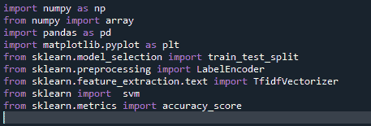
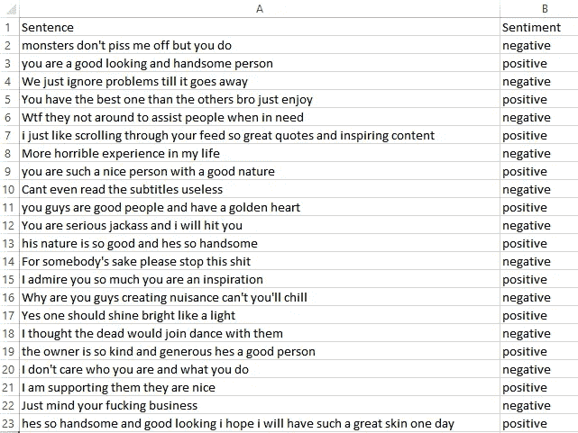
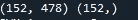
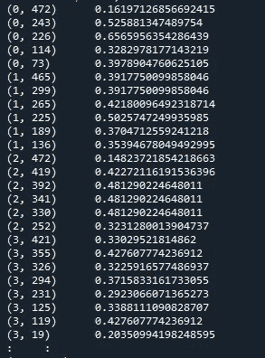
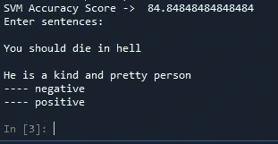

# 使用 SVM(支持向量机)的情感分析

> 原文：<https://medium.com/analytics-vidhya/sentimental-analysis-using-svm-support-vector-machine-812f2454fbc5?source=collection_archive---------19----------------------->

马库斯·斯皮斯克在 [Unsplash](https://unsplash.com?utm_source=medium&utm_medium=referral) 上的照片

情感分析是将任何社交媒体的各种帖子和评论分为负面或正面的过程。使用 NLP(自然语言编程)或 ML(机器学习)是使这个过程更容易的最好方法。

我做的情感分析项目有以下程序流程。

任何情感分析的步骤是:-

1.  **准备数据集** -用户可以获取任何类型的数据，也可以从网上下载。数据越多，预测就越准确。
2.  **数据预处理** -在这一步中，我们将单词变得更简单，这样预测就变得容易了。一些常见的数据预处理方法有:标记化(分割成每个单词)、词条化、词干化和去除停用词(不想要的单词)和字符。词条化意味着得到输入单词的原始单词“漂亮”将变成“漂亮”
3.  **特征提取**-对于所有的分类算法，特征对于绘制或制作精确的细节是必要的，以便预测基于该特征。这里我们将使用 TFIDF 算法
4.  **分类器算法** -这里我们使用 svm(支持向量机)，但也使用各种其他算法，如朴素贝叶斯、回归等。可以使用。
5.  **预测-** 完成上述所有步骤后，模型就可以进行预测了。我们将在测试数据集上进行预测。

必需品进口:-

所用的数据集非常简单，是手工输入的。数据集是一个 csv 文件。你可以在谷歌上得到一个直接的评论数据集。数据集的长度接近 308。

资料组

//使用下面一行，以便我们反复运行程序，并保持原始输入值。

随机种子(500)

#现在让我们使用 panda(pd)读取数据集

data = pd.read_csv('training.csv '，encoding = ' latin1 ')
#因为数据集很长所以使用 latin 来解码和正确的起始字节

data . dropna(in place = True)#删除所有空格
#将所有文本改为小写。

#Python 对‘car’和‘CARS’的解释不同。我没有在这个程序中使用词干，但这个过程很简单，可以通过使用像“ntlk”这样的内置函数来完成。
data['句子']=[entry . lower()for entry in data['句子']]

data['情绪'] = np.where(data['情绪'].str.contains('正')，1，0)

#上述步骤将正数划分为 1，负数划分为 0 这本来可以由标签编码器完成，但是我的 train_y 数组是 1 d
Train_X，Test_X，Train_Y，Test _ Y = Train _ Test _ split(data[' Sentence ']，data[' perspective ']，Test _ size = 0.3)
#将数据集以 70:30 的比例拆分为训练集和测试集

print(Train_X.shape，Train _ y . shape)#这有助于查看数据集中的行数

encoder = label encoder()#这样使用是为了将 Y 的所有条目适当地划分为 1 和 0
Train _ Y = encoder . fit _ transform(Train _ Y)
Test _ Y = encoder . fit _ transform(Test _ Y)

d = PD . read _ CSV(" stop words . CSV ")
my _ stop word = d . values . to list()#将数据类型转换为列表

#删除不需要的单词，如“是、是你、将等……”(stop words . CSV 有单词列表)

#使用函数提取 tfidf 特征

vectorizer = TfidfVectorizer(my _ stop word)
vectorizer . fit _ transform(data[' Sentence '])
# feature _ names = vectorizer . get _ feature _ names()by this u 可以查看是否删除了停用词和唯一重要的特征词

#训练数据和测试数据的 tfidf 值
Train _ X _ tfi df = vectorizer . transform(Train _ X)
Test _ X _ tfi df = vectorizer . transform(Test _ X)
print(Train _ X _ tfi df)

(a，b) c :csr 矩阵:a-内存索引 b-每个数字的唯一二进制值 c- tfidf 值。

#SVM 函数内置在库中
SVM = svm。SVC(C=1.0，kernel='linear '，degree=3，gamma = ' auto ')
SVM . fit(Train _ X _ tfi df，Train_Y)

#预测验证数据集上的标签
预测 _SVM = SVM.predict(Test_X_Tfidf)

#使用 accuracy_score 函数获得准确度
print("SVM 准确度得分- >"，accuracy_score(预测 _SVM，测试 _ Y)* 100)
#如果您要输入一个输入句子并检查分类是正还是负
lst = [ ]
print("输入句子:")

)for I in range(0，2):
ele = input()
lst . append(ele)

# print

输出

希望你能理解！检查下面的代码。

也发表在 freshly build-

[https://freshlybuilt.com/sentimental-analysis-using-svm/](https://freshlybuilt.com/sentimental-analysis-using-svm/)

 [## rak 02/感性分析

### 基于支持向量机的情感分析。在 GitHub 上创建一个帐户，为 rak 02/情感分析开发做贡献。

github.com](https://github.com/rak02/sentimental-analysis)