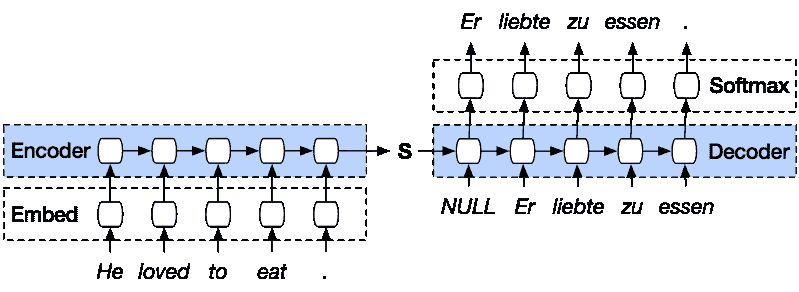
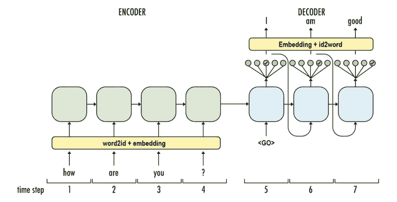

# Seq2seq 模型与暴露偏倚问题

> 原文：<https://medium.com/analytics-vidhya/seq2seq-model-and-the-exposure-bias-problem-962bb5607097?source=collection_archive---------3----------------------->

Seq2seq 模型或通常称为编码器-解码器模型，是用于机器翻译、图像字幕、文本摘要等的技术。在下图中，我们可以看到用于机器翻译的编码器-解码器模型。

(机器翻译模型)

我们可以使用 LSTM 或其变体，如 GRU 或双向 LSTM 作为编码器解码器单元。假设我们想要创建一个将英语句子转换成法语句子的模型。然而，我们不能直接将原始的英语句子作为输入提供给编码器。因此，我们需要将这些单词转换成向量。我们可以使用各种预训练的模型，如 google 的 word2vec、glove 或 fasttext，将这些单词转换为矢量，或者我们可以使用嵌入层来获得每个单词的矢量表示。

在后一种情况下，我们的模型将在训练模型时学习单词的有用表示。首先，我们可以将每个单词转换成一个整数，然后应用嵌入查找操作来找到给定单词的相应表示。

这里有一个我们在进行机器翻译时应该遵循的技巧:在将整个句子作为编码器模型的输入时，我们应该首先反转它，然后将其馈送给模型，使得第一个单词应该出现在最后，因为这是应该首先翻译的单词。

现在让我们试着分析解码器的输入。在训练时间中，解码器被给予输入，该输入应该是在先前步骤中输出的，除了第一个单词，该单词具有作为代表句子开始的输入的标记(假设为<go>)。除此之外，解码器单元被给予先前的输出作为输入。</go>

(用于自动响应生成的 seq2seq 模型)

在每个时间步中，解码器将输出每个单词的分数，该分数通过 softmax 函数转化为概率。我们还选择概率最高的单词作为输出(不同之处在于波束搜索策略)。在这种情况下，假设单词 good 的概率为 0.3，“I”的概率为 0.4，“am”的概率为 0.3，那么根据贪婪搜索策略，我们选择“I”作为输出。

在推理时间或测试时间，我们没有目标句子作为输入提供给解码器。在这里，模型完全依赖于它自己，因为实际摘要的不可用性，我们提供来自先前输出的输入。这个问题被称为 ***曝光偏差问题。*** 如果模型在某一步输出一个坏的输出，反过来影响前面的整个序列，这个问题就变得很尖锐。

作为这个问题的第一步解决方案，我们可以利用课程学习，试图消除解码器对实际摘要或基础事实的依赖。这利用了所谓的 ***计划抽样*** 的概念，其中模型将随机选择从哪里抽样。也就是说，是将地面实况作为输入提供给下一个时间步，还是将前一个时间步中产生的输出作为两个输入提供给推断时间。这种方法大大减少了模型对原始摘要的依赖。

在下一篇文章中，我们将看到使用 ***强化学习*** 来抑制曝光偏差的问题。