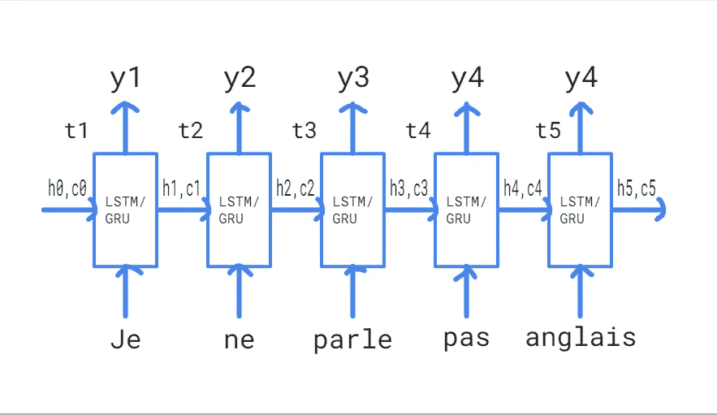

# Seq2Seq 模型:注意使用编码器-解码器模型进行法语到英语的翻译。

> 原文：<https://medium.com/analytics-vidhya/seq2seq-models-french-to-english-translation-using-encoder-decoder-model-with-attention-9c05b2c09af8?source=collection_archive---------6----------------------->

具有注意机制的机器翻译的张量流实现。

# **目录:**

1.  序列对序列模型介绍。
2.  编码器。
3.  解码器。
4.  注意。
5.  代码演练。
6.  评估测试数据的性能。
7.  结论。
8.  参考文献。

# **1-序列对序列模型介绍:**

序列对序列学习就是训练模型，将序列从一个域转换到另一个域。这里需要注意的一点是，两个序列可能长度相同。一个典型的 Seq2Seq 模型由一个编码器和一个解码器组成，它们本身是两个独立的神经网络，合并成一个巨大的网络。编码器和解码器都是典型的 LSTM 或 GRU 模型。

Seq2Seq 模型的一些应用是神经机器翻译、图像字幕、语音识别、聊天机器人、时间序列预测等。

编码器网络的工作是理解输入序列，并创建一个更小的维度表示，然后转发给产生输出的解码器网络。

编码器的输入可以是编码的句子(在神经机器翻译的情况下)或者图像特征(在图像字幕的情况下)或者甚至是声波(在语音识别的情况下)。

**神经机器翻译**

**语音识别**

**图像字幕**

在这篇博客中，我将讨论神经机器翻译的编码器-解码器模型。我将训练模型将法语句子翻译成英语句子。

# 2-编码器:

让我们了解编码器架构。假设我们的输入句子有“n”个单词。为了简单起见，我们假设语料库中只有一个句子。

*   ***法语:“我不会说英语”***
*   ***翻译:“我不会说英语”***
*   输入词汇:{Je，ne，parle，pas，anglais} (5 个唯一单词)。

**编码器架构**

*   Xi →由于我们要使用单词级编码，在每个时间戳输入的将是句子中的每个单词。这意味着 X1 = '日本'，X2 = '东北'，等等..高达 X5 = '英国人'。如果我们使用字符级编码器-解码器模型，那么每个时间戳的输入将是单个字符:X1 : 'J '，X2 : 'e '，X3 : 'n '，等等。每个单词都以向量的形式表示。为此，每个单词都被语料库中该单词的 word_index 替换。最频繁使用的单词的单词索引小于最不频繁使用的单词。
*   ‘h0’和‘c0’→初始隐藏状态和上下文向量，它们都是零(通常)并且在第 0 个时间戳被馈送到编码器。在这之后，我们开始输入单词。
*   “hi”和“ci”→时间戳 I 之后的隐藏状态和上下文向量。这些向量简单地表示编码器在该时间戳之前已经看到的内容。例如，h3 和 c3 会记得网络到目前为止已经看到了“Je ne parle”。这些向量中的每一个的大小等于 LSTM/格鲁的单位数。在最后一个时间戳之后获得的状态作为解码器初始状态被馈送到解码器中。
*   ‘yi’→时间戳 I 处的输出。这是通过使用 Softmax 激活函数生成的整个词汇的概率分布。我们不需要来自编码器网络的输出，因此我们将丢弃它们。我们关心的唯一编码器输出是隐藏/上下文向量。

***注:上图是我们在时间轴上展开 LSTM/GRU 电池时的样子。即，它是单个 LSTM/GRU 单元，在每个时间戳取单个字。我们的编码器/解码器网络中可以有多个这样的单元。***

# 3 解码器:

在学习了编码器之后，现在让我们进入另一部分:解码器网络。与编码器不同，解码器在训练和推理阶段表现不同。此外，我们需要向输出句子添加两个特殊的标记，原因如下所述。这些记号是“<start>”(在字符串的开头)和“<end>”(在字符串的结尾)。</end></start>

## a)。训练阶段的解码器:

注意，编码器的最终状态被设置为解码器的初始状态。在初始状态，我们提供'<start>'作为输入，以便解码器开始生成下一个标记(英语句子的第一个单词)。我们使用一种称为 ***【教师强制】*** 的技术，其中将来自先前时间戳的实际输出(而不是预测输出)作为输入馈送到当前时间戳。在输入实际翻译的最后一个单词后，我们让我们的解码器学习预测表示翻译结束的'< end >'。这个'< end >'标记在推断阶段充当停止条件。</start>

*   (编码器+解码器)网络的整个训练可以总结如下图所示:

**整个编解码训练网络**

## a)。推断阶段的解码器:

*   解码器在训练和推断阶段的唯一区别在于，在推断阶段，来自先前时间戳的预测输出(而不是与训练阶段不同的实际输出)被作为输入馈送到当前时间戳。休息和训练阶段一样。
*   下图总结了整个推理过程:

**推理网络**

# 立正！

*   到目前为止所讨论的都是没有注意机制的简单的编码器-解码器模型。
*   这种模式的一个主要缺点是，一旦他们进一步处理，他们往往会忘记序列的早期部分。对于较长的句子是不好的。请看下图:

**句子长度 vs BLEU 分数**

*   上图是句子长度与 BLEU 分数的关系图。第一个模型(RNNSearch-50)使用注意机制，而其余 3 个模型不使用。
*   我们可以清楚地看到，随着句子长度的增加，后 3 个模型的 BLEU 得分下降，而 RNNSearch-50 的 BLEU 得分保持稳定。因此，在处理较长的序列时，注意力是一个非常重要的方面。我们就在这一节讨论吧。

# 注意力是如何工作的？

让我们以前面的例子为例，一步一步地理解它:

***法语:“我不会说英语”***

***翻译:“我不会说英语”***

下图显示了它们对应的隐藏编码器状态:

**编码器 GRU**

*   **获取编码器隐藏状态:**首先从编码器获取每个时间戳后的隐藏状态，如上图所示。
*   **将编码器最终状态设置为解码器初始状态:**由于我们试图预测输出序列的第一个字，解码器将不会有任何当前内部状态。为此，我们将使用最终编码器状态(h5)作为初始解码器状态。
*   **计算分数:**现在，使用所有编码器状态和当前解码器状态，我们训练一个简单的前馈神经网络，该网络将通过为相关编码器状态生成高分并为不相关状态生成低分来学习识别相关编码器状态。例如，为了预测单词“speak”，相关信息可以处于状态 h1、h2、h3，而剩余的状态 h4 和 h5 可能是不相关的。我们的前馈神经网络将学习给前 3 个状态高分，给后 2 个状态低分。设这些分数分别为[s1，s2，s3，s4，s5 ]。

**计算分数**

*   **获取关注权重:**将前一阶段得到的分数送入***【soft max】***函数，获取关注权重。设这些权重为 e = [e1，e2，e3，e4，e5]。所有这些权重的总和等于 1。因此，他们给出了一个很好的概率解释。

**从 softmax 获取注意力权重**

*   **计算上下文向量:**得到关注权重后，上下文向量计算如下。它将被解码器用来预测下一个字。

> **context-vec(cv)= E1 * h1+e2h 2+E3 * H3+E4 * H4+E5 H5**

*   **将上下文向量与先前的输出连接:**对于第一个时间戳，我们没有任何先前的输出，因此我们将把 ***' <开始> '*** 与上下文向量连接起来。然后，我们将合并后的向量提供给解码器，解码器将使用它来预测下一个单词。

# 代码演练:

*   首先，像任何其他 NLP 任务一样，我们加载文本数据并执行预处理，还进行训练测试分割。
*   作为清理的一部分，我们从文本数据中删除 html 标签、数字和不需要的符号。
*   从这个[链接](http://www.manythings.org/anki/)下载法语到英语的数据集。

*   标记化和填充。
*   执行填充以使所有句子的长度相同(等于 max_len)。

*   使用 tensorflow.data 创建数据输入管道。请参考此[链接](https://www.tensorflow.org/guide/data)了解有关 tensorflow 数据的更多信息。

*   定义编码器和解码器架构。

*   定义优化器、损失函数和设置检查点目录路径以在训练时保存进度。

*   最后，是训练循环。它使用上面讨论的教师强制概念进行训练。
*   它也在每一秒保存进度。

*   用于评估测试数据和绘制注意力权重的函数:

# 评估测试数据:

*   我们的翻译将根据 BLEU(双语评估替角)评分进行评估。它是一个介于 0 和 1 之间的值。BLEU 分数越接近 1 越好。要了解更多信息，请参考[本](https://en.wikipedia.org/wiki/BLEU)和[本](https://towardsdatascience.com/evaluating-text-output-in-nlp-bleu-at-your-own-risk-e8609665a213)链接。
*   我已经训练了 6 个时期的模型，损失在 0.05 左右。你可以看到有些翻译很完美，有些没那么好。

# 结论:

*   测试数据的翻译相当准确。他们中的一些人没有达到标准
*   我们可以添加更多的数据，并运行大量的时期，以获得更好的翻译。
*   我们也可以使用不同的注意力得分函数(点和一般得分函数)。
*   使用双向包装器的 LSTM 代替 GRU 也可以大大提高翻译。

# 参考资料:

1.  [https://arxiv.org/pdf/1409.0473.pdf](https://arxiv.org/pdf/1409.0473.pdf)
2.  [https://arxiv.org/abs/1409.3215](https://arxiv.org/abs/1409.3215)
3.  [https://medium . com/@ Martin . monperrus/sequence-to-sequence-learning-program-repair-e 39 DC 5c 0119 b](/@martin.monperrus/sequence-to-sequence-learning-program-repair-e39dc5c0119b)(使用 seq-to-seq 学习进行程序修复)。
4.  [http://www.manythings.org/anki/](http://www.manythings.org/anki/)(各种数据集链接)
5.  Keras 序列对序列学习教程。
6.  [https://www . tensor flow . org/API _ docs/python/TF/keras/layers/Attention](https://www.tensorflow.org/api_docs/python/tf/keras/layers/Attention)(tensor flow 关注)
7.  [https://towards data science . com/light-on-math-ml-attention-with-keras-DC 8 db C1 fad 39](https://towardsdatascience.com/light-on-math-ml-attention-with-keras-dc8dbc1fad39)