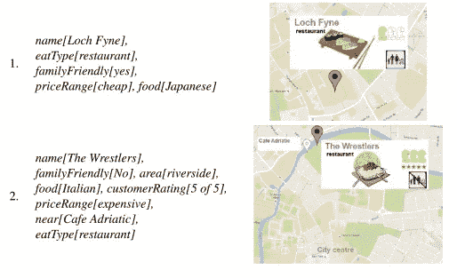
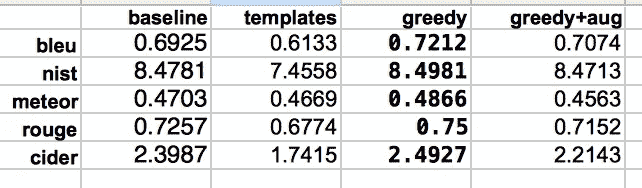
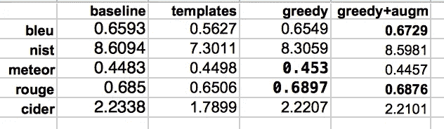
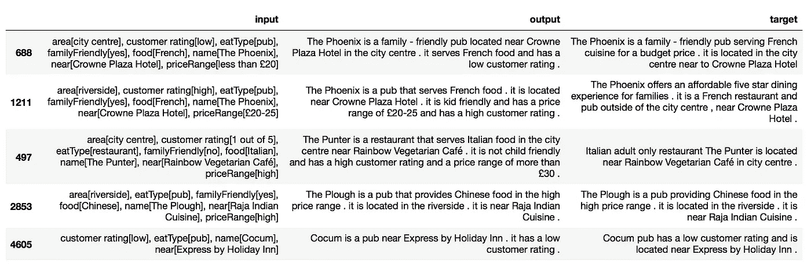

# NLG:好的、坏的和无聊的

> 原文：<https://medium.com/analytics-vidhya/seq2seq-nlg-the-good-the-bad-and-the-ugly-8de0a05d9da1?source=collection_archive---------10----------------------->

克林特·伊斯特伍德在塞尔吉奥·莱奥内的电影《善、恶、丑》中

在自然语言生成(NLG)中，依赖于领域的定制架构和基于模板的方法长期以来一直占据主导地位，这是因为输入数据是异构的，需要认知和语言通知任务来将其转换为适合通信的消息。此外，目标文本更不用说成对的输入和目标文本很难得到。

在神经机器翻译之后，NLG 的序列对序列(seq2seq)模型出现了，它承诺生成端到端的语法文本，这些文本保留了目标文本的风格，同时仍然传达了输入内容。

2017 端到端(e2e) NLG 挑战赛很好地体现了 NLG seq2seq 的热情。基线本身是一个 seq2seq 方法，许多提交竞争或后来提出的系统都是基于这个模型。这些方法的综合以及对数据集和评估的详细分析可以在[这里](https://www.sciencedirect.com/science/article/pii/S0885230819300919)找到。

在本文中，我首先介绍了这一挑战的关键要素，即数据集、基线、评估和一些为改善基线而提出的 seq2seq 策略。然后，我介绍了一个基本 seq2seq NLG 的实现，它使用了 NLP 上的 [Fastai 课程中为神经机器翻译提供的](https://github.com/fastai/course-nlp) [Fastai](https://www.fast.ai/) 代码，在一些基于单词的指标上取得了比基线 wrt 更好的分数。Fastai 代码的优势在于，它可以随时使用并实现 seq2seq 学习问题的一些最新解决方案。因此，人们可以专注于尝试不同的想法。

该 FastAai seq2seq NLG 模型的代码和笔记本以及评估结果的预处理可在 github [此处](https://github.com/nadjet/e2e_nlg)获得。

# 资料组

e2e NLG 竞赛数据集由大约 50k 对含义表示(MRs)和简短自然语言(NL)餐馆描述组成，其中不到 10%是验证集。+6k 的 MR 是唯一的，这意味着一个 MR 可以以不同的方式实现。数据集已经过组织，因此输入不会在验证和测试集中重复，即使在删除了场所名称之后也是如此。

下面是 MR 的一个例子，它可能有 6 种不同的表达方式:

> **先生:**
> 
> *名称【老鹰】，
> eatType【咖啡店】，
> 美食【英式】，
> 价格区间【30 多】，
> 定制【高】，
> 地区【河畔】，
> kidsFriendly【是】，
> 附近【汉堡王】*
> 
> **NLs:**
> 
> (Eagle 是河滨汉堡王附近一家受到高度评价的儿童友好型咖啡店。它有英国食物，价格范围是 30 多英镑。
> 
> (Eagle 是一家价格不菲的家庭咖啡店，供应英国菜。它位于汉堡王附近。
> 
> (3)河滨区汉堡王附近有一家名为 Eagle 的儿童友好型咖啡店，顾客评价很高，价格适中，在 30 英镑左右。
> 
> (4)评价很高的 The Eagle English 咖啡店位于汉堡王附近的 riverside，价格区间 30 多。
> 
> (5)有一家叫老鹰的英国咖啡店。它在河边地区的汉堡王附近。它适合儿童，价格在 30 英镑以上。
> 
> (6)老鹰在北部市中心，河的南边，汉堡王附近。

这个例子的含义表示表达了 MR 可能具有的所有 8 个属性。这些属性中的两个是自由文本(*名称*和附近的*)，其余的有两到六个可能的值。*

上面的参考文献有非常丰富的词汇和结构，从一句到三句不等。此外，许多人并没有把所有的内容都用语言表达出来。事实上，句子(6)提供的信息甚至在 MR 中也没有。

在这方面，了解挑战的[组织者](https://www.sciencedirect.com/science/article/pii/S0885230819300919)所解释的数据是如何获得的是很有趣的:它是众包的，其中 80%的案例使用如上所述的带括号的 MRs 呈现(以随机顺序呈现，以便不影响信息在文本中呈现的顺序)，20%的案例使用图像地图 MRs(见下图)。因此，句子(6)中的额外信息看起来可能是从图片/地图表示中获得的。事实上，通过使用一项比较图片和文本 MRs 的预先研究，作者揭示了“*图片 MRs 引出的文本在语义文本相似性方面与潜在 MR 明显不太相似”*，以及*“与文本 MRs 相比，图片 MRs 引出的文本在语义文本相似性方面与潜在 MR 明显不太相似”。*

文本/逻辑 vs 图片/地图意义表征([来源](https://www.sciencedirect.com/science/article/pii/S0885230819300919))

根据作者的说法，这些变化引入了 NLG 系统必须应对的噪声。然而，是否有一个标准来决定是否要用言语表达一些意思呢？例如，在上面的 6 篇文章中，有 5 篇提到了 30 多的价格，所有文章中都提到了与汉堡王的接近度，只有 3 篇文章提到了高客户评级。此外，不同文本的出处(作者和图片与文本的 MR)没有具体说明，因此很难利用这些信息。

# 估价

为了对系统进行基准测试，e2e NLG 竞赛组织者提供了一个基线，这是一个基于注意力的 seq2seq 模型，该模型使用分类器进行数据增强和波束搜索，并对偏离输入的输出进行惩罚。所以他们的底线本身就很强。

对于输出文本的评估，使用三种类型的措施，即单词重叠度量，文本复杂性和多样性度量，以及人的判断。下面我们将简要描述每一种方法，尽管我们将只提供基于单词的度量作为我们的评估。

## 单词重叠度量

为了对照参考文本评估输出文本，提供了一个[评分脚本](https://github.com/tuetschek/e2e-metrics),用于计算多个单词重叠指标，即 BLEU、Meteor、Rouge-L、CIDEr 和 Nist。以下是它们的简要说明:

*   [BLEU](https://en.wikipedia.org/wiki/BLEU) :计算 n-gram 精度的调和平均值(其中 n 最大为 4)，如果输出比引用短，则降低一个简洁性代价。针对任何参考文本执行 n 元语法匹配。
*   CIDEr:在 tf*idf 分数加权的 *n* -grams，n∈{1，…，4}级别上计算系统输出和参考句子之间的平均余弦相似度。
*   [Meteor](https://en.wikipedia.org/wiki/METEOR) :测量给定 MR 的每个人类生成输出的 unigrams 的精度和召回率，选择最匹配的一个。除了精确的单词匹配，它还使用基于词干和 WordNet 同义词的模糊匹配。
*   [Rouge-L](https://en.wikipedia.org/wiki/ROUGE_(metric)) :根据最长公共子序列相对于任何人类参考的精确度和召回率来测量 f 值。
*   [Nist](https://en.wikipedia.org/wiki/NIST_(metric)) :是 BLEU 的一个版本，它赋予更稀有的 n 元文法更多的权重，而对简洁的惩罚更少。

因此，一些度量标准，如 BLEU、Meteor 或 Rouge-L 因子，在给定意义表示的多个参考文本中。

## 文本复杂性和多样性度量

对参考文本的词汇和句法复杂性的测量表明，这些文本表现出高度的词汇和句法复杂性和多样性。使用[词汇复杂性分析器](https://aihaiyang.com/software/lca/)计算词汇测量，例如类型与标记比率和熵。使用 [D 级分析器](http://www.personal.psu.edu/xxl13/downloads/d-level.html)测量句法复杂程度，该分析器在句法复杂程度的 8 分制上给句子赋值。结果显示，虽然 46%的句子是简单的，但 15%的句子具有最高的两种复杂程度。另一方面，研究表明 seq2seq 系统通常具有较低的句法复杂性和较差的词汇多样性。

## 人类的判断

定量评估有其局限性，通常建议用于系统之间的比较。然而，要评估文本生成系统的输出质量，人类的判断是必不可少的，尽管代价很高，但也并非没有困难。要获得启发，请阅读 Ehud Reiter 的博客文章[“如何做 NLG 评估:指标”](https://ehudreiter.com/2017/05/03/metrics-nlg-evaluation/)。

对于这个比赛，两个单独的文本质量判断任务在众包源上执行。一方面，他们被要求判断与他们的输入 MRs 一起呈现的文本的*，回答以下问题:“*你如何根据其语法正确性、流畅性、充分性和其他重要因素来判断话语的整体质量？*”。另一方面，大众信源被要求判断输出文本的*质量，没有他们的 MRs，回答问题:“*话语可能是由一个说本族语的人发出的吗？***

# **一盒工具和窍门**

**通过查看本次竞赛产生的大量文献，我发现 seq2seq 系统建议通过以下方式对基线进行改进:(1)调整输入数据集，(2)调整架构，或(3)调整输出，以及这三种方式的任意组合。**

****

**选择正确的工具**

## **调整输入**

**大多数系统执行的第一件事，seq2seq 或其他，是将*输入去具体化，即用一些虚拟值替换自由文本输入(即当前和附近的场馆名称)。***

***许多系统执行的另一种常见方法是进行 ***数据扩充*** ，它采用多种形式，例如:***

*   **[***排列***](http://www.macs.hw.ac.uk/InteractionLab/E2E/final_papers/E2E-TNT_NLG2.pdf) 输入中属性值的含义表示、**
*   **[***过采样***](http://www.macs.hw.ac.uk/InteractionLab/E2E/final_papers/E2E-TNT_NLG2.pdf) 通过简单地复制输入，或者通过使用槽对齐器添加与属性值匹配的单句，**
*   *****选择性子采样*** ，通过使用具有最高平均词频的[引用](http://www.macs.hw.ac.uk/InteractionLab/E2E/final_papers/E2E-Sheffield.pdf)以增加多样性，或者通过使用具有复杂单句的[引用](https://arxiv.org/abs/1805.06553)以获得更复杂的输出。**
*   **[***合成文本生成***](https://www.aclweb.org/anthology/W18-5019.pdf) ，通过使用统计生成器来生成根据人格的心理语言学模型而风格各异的大型文本语料库。**

## ****调整架构****

**已经提出了许多方法，例如:**

*   *****集合*** 在不同的神经架构上训练的不同模型[(使用 LSTMs vs CNNs)或在](https://www.aclweb.org/anthology/N18-1014/)[表现出相似风格和结构属性的不同句子簇上用相同架构训练的不同模型](https://arxiv.org/pdf/1810.04700.pdf)。**
*   ***从文本中联合学习 NLG 夫人和 NLU 先生，以缓解成对数据集的缺乏。***
*   ***使用属性值的[固定集合](https://www.aclweb.org/anthology/W18-6557.pdf)作为编码器的输入。***
*   ***使用 [***复制机制***](http://www.macs.hw.ac.uk/InteractionLab/E2E/final_papers/E2E-HarvardNLP.pdf)*，允许在标准生成机制和直接将输入事实复制到输出之间交替。****

## ***调整输出***

***这通常是用 ***波束搜索*** 来生成 k 最佳输出，然后通过使用 ***分类器*** 或 ***长度罚分*** 和 ***覆盖罚分*** 来应用 ***重新排序*** ，这些罚分惩罚那些没有描述所有输入的输出。***

# **履行**

**正如介绍中提到的，我重用了在 Fastai NLP 课程中介绍的 seq2seq 的 Fastai 实现。这包括:**

*   **Fastai 文本串加载和预处理。这使用了 spacy tokenizer，并将最小词频设置为 3。**
*   **输入和输出嵌入。在这个实现中，我使用 Fasttext 预训练模型将含义表示中的每个单词映射到 300 维嵌入。**
*   **一个 1 层 GRU 编码器和解码器架构，具有一些默认的下降值。我发现 1 层架构比 2 层架构性能更好，大概是因为它涉及的参数更少。隐藏层中神经元的数量设置为 128，批量设置为 32。与 e2e NLG 竞赛的大多数 seq2seq 解决方案相反，我没有发现与普通版本相比，注意力给最终结果增加了价值。**
*   **教师强制，其在步骤 t 向解码器提供步骤 t-1 的真实观察值，而不是训练时的预测值，以避免误差传播。这种方法通过计划抽样得到缓解，计划抽样实际上提供真实观察和预测的随机混合，真实观察随着训练的进行而减少。**

**我还对参考文本和含义表示进行了去词汇化，并在将输入的含义表示提供给编码器之前对其进行了一些基本的清理，比如在破折号周围和标点符号之前添加空格。**

**在对 MRs 和文本进行预处理、清理和上传之后，我最终得到了 56 个惟一的输入令牌和 1216 个惟一的输出令牌。**

**我尝试了 4 种不同的设置:**

1.  **带贪婪搜索的普通 seq2seq**
2.  **基于模板的方法使用与此处[提供的](https://www.aclweb.org/anthology/W18-6557/)相同的基本模板**
3.  **带贪婪搜索和数据扩充的普通 seq2seq**
4.  **带波束搜索和重新分级的普通 seq2seq**

**为了增加数据，我对每一对输入使用了 3 种随机排列，如[这里的](http://www.macs.hw.ac.uk/InteractionLab/E2E/final_papers/E2E-TNT_NLG2.pdf)(不要忘记将 Fastai tokenize 预处理器的最小词频从 3 提高到 9，以保持相同的标记)。**

**对于波束搜索，我使用了具有变量 k 的神经采样，而不是固定的 k，变量 k 的条件是概率 p=0.3，因为我发现这比 top-k(当 p 保持较低时)给出了更多的语法输出。为了更好地测量，我还改变了 softmax 温度(T=1)。已知这两种方法(神经采样和温度)都可以获得更多样的输出。**

**为了执行重新排序，我使用了一个[多标签分类器，它是我使用 Fastai ULMFit 方法在成对的 text-MRs](https://www.kaggle.com/nadjetba/text-to-meaning-with-multi-label-classification) 上开发的。该分类器在针对 ***个体*** MR 属性值分配的测试集上实现了 90%的 F1 分数。根据分类器，仅当贪婪输出没有实现所有 MR 属性值时，才应用神经采样和重新分级，并且仅当神经采样输出的 F1 值高于贪婪输出的 F1 值时，才考虑神经采样输出。**

# **结果**

**下面的两个表显示了 seq2seq 模型在竞争基准、基于模板的方法以及贪婪搜索(有和没有扩展)下对开发和测试集的评估。**

****

**对开发集的评估**

****

**对测试集的评估**

**结果表明，对于开发集，基本的 Fastai seq2seq 实现在所有度量上都优于基于模板的实现和基线实现。相反，数据扩充并没有改善开发集的结果。**

**在测试集上，基本的 Fastai seq2seq 实现优于 Meteor 和 Rouge 上的基线。具有数据扩充的贪婪搜索比没有数据扩充的贪婪搜索给出了更好的 Bleu、Nist 和 Rouge 分数，并且在 Bleu 和 Rouge 上优于基线。**

**以下是使用 seq2seq 和贪婪搜索获得的一些示例输出(在“重组”之前):**

****

**seq2seq 的示例输出，使用开发集中的贪婪搜索**

**该示例显示并非所有属性值都在输出列中实现:行 688 缺少价格，行 1211 缺少面积。还有一些属性值没有正确实现:当输入中的客户评级为“1/5”时，行 497 提到了“高客户评级”。**

**不幸的是，使用我们的分类器执行重新排序的波束搜索并没有改善结果。事实上，这让他们更糟。对开发集的所有贪婪输出应用分类器揭示了超过 93%的输出实现了 100%的精度，67%实现了 100%的召回。考虑到许多目标文本并不描述所有的输出，这可能解释了为什么提高回忆对表现没有太大的影响。此外，把所有内容都用语言表达会使文本变得更长，这也可能会影响性能。**

# ****遗言****

**总而言之，我发现令人印象非常深刻的是，我可以生成听起来相当不错的短文，这些短文使用顺序模型来描述大部分输入，而没有任何常见的 NLG 工具(排序、句子规划、词汇化、语言实现等)。**

**然而，与我们领域的目标文本相反，得到的文本在语言学上变化不大(根据 [LCA](https://aihaiyang.com/software/lca/single/) 的开发集的贪婪输出中不同单词的数量是 53，这接近于输入标记的数量)。我可以以更高的神经采样概率或更高的 softmax 温度获得更多种类，但这降低了输出的语法性和正确性，即，导致了所谓的[神经幻觉](https://www.aclweb.org/anthology/P19-1256/)。**

**因此，回到文章的标题，我们得到了“好的”目标文本，“坏的”官样文章(喜欢这个词)输出和“无聊的”seq2seq 输出。这种扁平风格的输出对于基于对话的系统来说尤其成问题，[的一些作品](https://arxiv.org/pdf/1907.09527.pdf)试图通过将风格和文体特征融入训练中来补救这一点。**

**最后，诚实一点。我花了很多时间尝试不同的选项，试图获得更好的结果，例如:**

*   **不同型号(vanilla seq2seq，注意，变形金刚)，**
*   **在不同的 p 值下用神经采样重新排序，并用不同的 softmax 温度进行实验，**
*   **教师用不同的真实观察值与预测值的比率强迫学生，**
*   **选择性二次采样(例如，用单句文本进行训练)或仅通过复制数据进行过采样。**

**我还花了相当多的时间修改超参数，因为验证损失虽然在减少，但其价值比训练损失高得多，这可能是过度拟合的迹象。对于后一个问题，我尝试了不同的漏失值、隐藏层中的单元数、批量大小和权重衰减。**