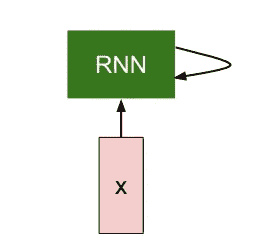

# RNN 氏症的序列学习

> 原文：<https://medium.com/analytics-vidhya/sequence-learning-with-rnns-e672386a195e?source=collection_archive---------24----------------------->

## 你有没有想过谷歌翻译是如何在一瞬间将句子从一种语言翻译成另一种语言的？你有没有想过一些拼写检查应用程序是如何理解你的句子的语义并提出纠正建议的？你来对地方了。

在这篇博文中，我们将详细讨论递归神经网络的力量，以及为什么它是下一个大事件？(已经是了！)

## RNN 氏症的需要？

深度神经网络(DNN)是非常强大的 ML 模型。他们被称为**通用函数逼近器**。让我们把注意力集中到“**逼近者”**这个词上。理解数据的一种简单方法如下。我们今天拥有的每一份数据都是某种行为的结果。

*例句:你按下音量键，手机的音量就会增大。音量增加的速度取决于您按住该按钮的时间或您点按该按钮的次数。*

在这里，按下按钮的动作就是你如何创建数据，而你按下按钮的方式决定了音量如何增加。这就是你对数据应用的函数。我可以通过**逼近数据中的函数**来理解/想象你按下按钮的方式。

但是 DNN 的问题是他们需要一个固定的输入维度。在句子翻译任务中，用户可以输入任意长度的字符。您不能将其长度限制为一个常数。同样，在语音识别中，用户可以说出任何长度的句子。这是 RNN 的闪光点。

## 体系结构

一个 RNN 细胞

假设我们的输入是一段文本。例句 *:* “橙色是新的黑色”。如果在时间步长= 1 时首先将单词“Orange”传入网络。RNN 接受该输入，对该输入应用一个函数，并在时间步长= 2 时将转换后的输入传递给自身，此时传递下一个单词“is”。所以在这个整个过程中有一个输入，前一个状态输出和一个函数。

在这里， ***xt*** 是我们输入的“是”， ***ht-1*** 是我们输入的“橙”的变换版本， ***fw*** 是我们应用在“橙”上的变换来变换它。很简单。下一步是实际定义我们的转换，定义我们的计算，这样我们得到我们的 ***ht-1*** 等等。如下所示

这里 ***W_hh*** 是我们的隐藏状态权重矩阵，而 ***W_xh*** 将是我们的输入状态权重矩阵。下图显示了这些重量的确切位置。

*是一种类似乙状结肠激活的激活。它给传入的输入增加了一些非线性。它将输入值压缩在 1 和-1 之间。因此，对于我们输入的每个单词，同样的步骤被反复执行，直到我们用完所有的单词。*

**

## ***别搞混了***

*在上面的图像中，我们展示了多个 RNN 细胞来全面描述正向传播过程。这只是为了说明的目的。但实际上，它只是一个单 RNN 单元，在随后的时间步接受输入。把 x 轴当作我们的时间轴。我们只是在时间中放松。*

## ***正向传播***

*如果你读到这里。恭喜你。您已经完成了正向传播。正向传播是你在每个时间步将例句“橙色是新的黑色”中的每个单词发送到我们的 RNN 单元。一旦我们不再输入单词，我们就计算出**损失或成本。我假设你熟悉损失函数，并且以前已经使用过。***

> *损失函数是一个数学函数，它告诉我们的预测与实际输出相比有多差。*

**

*这里 ***y_i*** 是我们的正确输出 ***y^i*** 是模型输出。我们将两者都传递给损失函数，损失函数会返回一个分数，表示我们的模型对数据的逼近程度。*

## *反向传播(通过时间)*

*在 RNN 氏症的情况下，标准反向传播变得有趣。因为正向传播在时间步长上是独立发生的。甚至我们调整权重的反向传播也发生在每个时间步长。*

**

*在我们进入偏微分方程之前，如果你注意到上图在输出端有一个权重矩阵**。*下面是我们推导出的偏导数方程来更新权数**

****

## **缺点**

**瓦尼拉·RNN 的问题在于，当我们对一长串输入进行这种反向传播时。多重导数相乘的效果导致导数变得非常小，使得第一时间步上的权重几乎不更新。这就是著名的**消失渐变问题。下面是一个小例子，告诉你如何可视化消失的渐变****

****

**我用 5 个小于 1 的数相乘，得到 0.0001。这就是 RNN 的情况。因此，梯度变得非常小，当权重更新时，它们几乎不变。另一个有趣的问题是**爆炸梯度问题**梯度是如此之大，以至于我们乘以多个大数，结果是一个非常大的数。**

## **那么下一步是什么？**

**为了解决这些问题，研究人员想出了一种新的改良 RNN，叫做 **LSTM。LSTM 的比香草 RNN 的更有力量。我会把 LSTM 的问题称为顺序问题的结果。比如 skip 连接如何帮助 Resnet 控制信息流。LSTM 的“遗忘之门”让他们能够忘记过去的不相关信息，从而加强各层之间的信息流动。****

## **信用**

1.  **幻灯片([http://cs 231n . Stanford . edu/slides/2017/cs 231n _ 2017 _ lecture 10 . pdf](http://cs231n.stanford.edu/slides/2017/cs231n_2017_lecture10.pdf))**