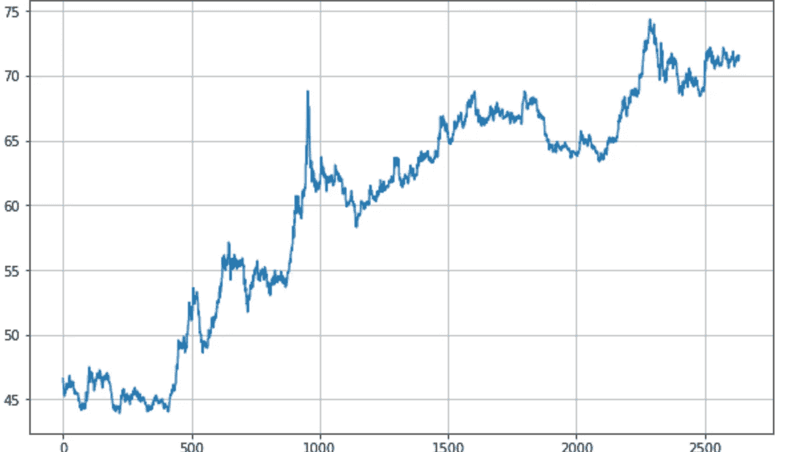

# 基于 Tensorflow 2.0 的序列模型时间序列预测

> 原文：<https://medium.com/analytics-vidhya/sequence-model-time-series-prediction-using-tensorflow-2-0-665257beb25f?source=collection_archive---------3----------------------->

## 使用历史时间序列数据预测美元对印度卢比


萨蒂什·库马尔·安迪

在本文中，我们将讨论如何创建一个简单的 TensorFlow 模型来预测时间序列数据，在我们的例子中是美元到印度卢比的转换数据。

我使用了 google colab 来训练模型和预测输出。
首先，在木星笔记本中安装 TensorFlow。

```
!pip install tensorflow==2.0.0import tensorflow as tf
print(tf.__version__)
```

接下来，从 Github 下载预处理的时间序列 USD 到 INR 数据。

```
!wget — no-check-certificate [https://raw.githubusercontent.com/satishnaidu/mldata/master/timeseries/USD_INR.csv](https://raw.githubusercontent.com/satishnaidu/mldata/master/timeseries/USD_INR.csv) -O /tmp/USD_INR.csv
```

如果你想训练自己的数据，你可以从下面的网站下载[https://www . investing . com/currences/USD-INR-historical-data](https://www.investing.com/currencies/usd-inr-historical-data)
这个数据需要一点预处理，比如添加一个带有序号的新列，并按日期对列进行排序。

使用 matplotlib 库查看转换时序图。

```
import numpy as np
import matplotlib.pyplot as pltdef plot_series(time, series, format="-", start=0, end=None):
  plt.plot(time[start:end], series[start:end], format)
  plt.xlabel("Time")
  plt.ylabel("Value")
  plt.grid(True)import csv
time_step = []
inr_conversion = []with open('/tmp/USD_INR.csv') as csvfile:
  reader = csv.reader(csvfile, delimiter=',')
  next(reader)
  for row in reader:
    inr_conversion.append(float(row[2]))
    time_step.append(int(row[0]))print(len(time_step))
print(inr_conversion[len(time_step)-1])
series = np.array(inr_conversion)
time = np.array(time_step)
plt.figure(figsize=(10, 6))
plot_series(time, series)
```



从这个图表中，你可以注意到它有一个上升的趋势，但没有任何特定的季节性和大量的噪音。
在处理时间序列数据时，您必须熟悉以下术语。

***趋势*** :时间序列值的增减
例如:上升趋势或下降趋势。
*:系列中反复出现的一致模式
例如:夏天的气温早上升高，晚上下降。
***噪声:*** 序列中的随机值，这使得模型难以识别趋势性和季节性。*

*接下来，将时序数据拆分为训练数据并验证数据集*

```
*split_time = 2000
time_train = time[:split_time]
x_train = series[:split_time]
time_valid = time[split_time:]
x_valid = series[split_time:]window_size = 60
batch_size = 100
shuffle_buffer_size = 1000*
```

*接下来，使用辅助函数(如窗口数据集和模型预测函数)创建张量流模型。*

```
*def windowed_dataset(series, window_size, batch_size, shuffle_buffer):
  series = tf.expand_dims(series, axis=-1)
  ds = tf.data.Dataset.from_tensor_slices(series)
  ds = ds.window(window_size + 1, shift=1, drop_remainder=True)
  ds = ds.flat_map(lambda w: w.batch(window_size + 1))
  ds = ds.shuffle(shuffle_buffer)
  ds = ds.map(lambda w: (w[:-1], w[1:]))
return ds.batch(batch_size).prefetch(1)def model_forecast(model, series, window_size):
  ds = tf.data.Dataset.from_tensor_slices(series)
  ds = ds.window(window_size, shift=1, drop_remainder=True)
  ds = ds.flat_map(lambda w: w.batch(window_size))
  ds = ds.batch(32).prefetch(1)
  forecast = model.predict(ds)
return forecasttf.random.set_seed(51)
np.random.seed(51)
train_set = windowed_dataset(x_train, window_size=120,
                             batch_size=100,
                             shuffle_buffer=shuffle_buffer_size)model = tf.keras.models.Sequential([
  tf.keras.layers.Conv1D(filters=60, kernel_size=5,
                         strides=1,padding="causal",
                         activation="relu",input_shape=[None, 1]),
  tf.keras.layers.LSTM(60, return_sequences=True),
  tf.keras.layers.LSTM(60, return_sequences=True),
  tf.keras.layers.Dense(30, activation="relu"),
  tf.keras.layers.Dense(10, activation="relu"),
  tf.keras.layers.Dense(1),
  tf.keras.layers.Lambda(lambda x: x * 400)
])optimizer = tf.keras.optimizers.SGD(lr=51e-7, momentum=0.9)
model.compile(loss=tf.keras.losses.Huber(),
              optimizer=optimizer,
              metrics=["mae"])
history = model.fit(train_set,epochs=100)*
```

*接下来，预测每个时间序列窗口的预测，此处我们采用的窗口大小为 120，步距=1，因此它将尝试使用之前的 119 个值预测第 120 个值，并使用步距值移动到下一个级别。*

```
*rnn_forecast = model_forecast(model, series[..., np.newaxis],
                              window_size)
rnn_forecast = rnn_forecast[split_time - window_size:-1, -1, 0]*
```

*最后，根据验证集的原始数据绘制预测结果。*

```
*plt.figure(figsize=(10, 6))
plot_series(time_valid, x_valid)
plot_series(time_valid, rnn_forecast)
print(time_valid[-1:])
print(rnn_forecast[-1:])
References:*
```

*为了预测未来的数据，请使用输入序列中最近的 120 个值来预测下一个值。*

```
*split_time = 2515
window_size = 120rnn_forecast = model_forecast(model, series[split_time:,np.newaxis],     window_size)
rnn_forecast = rnn_forecast[0:-1, -1, 0]
print(rnn_forecast)*
```

*coursera:[https://colab . research . Google . com/github/lmor oney/dlai Course/blob/master/tensor flow % 20In % 20 实践/课程% 204% 20-% 20S % 2BP/S % 2BP % 20 week % 204% 20 lesson % 203 . ipynb # scroll to = TP 7 oqudkk 0 gy](https://colab.research.google.com/github/lmoroney/dlaicourse/blob/master/TensorFlow%20In%20Practice/Course%204%20-%20S%2BP/S%2BP%20Week%204%20Lesson%203.ipynb#scrollTo=tP7oqUdkk0gY)*

*tensor flow:
[https://www . tensor flow . org/tutorials/structured _ data/time _ series](https://www.tensorflow.org/tutorials/structured_data/time_series)*