# 序列对序列学习—论文说明

> 原文：<https://medium.com/analytics-vidhya/sequence-to-sequence-learning-paper-explained-ce346158e0a6?source=collection_archive---------6----------------------->

## seq2seq 模型中的编码器和解码器到底是什么？

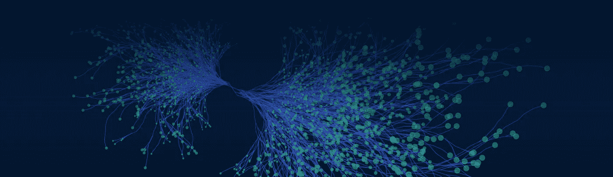

这个博客给出了 Seq2Seq 模型的高级直觉，所以你不需要成为“深度学习者”来理解它的全部，基本的神经网络知识就足以理解这个博客。

研究论文 [*用神经网络*](https://papers.nips.cc/paper/5346-sequence-to-sequence-learning-with-neural-networks.pdf) 进行序列对序列学习，被认为是谷歌在*神经信息处理系统(NIPS)* 会议上发布该论文后，在自然语言处理领域取得的突破。在理解 Seq2Seq 之后，人们可以继续阅读变形金刚、注意力概念以及 NLP 领域的其他最新突破。

从一开始就已经有了以下 rnn:

1.  **矢量对矢量(Vec2Vec) RNN**

该模型将单个向量作为输入，并产生单个向量作为输出。

一个例子可以是字对字的翻译。

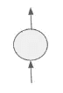

Vec2Vec 模型

**2。序列到向量(Seq2Vec) RNN**

在 RNN 模型中，我们给出输入，输出的序列是一个单一的向量。
这样的一个例子可以是语言预测器，

*我爱计算机科学* (input sequence) gives *Chinese*(output vector)

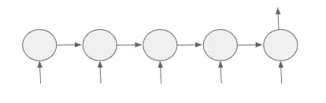

Seq2Vec 模型

**3。向量到序列(Vec2Sec) RNN**

RNN 模型，其中输入是单个向量，输出一个序列。

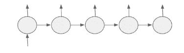

Vec2Seq 模型

**4。序列对序列(Seq2Seq) RNN**

是啊！我们之前也有序列对序列模型，它将输入作为一个序列，也按序列提供输出。
*注意:它完全不同于本文中描述的编码器-解码器架构，本文稍后将对此进行解释*

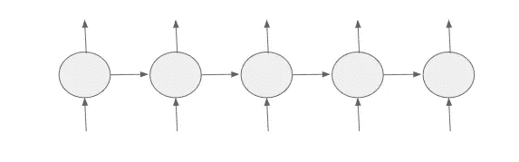

传统 Seq2Seq RNN 模型。

尽管有这个传统的 seq2seq RNN 模型。这篇论文怎么可能是一个突破？
在这里，**在上图中，我们可以看到输出序列的长度与输入序列相同。语言翻译模型也是如此。如果我们试图将英语转换为印地语，这并不一定意味着英语序列的长度与印地语序列的长度相同。这就是编码器和解码器有用的地方。**

# 编码器和解码器

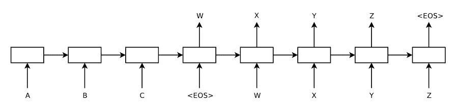

Seq2Seq 的编码器解码器架构

上面显示的是 Seq2Seq -编码器解码器研究论文中提出的相同架构。它由 2 个基本成分组成——
1。编码器
2。下面显示的解码器
是编码器和解码器的详细图解。使用编码器/解码器模型的主要优点是输入长度和输出长度可以不同。

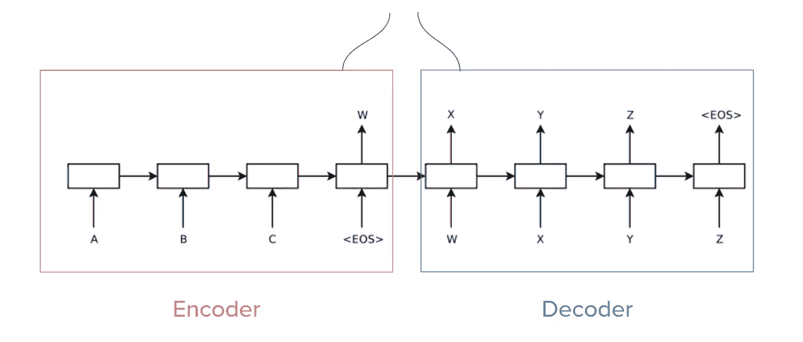

*   该架构中的每个单元都是一个 RNN 网络*(可以是 LSTM 网络，也可以是 GRU 网络)。*
*   编码器接收输入 *(A，B，C，< eos > )* ，每个单元格接收来自**隐藏状态** *的反馈(每个单元格之间的链接)。*
*   *W* 是**的上下文向量**。
*   解码器是产生输出 *(X，Y，Z，< eos >的部分。*

让我们试着详细了解每个组件，这样我们就可以了解编码器、解码器的整体功能，以及信息如何从编码器传递到解码器。

## 编码器

编码器是每个单元中的递归 RNN 网络。每个单元接收单个向量，后跟一个语句结束标记，<eos>标记输入序列的结束，并生成**上下文向量，** **W** 。</eos>

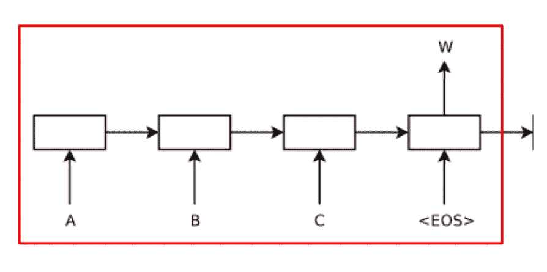

编码器-解码器模型中的典型编码器，显示了 RNN 块、输入以及上下文向量 w 之间的关系

它负责接收输入并将信息传递给下一个细胞。这个被传递的信息被称为**反馈(隐藏状态)**，并通过连续单元格之间的链接显示出来。

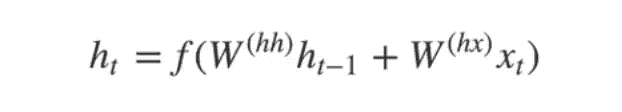

隐藏状态(反馈)计算公式

这里提到的公式用于计算隐藏状态的反馈值，该值包含直到最后一个单元格输入的所有信息。这里， *Wʰʰ* 是在时间戳 *(t-1)* 赋予前一隐藏状态的权重， *Wʰˣ* 是在时间戳 *t.* 赋予当前输入的权重

## **上下文向量——编码器和解码器之间的链接**

上下文向量**包含来自编码器内部所有隐藏状态的所有信息**,它仅充当解码器部分的输入。

## 解码器

解码器负责产生输出。每个单元在时间戳 *(t-1)* 接收从前一个单元生成的输出，作为当前单元在时间戳的输入。由编码器的最后一个单元生成的上下文向量充当解码器中 RNN 单元的初始输入。

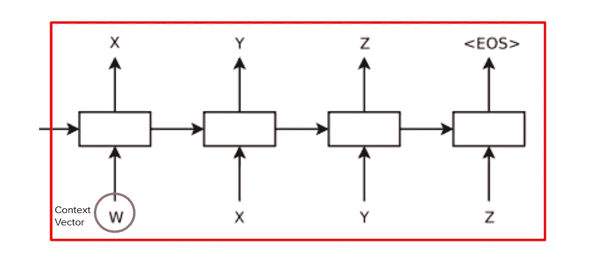

编码器-解码器模型中的典型解码器，显示 RNN 块、输入和输出之间的关系

需要注意的关键点是，单元在时间标记 *t* 产生的输出被用作单元在时间标记 *t+1 的输入。*

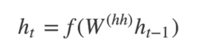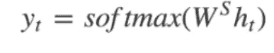

这两个公式用于计算隐藏状态反馈和每个单元的输出。

这是关于编码器和解码器功能的所有基本知识。**这篇论文成为自然语言处理(NLP)研究和应用领域的一项突破，因为现在输出序列的长度可以不同于输入序列的长度**，这使得它在机器翻译、问答系统、对话生成模型和许多其他领域中非常健壮和有用。