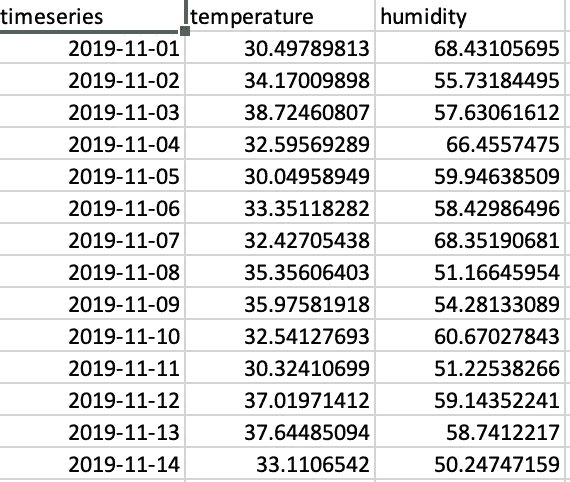
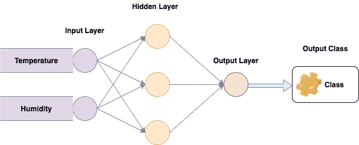
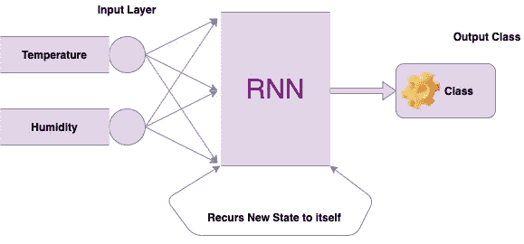

# 序列数据——和神经网络难题！

> 原文：<https://medium.com/analytics-vidhya/sequential-data-and-the-neural-network-conundrum-b2c005f8f865?source=collection_archive---------6----------------------->

## 解码神经网络的顺序数据难题！

马库斯·斯皮斯克在 [Unsplash](https://unsplash.com?utm_source=medium&utm_medium=referral) 上的照片

大家好！希望大家编码愉快！

好吧，告诉你一点关于我自己的事情，我已经从全栈开发做了一个“小的职业转变”,并试图追求数据科学。我从零开始，希望在理解这个主题的所有细节的同时达到顶峰。在这个同化过程中，如果你们指出任何修正或者建议更好的方法来做这篇文章中已经提到的事情，我会很高兴。我希望你们都喜欢阅读！

# 什么是顺序数据？

只要数据集中的点依赖于数据集中的其他点，该数据就称为顺序数据。一个常见的例子是时间序列，如股票价格或传感器数据，其中每个点代表某个时间点的观察值。还有其他顺序数据的例子，如序列、基因序列和天气数据。

# 为什么顺序数据是传统神经网络的一个问题？

事实上，传统的神经网络通常不能很好地处理这些类型的数据。所以我们来看看为什么不能用前馈神经网络来分析序列数据。让我们考虑一个顺序问题，看看基本神经网络有多适合。假设我们有一个包含每天温度和湿度值的数据序列。
我们的目标是建立一个神经网络，将某一天的温度和湿度值作为输入和输出。例如，预测那天的天气是晴天还是雨天。对于传统的前馈神经网络来说，这是一项简单的任务。

时间序列天气数据示例

使用我们的数据集，我们首先将一个数据点输入到输入层。然后，数据流入应用权重和偏差的隐藏层。然后输出层对来自隐藏层的结果进行分类，最终产生晴天或阴天或雨天的输出。

当然，我们可以在第二天重复这些步骤，得到结果。然而，重要的是要知道模型是无状态的，它不会记住刚刚分析的数据。它所做的就是一个接一个地获取输入，并为每天产生一个单独的分类。

传统神经网络

事实上，传统的神经网络假设数据是非连续的，并且每个数据点都独立于其他数据点。因此，输入是孤立分析的，如果数据中存在相关性，这可能会导致问题。

为了了解这如何成为一个限制，让我们再次回到天气的例子。可以想象，在研究天气时，某一天的天气往往会对随后几天的天气产生强烈的影响。也就是说，如果盛夏的某一天天气晴朗，那么假设第二天也是晴天也是合理的。然而，传统的神经网络模型确实利用了这些信息，所以我们不得不转向不同类型的模型，如**递归神经网络**模型。

一个**递归神经网络**或 **RNN** 有一个可以处理顺序数据集的机制。这也是递归神经网络试图解决的问题的要点。

递归神经网络

# 跟我来

伙计们，如果你喜欢阅读这篇文章，并想阅读更多内容，跟随我成为一名见多识广的数据科学家的旅程，请在 [Medium](/@aashishchaubey) 、 [Twitter](https://twitter.com/AashishLChaubey) 和 [LinkedIn](https://www.linkedin.com/in/chaubey-aashish/) 上关注我。另外，请不要忘记留下你对这篇文章的评论！