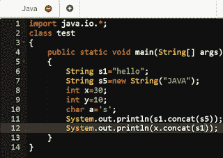
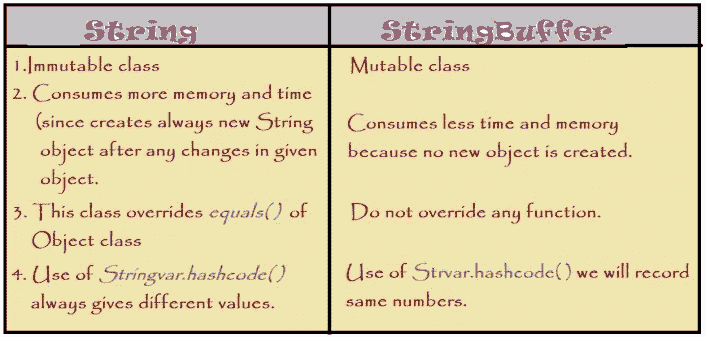

# 弦的序列研究(下)

> 原文：<https://medium.com/analytics-vidhya/sequential-study-of-strings-part-ii-b0333102c2cc?source=collection_archive---------24----------------------->

继续之前关于 Java 中字符串的讨论，在这次探索之旅中，我们将讨论字符串类中的不同方法，字符串缓冲区和生成器以及其他额外功能。

## 1.字符串类中的方法

> 无论我们对字符串对象应用什么方法，都不会影响它的原始值，因为我们是在处理字符串类。
> 
> *在这一部分中，我们将探索在字符串上实现的字符串类的一些最常用的方法，在这个类的列表中有很多，但其中一些如下:*

# a.字符串的比较

为了在字符串之间进行**比较或相对比较，有 3 种内置方法:**

*   **等于()**
*   **= =** 操作员
*   **compareTo( )**

## 一.等于( )

在该方法中，通过检查出现在特定位置的所有字符分别出现在要比较的另一个字符串中，来检查字符串是否是相同的单词或字符串。

两种类型都等于()*返回布尔类型值*true 或 false。

equal()有两种:

a)等于()

b) equalsIgnoreCase()

> **语法:****string variable _ name 1 . equals(string var _ name 2)；**

例如:S1 . equals(S2)；

> **当我们比较由相同字母组成但不区分大小写的字符串时，它只检查一个字符串中的所有字母在相同位置和字母方面是相似的，例如，如果一个字符串是教师，另一个字符串是教师，在这种情况下两者是相同或相等的，因为它实际上忽略了大小写。**

**语法:***string variable _ name 1 . equalsignorecase(string var _ name 2)；***

****

## *二。= =运算符*

> **在进入字符串常量池时，我们知道具有相同值的字符串会获得相同的对象引用，直到明确指定了* ***使用新关键字****

*   *它还检查被引用的对象也是相同的，这个操作符也返回布尔值(真，假)。*
*   *它们甚至区分大小写。*

******

> ****三世。*compare to()***

*   *这是 String 类中的一个内置函数，它按字典顺序比较两个字符串，即查找字典中字母的大小写或顺序。*
*   *这个函数返回正数、负数或零(比较后得到)。*

> **语法:***string 1 . compare to(string 2)；***

****

> *在上面的例子中，我们发现在两个字符串之间进行比较时，我们要么得到正值，要么得到负值，要么得到零(如果比较两个相似的字符串)。*

*   *当字符串 1 按字典顺序大于字符串 2 时，我们得到正的。*
*   *当字符串 1 在字典顺序上小于字符串 2 时，我们得到负数。*
*   *当两个字符串相同时，我们得到零。*

## ****b .字符串的串联(追加)****

> *在讨论了比较之后，让我们来看看连接(即连接两个字符串，也称为追加字符串)。为了执行连接，我们在 String 类中有两个内置函数。*

*   ***+运算符***
*   ***concat ()***

> **需要注意的是，字符串类的连接方法的所有操作，但是我们熟知字符串的概念，在这个类中是不可变的，我在博客中已经讨论了很多。那么我们是否正在改变这种观念呢？不，这里有一些 Stringbuffer 和 StringBuilder 类的帮助，它们执行附加工作。他们实际上通过内部使用 new 关键字创建了一个新对象。**

## **I. (+)运算符**

> **这可以连接任意两个原始数据。但实际上，通过看到这个操作符与字符串一起使用，它会以 StringBuilder 的形式编译成其他语法。**
> 
> **语法:*String var _ name = String 1 var _ name+String 2 var _ name+…。+String nvar _ name；*

*上面的语法编译为:*

****(new StringBuilder())。append("String1var_name "。append(" String2var_name ")。toString()****

****

> *在上面的例子中，我已经尝试给出了一个所有数据类型都与字符串连接的原语。*

## **二。concat( )**

> **语法:***string 1 var _ name . concat(string 2)；***
> 
> **对于 concat()，该方法被重载为，**

**公共字符串串联(String varname* )*

********

*   *所以我们发现 int 数据类型不能直接用在 concat()方法中。*

## ****三世。其他方法****

> **在 String 类中有更多的内置方法，但是我将和你一起探索一些常用的方法。**

## *1 .子字符串( )*

> **这是一个函数，我们可以使用它作为一个修剪器，从原始字符串中提取由一些特定字符组成的字符串的一部分。**

*   *在字符串中，字符从零开始从左到右进行索引。*
*   *有两种类型的方法被重载来获取子串，我们称之为函数。*
*   ****String 子串(int Start _ index)；****

> ***T51。String substring(int start _ index，int end _ index)；***
> 
> **开始 _ 索引-:已包含**
> 
> **end_index -:排除**
> 
> **实施:**
> 
> ***字符串 var_name= string_name_original。子串(Start_index，end _ index)；***
> 
> *语法:**String var _ name = String _ name _ original。子串(Start _ index)；***

****

## ****2。toupper case()&to lower case()****

> **将字符串转换成大写或小写字符。**
> 
> **语法:***string name . tolowercase()；***
> 
> ***string name . toupper case()；***

****

## ****3。*trim()***

> **这个方法有助于删除给定字符串中的开始(前空格)和结束(后空格)。**
> 
> **语法:***String _ name . trim()；***
> 
> ***“string value”。trim()；***

## ****4。startsWith()，endsWith( )****

*   *两个函数都返回布尔类型值(真/假)。*
*   *检查一个给定的字符串是从某个指定的字符开始，还是以一个正在讨论的字符结束。*
*   *同时检查这些方法是否区分大小写。*

**语法:***String _ var . starts with(" characters et ")；***

***String _ var . ends with(" characters et ")；***

***“串 _ 待 _ 查”。startsWith("字符集")；***

****

## ***5*。*实习生()***

> **当字符串对象不存在时，它在池中创建字符串对象，否则它只提供旧的当前对象的引用。**
> 
> **主要我们用这个函数来引用 new 关键字创建的 String 对象。因为我们非常熟悉使用 new 关键字创建新对象的概念，不管池中是否存在类似的对象。**
> 
> **语法:***String _ value . intern()***

****

## ***6*。*value of()***

> **用于包装类数据类型到字符串对象的转换。对于 java 的新版本，除了 String 之外的其他包装类，我们不必显式地指定来改变包装类。**
> 
> ****语法:*string . value of(primitive _ varname)；***

## ****7。*替换()***

> **将一个令牌或一组字符串替换或更改为其他。**
> 
> ****语法:* String_var.replace("首字"，"新字")；***

****

# ****字符串缓冲****

*这个类用于创建可变字符串。这个类存在于***Java . lang . string buffer***中*

*创建字符串:*

> ***String buffer var _ name = new String buffer(" String _ value ")；***

# *2.字符串类的方法*

> *我们在这里浏览一下这个类的一些基本功能。此类的方法不能应用于字符串类对象。*

## ***1。** **追加()***

> **对于串联过程，我们使用它。**
> 
> **语法:***var _ name . append(" value ")；***

## ***2。insert( )***

*在给定的字符串中插入字符串。*

> **语法:***string obj . insert(int startindex，" string value _ to insert ")；***

## ***3。replace( )***

*这与 String 类有一个。*

> **语法:***var _ name . replace(int begin index，int endindex，" string given ")；***

********

## ***4。删除()***

*擦除给定字符串的一部分。*

***语法:*string var _ name . delete(int begin index，int endindex)；****

## ***5。反向()***

*这是一个内置的特性，可以反转所提供的字符串。*

*语法:***string var . reverse()；****

## ***6。容量()***

*默认情况下，StringBuffer 对象的容量为 16。如果我们对字符进行任何更改，容量的增加或减少将基于:*

***(旧容量*2)+2。***

*语法:***string var . capacity()；****

## ***7。ensureCapacity( )***

*以动态提供所需的容量。*

*语法:***string var . ensure capacity(int capacity)；****

******

# ****StringBuilder****

*注意:StringBuilder 类也有和 StringBuffer 类相似的特性，除了一些不同之处，我们将在后面的段落中介绍。*

**

## *STRING、STRINGBUFFER 和 SRINGBUILDER 类之间的区别*

**