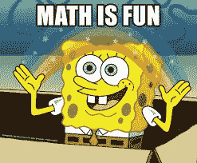
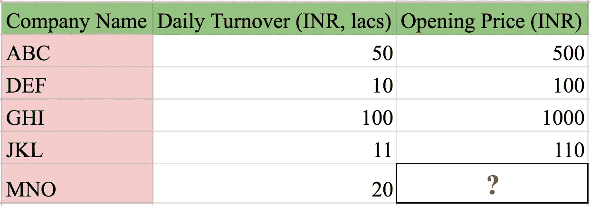
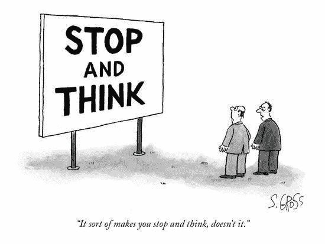
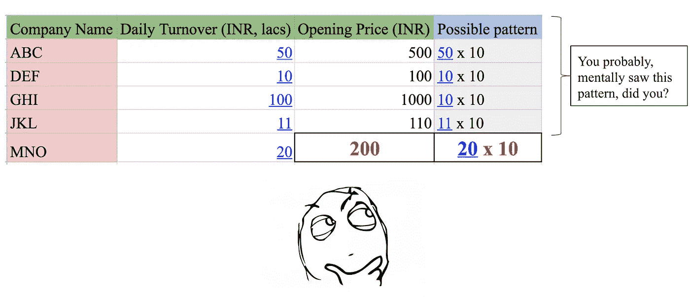
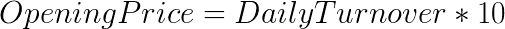
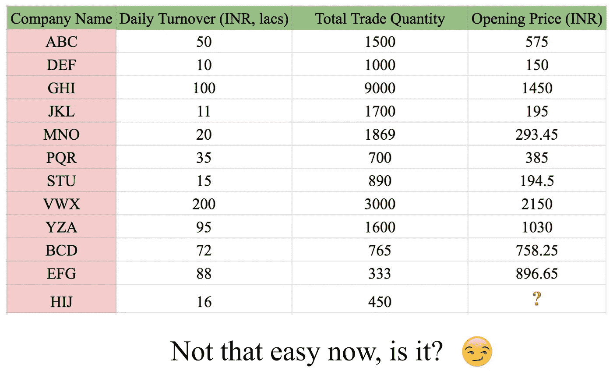
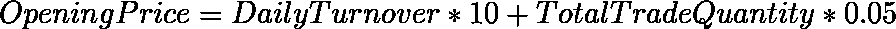

# 向我妈妈解释机器学习

> 原文：<https://medium.com/analytics-vidhya/series-explaining-machine-learning-to-my-mother-part-2-what-is-machine-learning-7c3fa9ad6a94?source=collection_archive---------14----------------------->

## 系列:

## 第 2 部分—什么是机器学习？为什么每个人都在谈论它？

本文是系列文章的一部分。在这里阅读本系列的介绍:[https://medium . com/@ k . aparnambiar/series-explaining-machine-learning-to-my-mother-introduction-17da 043 e 494](/@k.aparnanambiar/series-explaining-machine-learning-to-my-mother-introduction-17da043e494)

图片提供:geeksforgeeks.com

你能想出一些我们这些人试图*预测*某事的例子吗？

我能想到的有几个:

*   天气
*   选举结果
*   股票价格
*   燃料价格
*   印度赢得板球比赛的机会

嗯，当我们使用术语*机器学习*时，这种预测本质上就是我们的意思。

现在，这是一个合理的问题——“我们不是已经做了一个多世纪的预测了吗？为什么现在这是个大新闻？有什么不同？”

答案是——在过去的四分之一世纪里，发生变化的是可用数据的规模。

在历史上，我们从未能够像现在这样大规模地收集和存储数据。这意味着，我们用来预测任何事情的计算在工作表或桌面计算器上是不可行的。我们开始使用强大的计算机来处理这些数据，因此产生了机器学习。

# 举个例子吧！

这将会很有趣，让我们做一点数学，好吗？

比方说，你被要求预测一些公司的股票价格。你所要依据的，就是下面的数据

> “ *MNO* 公司的*开盘价*会是多少？

我希望你明白这一点。根据我们掌握的数据， *MNO* 的开盘价为*200 印度卢比*

我们是如何得出这个结果的？

数学上，我们可以把这种模式写成

# 就这么简单！那*机器学习有什么大不了的？*

我对数据集做了一些更改，请看下表。

现在，你能猜出 HIJ 的开盘价吗？你能看到像上面这样的图案吗？

这里有一个实际的模式(公式)来预测这个数据集的开盘价。

也就是说，

尝试使用这个公式，并将其与表中的结果匹配，这是一个有趣的练习！

为了回答这个问题，HIJ 的开盘价是:

*HIJ 的日营业额= 16*

*HIJ 贸易总量= 450*

*HIJ 开盘价= 16 * 10+450 * 0.05 =****182.5***

为什么这次我们很难搞清楚？

这是因为我们添加了更多的数据，在本例中，*总交易量。*

我们添加的数据越多，人类就越难看到*模式*。

这就是我们开始使用机器来完成这项任务的地方。

我们用计算机来看和学习模式，换句话说，我们用， ***机器学习***

# 什么是机器学习？

就像上面的例子，我们用电脑查看一些我们已经知道的数据，然后 ***预测*** 未知的答案

计算机通过在它已经看到的数据中找到一个模式(上面例子中的公式)来做到这一点。

当你看到乌云时，你预测可能会下雨，对吗？

在你的生活中，你已经从每次下雨中学到了一种模式。

模式是，当有乌云时，通常会下雨。

计算机学习模式与你学习的方式非常相似。唯一的区别是，我们可以用数字来表示计算机的模式。

我们将在本系列的后续博客中讨论计算机是如何做到这一点的。

# 系列中的下一个

所以，你预测了一些事情——你是怎么做到的？