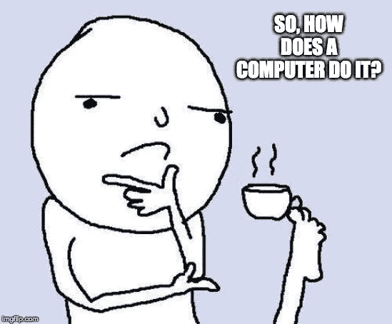
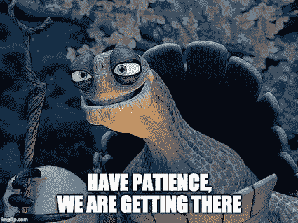
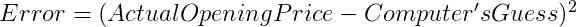

# 向我妈妈解释机器学习

> 原文：<https://medium.com/analytics-vidhya/series-explaining-machine-learning-to-my-mother-part-3-so-you-predict-something-how-do-you-ba3c005d6e14?source=collection_archive---------12----------------------->

## 系列

## 第三部分:所以，你预测一些事情——你是怎么做的？

本文是系列文章的一部分。

*   第一部分— [系列介绍](/@k.aparnanambiar/series-explaining-machine-learning-to-my-mother-introduction-17da043e494)
*   第二部分— [什么是机器学习？为什么每个人都在谈论它？](/@k.aparnanambiar/series-explaining-machine-learning-to-my-mother-part-2-what-is-machine-learning-7c3fa9ad6a94)

如果你是机器学习世界的绝对初学者，我建议你在开始这一部分之前阅读系列的[第二部分。](/@k.aparnanambiar/series-explaining-machine-learning-to-my-mother-part-2-what-is-machine-learning-7c3fa9ad6a94)

在你开始之前，请记住，我写这篇文章的时候，是考虑到那些对计算世界完全是局外人的人。

因此，有些部分可能看起来非常基础，请随意跳过:)

# 观察模式—回顾

当我们教一台*计算机学习*时，我们本质上是在教它看一个 ***模式*** 。

在我们在*第 2 部分讨论的第一个股票价格预测示例中。*即下面的数据集:

我们得到了 MNO 的*开盘价的答案，是 200 印度卢比*

我们通过实现下面的*模式*做到了这一点

我猜，你能想到的最好的答案是—

> “我不太确定，我看着这些数字，我的大脑看到了一种模式。我注意到开盘价就是日成交量乘以 10”

我再问一次这个问题——你知道 ***你是如何*** 看到这个图案的吗？

我就开门见山了，我也不知道！

我们并不真正知道大脑是如何得出这个模式的。神经科学家仍在试图理解我们的大脑是如何看待这种模式的。

然而，基于对我们如何思考的观察，我们试图教计算机使用数学来模仿我们大脑看到的模式。！！

这是机器学习的理想目标——能够创建真正模仿人类思维的系统。

问得好——如果我们不知道大脑是如何工作的，我们如何找到帮助我们学习模式的数学方法呢？

诚实的回答——我们做了一些猜测，在大多数情况下，它工作得相当好！

这一切很快就会变得有意义，所以只要和我在一起，好吗？

## 那么，帮助我们找出*模式的神奇数学是什么呢？*

让我们从第二部分 的

问题是——根据你看到的数据，你能确定 **HIJ** 的开盘价吗？

这里有一个模式，这个模式就是下面的公式

现在，我们讨论了这个*图案*或*公式*是如何不容易被人脑察觉的。

为了帮助计算机找出这种模式，我们提出的问题略有不同。

在我们开始之前，让我们先熟悉一些概念—

***输入数据***

我们有一组输入数据—示例中的*日成交量*和*总交易量*。

输入数据是数据集的一部分，我们不必预测。这些都是简单的事实，没有猜测工作。

就像在这个例子中，我们将假设，我们不需要预测*日成交量*或*总交易量——这些都是给定的事实。*

***输出***

这是我们必须预测或猜测的部分。

比如这个例子— *开盘价*

***输入与输出的关系***

这是机器学习中的一个重要理念——我们假设输入数据 ***与我们试图预测的输出*** 有某种关系

例如，如果我问你——“你认为接下来的一个小时内会下雨吗？”

你会抬头看着天空，你可能会说两个答案中的一个(或者它的一些变体)

> “天空乌云密布，我想接下来的一个小时内多半会下雨”

或者

> “天空明亮而晴朗，我的猜测是，在接下来的一个小时内**不会下雨”**

在这种情况下，您的输入数据是-天空的状态(多云或晴朗)

输出是—您对—接下来一小时内会下雨吗—(是/否)的回答

你是 ***假设*** 在输入和输出之间有一个*的关系，即天空的*状态*和*下雨的几率**

*换句话说，你假设输入 ***影响输出*** 。就像天空的状态 ***影响*** 下雨的几率。*

*这个假设来自于你的大脑多年来看到的例子。*

*这个假设是进行预测的第一步，对计算机和人类都是如此。*

*因为如果我们不能假设输入和输出之间的关系，我们就不能用输入来预测输出。*

**

## *好吧，那计算机是怎么假设的？*

*我们通过在输入和输出之间建立一个数学方程来帮助计算机进行假设。我们假设**的输出是*的函数*的输入***

****一个函数的想法****

*让我们稍微复习一下基础代数，好吗？*

**

***问题:**你能告诉我下面的输入**和输出**有什么关系吗？*

**

*我相信你已经猜到了——输出是输入的平方*

*或者，*

**

*或者，*

**

*我们在数学上写的是*

*输出是输入的 ***函数***——本例中的 ***函数*** 是 ***平方()****

*数学中的函数是用 ***表示数字之间的关系*** 的一种方式*

***问题:**你能算出下面两个输入和输出的关系吗？*

**

*这也很简单，不是吗？*

**

*或者，用另一种方式把它写成一个 ***函数，它把*** 输入和输出联系起来*

******

## *类函数*

*既然我们已经理解了数学中函数的概念。我再补充一个想法。*

*在最后几个例子中，我们知道了输入和输出之间的关系。*

*所以我们相应地命名了我们的函数——square(…)、sum(…)等等*

*如果我们不确切知道输入和输出之间的关系，我们在数学中使用一个函数的通用名称— ***f(…)****

*就是这样— ***f*** 为*功能**

*当我们不知道这种关系到底是什么，但我们确实知道有这种关系时，我们把这种关系写成*

**

*基本上是说，我知道有一个关系，我只是还不知道怎么称呼它，所以我就把它叫做— ***f****

**

# *回到机器学习*

*在我们正在查看的数据集中，我们有两个输入——日成交量和总交易量*

*一个输出——开盘价*

**

*我们首先假设在输入和输出之间有一种 ***某种*** 关系。*

*从数学上来说，我们把它写成—*

**

*基本上可以说， ***开盘价*** 和投入量— ***日成交量*** 和 ***总交易量*** 之间存在某种关系*

*我们还不知道这种关系是什么，但这是我们将要弄清楚的。*

*换句话说，这种关系就是我们试图理解的 ***模式****

*现在，我们并不真正了解 ***任何关于*** 的关系。我是说 ***绝对没有****

*是不是—*

**

*或者是—*

**

*或者可能是—*

****

*这种关系可以是以上任何一种，甚至是 ***以上*** 都不是*

## *那我们现在怎么办？*

*这是聪明的数学家想出一种技术的地方。*

*他们说——同意我们不知道确切的关系，但是既然我们知道有关系，我们就把它写成*

**

*如果我们能计算出 ***x*** 和 ***y*** 的值，我们就有了答案——投入量 ***日成交量和总交易量*** 与产出量 ***开盘价*** 之间的关系是什么*

*好问题—*

*“我们怎么知道这个关系是加法运算呢？你刚刚告诉我，这可能是任何事情！
为什么我们没有将日成交量和总交易量相乘？”*

**

*对，它不一定是加法运算，它可以是任何东西。*

*机器学习中有一个步骤涉及一些数学，可以帮助你找出在输入之间放置什么样的操作。*

*这很有趣，但是对于我们来说有点超前，所以我们以后再讨论。*

*现在，让我们假设我们已经完成了这些步骤，并且发现这种关系涉及到两个输入的相加。所以—*

**

*现在我们要做的就是算出 ***x*** 和 ***y****

## *有道理，现在我们该怎么办？*

*机器学习背后的总体思想是这样的*

*   *计算机对 x*和 y*做出一个绝对随机的 猜测——它只是从某个地方开始。
    用它计算产量(在本例中， ***开盘价*** )***
*   **这个猜测显然会错得很离谱，所以它会返回并检查我们已经知道答案的输出。
    它计算的误差有多大，这叫做 ***误差计算*****
*   **它会查看误差的大小，然后返回并调整它对 ***x*** 和 ***y*** 的猜测**
*   **它一直这样做，直到尽可能接近原始答案——它从错误中学习**

****

****就是这样！这就是所有机器学习算法做的事情****

**有点像，就像我们一样，你不觉得吗？**

## **听起来太抽象了——给我举个例子吧！**

**这里有一个例子—**

**计算机启动时随机地将 ***x*** 和 ***y*** 设置为某个值——绝对随机**

**说它设定好了—**

*****x = 2*****

*****y = 4*****

**现在它使用以下公式进行计算**

****

**因此，它会计算下面显示在 ***计算机的猜测*** 栏中的值。**

****

**差远了！不是吗？**

**嗯，我们都会犯错，我们会学习——计算机也是如此！**

**为了从它所犯的错误中学习，它将不得不首先查看它犯了多大的错误，因此它还将计算一个 ***错误*** 值。**

**误差值计算如下—**

****

**简单地说，实际答案和猜测答案之间的差的平方**

**所以，现在计算机正在看一个像下面这样的数据集**

****

**现在我们简单地取所有误差的平均值，在这种情况下—**

*****平均误差= 137198506.3*****

**现在一台计算机看着这个数字，然后说！**

****

**所以现在，它返回并选择一个 x 和 y 来减少这个误差。**

**它是怎么做到的？它怎么知道 ***x*** 和 ***y*** 根据误差来选择下一个呢？**

**它使用了一种非常有趣的数学技术。对我们来说谈论它还为时过早，对我们现在所处的位置来说有点超前。但是总有一天，我们也会讨论这个问题的，我保证！**

**现在，让我们假设我们应用了该技术，并且计算机现在认为 ***x*** 和 ***y*** 的新值是**

*****x = 9.5*****

*****y = 0.25*****

**所以它会返回并重新计算**

****

**你能看到现在的数值比以前更接近实际的 ***开盘价*** 吗？**

**我们再次计算误差，这次是**

*****平均误差= 345720.2*****

**远小于 ***137198506.3*****

**所以电脑知道它可能正朝着正确的方向前进。**

****

**计算机将继续猜测，直到误差变为 0 或至少接近于 0。**

**当误差变为零时，计算机会计算出实际的 ***模式*** 或 ***公式*****

**也就是—**

****

**也就是说，它最终会猜到**

*****x = 10*****

*****y = 0.05*****

## **就为了这个？这不是简单的代数吗？**

**对，在这种特殊情况下，我们可以用基本的线性代数简单地解决它。**

**对于那些不太记得我们是如何做到这一点的人来说，这里有一些方法**

**我们从数据集中取任意两行。比如说—**

****

**然后我们将创建两个方程**

********

**现在我们解决这个问题，就像我们在中学做的那样，记得吗？**

**瞧——我们将得到值 ***x*** 和 ***y*****

****

## **唉，现实世界没那么简单！**

**为了简单起见，我举了一个例子，其中*开盘价只取决于两个因素——日成交量*和总交易量****

***但在现实中，股票价格取决于很多因素，其中一些我们甚至不知道，它们是什么！***

***例子——你知道吗，特朗普的推文可以影响印度公司的开盘价？(例如，他关于限制工作签证的推文可以影响印度 IT 行业的股价)***

***有时甚至几厘米的降雨量也会影响股票的开盘价***

***我们永远不会真正了解 ***能够影响预测的一切*** 。***

**在我们没有能够直接 ***影响*** 我们试图预测的值的所有数据的情况下，我们能做的最好的事情，就是继续猜测，直到 ***误差*** 尽可能低。**

**在现实世界中， ***误差*** 永远不会触及零。因为，我们绝大多数时候都没有所有的数据，即使我们有，我们也没有机器学习的用处。**

****

**我希望你学到了新东西——我知道我学到了！**