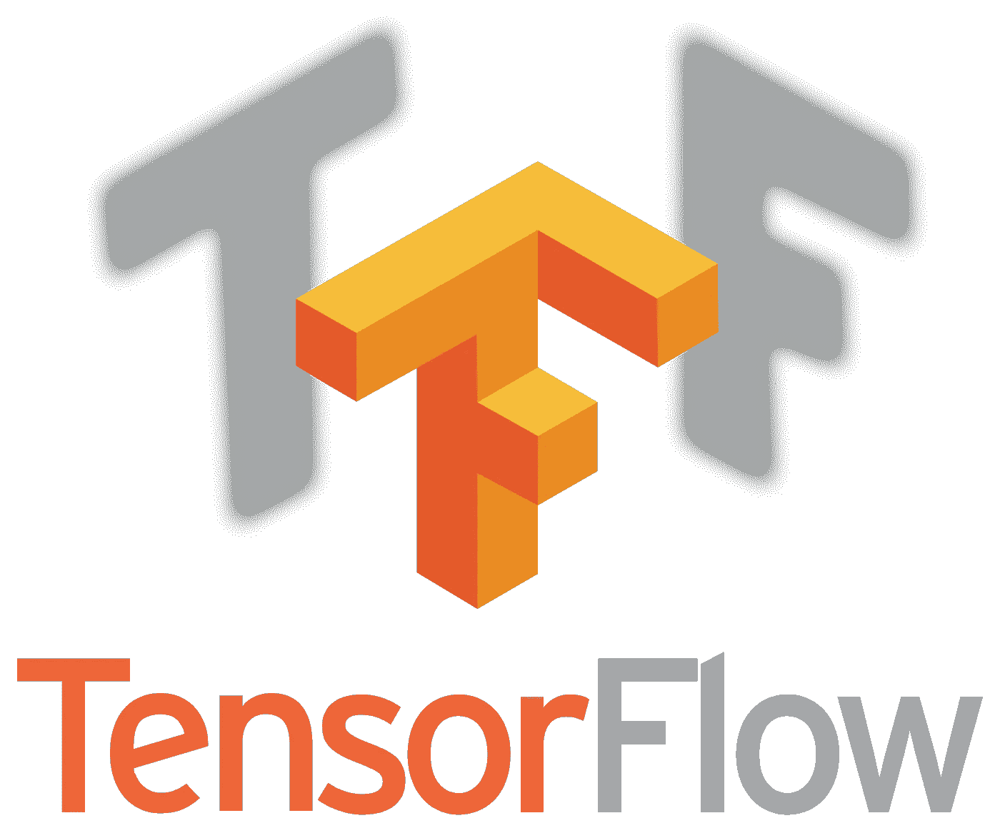

# 以最简单的方式开始使用 TensorFlow(第 1 部分)

> 原文：<https://medium.com/analytics-vidhya/series-learning-tensorflow-the-easy-way-dcc5be834d74?source=collection_archive---------0----------------------->

*这是关于如何开始使用 TensorFlow 的系列文章的第 1 部分。*

鉴于最近对深度学习领域的兴趣激增，数据科学家之间经常发生激烈的辩论——哪个框架是最好的？这和这个领域的许多其他事情一样，完全是主观的。

但是大多数专家喜欢和使用的一个框架是 Google 的 TensorFlow。这是行业专家和研究人员使用最广泛的框架，它代表了深度学习新手的一个良好起点。



Tensorflow 徽标

TensorFlow 是一种灵活的架构，允许在各种平台(CPU、GPU、TPU)上轻松部署机器学习计算，从桌面到服务器集群，再到移动和物联网设备。

在本系列中，我们将介绍 Tensorflow 框架的基本内容，包括许多有趣的可视化和辅助项目。

# 先决条件

为了充分利用本教程，我们希望满足以下先决条件:

1.  对 Python 的基本理解
2.  机器学习基础
3.  熟悉 Jupyter 笔记本电脑

我们将在以下部分介绍**学习 tensor flow easy way**的过程；

*第 1 部分:Tensorflow 安装和设置、语法和图表*

*第 2 部分:Tensorflow 中的变量和占位符*

*第 3 部分:在 Tensorflow 中实现回归示例*

*第 4 部分:在 Tensorflow 中实现分类*

# **第 1 部分: *Tensorflow 安装和设置、语法和图形***

# 安装和设置:

Tensorflow 支持以下 64 位操作系统。

*   Ubuntu 16.04 或更高版本
*   Windows 7 或更高版本
*   macOS 10.12.6 (Sierra)或更高版本(不支持 GPU)
*   Raspbian 9.0 或更高版本

pip 安装需要 Python 2.7、3.4、3.5 或 3.6。您可以使用以下命令检查您的 Python 和 pip 版本:

```
python3 --version
pip3 --version
```

它应该输出您的 python 和 pip 版本。建议您设置一个虚拟环境。我安装了 anaconda，它支持 tensorflow 的许多依赖项。我们可以使用 conda 命令创建一个 python 3.5 虚拟环境。

```
conda create -n py35 python=3.5
```

这需要一段时间。现在，您可以使用`source activate py35`切换到环境

一次，你在你新创建的环境中，可以用 pip 命令安装 tensorflow

```
pip install -- tensorflow==1.3
```

让我们使用`jupyter notebook`命令打开一个 jupyter 笔记本，并使用下面的命令导入 tenforflow。

```
import tensorflow as tf
print("Tensorflow version: {}".format(tf.__version__))Output: 
Tensorflow version: 1.3.0
```

请注意，本教程是在 1.3.0 版本上制作的，如果您使用 tensorflow 的任何早期版本，语法可能会有所不同。

# 张量流基础:语法和图形

## 理解张量流中的“张量”

**张量**是简单的数字数组，或者函数，它们在坐标改变的情况下按照一定的规则变换。我们通常在点积、叉积和线性映射等关系中看到它们。

如前所述，张量是一组数字。但是，应该注意，张量不是多维数组的另一个名称。张量和多维数组有很大的区别。简单来说，多维数组就是在一个坐标系中表示张量的数据结构。


笛卡尔张量

## 张量流中图形的故事

张量流通过计算图作用于*张量*及其*流*的运算。因此得名；张量+流=张量流！

> 计算图是排列成节点图的一系列张量流运算。

首先我们创建一个模型，它是一个以 **张量**为对象的*计算图。然后我们创建一个**会话**，在这个会话中我们一次运行所有的计算。不要担心这个概念是否有问题。让我们用代码实现同样的功能，以便更好地理解它*

```
import tensorflow as tffirst_string = tf.constant('Analytics')
second_string = tf.constant(' Vidhya')
```

现在，如果你用`type(first_string)`命令检查变量的类型。你应该看到它是一个张量对象而不是一个字符串。

```
Out []: tensorflow.python.framework.ops.Tensor
```

现在，让我们试着把两个字符串相加，并试着打印出来。类型保持不变。但是，输出并不是通常预期的那样。

```
combined_string = (first_string + second_string)
print (type(combined_string))
print (combined_string)Out []: <class 'tensorflow.python.framework.ops.Tensor'>
        Tensor("add:0", shape=(), dtype=string)
```

这就是计算图形的工作原理。`combined_string`不是两个字符串相加的直接结果，而只是一个要执行的操作。张量流就是在这个基础上工作的。首先定义一个路径，然后在会话中执行管道。

现在，为了看到预期的结果，我们必须运行会话来进行计算。您可以使用以下命令运行它；

```
with tf.Session() as sess:
    result = sess.run(combined_string)
    print (result)Out []: b'Analytics Vidhya'
```

我们使用`with tf.Session()…`,因为它在为我们运行计算后会自动打开和关闭会话。

为了掌握它，让我们在一个批量代码中尝试一些矩阵运算，将两个矩阵作为输入，然后将它们相乘。

```
Matrix_1 = tf.constant([ [1,3],
                          [2,6]])
Matrix_2 = tf.constant([ [13,26],
                          [23,52]])
print("The Shape of Matrix 1 is {} and of Matrix 2 is {}".format(Matrix_1.get_shape(), Matrix_2.get_shape()))MatMul = tf.matmul(Matrix_1, Matrix_2)with tf.Session() as sess:
    result = sess.run(MatMul)

print(">> Output")
print(result)Out []: The Shape of Matrix 1 is (2, 2) and of Matrix 2 is (2, 2)
        >> Output
        [[ 82 182]
         [164 364]]
```

所以总的来说，你需要记住以下几点:

1.  图是节点的集合
2.  这些连接被称为边
3.  在 Tensorflow 中，每个节点都是具有一些输入的操作，在执行后提供输出

这部分介绍就到此为止。Jupyter 笔记本可以在 [GitHub 这里](https://github.com/shaz13/learning-tensorflow/blob/master/Learning%20Tensorflow%20the%20easy%20way.ipynb)获得。我们将在中讨论下一个概念

*第二部分:张量流和运算中的变量和占位符*

敬请关注。还有，别忘了初始化你的张量。如需任何帮助或建议，请使用下面的评论部分。