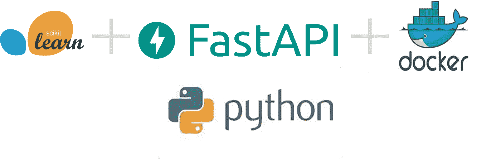
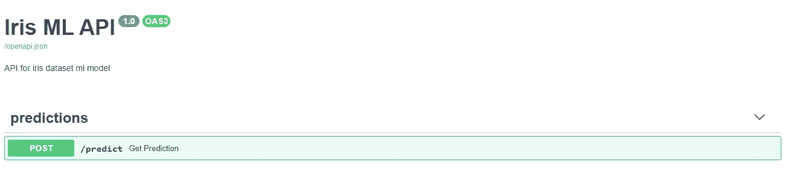
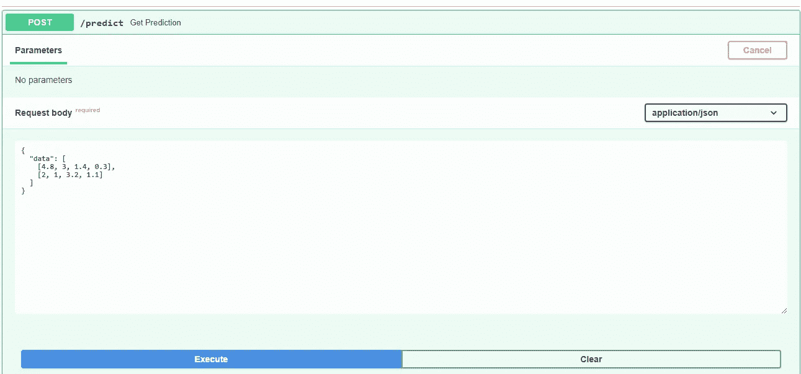
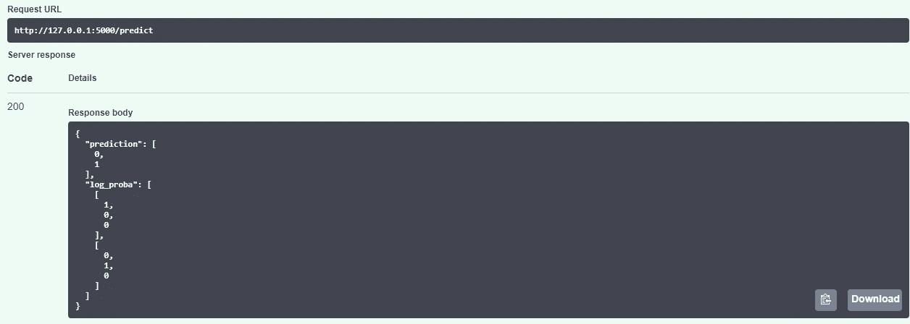
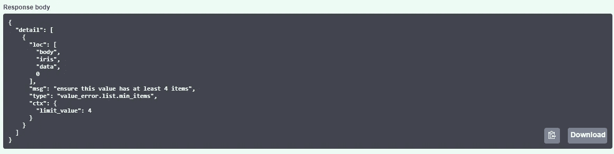
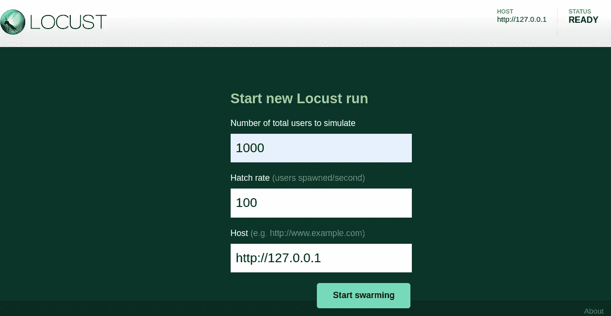
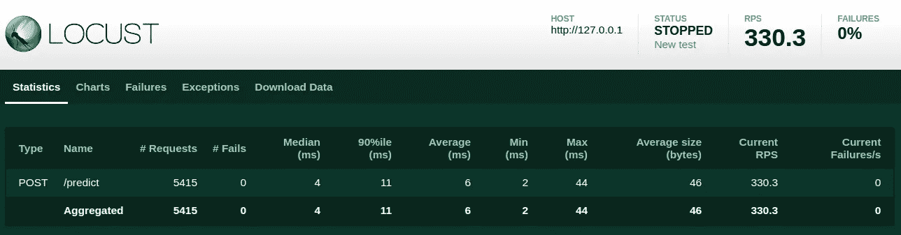

# 使用 Sklearn、FastAPI 和 Docker 服务一个机器学习模型。

> 原文：<https://medium.com/analytics-vidhya/serve-a-machine-learning-model-using-sklearn-fastapi-and-docker-85aabf96729b?source=collection_archive---------3----------------------->



在这篇文章中，你将学会如何:

*使用 Sckit-learn 训练并保存机器学习模型
*创建一个可以接受传入预测请求的 API
*使用 Docker
运行您的 API *使用 Locust 测试您的 API 性能

机器学习是数据科学中最热门的话题之一；有许多关于如何训练模型的资源，从数据清理、特征选择，到在许多候选对象之间进行选择并对其进行微调。

在这一点上，你的电脑上的一切都很正常。然而，当涉及到部署您的模型以便其他用户或系统可以使用它时，它带来了几个挑战，例如预测速度、基础设施兼容性和服务可伸缩性。

让我们看看如何实现这一点；我们的项目结构如下:

```
iris-api/
│
├── models/
│   ├── ml/
│   │    ├── classifier.py
│   │    └──traing.py
│   │    └── iris_dt_v1.joblib
│   └── Iris.py
│
├── tests/
│   ├── load_test.py
├── app.py
├── Dockerfile
├── LICENSE
├── README.md
├── requirements.txt
└── .gitignore
```

让我们把它分成几部分。

# **1。训练模型**

Sckit-learn，它可能是 python 中最流行的经典机器学习框架；它有一个易于使用的 API，支持最常见的模型。

**数据集:**

在这个项目中，我们将使用 Iris 数据集来训练一个分类模型。

虹膜数据集有四个特征:

*   萼片长度，单位为厘米
*   萼片宽度，单位为厘米
*   花瓣长度(厘米)
*   花瓣宽度(厘米)

这些特征用于将每个观察结果分为三类:刚毛鸢尾、杂色鸢尾和海滨鸢尾。


虹膜样本

首先，让我们设置出 train.py，导入方法和 iris 数据，将特性设置为一个名为 X 的 NumPy ndarray，将预测类别设置为变量 y。

```
from joblib import dump
from sklearn import datasets
from sklearn.pipeline import Pipeline
from sklearn.preprocessing import MinMaxScaler
from sklearn.tree import DecisionTreeClassifier

iris = datasets.load_iris(return_X_y=True)
X = iris[0]
y = iris[1]
```

现在，让我们创建一个简单的模型，记住这篇文章的主题不是模型训练，所以我们会尽可能简单。

作为预处理步骤，让我们缩放我们的变量，并使用一个带有默认参数的决策树分类器进行模型训练。

```
clf_pipeline = [('scaling', MinMaxScaler()), 
                ('clf', DecisionTreeClassifier(random_state=42))]
pipeline = Pipeline(clf_pipeline)

pipeline.fit(X, y)
```

最后一步，让我们保存训练好的模型，这样我们就可以在 API 中使用它来进行预测

```
dump(pipeline, './iris_dt_v1.joblib')
```

# 2.创建 API

根据 FastAPI 作者的说法:

> FastAPI 是一个现代、快速(高性能)的 web 框架，用于基于标准 Python 类型提示用 Python 3.6+构建 API。
> 
> 非常高的性能，与 **NodeJS** 和 **Go** 不相上下(感谢 Starlette 和 Pydantic)。[目前最快的 Python 框架之一](https://fastapi.tiangolo.com/#performance)。

它将允许我们服务于我们的机器学习模型。

在创建 predict 方法端点之前，我们将定义我们的 Iris 模型，因此我们让 FastAPI 知道我们期望什么作为请求数据；在我们的 iris.py 文件中，写入

```
from pydantic import BaseModel, conlist
from typing import List

class Iris(BaseModel):
    data: List[conlist(float, min_items=4, max_items=4)]
```

有了这段代码，我们将确保获得一个(或几个)包含模型进行预测所需的四个变量的列表。

在 classifier.py 上，使用

```
clf = None
```

clf 将作为一个占位符，所以我们可以导入和重用我们的模型

现在让我们创建一个端点来发送预测请求；首先，我们需要导入我们刚刚在 app.py 中创建的主 FastAPI 方法、占位符和 iris 模型

```
import models.ml.classifier as clf
from fastapi import FastAPI, Body
from joblib import load
from models.iris import Iris

app = FastAPI(title="Iris ML API", description="API for iris dataset ml model", version="1.0")
```

现在，我们需要得到我们训练过的模型；我们将确保 FastAPI 仅在应用程序启动时导入模型，而不是在每个请求中导入，因为这可能会在我们的预测中增加额外的时间，这是我们想要避免的，在其他情况下，您必须小心，在内存中保存模型可能是一个错误的决定。在这种情况下，由于我们想要进行实时预测，并且使用这样一个小模型，我们是可以的。

所以我们来读一下模型，然后赋值。

```
@app.on_event('startup')
async def load_model():
    clf.model = load('models/ml/iris_dt_v1.joblib')
```

接下来，我们定义接受我们请求的路由；这将是一个后方法来预测。

该方法将采用我们的 Iris 模型来确保请求数据格式是正确的，并将返回我们的类预测和每个类的对数概率。

```
@app.post('/predict', tags=["predictions"])
async def get_prediction(iris: Iris):
    data = dict(iris)['data']
    prediction = clf.model.predict(data).tolist()
    log_proba = clf.model.predict_proba(data).tolist()
    return {"prediction": prediction,
            "log_proba": log_proba}
```

**注意**我们的函数是异步的；FastAPI 支持现成的异步方法。

我们的基础 API 已经准备好了！现在，app.py 文件如下所示

```
import models.ml.classifier as clf
from fastapi import FastAPI
from joblib import load
from models.iris import Iris

app = FastAPI(title="Iris ML API", description="API for iris dataset ml model", version="1.0")

@app.on_event('startup')
def load_model():
    clf.model = load('models/ml/iris_dt_v1.joblib')

@app.post('/predict', tags=["predictions"])
async def get_prediction(iris: Iris):
    data = dict(iris)['data']
    prediction = clf.model.predict(data).tolist()
    log_proba = clf.model.predict_log_proba(data).tolist()
    return {"prediction": prediction,
            "log_proba": log_proba}
```

让我们从运行以下命令开始:

```
uvicorn app:app --port 5000
```

现在转到:[http://127 . 0 . 0 . 1:5000/docs](http://127.0.0.1:5000/docs)，你的屏幕应该是这样的:



开放 API

太好了！我们的 API 已经启动并运行了，我们可以轻松地记录和测试我们的 API，这是 FastAPI 的另一个优秀特性。

让我们转到我们预测的终点，点击“尝试一下”;我们会发送两份观察报告。



您也可以尝试从您的终端或任何其他客户端作为邮递员

```
curl -X POST "http://127.0.0.1:5000/predict" -H\
 "accept: application/json"\
 -H "Content-Type: application/json"\
 -d "{\"data\":[[4.8,3,1.4,0.3],[2,1,3.2,1.1]]}"
```

这是我们的回应。它告诉我们，第一个数据点的预测类是 0 类，对应于鸢尾，第二个点是鸢尾杂色，它还为我们提供了每个类别的对数概率，您可以在响应中添加更多有用的信息



Iris API 响应示例

您还可以尝试向请求发送四个变量中的三个，并查看 FastAPI 如何处理验证(您可以在这里添加一个状态代码)



错误请求的例子。

# 3.与 Docker 一起运行

在这一点上，一切可能都在我们的电脑上工作。尽管如此，当你将它部署到你最喜欢的应用程序主机时，并不能保证系统会有我们运行 API 所需的所有依赖，所以 Docker 来帮助我们克服这一点。

来自 Docker 官方页面

> 如今开发应用程序需要的不仅仅是编写代码。在生命周期的每个阶段，多种语言、框架、架构和工具间不连续的接口造成了巨大的复杂性。Docker 简化并加速了您的工作流程，同时让开发人员可以自由地为每个项目选择工具、应用程序堆栈和部署环境。

你可以从 Docker 的官方[网站](https://docs.docker.com/get-docker/)获得。

首先，让我们创建我们的 requirements.txt 这将使我们所有的 python 包要求使用相同的包版本。

```
fastapi==0.57.0
uvicorn==0.11.5
pydantic==1.5.1
starlette==0.13.4
python-multipart==0.0.5
requests==2.24.0
scikit-learn==0.23.1
joblib==0.16.0
```

现在是文档

```
FROM tiangolo/uvicorn-gunicorn:python3.8-slim 

WORKDIR /app ENV DEBIAN_FRONTEND=noninteractive
ENV MODULE_NAME=app ADD requirements.txt . RUN pip install -r requirements.txt \    
    && rm -rf /root/.cache 
COPY . .
```

就这几行，我们告诉 Docker 从 docker hub 获取一个 python 3.8 图像，顺便说一下，这是由 FastAPI 的同一作者创建的图像。它被优化用于这个框架；然后，我们创建一个新文件夹，放入所有的应用程序代码并安装我们需要的 python 包。

现在让我们创建 docker 映像并运行容器。

```
docker build -t iris-ml-build .
docker run -d -p 80:80 --name iris-api iris-ml-build
```

现在进入 [http://127.0.0.1/docs](http://127.0.0.1/docs)

您应该看到和以前一样，但是现在它运行在 docker 容器中；您可以将这个 docker 映像带到任何云提供商，它应该保持不变。

# 恭喜你！现在你的应用已经启动并运行了

您可以从我的 GitHub 获得完整的代码，并获得更多的功能:

[T3【https://github.com/rodrigo-arenas/fast-ml-deploy】T5](https://github.com/rodrigo-arenas/fast-ml-deploy)

# 4.额外收获:负载测试

正如开头提到的，如果我们期望进行实时预测，我们的 API 的响应时间可能是至关重要的；我们希望我们的 API 能在几毫秒内做出响应。

我们将使用蝗虫来测试我们能得到多少。

> Locust 支持运行分布在多台机器上的负载测试，因此可以用来模拟数百万个并发用户。

您可以使用 pip install Locust 安装它；根据你的 OS；你可能需要额外的要求:[https://docs.locust.io/en/stable/installation.html](https://docs.locust.io/en/stable/installation.html)

创建 load_test.py 文件，并将其放在 tests 文件夹中；它将帮助我们向我们的 API 发送数百个请求。

```
from locust import HttpUser, TaskSet, task, between

class IrisPredict(TaskSet):
    @task
    def predict(self):
        request_body = {"data": [[4.8, 3, 1.4, 0.3]]}
        self.client.post('/predict', json=request_body)

class IrisLoadTest(HttpUser):
    tasks = [IrisPredict]
    host = 'http://127.0.0.1'
    stop_timeout = 20
    wait_time = between(1, 5)
```

运行蝗虫使用

```
locust -f ./tests/load_test.py
```

现在蝗虫运行在[http://localhost:8089/](http://localhost:8089/)；我们可以试试我们的 API 我们将每秒发送 100 个用户，直到 1000 个请求。



蝗虫设置

在酷睿 i7 笔记本电脑、8 Gb 内存和四个内核上运行，我们得到的是:



负载测试结果

正如您在 Locust 报告中看到的，我们发送了 5415 个请求，平均响应时间为 6 毫秒，这意味着我们能够在测试结束时每秒处理 330 个请求，并且没有失败。

对于我们的实现来说相当不错！