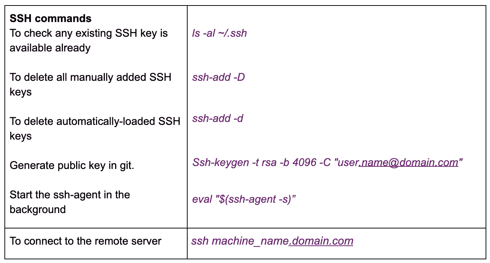

# 数据专业服务器

> 原文：<https://medium.com/analytics-vidhya/server-for-data-professional-48b80a435ceb?source=collection_archive---------22----------------------->


服务器具有广泛的应用范围。在这个博客中，我们发现了所有数据专家使用服务器的有趣方式。💻无论是数据分析师、数据科学家、数据工程师还是数据管道开发人员，这都是属于你的博客:)

总的想法是，服务器的设置是复杂的，需要大量的经验与 Linux 和许多其他工具🛠.但是，没必要那么复杂。如果您正在处理大数据，拥有一台服务器就变得势在必行。提取数据和处理数据需要很长时间，这可能会考验你的耐心。我很想拥有一台自己的服务器，它甚至可以是一个功能正常的旧系统，但它只是被塞在阁楼的某个地方。或者更令人惊奇的是一台租来的具有良好处理能力的服务器。

我想从这台服务器上得到的东西有一个永无止境的列表，但是，我列出了一些优先的应用程序，我希望从这些应用程序开始，作为我的最低要求。它们如下。让我们自下而上，从数据提取开始，最后通过仪表板进行数据报告。作为开源软件的粉丝，下面讨论的所有工具都是开源的。这确保了预算的更大可用性💰更强大的硬件。

首先，我们需要一个操作系统。🙄毫无疑问，它是 Linux 操作系统。它是开源的轻量级、可伸缩的、易于远程访问的、模块化的，非常适合任何服务器。我会推荐 ubuntu，因为他们也有特定的服务器版本:🤩->[https://ubuntu.com/download/server](https://ubuntu.com/download/server)。

一旦你有了一个操作系统，那么你需要进行几次安装，比如

1.  OpenSSH🔐从远程访问机器。(访问)
2.  驱动程序和依赖项-> JDBC & ODBC 驱动程序，基于您要从中提取数据的数据库🛢。(数据提取)
3.  大蟒🐍和它的包装📦，(我们稍后会详细讨论这一点🙊)(数据处理)
4.  R & its📦, (🙊)(数据处理)
5.  气流💨和码头工人🐬(数据处理流水线)⛓
6.  RStudio 和 Shiny(可视化仪表盘)

让我们一个一个来看看:☝️

# 1.OpenSSH

将安装在远程机器和您的系统上。

```
SSH stands for Secure Shell. This is used to authenticate you as a recognised user of the remote machine. This ensures that you don't have to put in username and password each time you login into the system.It works by generating a system specific key 🔑 , stored in the local system and which can be linked to your github account, and the personal system is granted access to the remote machine.It is worth noting that, any person who has access to your personal system will also have full access to the remote machine.
```



生成 SSH 密钥的有用命令列表

## 如何将 SSH 密钥链接到您的 Github 帐户🔐

```
1\. Copy the key that is found in ~/.ssh/id_rsa.pub2\. Paste it in **Github > settings > SSH and GPG keys > New SSH key or Add SSH key > Paste your key into the "Key" field > Add SSH key**
```

# 2.驱动因素和依赖因素。

下面是一个示例列表，可以将其复制粘贴到 Linux shell 来安装所有基本的 Linux 软件包。你也可以随意添加任何遗漏的内容..

```
*sudo apt-get install libkrb5-dev libsasl2-dev libssl-dev libffi-dev libpq-dev git freetds-bin build-essential default-libmysqlclient-dev apt-utils curl rsync netcat locales unixodbc-dev freetds-dev*
```

# 3.计算机编程语言🐍和它的包装📦

安装 python: `*sudo apt install python3.8
python --version*`

要安装所有依赖包:这里提到了我最常用的一个示例列表:

```
*pip3 install -U pip setuptools wheel \
    && pip3 install pytz \
    && pip3 install pyOpenSSL \
    && pip3 install ndg-httpsclient \
    && pip3 install pyasn1 \
    && pip3 install apache-airflow \
    && pip3 install 'redis==3.2' \
    && pip3 install --upgrade setuptools && \
    pip3 install fbprophet==0.6 && \ 
    pip3 install jupyter && \
    pip3 install apache-airflow && \
    pip3 install matplotlib && \
    pip3 install nibabel  && \
    pip3 install pillow  && \
    pip3 install pydicom  && \
    pip3 install redis  && \
    pip3 install postgres  && \
    pip3 install datetime  && \
    pip3 install matplotlib  && \
    pip3 install pillow  && \
    pip3 install seaborn  && \
    pip3 install sasl  && \
    pip3 install thrift  && \
    pip3 install thrift-sasl  && \
    pip3 install pyodbc && \
    pip3 install tabulate && \
    pip3 install cufflinks  && \
    pip3 install plotly  && \
    pip3 install pyHive  && \
    #pip3 install pypi-simple && \
    pip3 install datetime  && \
    pip3 install pyexasol==0.11.3 && \
    pip3 install pandas-profiling &&  \
    pip3 install nltk*
```

一旦安装了所需的包，在服务器上安装 Jupyter-notebook(pip 3 install Jupyter)也是一个好主意，这个笔记本也可以在任何其他系统上访问，而不需要 SSH。我们该怎么做呢！！

我发现以下是最简单的方法:

**步骤 1** :在 Linux 上用下面的命令从所需的文件位置启动 Jupyter 笔记本。无浏览器标志确保笔记本不会在任何浏览器上打开，端口参数用于将笔记本传送到所提到的端口号。

```
*jupyter notebook --no-browser --port=2222*
```

**第二步**:现在用下面的命令从你的系统访问笔记本。该命令将运行在服务器(Linux 端口 2222)上的笔记本重定向到本地机器端口号 5454。xx.yy.zz.aa 代表远程 Linux 机器的 IP 地址。

```
*ssh -N -f -L localhost:5454:localhost:2222 user.name@xx.yy.zz.aa*
```

**第三步**:转到 [http://localhost:5454/tree？](http://localhost:2222/tree?)。就是这样。完成✅

# 4.R☺️及其包装📦

要安装 3.5 版的 R

```
*sudo apt install apt-transport-https software-properties-common* *sudo apt-key adv --keyserver keyserver.ubuntu.com --recv-keys E298A3A825C0D65DFD57CBB651716619E084DAB9sudo add-apt-repository 'deb https://cloud.r-project.org/bin/linux/ubuntu bionic-cran35/'
sudo apt updatesudo apt install r-base* *R --version*
```

要安装任何 R 包

```
*sudo -i R
install.packages(c("stringr",**"ggplot2", "gdata", "ggmap", "ggplot2","gridExtra", "shiny", "**shinyBS**", "**shinyLP**", "**shinyjs**", "**shinythemes**"**))*
```

# 5.气流💨和码头工人🐬

现在我们要去冷却器了😎零件。

首先安装 Docker 和 docker-compose

```
*sudo apt install docker.io 
docker --version
sudo curl -L "https://github.com/docker/compose/releases/download/1.26.1/docker-compose-$(uname -s)-$(uname -m)" -o /usr/local/bin/docker-compose
sudo chmod +x /usr/local/bin/docker-compose
docker-compose --version*
```

然后获取 docker 文件并启动它。

克隆这个库[https://github.com/Nivedab/airflow/tree/master](https://github.com/Nivedab/airflow/tree/master)，然后导航到那个位置，粘贴下面的命令让 docker 用 airflow 启动。

```
*docker-compose up*
```

然后转到[http://xx.yy.zz.aa:8080/admin/](http://10.16.32.27:8080/admin/)，其中 xx.yy.zz.aa 代表远程 Linux 机器的 IP 地址。

搞定了！✅

从 git 向 dags 文件夹添加新的 Dags([https://airflow.apache.org/docs/stable/concepts.html](https://airflow.apache.org/docs/stable/concepts.html))。并刷新页面[http://xx.yy.zz.aa:8080/admin/](http://10.16.32.27:8080/admin/)

# 6.🎙和闪亮

首先:RStudio 服务器确保 Linux 发行商匹配([https://rstudio.com/products/rstudio/download-server/](https://rstudio.com/products/rstudio/download-server/))以下是 ubuntu

```
*sudo apt-get install r-base
sudo apt-get install gdebi-core
wget* [*https://download2.rstudio.org/server/xenial/amd64/rstudio-server-1.3.959-amd64.deb*](https://download2.rstudio.org/server/xenial/amd64/rstudio-server-1.3.959-amd64.deb) *sudo gdebi rstudio-server-1.3.959-amd64.deb*
```

启动它

```
*sudo systemctl start* rstudio-server
```

然后转到。[http://xx . YY . ZZ . aa:8787](http://lime-analytics-1.analytics.ams2.xing.com:8787/auth-sign-in)/

现在闪亮服务器，确保 Linux 发行商匹配([https://rstudio.com/products/shiny/download-server/](https://rstudio.com/products/shiny/download-server/))以下是 ubuntu

```
*sudo apt-get install r-base
sudo su - \
-c "R -e \"install.packages('shiny', repos='https://cran.rstudio.com/')\""
sudo apt-get install gdebi-core
wget* [*https://download3.rstudio.org/ubuntu-14.04/x86_64/shiny-server-1.5.14.948-amd64.deb*](https://download3.rstudio.org/ubuntu-14.04/x86_64/shiny-server-1.5.14.948-amd64.deb) *sudo gdebi shiny-server-1.5.14.948-amd64.deb*
```

启动它

```
*sudo systemctl start shiny-server*
```

shiny 的默认配置文件在`**/etc/shiny-server/shiny-server.conf**`中。

注意:app 目录的默认位置是`**/srv/shiny-server**` **，**，但这可以在配置文件中更改。

转到。[http://xx . YY . ZZ . aa:](http://lime-analytics-1.analytics.ams2.xing.com:8787/auth-sign-in)3838/为互动闪亮起始页

# 结论

上述工具足以提取一些数据，并通过流水线处理气流上的任务来处理这些数据。把流程提取出来，把数据放回数据库，这是一个全方位的解决方案。由于 python 库，也很容易安排所有的 ML 任务。

谢谢:)