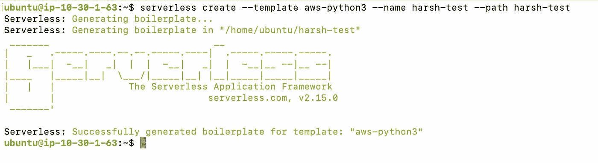
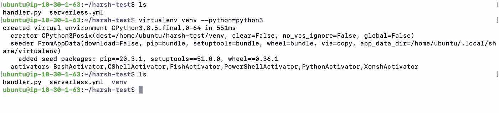
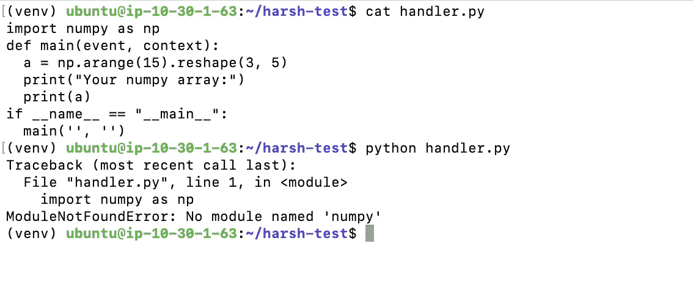
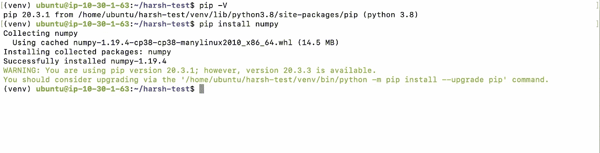
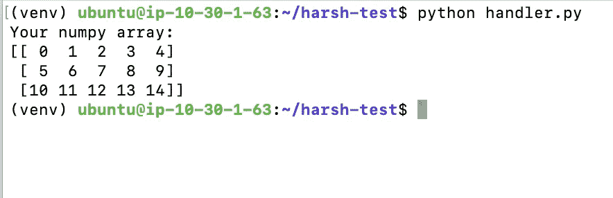
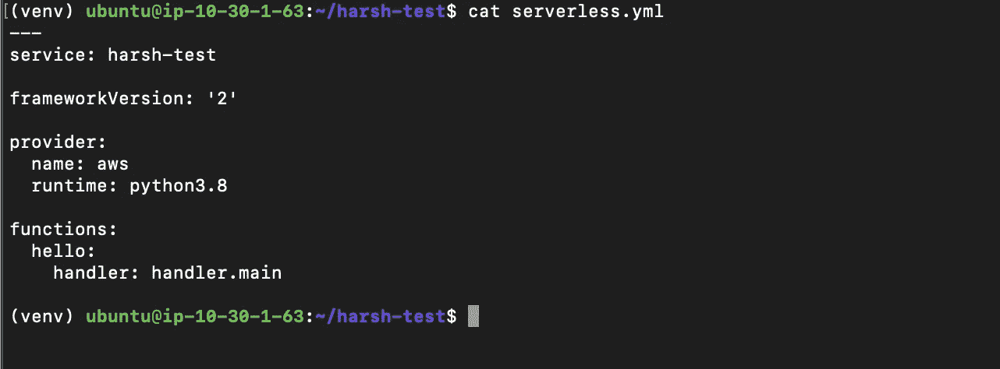
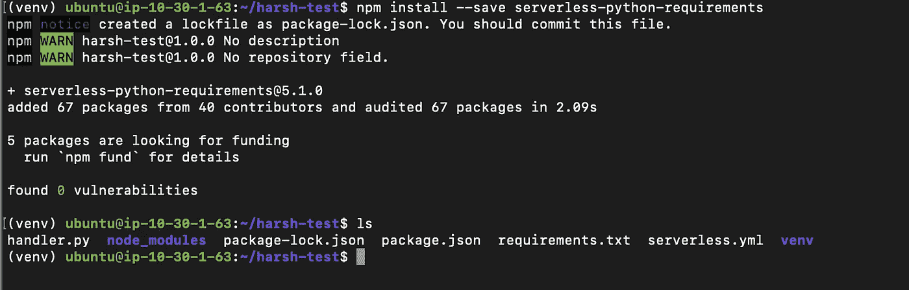
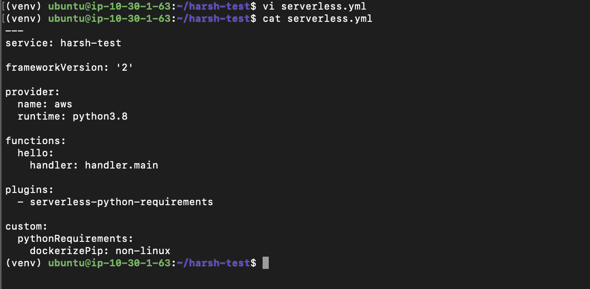

# 无服务器框架——轻松打包您的 Lambda 函数

> 原文：<https://medium.com/analytics-vidhya/serverless-framework-package-your-lambda-functions-easily-6c4f0351cdab?source=collection_archive---------7----------------------->

现在，一天无服务器是云计算世界中快速发展的技术。大多数公司正在从传统架构转向集装箱架构或无服务器架构。

AWS 是最流行和最强大的云之一。它有许多服务，并对无服务器技术有很大的支持。

AWS Lambda 是运行无服务器工作负载的强大服务之一，结合了 API Gateway、DynamoDB、S3 等其他服务..

在软件开发中，我们都有使用一些外部依赖项的要求，当涉及到在 AWS Lambda 中使用外部包部署代码时，您创建一个代码的 zip 文件，并将其上传到 S3 bucket，然后配置您的 Lambda 函数以指向该位置，但如果我说您不必做所有这些，而是专注于创建您的代码，一个框架会负责将您的代码打包并部署到 AWS Lambda，那会怎么样？听起来很有趣？如果是，那么继续阅读这篇博客。

# 无服务器框架的先决条件

*   IAM 用户的访问密钥和秘密访问密钥。
*   Docker 已安装并在系统中运行
*   AWS CLI
*   结节

# 让我们开始吧。

*   正在安装无服务器框架。

*注意:如果你的机器上还没有* [*节点*](https://nodejs.org/en/download/package-manager/) *，你需要先安装它。我建议使用 NodeJS 的最新 LTS 版本。*

```
npm install -g serverless
```

# 在本地创建您的服务

一个`service`就像一个项目。在这里定义 AWS Lambda 函数、触发它们的`events`以及它们需要的任何 AWS 基础设施`resources`，所有这些都在一个名为`serverless.yml`的文件中。

我们可以从模板创建服务。我准备用 Python 3。

```
serverless create \
 --template aws-python3 \
 --name harsh-test \
 --path harsh-test 
```

`serverless create`命令将创建一个服务。`--template aws-python3`将使用 python3 初始化我们的服务`--name harsh-test`将被用作服务名，而`--path harsh-test`将创建一个名为 harsh-test 的目录来存储我们的代码和来自无服务器框架的一些其他文件。

> 无服务器框架带有一些预定义的模板。您可以阅读更多关于其他可用模板的信息—[https://www . server less . com/framework/docs/providers/AWS/guide/services/](https://www.serverless.com/framework/docs/providers/aws/guide/services/)



使用 aws-python3 模板创建无服务器

这将在我们的目录中创建两个文件，即`handler.py`和`serverless.yml`文件。


# 创建虚拟环境

我们将在无服务器框架创建的目录中创建一个虚拟环境。你可以阅读[这里](https://python-guide-pt-br.readthedocs.io/pt_BR/latest/dev/virtualenvs.html)关于如何和为什么使用 Python 虚拟环境。

```
virtualenv venv --python=python3
```

如果您没有安装 virtualenv，您可以使用`pip3 install virtualenv`来安装



virtuaenv usig python3

使用以下命令激活虚拟环境:

```
source venv/bin/activate
```

让我们设置想要部署的功能。在您最喜欢的文本编辑器中打开`handler.py`,添加以下几行:

```
# handler.pyimport numpy as npdef main(event, context):
  a = np.arange(15).reshape(3, 5)
  print("Your numpy array:")
  print(a)if __name__ == "__main__":
  main('', '')
```

这是一个简单的函数，使用了[数字快速入门](https://numpy.org/doc/stable/user/quickstart.html)中的一个例子。当使用 AWS Lambda 函数时，您需要定义一个接受两个参数的函数:`event`和`context`。你可以在 AWS 上阅读更多关于 Python 的 [Lambda 函数处理程序。](http://docs.aws.amazon.com/lambda/latest/dg/python-programming-model-handler-types.html)

如果我们运行`python handler.py`，它将运行我们的`main()`功能。

```
python handler.py
```



编辑和运行 handler.py 文件

啊，我们还没有在我们的虚拟环境中安装`numpy`。让我们在虚拟环境中安装`numpy`。

```
pip install numpy
```



在 virtualenv 中安装 Numpy

我使用的是`pip install numpy`，但是你也可以在创建 virtualenv 时编写`pip3 insatll numpy`，我们已经提到过我们想要使用`python3`创建 virtualenv，所以在我们的 virtualenv `pip`中将使用`python3`来安装包。

让我们创建`requirements.txt`文件。

```
pip freeze > requirements.txt
```


生成 requirements.txt 文件

现在让我们运行代码。

```
python handler.py
```



恭喜你！！👏我们已经成功地在本地运行了 python 代码。

# 部署我们的无服务器服务

我们的功能正在本地工作，并且已经准备好部署到 Lambda。在您最喜欢的文本编辑器中打开`serverless.yml`文件，并写下以下几行:

```
# serverless.yml---
service: harsh-testframeworkVersion: '2'provider:
  name: aws
  runtime: python3.8functions:
  hello:
    handler: handler.main
```

这是一个叫做`harsh-test`的基础服务。它将向 AWS 部署一个名为`hello`的 Python 3.8 函数，而`hello`函数的入口点是`handler.py`模块中的`main`函数。



无服务器. yml 文件

部署前的最后一步是添加`serverless-python-requirements`插件。让我们创建一个`package.json`文件来保存您的节点依赖关系。

该命令将创建`package.json`文件，接受所有默认值。

```
npm init
```


创建 pacakge.json 文件

现在我们将再运行一个命令来安装``serverless-python-requirements`package

```
npm install --save serverless-python-requirements
```



安装无服务器-python-要求

为了配置我们的`serverless.yml`文件来使用这个插件，我们将在我们的`serverless.yml`中添加以下几行:

```
[...]plugins:
  - serverless-python-requirementscustom:
  pythonRequirements:
    dockerizePip: non-linux
```



`plugins`部分向框架注册插件。在`custom`部分，我们告诉插件在用 pip 安装包时使用 Docker。它将使用一个类似于 Lambda 环境的 Docker 容器，因此编译后的扩展将是兼容的。

进行部署之前的最后一步是配置 IAM 用户的密钥。

```
aws configure
```

它会要求您输入 IAM 用户的访问密钥 Id 和秘密访问密钥。正确配置值。

最后，我们将部署我们的功能:

```
serverless deploy
```

恭喜你！👏您已经使用无服务器框架成功部署了 AWS Lambda 函数。

# 使用变量

到目前为止，我们已经创建了基本的 lambda 函数，使用一个简单的命令，使用无服务器框架部署它。

让我们向前迈出一步，让我们的环境变得更有活力。

考虑一个场景，您希望在多个环境中部署相同的功能。我们将在我们的`serverless.yml`文件中使用一些自定义变量来将我们的代码部署到多个区域。

打开`serverless.yml`文件，添加以下几行:

*   添加自定义变量

```
[Previous Content.....]custom:
  defaultEnv: dev #Env Specific Variables dev:
    region: us-east-1
    profile: dev staging:
    region: ap-south-1
    profile: staging pythonRequirements:
    dockerizePip: non-linux
```

在我们的`serverless.yml`文件中，我们有一个名为`custom`的键。在这里，我们提到了`defaultEnv: dev`，我们还创建了`dev`键，并指定我们要使用`us-east-1`区域和`dev`配置文件。对于`staging`环境也是如此。你可以在这里阅读更多关于无服务器框架[中的变量。](https://www.serverless.com/framework/docs/providers/aws/guide/variables/)

*   在我们的提供者中使用变量。

```
[Existing Content.....]provider:
  name: aws
  runtime: python3.8
  stage: ${opt:stage, self:custom.defaultStage}
  region: ${self:custom.${self:provider.stage}.region}
  profile: ${opt:profile,self:custom.${self:provider.stage}.profile}[Existing Content....]
```

在我们的`provider`部分，我们写了`stage: ${opt:stage, self:custom.defaultStage}`，这意味着我们可以在运行命令`serverless deploy`时传递 stage 的值，否则它将使用默认 stage。例如，如果你写`serverless deploy --stage staging`，那么它将被翻译成`stage: staging`。你可以在这里阅读更多关于 AWS 提供者[的可用选项。我在`provider`中使用的键都来自那个文档，我们正在使它动态化。](https://www.serverless.com/framework/docs/providers/aws/guide/serverless.yml/)

*   现在，我们将把现有功能部署到舞台环境中。

我们需要再次运行 AWS Configure 来为我们的`stageing`环境配置凭证。

```
aws configure --profile staging
```

您必须配置临时环境 IAM 用户的 Access_Key_Id 和 Secret_Access_Key。

*   最终`serverless.yml`文件:

```
---
service: harsh-testframeworkVersion: '2'custom:
  defaultStage: dev dev:
    region: us-east-1
    profile: dev staging:
    region: ap-south-1
    profile: staging pythonRequirements:
    dockerizePip: non-linuxprovider:
  name: aws
  runtime: python3.8
  stage: ${opt:stage, self:custom.defaultStage}
  region: ${self:custom.${self:provider.stage}.region}
  profile: ${opt:profile,self:custom.${self:provider.stage}.profile}functions:
  hello:
    handler: handler.mainplugins:
  - serverless-python-requirements
```

# 将我们的功能部署到另一个环境

一旦您完成了对`serverless.yml`文件的更改，我们只需运行一个命令，它就会将我们的功能部署到环境中。

```
serverless deploy --stage staging --profile staging
```

注意:—在我的例子中，我的环境名称是 staging，我的 AWS 概要文件名称也是 staging。这就是为什么在我们的命令中，阶段名和概要名是相同的。在配置 AWS 凭证时，`--profile`对应于 AWS 配置文件。