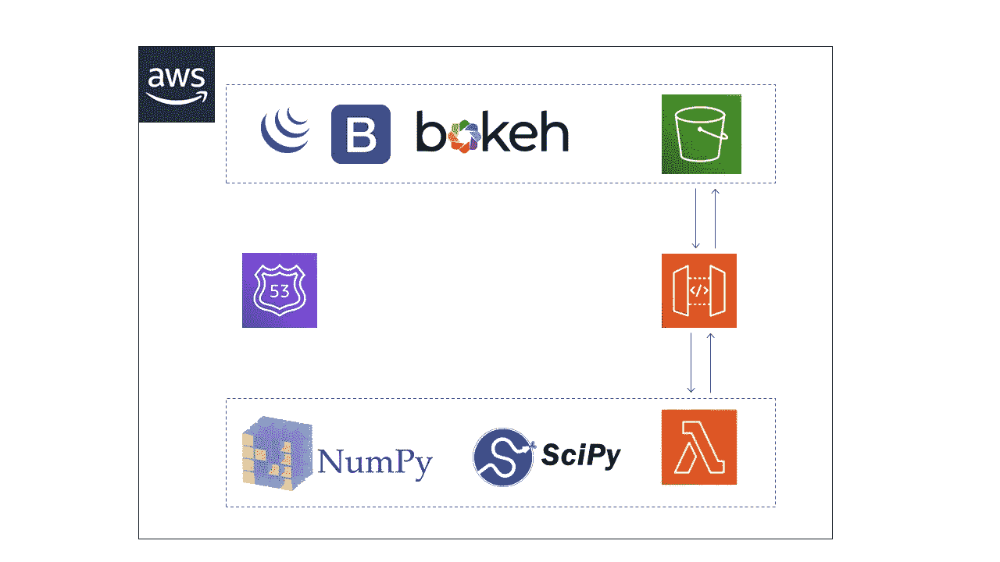
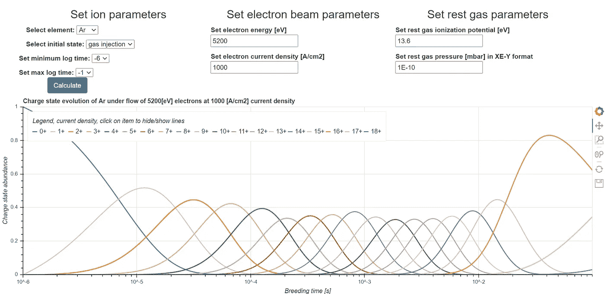
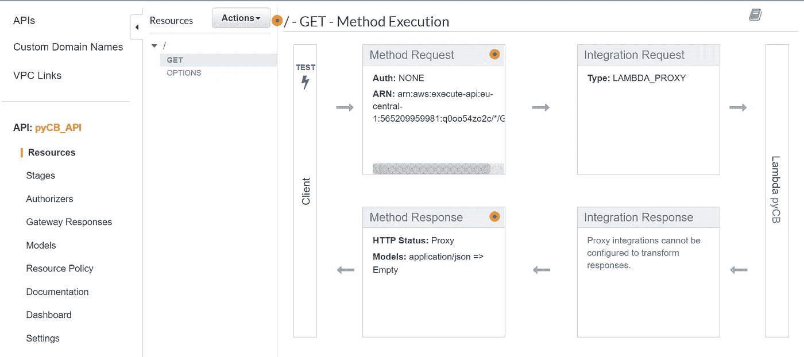
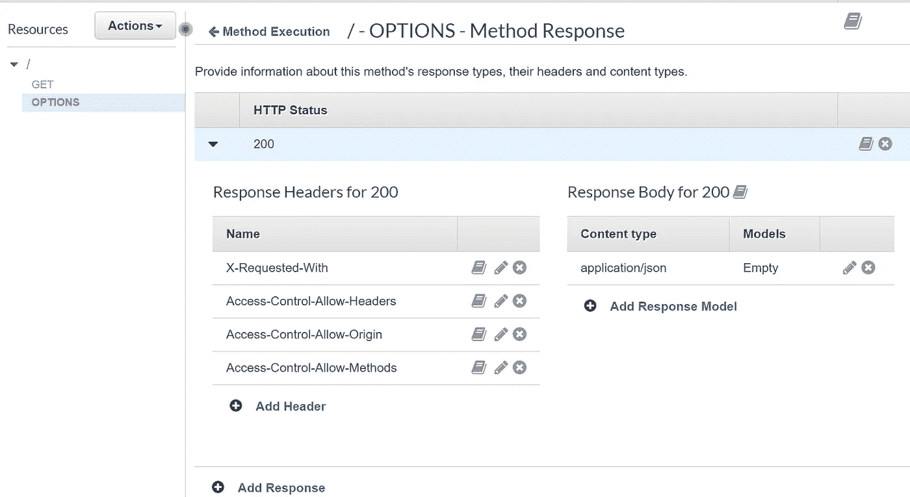
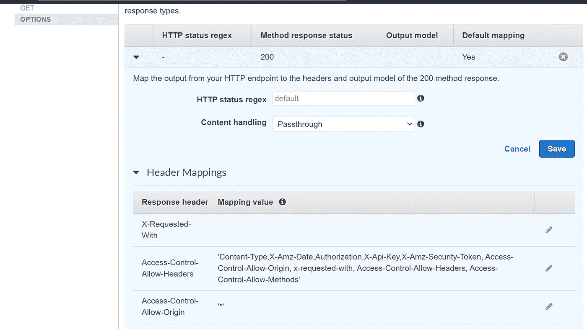

# 无服务器数字处理

> 原文：<https://medium.com/analytics-vidhya/serverless-number-crunching-cefbfe42d1c3?source=collection_archive---------17----------------------->

## 使用 AWS lambda、API Gateway 和 S3 构建交互式和可视化的双层全无服务器数字处理应用程序

几年来，使用 flask server 部署 API 端点一直是生产数据产品(ML 或其他)的首选方式。对于负载不规则的应用程序，无服务器部署提供了多种优势，如降低成本和维护。在本文中，我们将通过一个这样的应用程序的例子，其中大量的计算负载发生在 AWS lambda 后端，通过 API 网关连接到具有交互式散景的前端。JS 图形静态托管在 AWS S3。前端和后端完全无服务器，具有最大的可扩展性。

应用简化方案，由作者绘制

## **通用架构**

为了我们前端的高灵活性，我们将使用准静态网站。“准静态”意味着它没有任何服务器端呈现，只使用最少的客户端 javascript 来查询 API 和更新图形。这允许有非常简单和快速的前端。关于主机——只要允许 javascript，什么都可以。亚马逊 S3 上的一个为桶启用了网络托管选项的存储就足够了(参见[S3 上的静态托管](https://docs.aws.amazon.com/AmazonS3/latest/dev/WebsiteHosting.html))。

由于我们将图形和用户界面从后端移除，它唯一的任务就是接收输入、处理数据并提供响应。AWS lambda 函数可以做到所有这些，只要我们符合它的限制。好处包括高可扩展性、无需维护服务器，以及 Lambda 免费层(与普通 AWS 免费层不同，它不仅适用于新用户，而且不会在 1 年后过期)。关键问题是你的应用程序是否适合 lambda 用例，因为我们在谈论实际的数字处理，而不仅仅是查询腌 ML 模型——情况并不总是这样。那么，主要的局限性是什么呢？以下是最重要的:

*   执行时间限制为 900 秒(注意默认值只有 3 秒，我的基准代码很容易达到这个限制)
*   内存限制为 128 到 3008 Mb
*   依赖项(默认运行时几乎没有预装包，管理依赖项有点麻烦，最大部署包 250 Mb 解压缩)
*   关于 [AWS](https://docs.aws.amazon.com/lambda/latest/dg/gettingstarted-limits.html) 的完整限制列表

默认情况下，AWS Lambda Python 运行时包含最少的库。使用 Python 进行任何模拟的任何东西都可能需要一些公共库，如 numpy、Scipy 或 ML 库，如 scikit-learn、pyTorch 等。

在 AWS lambda 上获得依赖关系并不像在 Azure 或 GCP 等其他平台上那样简单，在这些平台上，一个简单的 *requirements.txt* 就可以完成这项工作。

在 AWS 上，你要么需要提供本地安装的库，要么通过 lambda 层使用。对于本地安装选项，您需要在一个压缩文件夹中提供库以及其余的代码。确保遵守 256 Mb 的文件夹大小限制，并且您的代码和依赖项可以与 lambda 运行时环境的其余部分一起平稳运行。

最好的方法是下载 amazon Linux 的 docker 映像，并测试其中的所有内容。这个主题被其他一些作者很好地涵盖了(一个基本的指令，更多的[全面的](https://blog.quiltdata.com/an-easier-way-to-build-lambda-deployment-packages-with-docker-instead-of-ec2-9050cd486ba8)版本，带有多一点的 Docker)

对于 lambda 层，我们将遵循更简单的方法。层是预构建的依赖包，如果您使用 AWS 本身的依赖包，它们可以保证与运行时的其他部分一起平稳运行。如果一层不能满足你的需求，你可以用五层。通过我们在 lambda 函数中只留下数字运算的方法，我们的依赖列表可以减少到可行的最小值。更多关于图层的信息可以在[的介绍帖](https://adhorn.medium.com/getting-started-with-aws-lambda-layers-for-python-6e10b1f9a5d)中找到。

在这个例子中，我考虑了一个跟踪某个马尔可夫过程的时间演化的代码，其中处于状态 *n* 的每个对象都有可能保持不变，或者改变到状态 *n-1* 或 *n+1* 。我们正在观察这类物体集合中的状态数随时间的演化。

从这个概括的描述中你看到这是一个非常普通的任务，它可以描述任何事情，从化学反应到生态系统中物种之间的平衡。

在我的特殊情况下，这是一个称为电荷繁殖的过程，它出现在全球从事核物理研究的大型研究实验室中，如 CERN (CH)、Brookhaven 国家实验室(NY，US)等。理解 AWS 部分不重要，吹牛而已:)

重要的是，从描述中我们看到所需库的全部范围是非常有限的，用于数组处理的 numpy 和用于求解微分方程的 Scipy 是我们唯一需要的东西。

这个组合在 AWS 上作为一个单独的层很容易获得，例如，作为 Python 3.7 运行时的 AWSLambda-Python37-SciPy1x 层。

最后，我们需要将 lambda 函数绑定到我们的前端。虽然 lambda 可以通过直接的 API 调用来调用，但这需要 AWS 凭证，并且在标准实践中，lambda 由其他 AWS 事件(如 CloudWatch alarms)调用，或者在这种情况下由专用的 AWS 服务— API 网关调用。API Gateway 允许您通过简单的 http 请求(如 GET、POST 和 GET response)来访问您的 lambda。

毕竟我们的架构看起来如下:

作者绘制的详细应用方案

前端托管在一个 S3 桶中，使用 jquery 与 API 端点对话，使用 Bokeh 绘制图形，使用 bootstrap 将我们的 UI 放在基于列的灵活布局中。我使用可选的 AWS route 53 为 bucket 提供 DNS 别名，但是出于测试目的，一个有意义的 S3 bucket 名称也很好。

然后我们有 API 网关将前端和后端绑定在一起。最后，在后端，我们有进行主要模拟的代码，elements.json 中的原始数据和一个带有 lambda 函数处理程序的文件。全部加载为压缩文件夹。通过带有 numpy 和 scipy 的单一 lambda 层来满足依赖性。

## **实现**

一旦我们完成了架构，让我们看看实际的实现。先从后端说起。Lambda 处理程序，由事件触发的函数做一些简单的事情(参见 [github repo](https://github.com/AndyShor/PyCB_AWS) 中的完整后端)。

Lambda 函数从请求中获取输入值

然后，它使用我们加载到 lambda 文件夹(csd.py)的代码中的函数来设置问题，并让 scipy 求解微分方程系统。

一旦完成，它就以某种形式生成一个响应，该响应将被接受为一个带有适当头的有效响应(稍后将详细介绍)。

完成 lambda 函数后，创建一个测试事件并检查函数是否按预期返回响应是很有用的。如果您发送一个带有有效“querystring”值的 GET 请求，它应该会正确响应。

让我们移到前端。在前端，我们有两个主要动作。

1.获取所有 UI 元素的值，创建一个查询字符串并向 API 发出 Get 请求

2.从 API 接收数据，并通过用新数据替换旧数据来更新散景图。

我们最终的应用程序看起来非常简单，但是它拥有我们需要的所有功能。

应用程序截图，由作者拍摄

从表单元素获取值并生成查询字符串几乎不需要解释(这里是对本地部署的服务)。

让我们开始策划吧。我用散景来绘图，因为我非常喜欢它产生的交互式绘图和它提供的灵活性。客户端绘图有一些替代方案，如 [charts.js](https://www.chartjs.org/) ，但我发现散景更适合复杂的绘图。通常我在 Python 中使用它，但是您也可以访问底层的 javascript，尽管它似乎功能不太丰富，也没有很好的文档记录。一个地块的最小功能模型可以在 BokehJS [文档](https://docs.bokeh.org/en/latest/docs/user_guide/bokehjs.html)中找到。为了让散景工作，你需要在你的 html 前端添加以下链接，注意导入顺序，这很重要。

在所有的 UI 元素(基本的 html 输入)之后，前端包括一个呈现按钮、绘图、查询 API 和刷新绘图的脚本。用对数 x 轴建立我们的基本图形如下所示

通过清除渲染对象(plot.renderers)列表、根据用户输入更新 x 坐标范围、添加新线条和相关图例项来实现图形更新

我们将把 HTML、JS 和 CSS 放入一个启用了虚拟主机选项的 S3 桶中(按照 AWS [文档](https://docs.aws.amazon.com/AmazonS3/latest/dev/WebsiteHosting.html))并做最后的步骤。

现在，为了将前端和后端绑定在一起，我们需要创建一个 API 网关，它具有与 lambda 函数集成的功能。创建一个新的 REST API 网关。然后，在资源中我们需要创建一个 GET 方法并使用代理集成类型，这样我们的网关就像代理服务器一样工作。

API Gateway AWS 控制台截图，作者拍摄

在这里，回应的形式开始发挥作用。您的响应必须有一个响应代码头和一个字符串化的 json 作为有效负载，否则您将会以错误 502“格式错误的响应”结束。

如果你现在试图通过 API invoke URL 访问你的 lambda，使用像 [Postman](https://www.postman.com/) 这样的 http 请求测试工具，或者一个简单的终端命令' *curl api-invoke-url？你应该会收到一个合适的答案。如果你试图通过点击前端的按钮来做同样的事情，你会发现什么都不管用。如果你把地址串从浏览器复制到邮递员，它就工作了。*

怎么了？

你刚刚和 CORS 有了第一次接触。如果你使用 Chrome，你可以打开开发者工具，在控制台上看到你的前端正在尝试做正确的请求。但是你的浏览器不允许。因为 CORS 问题。CORS 是跨产地资源共享。由于您的前端和 API 调用 URL 在不同的域中，浏览器不会让网站与 API 对话，除非 API 明确确认该网站被允许这样做。

这是一项旨在保护用户的安全功能。想象一下，我们的网站看起来不像最基本的 HTML 演示，而是看起来完全像你的互联网银行界面，而不是联系 AWS 上的 API，它实际上试图代表你的银行作为中间人联系你。CORS 就是为了防止这样的事情发生。如果我们想使用它，我们需要在我们的 API 网关中启用 CORS(转到操作—启用 CORS)。在那里我们需要指定，哪些请求的来源是允许的(一个特定的网址，或者任何人' * ')。启用 CORS 将在您的集成中创建另一个名为选项的方法。OPTIONS 方法的响应必须在方法响应中至少包括以下标题`Access-Control-Allow-Methods, Access-Control-Allow-Headers, Access-Control-Allow-Origin`。

选项方法回复标题，作者截图

在选项集成响应中也应该有一些标题。

选项集成回应标题，作者截图

我们的 lambda 函数响应还必须具有`Access-Control-Allow-Origin`头(正如你在上面的代码中看到的)。

一旦解决了这个问题(修改后不要忘记重新部署 lambda 或 API gateway)，一切都应该开始工作了。你可以在这里看到我们在[工作的示例项目。源文件可以在](http://pycb.cloudshore.eu) [github](https://github.com/AndyShor/PyCB_AWS) 上找到。

这就是了。我们刚刚做到了。托管在无服务器云基础设施上的双层 web 应用程序。

对于这样一个有限的努力，这是一个非常健康的流行词汇，并且所有这些都有一个实际的应用案例！