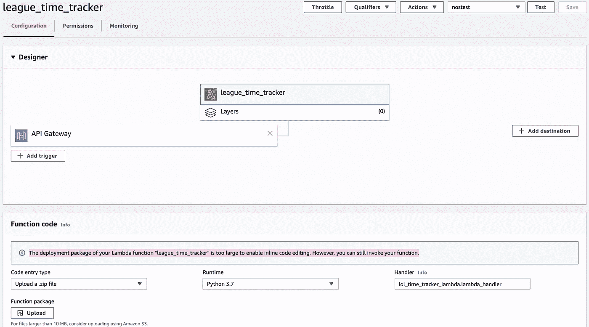
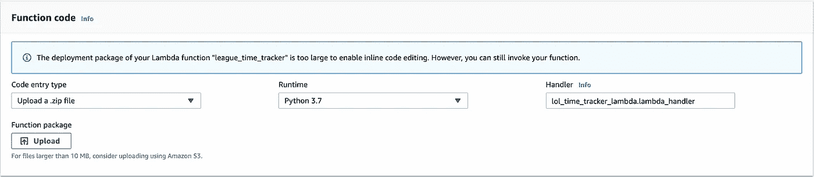
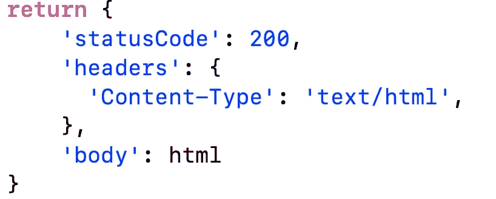

# 无服务器编程—使用 Python 的 AWS Lambda

> 原文：<https://medium.com/analytics-vidhya/serverless-programming-aws-lambda-with-python-c89d9aa2db5e?source=collection_archive---------21----------------------->

*使用 Lambda，您可以运行几乎任何类型的应用程序或后端服务的代码——所有这些都无需管理。只需上传你的代码，Lambda 就会为你的代码提供高可用性的运行和扩展。您可以将代码设置为从其他 AWS 服务自动触发，或者直接从任何 web 或移动应用程序调用它。— AWS Lambda 网页*


照片由 [Martijn Baudoin](https://unsplash.com/@martijnbaudoin?utm_source=medium&utm_medium=referral) 在 [Unsplash](https://unsplash.com?utm_source=medium&utm_medium=referral) 上拍摄

我试图上传我的英雄联盟时间跟踪器的 python 项目到 AWS Lambda 上，这里是我在这个过程中学到的一些东西。它们没有特定的顺序。

lambda 的流程如下:创建一个你的代码及其所有依赖的 zip 文件，上传到 Lambda 并指定触发器。



为了压缩你需要的所有代码，你将首先在一个地方获得依赖项，在工作文件夹中创建一个`./package`目录，然后用`pip3 install --target ./package <YOUR_PACKAGE_NAME>`在那里安装所有的依赖项，如果你得到一个`distutil`错误，就在这个目录中创建一个`setup.cfg`文件，下面两行

```
[install]
prefix=
```

安装完所有的安装依赖项后，将`cd`放入其中并创建一个包含所有依赖项的 zip 文件

`zip -r9 ${OLDPWD}/<FILE_NAME>.zip .`

移出`./package`目录，用

`zip -g <FILE_NAME>.zip <CODE_FILE_NAME>`



准备好 zip 文件后，您可以将它上传到 lambda 中创建的函数。将运行时更改为相应的包，将处理程序更改为`<CODE_FILE_NAME>.<FUNCTION_NAME>`。默认情况下，函数名称为`lambda_handler`，并带有两个变量`event`和`context`。

只需添加一个 API 网关作为 lambda 函数的触发器，然后就可以通过访问 url 来运行该函数。

# 修改 AWS Lambda 的代码

首先要改变的是将函数体移到`lambda_handler`中，这个函数的返回是一个 JSON 响应。



JSON 返回值

当你访问 url 时，返回值的主体将显示在网页上。

JSON 的主体必须是一个字符串，否则它将显示为 500 内部服务器错误。

当使用全局变量时，不要忘记在调用它们之前声明`global var1, var2`。

我不得不修改我的错误捕获过程，这样错误就会显示在网页上，这样更容易调试。

对于我的 API 网关，我希望能够将变量传递到脚本中。这是通过向`GET`请求提供参数来完成的。为了检索`lambda_handler`中的这些参数，通过`event['queryStringParameters']['param1']`访问`event`中的`queryStringParameters`属性

这是 AWS Lambda 入门的全部内容。希望这有所帮助。