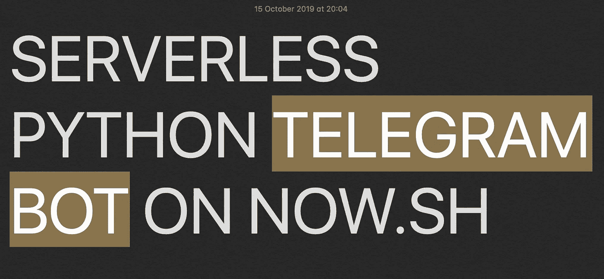

# 无服务器电报机器人 on Now.sh

> 原文：<https://medium.com/analytics-vidhya/serverless-telegram-bot-on-now-sh-b8522fb1e7fc?source=collection_archive---------5----------------------->

在这个故事中，我将告诉你我是如何在 Zeit.co(now . sh)上部署无服务器 python telegram bot 的。如果您使用 Javascript 或其他编程语言，本教程也会有所帮助。



# 动机

我不喜欢来自`[python-telegram-bot](https://github.com/python-telegram-bot/python-telegram-bot)` GitHub 的例子，我只是觉得它们不可扩展。我真的很想把“前端”(电报机器人接口)和“后端”(所有逻辑、数据库处理、后台任务)分开。在这种情况下，您可以分别开发这两个部分，在不同的服务器上托管它们…或者无服务器？

我的一些朋友使用 Heroku 来托管他们的机器人前端，这是一个很好的解决方案。但在某些情况下，如果你使用免费的 Heroku 实例，你的应用程序和 telegram bot 可能会“进入睡眠状态”，用户应该等待 10 秒钟，然后应用程序才能再次工作。是的，您可以编写“pinger”来阻止 Heroku 实例进入睡眠状态，但是这个解决方案不是可伸缩的和特定于平台的。咩。

我发现 Now.sh 有一个免费的无服务器层，每天有 5000 个调用。对于小项目来说，我觉得这远远绰绰有余。但是 Zeit 公司没有关于如何运行无服务器电报机器人的教程，所以我决定写一个。

# TL；速度三角形定位法(dead reckoning)

最重要也是最棘手的步骤:

1.  **烧瓶** **终点**同**岗位**方法允许，
2.  通过 **Now CLI** 设置 **TELEGRAM_TOKEN** env var 并链接到`now.json`，
3.  通过 Telegram API 调用将 Now.sh https URL 注册为 webhook。

# 无服务器机器人

我给大家简单了解一下无服务器电报机器人的工作原理:

1.  电报服务器捕捉所有机器人传入的信息，
2.  你给了电报发送这些信息的秘密。这是您部署的前端的 Now.sh 的 URL。
3.  电报转发您的前端所有传入的信息
4.  Now.sh 接收传入的消息，调用 bot 的实例
5.  现在，您可以访问用户的消息，并可以对其进行回复(如果您在前端也有可用的令牌)。

# 无服务器 Python 电报机器人

下面你可以找到简单的烧瓶电报回声机器人。`/api`端点将接收 Telegram webhook 的消息，并用相同的消息文本进行回复。

# 设置环境变量

*我相信你知道如何创建电报机器人，电报机器人令牌是什么，如果不知道，请谷歌一下。*

您可以注意到，我正在使用`TELEGRAM_TOKEN`环境变量来通过电报机器人回显消息。为了向 Now sh 提供这个秘密信息，你需要他们的 Now CLI(谷歌如何安装它)。

我不喜欢现在的 CLI，但我很喜欢 Zeit 的 GitHub 集成。遗憾的是，我不能用 Zeit.co 网站指定环境变量。亲爱的 Zeit，为什么？

要添加 **TELEGRAM_TOKEN** 环境变量，请使用以下代码:

```
now secrets add telegram-token <TELEGRAM_TOKEN>
```

我添加了一个名为“telegram-token”的新环境变量，因为 Zeit 无法添加高档变量名称。亲爱的 Zeit，为什么？

# 在 Now.sh 应用程序中使用环境变量

现在，您应该添加 now.json 配置文件，以允许您的应用程序读取这个秘密变量。

这是你该做的。注意，我还添加了特定于 Zeit 的配置来运行 python 项目。我花了很多时间试图找到一个适合我的。亲爱的 Zeit，为什么？

看看我是如何引用我在上一步中创建的“telegram-token”变量的。

既然已经完成了 Ziet 设置，就可以部署应用程序了。我喜欢通过连接 GitHub repo 来部署我的应用程序——现在每个 commit 都部署到现在，这是一个非常棒的 CD。

# 注册电报机器人网络钩子

既然您现在已经部署了您的应用程序，您应该有指向它的`https://`链接。现在 sh 为您的项目生成了许多别名，您将需要不带提交散列的 URL——因此您的项目 URL 在每次提交时都是相同的。

现在打开您的终端，运行以下命令:

```
curl “https://api.telegram.org/bot<TELEGRAM_TOKEN>/setWebhook?url=https://your-now-sh-project.now.sh/api"
```

有`https://`环节很重要。因为我使用的是`/api`端点，所以我也把它添加到了链接中。

那都是乡亲们！现在你的电报机器人应该无服务器地回显你的信息。

本教程的所有代码都可以在这里找到:[https://github.com/ohld/python-zeit-serverless-telegram-bot](https://github.com/ohld/python-zeit-serverless-telegram-bot)

感谢您的阅读！请在评论区问我任何问题。当然，请关注我获取更多信息！