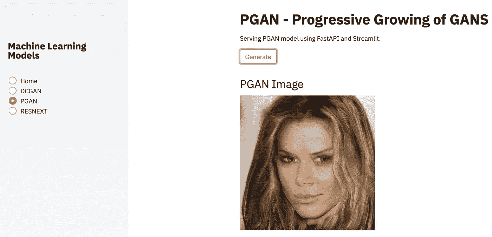

# 使用 FastAPI 和 Streamlit 服务机器学习模型(DCGAN、PGAN、ResNext)

> 原文：<https://medium.com/analytics-vidhya/serving-machine-learning-models-dcgan-pgan-resnext-using-fastapi-and-streamlit-2ef426f2e9de?source=collection_archive---------12----------------------->

PGAN 机器学习模型

# 概观

经过几个月的努力，现在是你部署机器学习模型的黄金时间。数据科学家花费大量时间训练和评估机器学习模型。但是，如果不使用经过训练和测试的模型，它实际上是没有用的。在这篇文章中，我将向你展示如何使用…