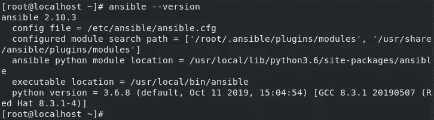
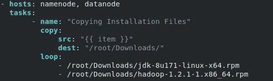
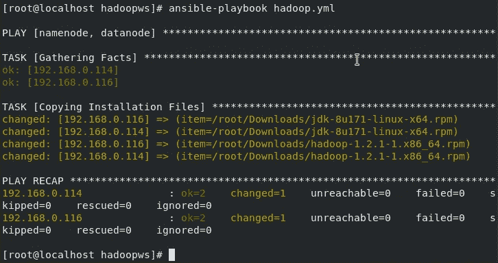
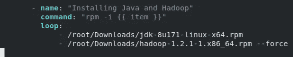
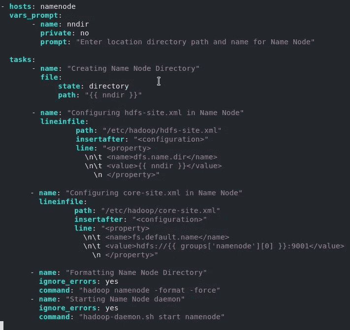
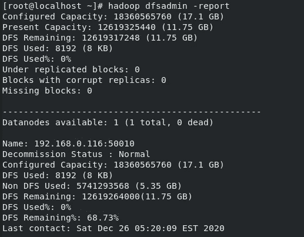

# 使用 Ansible 设置 Hadoop 集群

> 原文：<https://medium.com/analytics-vidhya/set-up-a-hadoop-cluster-using-ansible-b218bf4ce602?source=collection_archive---------6----------------------->


## 介绍

我们使用 Ansible 通过简单地编写行动手册来自动化云供应、配置管理、部署和其他 IT 操作。它是一个开源工具，可以大规模提高我们的生产力，当我们需要在多个节点上执行配置管理时，可以节省我们很多时间和麻烦。

在本文中，我们将在 Ansible 的帮助下自动化 Hadoop 集群设置。为了简单起见，我们的集群包含一个虚拟机作为 Ansible 的控制节点，两个虚拟机作为受管节点，它们将作为 Hadoop 集群中的名称节点和数据节点。

## 设置 Ansible

*如果您已经设置了 Ansible，您可以跳过这一部分。*

首先，运行`**ansible --version**`命令检查您安装了什么版本的 Ansible。如果这个命令不运行，那么可以使用 pip 安装 Ansible(需要为 Ansible 安装 Python)。要用 pip 安装 Ansible，可以运行`**pip3 install ansible**`。



接下来，我们需要创建一个清单文件，其中包含所有托管节点的 IP 地址。因此，在任何位置(例如`**vi /root/ipINV.txt**`)创建一个清单文件，最好是在某个目录下，这样你以后也可以保存你的 ansible 配置文件。

在清单中，以以下格式添加您的受管节点信息:

```
[namenode]
*<IP address of namenode>* ansible_user=root ansible_ssh_pass=*<password>* ansible_connection=ssh
[datanode]
*<IP address of datanode>* ansible_user=root ansible_ssh_pass=*<password>* ansible_connection=ssh
```

`[namenode]`和`[datanode]`是我们在写剧本时可以使用的标签。你可以随意命名你的标签。

接下来，为 ansible 配置文件创建一个目录，

`[root@localhost ~]# mkdir /etc/ansible`

在这个目录下，创建一个配置文件，`vim ansible.cfg` 并添加以下内容，

```
[defaults]
inventory = <path to inventory file>
host_key_checking = False
```

通过 **ssh** 连接依赖于另一个名为 **sshpass** 的软件。要在 Red Hat 8 上安装，输入`dnf install sshpass`(这个包可以在 **epel-release** repo 中找到，所以要确保 yum 配置了 epel-release 存储库)。

至此，我们完成了 ansible 的设置。我们现在可以开始编写剧本来配置 Hadoop 了。

# 创建行动手册

创建一个目录作为您的工作区，例如`mkdir /hadoopws` 在这个工作区内，创建一个剧本(扩展名**)。yml** )，比如 `vim hadoop.yml` 。

我们的第一行将有 **hosts** 关键字，它带有您希望在其上执行上述任务的主机组的标签。让我们从在名称节点和数据节点上安装 JDK 和 Hadoop 安装文件开始。

*   **复制 JDK 和 Hadoop 的安装文件**

在我的例子中，我将保存在我的控制器节点上的 JDK 和 Hadoop 安装文件复制到受管节点中，但是您也可以使用其他的 ansible 模块，比如 **get_url** 来直接从给定的 url 下载文件。



这里我使用**循环**和内置变量**项**来复制多个文件。
确保您下载了您安装的 Hadoop 版本支持的 JDK。参考此处的[和](https://cwiki.apache.org/confluence/display/HADOOP/Hadoop+Java+Versions)来检查哪些版本是兼容的。

您可以使用`ansible-playbook <playbook name>`运行您的剧本，看看是否一切正常。如果正确，您的数据节点和名称节点应该将这两个文件保存在您给定的目标中。



*   **安装 Java 和 Hadoop 并停止防火墙**

我们可以使用 **yum** 模块安装一个以 path 为名称属性的包，但是我们需要为 Hadoop 安装输入 **- force** 选项，这就是为什么我们可以只使用**命令**模块。



我们还将停止两个节点上的防火墙服务，以便当我们启动 namenode 和 datanode 时，它们可以相互连接。


*   **配置名称节点**

在 name 节点中，我们使用 **vars_prompt** 模块输入我们的目录名。我们的任务包括，
- **file** 模块创建目录
- **lineinfile** 模块输入 *hdfs-site.xml* 和 *core-site.xml* 文件中的配置行，位置为 **/etc/hadoop/** 。我们使用 **groups['namenode'][0]** 变量从清单文件中获取 namenode 的 IP。这是可能的，因为我们将我们的名称节点 IP 标记为“name node”。——我们最后使用**命令**模块和命令`hadoop namenode -format -force`和`hadoop-daemon.sh start namenode`格式化并启动名称节点。



*   **配置数据节点**

我们在数据节点上执行与名称节点相同的操作，除了我们对目录使用不同的变量名，并且我们的 *hdfs-site.xml* 也有一点变化。之后，我们可以直接启动 datanode。


# **完整剧本**

```
- hosts: namenode, datanode
  tasks:
       - name: "Copying Installation Files"
         copy:
             src: "{{ item }}"
             dest: "/root/Downloads/"
         loop:
             - /root/Downloads/jdk-8u171-linux-x64.rpm
             - /root/Downloads/hadoop-1.2.1-1.x86_64.rpm- name: "Installing Java and Hadoop"
         ignore_errors: yes
         command: "rpm -i {{ item }}"
         loop:
             - /root/Downloads/jdk-8u171-linux-x64.rpm
             - /root/Downloads/hadoop-1.2.1-1.x86_64.rpm --force- name: "Stopping firewalld service"
         ignore_errors: yes
         command: "systemctl stop firewalld"- hosts: namenode
  vars_prompt:
       - name: nndir
         private: no
         prompt: "Enter location directory path and name for Name Node"tasks:
       - name: "Creating Name Node Directory"
         file:
             state: directory
             path: "{{ nndir }}"- name: "Configuring hdfs-site.xml in Name Node"
         lineinfile:
                 path: "/etc/hadoop/hdfs-site.xml"
                 insertafter: "<configuration>"
                 line: "<property>
                   \n\t <name>dfs.name.dir</name>
                   \n\t <value>{{ nndir }}</value>
                     \n </property>"- name: "Configuring core-site.xml in Name Node"
         lineinfile:
                 path: "/etc/hadoop/core-site.xml"
                 insertafter: "<configuration>"
                 line: "<property>
                   \n\t <name>fs.default.name</name>
                   \n\t <value>hdfs://{{ groups['namenode'][0] }}:9001</value>
                     \n </property>"- name: "Formatting Name Node Directory"
         ignore_errors: yes
         command: "hadoop namenode -format -force"
       - name: "Starting Name Node daemon"
         ignore_errors: yes
         command: "hadoop-daemon.sh start namenode"- hosts: datanode
  vars_prompt:
       - name: dndir
         private: no
         prompt: "Enter location directory path and name for Data Node"tasks:
       - name: "Creating Data Node Directory"
         file:
             state: directory
             path: "{{ dndir }}"- name: "Configuring hdfs-site.xml in Data Node"
         lineinfile:
                 path: "/etc/hadoop/hdfs-site.xml"
                 insertafter: "<configuration>"
                 line: "<property>
                   \n\t <name>dfs.data.dir</name>
                   \n\t <value>{{ dndir }}</value>
                     \n </property>"- name: "Configuring core-site.xml in Data Node"
         lineinfile:
                 path: "/etc/hadoop/core-site.xml"
                 insertafter: "<configuration>"
                 line: "<property>
                   \n\t <name>fs.default.name</name>
                   \n\t <value>hdfs://{{ groups['namenode'][0] }}:9001</value>
                     \n </property>"- name: "Starting Data Node daemon"
         ignore_errors: yes
         command: "hadoop-daemon.sh start datanode"
```

## 运行剧本，

使用命令`ansible-playbook <playbook-name>` ,您可以通过在 name node 或 data node 上运行`hadoop dfsadmin -report` 来确保您的数据节点正在共享存储。



> 只需将数据节点的 IP 地址添加到数据节点标签下的清单文件中，就可以添加更多的数据节点。
> 
> 请记住，如果系统中保存了 hadoop 的任何缓存文件，重复运行本行动手册可能不起作用。因此，要为新集群重新运行行动手册，请确保您删除了 **/etc/hadoop/** 目录(如果您在运行行动手册时给出了与之前相同的目录名称，那么 namenode 和 datanode 目录，即 **/nn** 和 **/dn** 、也应该被删除)。

希望这有所帮助:)