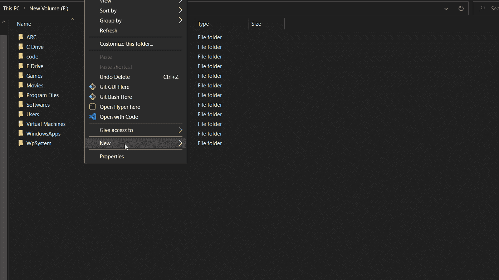
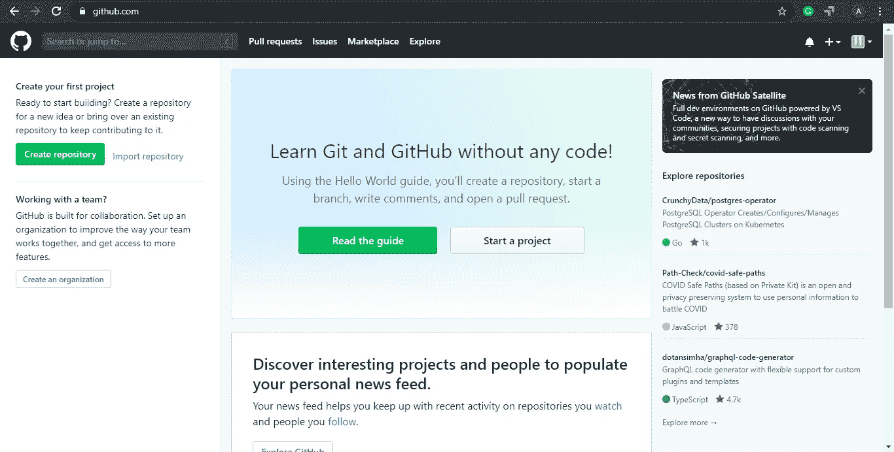
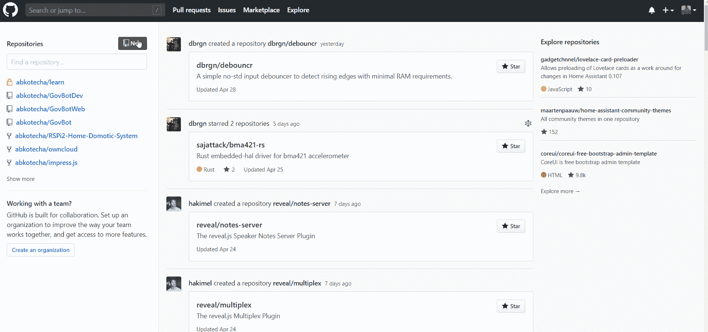
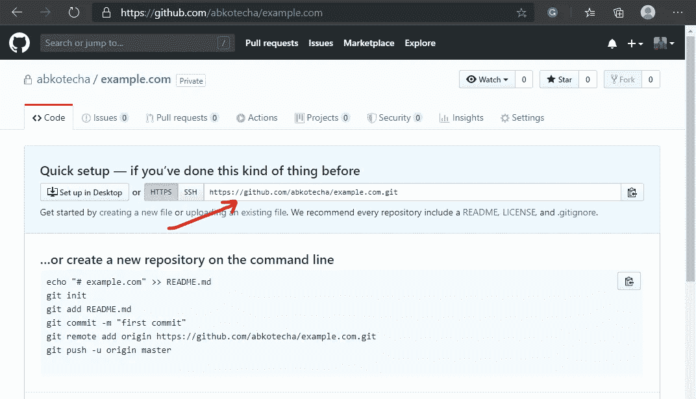
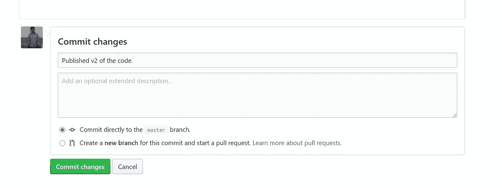
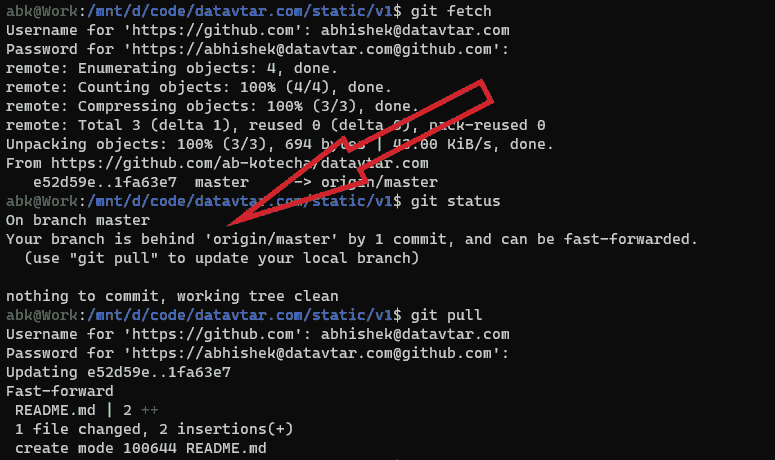
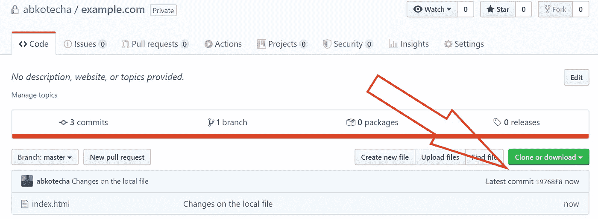

# 在 GitHub.com 建立你现有的项目，私人的，对整个团队免费。

> 原文：<https://medium.com/analytics-vidhya/set-up-your-existing-project-on-github-com-private-and-free-for-the-whole-team-2677871ac442?source=collection_archive---------23----------------------->

我相信我们大多数人都不需要任何关于 GitHub 的介绍。然而，让我为我们的新朋友快速总结一下。


*首先*——**什么是 Git？**
*回答* — Git 是一个微小的软件，它**跟踪由一个人或一群人同时在同一个项目中所做的所有代码变更**。阅读更多关于 Git 的内容，请点击 [*这里*](https://docs.microsoft.com/en-us/azure/devops/learn/git/what-is-git) 。

*上一个* —现在，**GitHub 是什么？** *答*——一个(SaaS)平台，提供所有必要的基础设施来永久**托管、访问和共享你所有 Git 跟踪的项目**。

把 GitHub 想象成一个管理你项目代码的 Gmail。类似于 Gmail——甚至 GitHub 的**免费账户也是一大堆**。在本指南中，我们将仅使用免费计划帐户。点击 [*这里*](https://github.com/pricing) 了解更多他们的定价。

> 在本“5 分钟”指南结束时，您将能够免费存储您的项目代码，并享受使用 Git 的所有好处。所有这些**没有付出一分钱**！

# 目录

1.  **工具** —快速介绍我将使用的工具
2.  **设置&集成** —在本地项目上启用 Git，并与 GitHub 集成。
3.  **验证** —验证 GitHub 集成，确保代码的完整性。

## 1.工具

我在最新版本的 Windows 10 上使用以下工具。请求您下载并安装该软件。

```
+-------------------+---------------------------------------+
|     Tool Name     |                 Link                  |
+===================+=======================================+
| VS Code           | [https://code.visualstudio.com/](https://code.visualstudio.com/)        |
| Windows Terminal  | [https://github.com/Microsoft/Terminal](https://github.com/Microsoft/Terminal) |
| Git Software      | [https://git-scm.com/](https://git-scm.com/)                  |
| Ubuntu on Windows | [https://ubuntu.com/wsl](https://ubuntu.com/wsl)                |
+-------------------+---------------------------------------+
```

从现在开始，我假设上述所有工具都已成功安装在您的机器上。

## 2.1 设置 Git

在本节中，我们将在所有项目代码所在的文件夹中初始化(启用)Git。之后，我们将在 GitHub 上远程集成同一个目录。作为参考，我正在从头开始创建一个项目目录。但是，如果已经有了项目目录，就可以跳过这个目录的创建。我正在用一个简单的代码创建一个 HTML 文件供参考。下面是代码片段，如果你想用它作为参考。

```
<html>
  <head>
  </head>
  <body>
  Hi. This is build 1.
  </body>
</html>
```

现在，我们有一个项目文件夹，我们想用 GitHub 来管理它。同样，下面是我将在我的 Ubuntu Linux (WSL)上执行的一些代码。打开我们已经安装的 Windows 终端，并转到目录。

```
$ cd /mnt/your_project_directory
// Open the Windows Terminal and visit the project folder.$ git init
// Run this command inside the master folder of the project.$ git add .
// This command indexes all those files that you have modified in this current directory.$ git commit -am “First draft for GitHub.”
// Here, we are committing all the changes we have made. The -m flag is optional but useful in tracking the set of changes in plain English.
```

如果您是第一次在您的机器上使用 Git，您可能需要声明您的身份。要做到这一点，需要以下两条信息。
1。设置你的邮箱
2。设置您的姓名

遵循以下命令并声明您的默认身份。

```
$ git config --global user.email "your@email.com"
$ git config --global user.name "Your Name"//Now re-run the commit command.$ git commit -am "First draft for GitHub."
```

您应该会收到一条确认消息，如下所示。



创建项目文件，以防您没有它。此外，激活项目目录上的 Git。

## 2.2 设置 GitHub



初次使用的用户可能会看到这样的屏幕。

现在是时候访问 GitHub 并设置它来托管我们的代码了。同样，请遵循以下步骤。

1.  注册 GitHub.com
2.  使用您的 GitHub.com 帐户凭据登录
3.  你将在仪表板着陆。点击**新建仓库**按钮，如下图所示。
4.  举几个名字。在这里，我将它命名为 example.com**。**
5.  **将其设置为**私有**，并点击**创建存储库**按钮。**

****

**创建私有存储库。**

## **2.3 整合**

**现在，让我们将本地项目文件夹与刚刚在 GitHub 上创建的远程存储库连接起来。**

****

**首先，让我们在 GitHub 上找到存储库 URL，复制它。对我来说，网址是[https://github.com/abkotecha/example.com.git](https://github.com/abkotecha/example.com.git)。你可以从下面的屏幕获得你的网址。**

**接下来，打开命令行界面，输入以下命令。**

```
$ git remote add origin [https://paste-the-URL-here.com.git](https://paste-the-URL-here.com.git)// In my case, the command looks something like below:$ git remote add origin [https://github.com/abkotecha/example.com.git](https://github.com/abkotecha/example.com.git)
```

**同样，运行下面的 **Push** 命令，将最新的文件发布到 GitHub repo。**

```
$ git push origin master//Here, the master refers to the master branch of Git.
```

# **使生效**

**我们可以通过两种简单的方法来验证本地/远程连接。在第一种方法中，我们将在 ***GitHub 资源库*** 上编辑一个文件。对于第二个，我们将在本地机器*上修改一个文件。***

***对于这两种情况，我们将使用一组简单的 Git 命令同步两个位置上的项目代码。***

## ***方法 1:远程目录中的更改***

***从文件列表中，单击要进行更改的文件。在这里，我将单击 index.html 文件。点击编辑按钮，用已经打开的 GitHub 编辑器编辑文件内容。***

******

***输入提交消息不是强制性的。***

***完成更改后，向下滚动并在 commit 部分输入一些相关的消息，其他选项保持不变。接下来， ***保存*** 这些修改并访问终端上的本地目录。***

***输入以下命令，检查本地和远程项目是否同步，或者一个项目是否领先于另一个项目。***

```
*$ git fetch
$ git status*
```

***如果通过提交的*数量，您得到的响应表明您的分支在*【origin/master】之后 ***，这表明远程项目在本地项目之前。******

******

***fetch 命令获取重要的工件来确定状态。***

***运行下面的**拉**命令来更新本地代码。***

```
*$ git pull*
```

***这个命令将从远程存储库中取出最新的代码，并替换本地目录中不同步的文件。***

## ***方法 2:本地目录中的更改***

***在本地机器上进行所需的更改，并遵循上一节 **2.1 设置 Git** 中提到的步骤。***

***在这些命令之后，输入 Push 命令。***

```
*$ git push*
```

***Push 命令用本地目录更新 GitHub 存储库。***

******

***验证从本地机器到 GitHub 的代码推送。***

***刷新您的浏览器页面，您应该会发现您在 GitHub 上的代码库现在与您的最新提交同步。GitHub 上显示的提交 ID 将与终端上的提交 ID 相匹配。***

# ***结论***

***通过本教程，我们了解了什么是 Git，并且用 GitHub 托管了我们的项目。任何其他队友都可以遵循相同的步骤，让 Git 在他们的本地机器上工作。***

***更新代码，提交代码，并获得同步的最新代码将有助于所有团队成员同时处理同一个项目。接下来，我将为整个团队发布使用 Git/GitHub 的最佳实践。在那里，我们将集中精力保持项目的完整性，即使很多人在项目的同一个模块上工作。敬请关注。***

***如果您有兴趣访问 Git 的备忘单并推进您的学习，请点击 [*此处*](https://www.atlassian.com/git/tutorials/atlassian-git-cheatsheet) 。***

> ***有一个创造性的和富有成效的一天！:)***