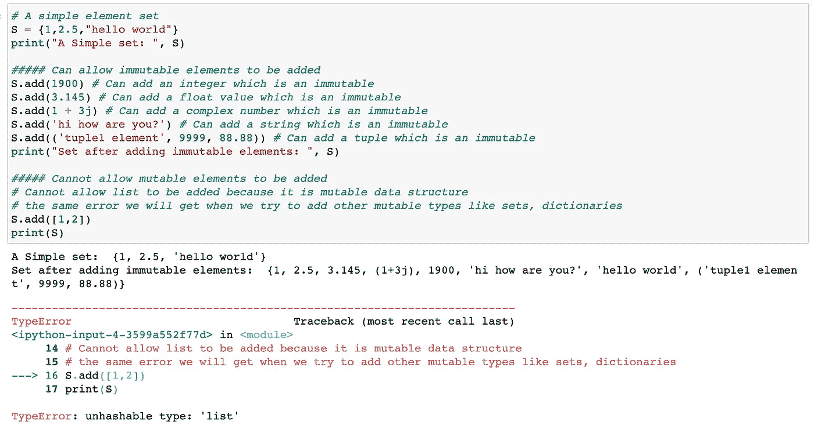
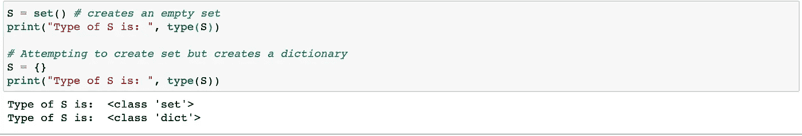
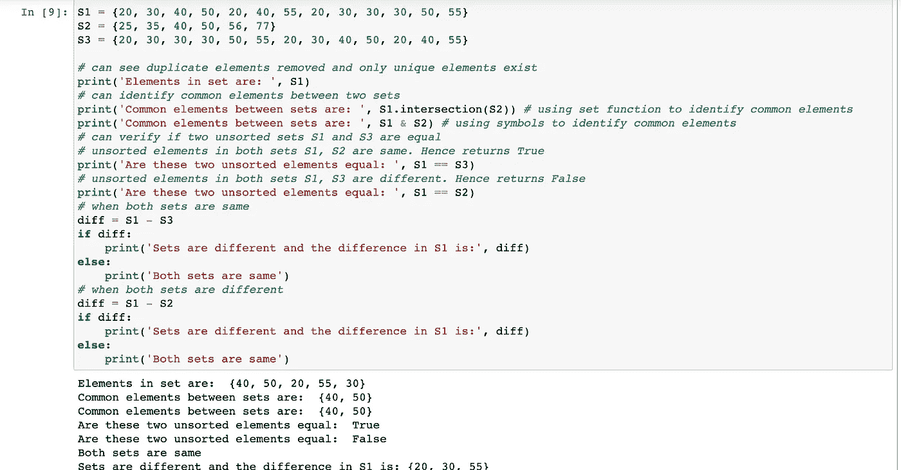

# 设置数学问题— Python

> 原文：<https://medium.com/analytics-vidhya/sets-the-maths-one-python-3a481e38daf7?source=collection_archive---------38----------------------->

集合是包含元素集合的可变数据类型对象。它是一个无序的集合，只包含唯一的对象。作为一个无序的数据结构，它不会记录元素的位置，也不会记录元素插入的顺序。

集合的另一个名字是无值字典，它们在内部被实现为字典。事实上，您可以将集合元素想象成字典的键，因为字典键不能有可变的数据对象。同样的要求也适用于集合元素。请参考我的另一篇帖子，了解更多关于字典键的信息—[https://medium . com/analytics-vid hya/dictionary-walk-through-python-74274 B2 BAF 71](/analytics-vidhya/dictionary-walk-through-python-74274b2baf71)

即使集合是可变的，它也只能有不可变的元素。它不允许任何可变对象作为它的元素。这意味着集合不能有列表、字典和集合本身，因为它们是可变的数据结构。下面是一些描述相同情况的例子。

显示可容纳的元素集类型的示例

github 链接:[https://github . com/bvvkrishna/Deep-Dive-into-Python/blob/master/Mutable % 20 set % 20 example . ipynb](https://github.com/bvvkrishna/Deep-Dive-into-Python/blob/master/Mutable%20Set%20Example.ipynb)

只能通过使用 set()构造函数而不是符号符号{}来创建空集。使用符号表示法将创建一个字典，因为集合和字典都使用相同的符号来创建它们的数据结构。下面的例子说明了这一点。

创建空集的示例

github 链接:[https://github . com/bvvkrishna/Deep-Dive-into-Python/blob/master/Creating % 20 empty % 20 set . ipynb](https://github.com/bvvkrishna/Deep-Dive-into-Python/blob/master/Creating%20Empty%20Set.ipynb)

除了从包含重复元素的元素集合中识别唯一元素之外，集合还有多种应用。下面是应用，下面是描述这些应用的例子。

1.  从包含重复项的元素集合中识别唯一元素。
2.  可以验证两个集合之间的公共元素。
3.  可以检查两个未排序的集合是否相等。
4.  可以验证两个集合是否相等，如果不相等，可以识别两个集合之间的差异。

设置应用程序

github 链接:[https://github . com/bvvkrishna/Deep-Dive-into-Python/blob/master/Set % 20 applications . ipynb](https://github.com/bvvkrishna/Deep-Dive-into-Python/blob/master/Set%20Applications.ipynb)

要深入了解 Python 内部，请在 Linkedin 上关注我-[https://www.linkedin.com/in/krishnabvv/](https://www.linkedin.com/in/krishnabvv/)