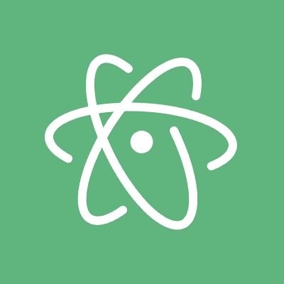
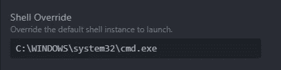
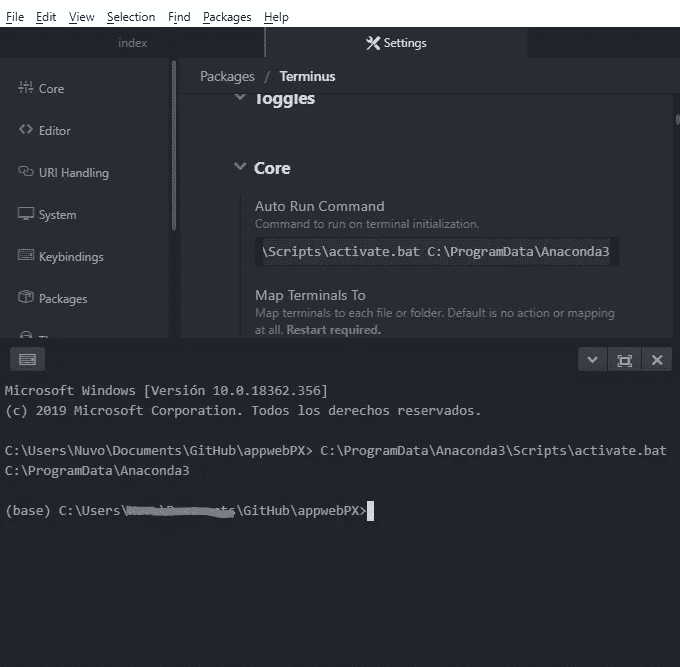

# 在 Atom 中用 anaconda 设置内部终端

> 原文：<https://medium.com/analytics-vidhya/setting-a-within-terminal-with-anaconda-in-atom-835133a16937?source=collection_archive---------6----------------------->

蟒蛇标志❤

作为一名开发人员，有时您希望根据自己的需求定制工具，正如他的页面所说，Atom 是“21 世纪的可破解文本编辑器”，对于许多每天使用它来实现惊人目的的开发人员来说，这是事实。

原子标志是一个实际的卢瑟福模型原子 OMG

让我们来讨论一个基本的定制，您会发现它非常有用，那就是在 windows 中设置一个使用 anaconda 提示符的终端面板！

有了这个，你的工作流程将会更加有机和流畅。

当然，您需要在系统中安装 anaconda 和 atom。

# 安装终端

要安装终端包，你可以点击此链接中的【https://atom.io/packages/terminus】**进行安装**

**对于 terminus，每个终端都加载了系统的默认初始化文件。这确保您可以访问与标准终端相同的命令和别名，这是您喜欢的终端，现在在一个口袋大小的 Atom 面板中。**

****

**支持底层终端的凌动封装**

**一旦安装完成，你会在底部有两个新的按钮“+”和“X ”,有了这两个家伙，你可以添加和删除任意多的终端！，我知道它很美。**

****

**末日的两个底部**

## **设定蟒蛇**

**现在您需要配置 terminus 来开始使用 anaconda，默认情况下，terminus 将使用 Power Shell，这对于习惯使用 CMD 的人来说可能有点棘手，所以第一件事是覆盖我们将要使用的 Shell 实例。**

**在 Atom 配置面板中按“CTRL”+“，”进入，一旦你让它进入“包”并在搜索栏中写“terminus”，然后按“设置”并进入核心>外壳覆盖。**

****

**在 shell Overid 中写下“C:\WINDOWS\system32\cmd.exe”这将使 terminus 能够使用命令提示符，**

**下一步是配置“自动运行命令”,只需编写或复制这些“C:\ program data \ anaconda 3 \ Scripts \ activate . bat C:\ program data \ anaconda 3”**

**现在尝试用“+”按钮打开一个新的终端，如果一切正常，你将能够看到像这样美丽的东西**

****

**如果你在你前进的道路上看到了宝贵的基础，那么你就成功了！**

## ****你“现在”是一名巫师哈利****

**如果你到了这一步，你就可以开始享受使用尽可能多终端的乐趣了，我使用 flask 开发 web 应用程序，这样的环境对我帮助很大，我希望它也能帮助你。**

**对于我的 Linux 爱好者来说，有好消息！如果你已经有了 anaconda 来处理你的终端，那么 terminus 将开始处理 anaconda，就这样！❤**

**感谢大家的阅读！**