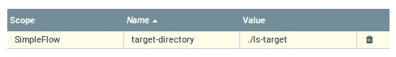
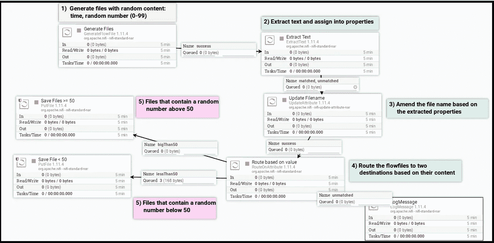

# 在 Docker 容器上设置 Apache Nifi

> 原文：<https://medium.com/analytics-vidhya/setting-apache-nifi-on-docker-containers-a00e862a8399?source=collection_archive---------0----------------------->

## 如果您正在寻找一个简单但健壮的工具来处理来自不同来源的数据，那么 Apache Nifi 是您的首选。你想尝试，但不知道从哪里开始？这本指南是给你的。


我工作的系统即将经历一次重大的技术更新。目标是改善当前阻止获取更多数据的障碍。补救措施需要一种产品，它从外部来源接收输入，对其进行处理，并将结果传播到目的地。

Apache Nifi 实现了[基于流的编程(FBP)](https://en.wikipedia.org/wiki/Flow-based_programming) 范式；它由通过预定义的连接交换数据的黑盒过程组成(摘自维基百科)。

> 简而言之，Apache NiFi 是一个处理和分发数据的工具。其直观的 UI 支持路由定义、各种连接器(输入/输出)和许多内置处理器。所有这些特性结合在一起，使它成为我们用例的一个合适的可选平台。

考虑到我们系统未来的需求，我们决定对 Nifi 进行彻底的评估。起点是建立一个环境。

在本文中，我将描述如何使用 Docker 映像建立一个 Nifi 环境，并运行一个简单的预定义模板；从头开始构建 Nifi 流将在另一篇文章中讨论。文章的三个主要部分是:

*   回顾 Apache Nifi 概念和构建块
*   设置 Nifi 流和 Nifi 注册表(基于 Docker 图像)
*   加载模板并运行它

准备好了吗？让我们从基础开始。

# Nifi 组件和概念

Nifi 基于以下层次结构:

*   **进程组**
    处理器及其连接的集合。进程组是保存在版本控制(Nifi 注册表)中的最小单元。一个进程组可以有允许连接进程组的输入和输出端口。这样，数据流可以由多个进程组组成。
*   **处理器** (大部分)具有通过连接器*链接到另一个处理器的输入和输出的处理单元。每个处理器都是一个执行单一操作的黑盒；例如，处理者可以更改流文件的内容或属性(见下文)。*
*   **流文件**
    这是由两部分(内容和属性)组成的逻辑数据集，在 Nifi 处理器之间传递。FlowFile 对象是不可变的，但是它的内容和属性可以在处理过程中改变。
*   **连接** 连接是在处理器之间路由流文件的队列。路由逻辑基于与处理器结果相关的条件；一个连接与一个或多个结果类型相关联。连接的条件是处理器之间的关系，可以是静态的，也可以是动态的。静态关系是固定的(例如，成功、失败、匹配或不匹配)，而*动态关系*基于用户定义的流文件的属性；本文的最后一节用 *RouteOnAttribute* 处理器举例说明了这个特性。
*   **端口** 一个进程组的入口和出口点。每个进程组可以有一个或多个输入或输出端口，通过它们的名称来区分。
*   **漏斗** 将来自多个连接的数据组合成一个连接。

下面的 Nifi 流程描述了这些组件:


过程组和 Nifi 元素

在回顾了 Nifi 数据流组件之后，让我们看看如何设置一个环境。

# 设置 Nifi 环境

我没有在我的机器上安装 Nifi，而是选择使用托管在 Docker 容器上的 Nifi，主要原因如下:

*   可移植性:Nifi 应用程序可以被复制或移动到另一台主机上。
*   在同一台主机上拥有多个 Nifi 应用程序的灵活性，每个应用程序都有不同的端口。
*   低占用空间:避免更换主机。
*   在定义 Nifi 流的过程中拍摄快照时，能够冻结环境。

## 启动 Nifi 应用程序

我使用的是 Ubuntu，一个基于 Debian 的 Linux，所以你可以在本文中找到安装和配置 [Docker 的命令。](https://liorshalom.com/2019/02/12/docker-on-a-linux-based-ec2-containerizing-a-c-net-api-service/)

安装 Docker 后，从 [DockerHub](https://hub.docker.com/r/apache/nifi/) 下载最新的 Nifi 镜像版本。

您**可以**使用默认设置创建并启动 Docker 容器:

```
$ docker run apache/nifi
```

但是，我想创建一个稍微复杂一点的容器，它允许:

*   命名我的容器(我将其命名为 *nifi2* )
*   控制端口，而不是默认的 8080 端口
*   能够看到 Nifi 的加载和标准输出
*   在我的主机(*共享目录*)和容器( *ls 目标*)之间创建一个共享卷

下面的示例命令实现了上述功能(容器的名称是 *nifi2)* :

```
$ docker run --name nifi2 -p 8091:8080 -i **-v** ~/document/Nifi/**shared-directory:**/opt/nifi/nifi-current/**ls-target** apache/nifi
```

万岁！您的 Nifi 应用程序正在运行，可以通过端口 8091 访问。

接下来是设置一个版本控制工具——Nifi 注册表。

## 启动 Nifi 注册表

[Nifi Registry](https://nifi.apache.org/registry) 是 Nifi 的一个独立子项目，允许对 Nifi 流进行版本控制。它允许保存流的状态，在不同的 Nifi 应用程序之间共享流，支持回滚和其他版本控制特性。

虽然您可以备份包含所有进程组信息的 flowfile.xml.gz*文件，但是管理版本的正确方法是使用 Nifi Registry 它的主要优点是保存封装在每个进程组专用的 *flow.json* 文件中的更改的简单性。*

Nifi 注册表镜像在 [Docker Hub](https://hub.docker.com/r/apache/nifi-registry/) 中可用；运行命令`docker pull`来安装它。

下面的 Docker 命令定义并启动一个 Nifi 注册表容器。我选择不使用`-d` (detach)选项，正如 DockerHub 中所建议的，这样容器的进度和输出将在运行时可见。与 Nifi 容器不同，这次我选择保留默认端口，因为我不会使用多个 Nifi 注册表实例。

```
$ docker run --name nifi-registry -p 18080:18080 apache/nifi-registry
```

## 将 Nifi 应用程序连接到版本控制

通常，我们可以将一个 Nifi 应用程序连接到一个或多个注册中心。这为在多个环境中工作提供了灵活性。

要将我们的 nifi 应用程序(*http://localhost:8091/Nifi*)连接到注册表，让我们访问 Nifi 设置→注册表客户端→ [+]。


接下来，我们需要注册地址。由于 Nifi 应用程序没有在主机上运行，因此尝试使用地址[*http://localhost:18080/Nifi-Registry*](http://localhost:18080/nifi-registry)访问 Nifi 注册表将不起作用。我们的 Nifi 应用程序从一个容器中运行，因此它需要外部主机的 IP。通过检查 Nifi 的容器可以获得主机的 IP。

```
$ docker inspect nifi2
```

主机的 IP 是*网关*:


由于此命令的输出非常广泛，下面的命令将只获取网关 IP:

```
$ docker inspect nifi2 --format='{{.NetworkSettings.Networks.bridge.Gateway}}'
```

之后，Nifi 注册中心的定义就很简单了。下图举例说明了一个连接到两个 Nifi 注册表实例的 Nifi 应用程序。


最后，在设置了至少一个注册表之后，有一个新的菜单选项可以在版本控制中保存一个进程组。


配置 Bucket 是设置 Nifi 注册表的下一步，也是最后一步。一个桶是一个或多个版本的过程组的容器；在 Nifi 注册表中至少应该有一个篮子来存放 Nifi 流。

让我们创建一个桶，并将其命名为*流程开发。*在下图中，我创建了两个存储桶，一个用于开发，另一个用于暂存:


虽然我们的 Nifi 画布是空的，没有要保存的进程组，但是基础在那里。在我们创建一个进程组之后，它可以被保存到注册表中。

现在，我们准备继续前进。

# 探索 Nifi 容器

一旦 Nifi 容器运行，我们就可以运行命令`docker exec`进入容器并探索它；下面的命令在容器中运行 *bash* (使用参数 *-i* 进行交互，使用参数 *-t* 进行终端):

```
$ docker exec -i -t nifi2 /bin/bash
```

在容器的目录中导航，您可以到达保存有**flow.xml.gz**文件的`nifi/conf`目录。该文件包含所有 Nifi UI 画布信息，包括所有进程组；任何更改都会自动保存。

另一个重要文件是`conf/nifi.properties`。它保存了 Nifi 的[配置，包括**flow.xml.gz**的位置。您可以在此链接](https://github.com/apache/nifi/blob/master/nifi-commons/nifi-properties/src/test/resources/NiFiProperties/conf/nifi.properties)中阅读更多关于[配置文件的信息。](https://nifi.apache.org/docs/nifi-docs/html/administration-guide.html)

## Nifi 知识库

Nifi 有三个主要的存储库:

1.  流文件存储库:在活动流期间存储流文件的元数据。
2.  内容存储库:保存流文件的实际内容。
3.  出处储存库:存储每个处理器中的流文件的快照。这样，它概述了详细的数据流和每个处理器中的变化，并允许深入发现事件链。

在进入 Nifi 容器之后，这些存储库揭示了:


# 导入 Nifi 流

因此，在设置和运行 Nifi 应用程序并将其连接到 Nifi Registry 之后，您就可以开始运行数据流了。

让我们加载一个现有的 Nifi 流，而不是从头开始构建。将流加载到 Nifi 有两个选项:

*   将模板导入 Nifi 流(XML 文件)
*   将流定义(JSON 文件)导入到 Nifi Registry 中，然后从中创建一个流程组。

第一种是直接的，而后者稍微复杂一点，但是可以使用 Nifi 工具包轻松完成，这不在本文讨论范围之内。

您可以从 GitHub 下载[示例模板，然后上传到您的 Nifi 应用程序:](https://github.com/liorksh/Nifi/blob/master/SimpleFlow/SimpleFlow-template.xml)


# 了解模板的流程

[这个模板](https://github.com/liorksh/Nifi/blob/master/SimpleFlow/SimpleFlow-template.xml)包括五个步骤，从生成一个带有随机文本的文件开始，重命名它，提取属性，并根据提取的属性将结果路由到目录中(细节在 [GitHub 库](https://github.com/liorksh/Nifi/blob/master/SimpleFlow/TemplateDescription.md)中描述)。

一旦处理结束，文件就保存在容器本身的本地目录下。回到容器的*运行*命令显示它包含一个共享卷定义(`ls-target`)。该卷是已处理文件的目标，因此可以从主机访问它:

```
$ docker run --name nifi2 -p 8091:8080 -i **-v** ~/document/Nifi/**shared-folder:**/opt/nifi/nifi-current/**ls-target** apache/nifi
```

**故障排除**:如果未授予权限，您可能无法将文件放入目录中:(错误消息为*“权限被拒绝”):*


要纠正这个问题，请授予目录权限( *chmod* 命令)。

这个目录也可以从容器内部访问:


打开进程组的变量，可以看到在那里定义了目标文件夹:



## 潜入 Nifi 处理器

右键单击画布(不是特定的处理器)并选择*启动*按钮，可以同时启动所有处理器。过一会儿，文件应该到达目标文件夹。



每个生成的文件都经历了一个更改其名称并根据其内容进行路由的过程；我更喜欢保持简单，避免改变文件的内容。然而，这个模板举例说明了 Nifi 处理器的一些特性:

*   基于内容提取属性:


*   使用属性并改变文件名([flow file 的一个属性](https://nifi.apache.org/docs/nifi-docs/html/nifi-in-depth.html#updating-attributes)):


*   举例说明 Nifi 表达语言:


*   基于属性的路由逻辑:


该模板使用以下处理器:

*   **GenerateFlowFile** :生成流文件，用于测试目的。它允许控制每个流文件的频率、数量和大小。
*   **提取文本**:从流文件的内容中提取文本。
*   **更新属性**:更新流文件的属性。
*   **RouteOnAttribute** :创建动态关系，并根据属性值定义路由逻辑。
*   **PutFile** :将流文件的内容保存到一个目录中。在本例中，如果目标目录不存在，处理器将创建它并设置文件的权限。

## 演示背压特性

一旦进程运行，你可以停止*更新文件名*处理器，看看会发生什么。不一会儿，将流文件传递给*更新文件名*的连接器将达到一个极限，并抑制文件流入流中的前一个处理器。

这种行为展示了背压的定义；连接器受到流文件数量或其整体大小的限制。万一这个机制被激活，就指出了一个问题。这是开始调查哪里出了问题的导火索。这可能是一个问题，例如处理器故障，或者是基本负载增加的指示，因此应该调整或分配流量。


背压示例

# 将进程组保存到 Nifi 注册表中

在运行模板并对其稍作修改后，您想要保存它。还记得 Nifi 注册表吗？

选择*启动版本控制*，将流程组保存到之前创建的桶中:


Nifi 指示版本控制中是否捕获了进程组的最新状态:绿色的复选标记表示它已经保存在注册表中。如果有未提交到注册表的更改，则用一个暗星号表示。


提交的过程组与未提交变更的 PG

# 关闭前的一些最佳实践

*   建议使用进程组，因为这是保存在 Nifi 注册表中的最小单元。
*   使用注释、标签和颜色来记录和组织 Nifi 流程。
*   Nifi 具有广泛的自动化功能(Nifi REST API， [Nifi Toolkit](https://nifi.apache.org/docs/nifi-docs/html/toolkit-guide.html) )，这在本文中没有涉及。Nifi 工具包可以使用命令行工具自动化流程；除了工作效率更高之外，这种自动化的好处对于建立 CI/CD 管道也很重要。

# 下一步是什么？

如果您已经做到了这一点，那么您已经获得了实现应用程序的工作平台；这个模板只使用了几个基本的处理器，但是它可以作为一个跳板，继续构建一个更复杂的流，使用令人印象深刻的各种 Nifi 处理器。

这篇文章只触及了冰山一角；有许多方面和功能需要涵盖，如数据来源、日志记录、变量和参数、Nifi 服务、使用漏斗聚合处理器输出等等。自动化的支持工具也是一个很大的领域。

我将把这些主题留给后续文章。

继续建设！

— Lior

# 参考资料:

*   [Nifi 文档](https://nifi.apache.org/docs/nifi-docs/html/user-guide.html)
*   [Nifi 注册管理机构文档](https://nifi.apache.org/docs/nifi-registry-docs/index.html)