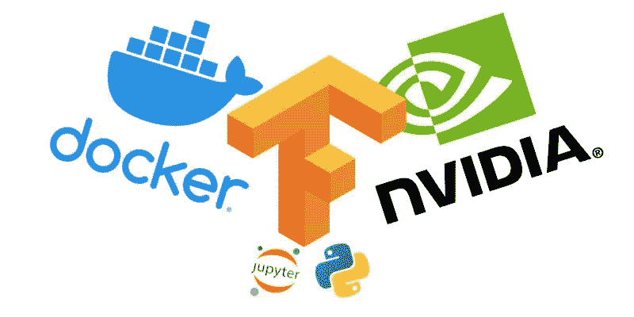

# 用 Ubuntu、NVIDIA-GPU、Docker 和 TensorFlow 搭建深度学习系统

> 原文：<https://medium.com/analytics-vidhya/setting-up-a-deep-learning-system-with-ubuntu-nvidia-gpu-docker-and-tensorflow-c1be8844e49c?source=collection_archive---------1----------------------->



我在我的 Mac book Air 上开始了我的机器学习之旅，尽管最初它出乎意料地顺利，但很快就发现 Air 喘着气，因为我开始更多地走向事物的深度学习端。所以我决定安装我自己的深度学习系统。在网上的一些帮助下，我很容易就弄清楚了硬件配置，这稍微受限于我的预算。

# 硬件配置

处理器:英特尔酷睿 i5–9400 f CPU @ 2.90 GHz×6

内存:16 GB

图形:Ge Force GTX 1660

一旦所有的硬件都启动并运行，我想我很快就会启动我的 GPU。但是我会大吃一惊的！

# 软件配置

我最初的计划是设置 Ubuntu，直接在系统上安装 NVIDIA 驱动，CuDA，Python，TensorFlow，Keras。于是我装了 Ubuntu 18.04，NVIDIA 驱动集版本 440.64，CUDA 10.2，Python 3.6，TensorFlow 2.2。所有的安装都按照各自的说明进行得很好，我能够毫无问题地运行我的模型训练。但很快我发现我的 GPU 没有启动，CPU 承担了所有的处理负载。我在网上到处寻找解决办法，我尝试了很多东西，但都无济于事。当我在网上寻找解决方案时，很明显 docker 是一个不错的选择。

## 码头工人的魔力

Docker 是一种容器化技术，可以让您在主机环境中独立运行应用程序。运行应用程序所需的所有软件包将驻留在 docker 容器中，同时它与主机系统共享硬件。这提供了许多优势，包括这样一个事实，即它为您省去运行应用程序所需的不同软件包之间的版本冲突和兼容性问题的所有相关麻烦。

Dockers 对于开发和分发复杂的应用程序特别有用，比如机器学习应用程序，对它们的依赖可能会变得非常复杂。Docker 使得将软件组件的工作组合作为镜像分发成为可能，该镜像可以作为 docker 容器独立于系统运行。

欲知更多关于 https://www.docker.com/why-docker 的细节

## 黄金之路

虽然这是适用于我的系统的配置，但这种配置应该可以在任何基于 Ubuntu 和 NVIDIA-CUDA 兼容 GPU 的系统上正常工作。

需要安装在主机系统上的关键组件是 NVIDIA 驱动程序、Docker 和 NVIDIA docker 支持。包括 CUDA、cuDNN、Python、TensorFlow 和 jupyter notebook 在内的所有其他软件都将在 docker 中运行。

**配置步骤**

1.  **安装 Ubuntu**

从 Ubuntu 官方网站下载 Ubuntu 20.04，并遵循标准安装程序。

2.**安装 Nvidia 驱动**

下载网址:[https://www.nvidia.in/Download/index.aspx?lang=en-in](https://www.nvidia.in/Download/index.aspx?lang=en-in)

选择适当的产品、操作系统和语言来搜索正确的驱动程序。下载并授予文件的执行权限，然后运行以安装。

3.**安装对接器**

参赛作品:[https://docs.docker.com/engine/install/ubuntu/](https://docs.docker.com/engine/install/ubuntu/)

**更新** `**apt**` **包索引:**

```
$ sudo apt-get update$ sudo apt-get install \
    apt-transport-https \
    ca-certificates \
    curl \
    gnupg-agent \
    software-properties-common
```

**添加 Docker 官方 GPG 键:**

```
$ curl -fsSL https://download.docker.com/linux/ubuntu/gpg | sudo apt-key add -
```

通过搜索指纹的最后 8 个字符，验证您现在拥有带有指纹`9DC8 5822 9FC7 DD38 854A E2D8 8D81 803C 0EBF CD88`的钥匙。

```
$ sudo apt-key fingerprint 0EBFCD88
```

**设置稳定库:**

```
$ sudo add-apt-repository \
   "deb [arch=amd64] https://download.docker.com/linux/ubuntu \
   $(lsb_release -cs) \
   stable"
```

## 安装 Docker 引擎:

更新`apt`包索引，安装*最新版本*的 Docker 引擎和 containerd:

```
$ sudo apt-get update
$ sudo apt-get install docker-ce docker-ce-cli containerd.io
```

4.**安装 NVIDIA Docker 支持**

为了让 NVIDIA 驱动程序在 docker 中工作，需要在主机上安装 NVIDIA Docker 支持。

**添加软件包仓库:**

```
distribution=$(. /etc/os-release;echo $ID$VERSION_ID)
curl -s -L https://nvidia.github.io/nvidia-docker/gpgkey | sudo apt key add -
curl -s -L https://nvidia.github.io/nvidia-docker/$distribution/nvidia-docker.list | sudo tee /etc/apt/sources.list.d/nvidia-docker.list
```

**更新 apt 并安装:**

```
sudo apt-get update && sudo apt-get install -y nvidia-container-toolkit
```

**重启 Docker:**

```
sudo systemctl restart docker
```

5.**下载并运行 TensorFlow docker 映像**

从[https://hub.docker.com/r/tensorflow/tensorflow/](https://hub.docker.com/r/tensorflow/tensorflow/)找到合适的 TensorFlow docker 图片并下载。

`$ sudo docker pull tensorflow/tensorflow:2.2.0-gpu-jupyter`

下载完成后，您可以使用适当的选项和参数运行映像。

`$ sudo docker run -it --rm --gpus all -v $(realpath /notebooks):/tf/notebooks -p 8888:8888 tensorflow/tensorflow:2.2.0-gpu-jupyter`

上述命令成功执行后，将启动一个 docker 容器，它可以访问主机系统的所有 GPU、主机的/notebooks 目录(充当容器的/tf/notebooks 目录)以及主机和桥接容器的 8888 端口(Jupyter notebooks 默认工作在 8888 端口)。现在只需在浏览器中打开主机 ip 即可启动笔记本。

6.**运行 Jupyter 笔记本**

**在浏览器中打开笔记本:**

在浏览器中打开 url 127.0.0.1:8888，将 jupyter 实例的令牌从终端复制粘贴到页面的“密码或令牌”输入框中，打开笔记本。

**在 GPU 上启用内存增长:**

还需要做最后一件事，以确保 TensorFlow 在模型训练期间不会耗尽 GPU 内存。这是为了在 GPU 上实现内存增长，这将阻止 TensorFlow 在初始化时分配整个 GPU 内存。

```
import tensorflow as tf
physical_devices = tf.config.list_physical_devices('GPU')
tf.config.experimental.set_memory_growth(physical_devices[0], True)
```

# 关于性能的说明

正如我前面所说，我的硬件配置是预算有限的，所以我从来没有期望它有任何令人惊讶的性能水平。我的机器花了大约 24 分钟在 food-101 数据集([https://www.kaggle.com/dansbecker/food-101](https://www.kaggle.com/dansbecker/food-101))上运行 ResNet50 网络的一个训练纪元，该数据集包含 101 种不同食物类型的 75750 幅训练图像。客观地说，同样的事情在 kaggle GPU 笔记本上需要 35 分钟。相当令人印象深刻！！！