# 设置多 GPU 机器并用 TensorFlow 深度学习模型进行测试

> 原文：<https://medium.com/analytics-vidhya/setting-up-a-multi-gpu-machine-and-testing-with-a-tensorflow-deep-learning-model-c35ad76603cf?source=collection_archive---------1----------------------->

Alexandre Debiève 在 [Unsplash](https://unsplash.com?utm_source=medium&utm_medium=referral) 上的照片

过去，我使用 GeForce GTX 1080 构建了一台 GPU 计算机，并训练了几个深度学习模型。最近有机会为一些深度学习和多 GPU 处理用例搭建了一台多 GPU 计算机。在下面的文章中，我将带您完成设置，我们将训练一个可通过 TensorFlow 的 GitHub 页面访问的 TensorFlow 模型。

**硬件规格和操作系统的建立**

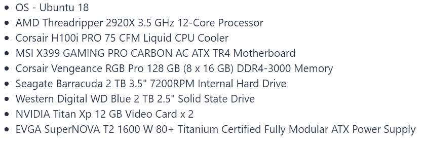

我需要 CUDA 工具包和 Nvidia 驱动程序来使用我的显卡。我最初安装 CUDA Toolkit 10.1 时遇到了一个问题，这是本文发表时的第二个最新版本，但与 TensorFlow 存在一些兼容性问题，所以我降级到了 10.0。查看哪些 CUDA 工具包和驱动程序是兼容的，哪些 TensorFlow 适用于特定的 CUDA 版本，这一点非常重要。我最终选择的司机是 435

**这里是每个 CUDA 工具包版本和 Nvidia 驱动程序版本的兼容性图表**

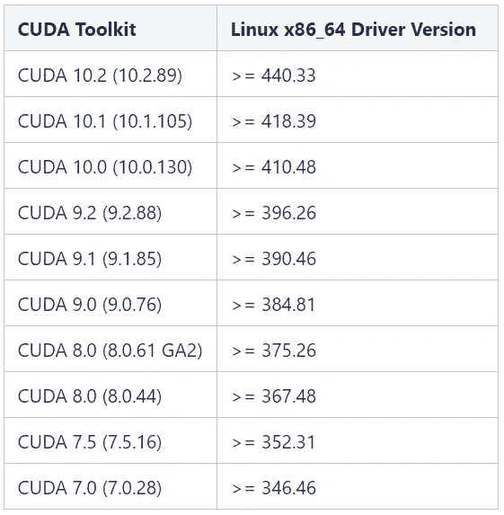

CUDA 兼容性图表

所以，既然我们已经有了 CUDA 版本和 Nvidia 驱动程序，我们需要开始安装所有的东西。从更新升级、Ubuntu 库开始，验证显卡是否可用。如果运行命令***“lspci | grep-I NVIDIA”***而看不到卡。重启电脑并再次运行该命令。

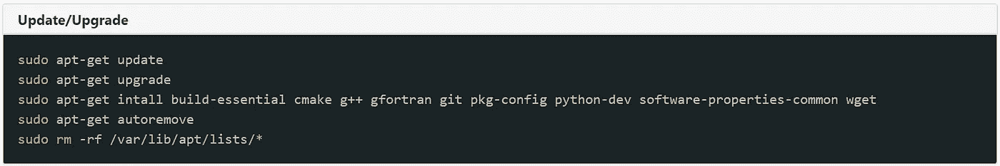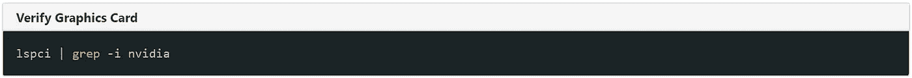

**安装显卡驱动**

在 Ubuntu 18 上安装驱动程序非常容易。通过以下路径找到更换驱动程序的位置

您将看到以下带有单选按钮的弹出框。默认是新的显示驱动程序。我把它改成 nvidia-driver-435，然后点击 ***“应用更改”*** 按钮。这大约需要 10 分钟才能完成。

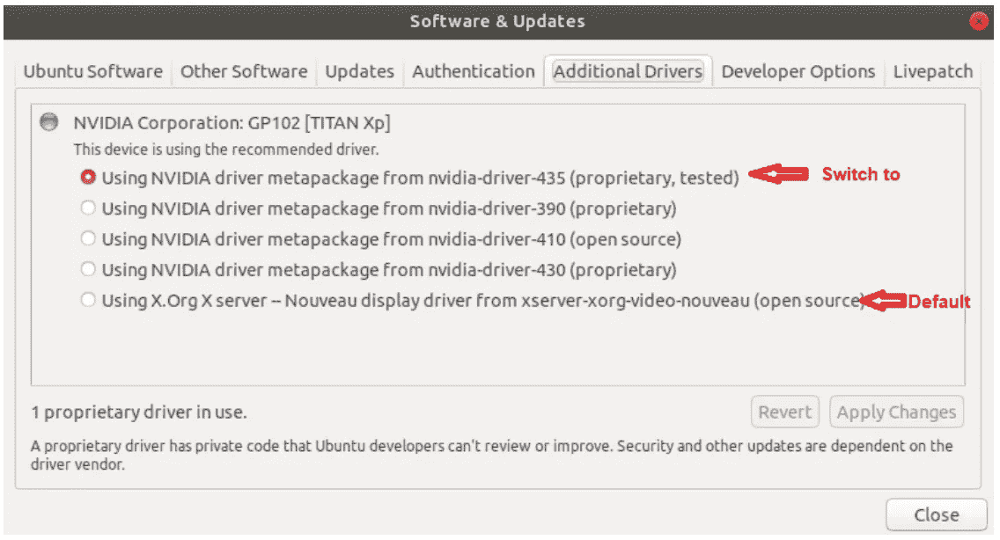

完成后，重新启动您的电脑，并输入到命令提示符，以验证驱动程序已成功安装。

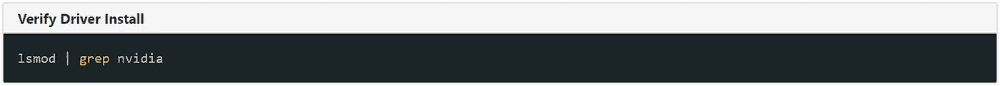

您应该会看到如下输出:

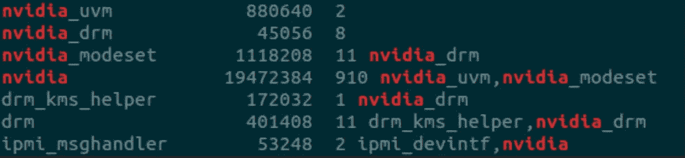

**安装 CUDA 和 libcudnn**

接下来，让我们为 CUDA 安装正确的 Nvidia 存储库，并安装 CUDA 和 libcudnn 的特定版本。这种情况下是 CUDA 10 和 libcudnn 7。

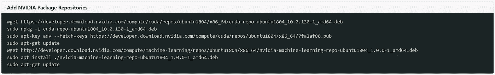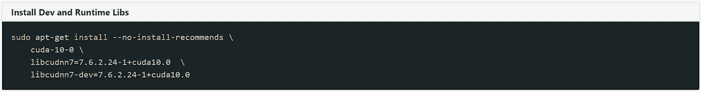

**添加环境变量的路径**

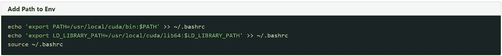

**验证 CUDA 的安装和版本**

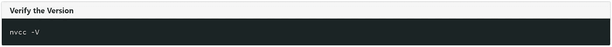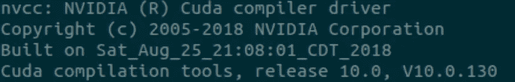

**测试 GPU 的**

现在是测试 GPU 的时候了，确保它们都得到利用。我们将使用 TensorFlow 的 GitHub 页面中的“cifar10_estimator”示例:[https://GitHub . com/tensor flow/models/tree/master/tutorials/image/cifar 10 _ estimator](https://github.com/tensorflow/models/tree/master/tutorials/image/cifar10_estimator)

此命令下载 cifar-10 数据集:

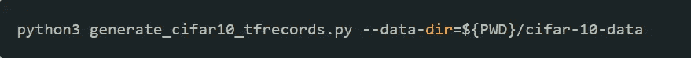

下载完数据后，您可以运行以下代码来启动 python 脚本，该脚本使用最近下载的数据集来训练和测试模型。你可以看到我在哪里用这部分***-num-GPU = 2 "***加上了 GPU 的数量。如果你有 4 个 GPU，你可以把它改成***-num-GPU = 4 "***。

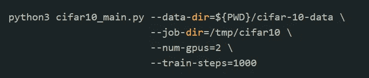

我喜欢监控 GPU 的功率、内存使用和利用率。有一个很棒的内置工具可以为你显示这个叫做***“NVIDIA-SMI”***。要持续监控，您可以使用以下命令。你会看到我选择了数字 5。这意味着它将每 5 秒刷新一次。您可以根据自己的选择更改这个数字。

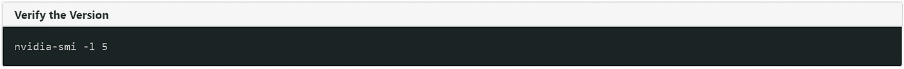

你可以看到在深度学习模型启动之前这是什么样子。瓦数、内存和利用率较低或为 0%。

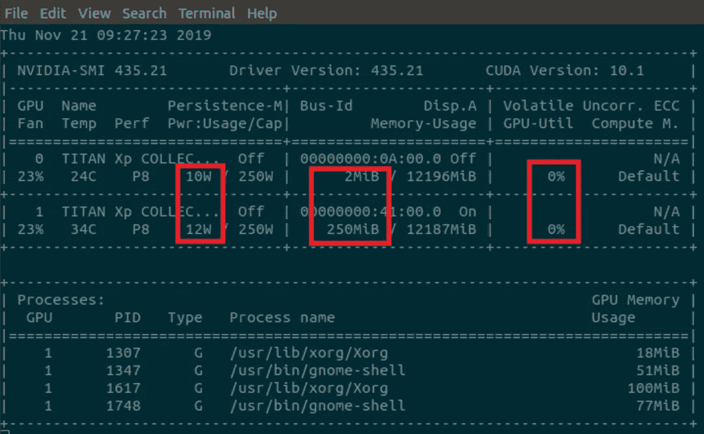

模型启动后，您可以看到所有这 3 项都有所增加。显示两个 GPU 都在致力于这个模型的训练。

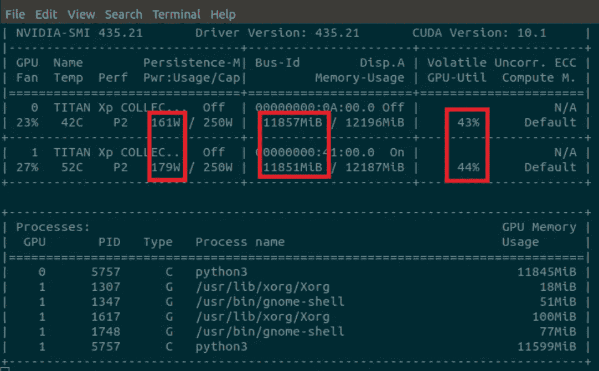

现在你知道了。还不错，只需安装和下载几个程序，你也可以在多个 GPU 上运行深度学习模型。