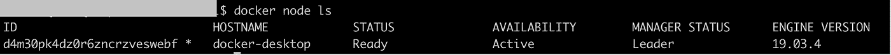
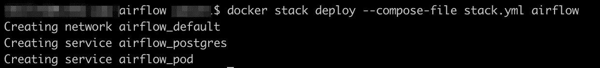
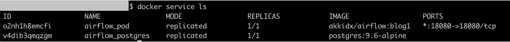
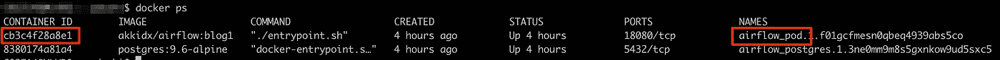
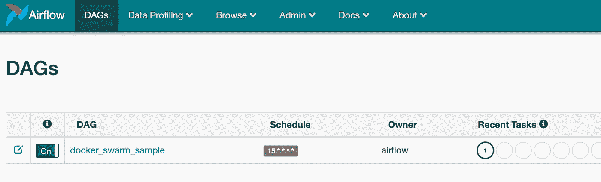
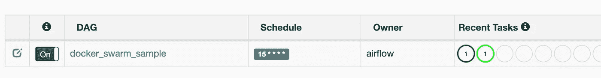
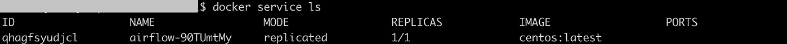

# 通过 Docker Swarm 的编排设置气流运行

> 原文：<https://medium.com/analytics-vidhya/setting-up-airflow-to-run-with-docker-swarms-orchestration-b16459cd03a2?source=collection_archive---------4----------------------->

## 设置可靠调度程序的代码片段

不久前，我在[上发布了一个故事](/analytics-vidhya/orchestrating-airflow-tasks-with-docker-swarm-69b5fb2723a7),描述了如何使用气流和容器编排层(比如 Docker Swarm)来构建弹性任务调度器。在这个故事中，我想分享启动和运行它所需要的极简代码。我们将设置气流来运行 Docker Swarm 上的任务。对于不熟悉 Airflow 或 Docker Swarm 的读者，我建议先看看[之前的故事](/analytics-vidhya/orchestrating-airflow-tasks-with-docker-swarm-69b5fb2723a7)。

**在本文结束时，您将拥有一个正在运行的 Airflow 实例，它的任务可以在任何具有足够资源的服务器上(从您的服务器池中)自动运行。如果你只是想学习设置气流并在其上运行任务，这可能仍然是一个好地方。**

# 内容

以下是我们将要遵循的步骤。安装 Docker(随 *Docker Swarm* 内置)
2。建立一个 Docker 集群
3。安装气流
4。在 Docker Swarm 上利用气流运行您的任务

所以让我们开始吧。

# 安装 Docker

这是唯一一部分，我不会说太多细节，因为它非常依赖于操作系统，并且已经在[https://docs.docker.com/install/#supported-platforms](https://docs.docker.com/install/#supported-platforms)做了很好的记录。如果你在安装时仍然发现任何问题，请随时在评论中或在 [Stackoverflow](https://stackoverflow.com/) 上问我。

一旦您的系统上运行了 Docker(或者已经运行了 Docker ),并且可以通过命令行访问它，您就可以跳到下一节。

# 建立 Docker 群集群

从您的终端，运行这个命令—***docker swarm init***

当您运行下面给出的命令时，现在应该能够看到群集中的一个节点:

> 停靠节点 ls

具有 1 个节点的 Docker 群集

## 向群集中添加更多节点(可选)

现在我们有一个 Docker Swarm 集群，其中有一个节点，足以看到实际情况，所以您可以跳过这一步。
如果您有更多的节点(服务器)并希望看到编排层(Docker Swarm)做一些“真正的”工作，您可以使用之前运行的“*init”*命令(例如对于`docker swarm join --token SWMTKN-some-long-string-token-here some-ip-or-hostname-here:2377`)得到的命令向 Docker Swarm 集群添加更多的节点。一旦您向 Swarm 集群添加更多的 workers，您将会看到命令`docker node ls`返回更多的节点。

# 安装气流

因为我们已经安装了 Docker，所以我们可以简单地运行气流的 Docker 映像，并让它启动和运行。还有一个 PostgreSQL 实例，我们将运行它来存储 Airflow 的元数据(支持许多其他数据库)。为此，请运行以下命令:

> mkdir air flow-swarm-operator-blog
> CD air flow-swarm-operator-blog/
> curl-XGET[https://gist . githubusercontent . com/akki/CD 89 c 9 caff 5 BF 19454 CDF 913 CEB 59 c 32/raw/085 F4 f 538 c 2d 48 e 01d 7789 aa 8701 f 9f 00 e 3a 0 a 81/stack . yml](https://gist.githubusercontent.com/akki/cd89c9caff5bf19454cdf913ceb59c32/raw/085f4f538c2d48e01d7789aa8701f9f00e3a0a81/stack.yml)>>stack . yml【T11

**注意:** Windows 用户可能需要将`stack.yml`文件(由上述命令创建)[中的`/var/run/docker.sock:/var/run/docker.sock`更改为`//var/run/docker.sock:/var/run/docker.sock`，如这里所述](https://stackoverflow.com/a/41005007/3061686)。

您应该看到以下输出(确保您没有看到任何错误):

部署 Docker 堆栈后的输出

简单地说，我们只是创建了一个 Docker 堆栈文件并部署了它。这将启动 2 个 Docker 服务，可以使用以下命令进行确认:

> 码头服务

如果一切正常，输出应该如下所示:

气流和邮船在码头群中运行

此外，您现在应该能够在 [http://localhost:18080](http://localhost:18080) 看到 Airflow 漂亮的用户界面。

# Docker Swarm 中的任务调度

既然我们已经设置并运行了气流，下一步就是在 Docker Swarm 上运行我们的气流任务。这里需要注意的一点是，如果你是 Docker Swarm 的新手，那么在 Swarm 中，所有的容器都作为一个“服务”运行，所以无论你计划运行什么任务(在 Airflow 中称为 DAG ),都将作为一个 Docker 服务运行。

## 使用 DockerSwarmOperator 添加 DAG

由于 Airflow 在 Docker 容器中运行，我们需要**将 DAG 文件复制到容器**中，以便将 DAG 添加到 Airflow 中。为此，只需遵循以下步骤:

1.  通过运行`curl -XGET [https://gist.githubusercontent.com/akki/4c95805ce1617e2765fecb73bb98230c/raw/cf58ec0391957d50f5ae548f7f618a58c9395156/example_dockerswarmoperator.py](https://gist.githubusercontent.com/akki/4c95805ce1617e2765fecb73bb98230c/raw/cf58ec0391957d50f5ae548f7f618a58c9395156/example_dockerswarmoperator.py) >> example_dockerswarmoperator.py`下载 DAG 文件。
2.  在您的终端中运行`docker ps`。
3.  查找容器名`airflow_pod`，并在上一步的命令中复制其容器 id(下图中高亮显示)。

气流堆栈运行时“docker ps”命令的结果

4.运行`docker cp example_dockerswarmoperator.py <copy-container-id-here>:/root/airflow/dags/example_dockerswarmoperator.py`。确保你没有错误。

5.现在再次刷新[UI](http://localhost:18080)——在几分钟内(通常为 3-5 分钟),您应该会在 UI 中看到您的 DAG。祝贺您—您的 DAG 现在正在气流中运行！👏

DAG 添加到气流中

## 确认你的任务正在 Docker Swarm 上运行

原来如此！你刚刚在 Docker Swarm 上运行了你的第一个气流任务。

但是我们怎么能确定呢？我们可以通过注意到当我们触发我们的气流任务时，一个新的 Docker 服务启动来确认这一点。以下是如何做到这一点:

1.  通过点击“触发 DAG”按钮，即“链接”部分下的“播放”按钮，通过 Airflow UI 启动(触发)您的任务。

触发 Dag 按钮

2.确认您的任务正在气流中运行，即有一个状态为“正在运行”的任务。

正在运行的任务的气流 DAG(浅绿色圆圈表示“正在运行”)

3.转到终端并运行`docker service ls` —几秒钟后，您应该能够看到一个新的服务正在运行，其名称的形式为- > `airflow-<8-character-random-string>`。(注意服务只运行 45 秒，所以之后，你的服务就会终止，从这里消失)。

气流任务作为 Docker 服务运行。

这就对了。您的任务作为 Docker 服务运行。如果您在 Docker Swarm 集群中添加了多个节点(如前面可选步骤中所述)，那么当一个节点资源不足时，您会看到它在不同的节点上运行。

此外，如果您熟悉 Airflow，您可以打印 DAG 中的一些内容，然后[检查它是否显示在 Airflow DAG 的日志中](https://stackoverflow.com/a/60584746/3061686)。

# 关闭一切

如果您想停止我们开始的一切，以下是实现这一目的的命令:

1.  移除 Docker 堆栈

> 码头堆栈 rm 气流

2.确保没有任何服务正在运行

> 码头服务

3.离开码头群集群

> 码头工人成群结队离去

4.或者，删除为此博客创建的目录

> 激光唱片..&& rm -r 气流-群体-操作员-博客

# 结论

在运行完所有这些步骤之后，你应该能够通过`DockerSwarmOperator`在 Docker Swarm 中运行你的 Airflow 作业了([参见这个](/analytics-vidhya/orchestrating-airflow-tasks-with-docker-swarm-69b5fb2723a7)以了解更多信息)。如果你有任何问题，请在下面的评论中提出来，如果可以的话，我很乐意帮忙。

对于任何好奇的人来说，这里是 akkidx/airflow 的 docker file:blog 1—[https://gist . github . com/akki/55 EAE 196 b 05377 BD 7b 3031d 9 c 16 BC 6](https://gist.github.com/akki/55eae1e196b05377bd7b3031d9c16bc6)。