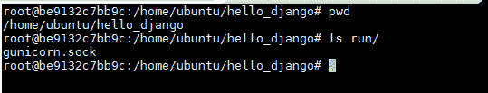

# 使用 Nginx、Gunicorn 和 Docker 设置 Django

> 原文：<https://medium.com/analytics-vidhya/setting-up-django-with-nginx-gunicorn-and-docker-352f7656f869?source=collection_archive---------0----------------------->

## 使用 Docker 的生产就绪解决方案

在我之前的[博客](/@harshvijaythakkar/dajngo-with-nginx-gunicorn-aaf8431dc9e0)中，我已经解释了如何使用 ***nginx*** 和 ***gunicorn*** 运行 Django 应用程序，这对于在 ***生产环境*** 中运行 Django 来说是完美的。

在这篇文章中，我将解释如何用 Docker 轻松管理你的 ***Django 应用程序。***

# **什么是 docker？**

Docker 是一个容器化工具，用于构建隔离的、可复制的应用环境。


架构图

你可以从我的 GitHub 库下载[源代码](https://github.com/harshvijaythakkar/harsh-django-docker)。这个项目是使用 **Python3 构建的。**

要测试这个应用程序，请转到 django-harsh/hello_django/并运行以下命令

```
python hello/manage.py 0.0.0.0:8000
```

进入浏览器，输入***<ec2-DNS:8000>***你会看到 django powered 页面。如果您正在本地运行该应用程序，请在浏览器中键入***<localhost:8000>***。确保您的 ***EC2 安全组*** 允许端口 8000 上的流量。

在生产中运行 Django 的本地服务器并不是推荐的方式，因为它只是一个测试服务器，而不是一个生产就绪的服务器。因此，在生产中运行 Django 就是运行 Gunicorn，并使用 Nginx 作为反向代理，从而为我们的应用程序提供更多的安全性。

***bin/guni corn _ start***脚本是一个 shell 脚本，在 run/目录下创建一个 socket。

# **Dockerize Django 应用程序。**

确保您的目录结构如下所示:-

```
/home/ubuntu/my_django_dir
  - hello_django (dir)
  - Dockerfile
```

在您喜欢的文本编辑器中打开 ***Dockerfile*** ，添加以下几行:

```
FROM python:3.6RUN mkdir -p /home/ubuntu/hello_django/WORKDIR /home/ubuntu/hello_django/ADD ./* /home/ubuntu/hello_django/RUN pip3 install -r /home/ubuntu/hello_django/requirements.txtVOLUME /home/ubuntu/hello_django/run/ENTRYPOINT ["/home/ubuntu/hello_django/bin/gunicorn_start"]
```

我使用的是基本图像 python3.6。这个 Dockerfile 文件是自解释的。在这里，我创建并安装 docker 卷来存储我们的 socket 文件。当容器终止时，该卷将被删除。

**让我们建立 docker 图像。**

```
docker build -t hello-django .
```

> 注意**“”上面命令中的**非常重要，它指定了 **Dockerfile** 的路径。所以确保你在**/home/Ubuntu/my _ django _ dir**

现在我们已经准备好了 Django 应用程序 Docker 映像。

**让我们运行 docker 容器。**

```
docker run --name=container hello-django
```

当您运行这个容器时，您会看到类似这样的内容


码头集装箱日志

我没有添加完整的截图，但只是我添加了一个重要的部分。您应该会看到类似上面的日志。

您将无法在浏览器中看到任何东西，因为我们在运行容器时没有暴露任何端口。我们的容器将创建一个卷，我们的 ***gunicorn_start*** 脚本将创建一个套接字并存储在该卷中。

**让我们验证我们的套接字是通过进入容器**创建的

```
docker exec -it container /bin/bash
```

现在你在 docker 容器中，你可以看到套接字被创建。



键入*从容器中出来。*

****恭喜恭喜！*** *我们已经完成了 Django 应用程序的 Dockerizing。**

# ***对接 Nginx***

*确保您的目录结构如下:*

```
*/home/ubuntu/my_nginx_dir
  - hello.conf
  - Dockerfile*
```

*我们将使用一个指向我们的套接字的配置文件，并将我们的请求转发给我们的 Django 应用程序。*

*在您最喜欢的文本编辑器中打开 ***hello.conf*** ，并添加以下几行:*

```
*upstream hello_app_server {# fail_timeout=0 means we always retry an upstream even if it failed# to return a good HTTP response (in case the Unicorn master nukes a# single worker for timing out).server unix:/home/ubuntu/hello_django/run/gunicorn.sock fail_timeout=0;}server {listen   80;server_name example.com;client_max_body_size 4G;access_log /home/ubuntu/hello_django/run/nginx-access.log;error_log /home/ubuntu/hello_django/run/nginx-error.log; location /static/ {alias   /home/ubuntu/hello_django/static/;}location /media/ {alias   /home/ubuntu/hello_django/media/;}location / {# an HTTP header important enough to have its own Wikipedia entry:#   http://en.wikipedia.org/wiki/X-Forwarded-Forproxy_set_header X-Forwarded-For $proxy_add_x_forwarded_for;# enable this if and only if you use HTTPS, this helps Rack# set the proper protocol for doing redirects:# proxy_set_header X-Forwarded-Proto https;# pass the Host: header from the client right along so redirects# can be set properly within the Rack applicationproxy_set_header Host $http_host;# we don't want nginx trying to do something clever with# redirects, we set the Host: header above already.proxy_redirect off;# set "proxy_buffering off" *only* for Rainbows! when doing# Comet/long-poll stuff.  It's also safe to set if you're# using only serving fast clients with Unicorn + nginx.# Otherwise you _want_ nginx to buffer responses to slow# clients, really.# proxy_buffering off;# Try to serve static files from nginx, no point in making an# *application* server like Unicorn/Rainbows! serve static files.if (!-f $request_filename) {proxy_pass http://hello_app_server;break;}}# Error pageserror_page 500 502 503 504 /500.html;location = /500.html {root /home/ubuntu/hello_django/static/;}}*
```

*现在，在您喜欢的文本编辑器中打开 ***Dockerfile*** 并添加以下行:*

```
*FROM nginxWORKDIR /etc/nginx/RUN rm /etc/nginx/conf.d/default.confCOPY hello.conf /etc/nginx/conf.d/EXPOSE 80*
```

*在这里，我使用 nginx 基础图像。Nginx 附带了 ***default.conf*** 文件，其中包含了 nginx 的一些基本配置。我正在删除那个文件，并将添加我们的 ***hello.conf*** 文件。*

***构建 Nginx docker 映像***

```
*docker build -t hello-nginx .*
```

****恭喜恭喜！*** *我们已经创建了两个 docker 映像，现在我们准备好为 Django 应用程序提供服务了。**

# ***让我们进行端到端测试***

*首先使用我们之前创建的 docker 映像运行我们的 Django 应用程序。*

```
*docker run --name=django-container hello-django*
```

> *请注意， ***"— name"*** 是运行 Django 容器时的重要参数，我们将使用这个名称来引用它创建的卷，并将该卷附加到我们的 nginx 容器。*

*打开新终端，运行 nginx docker 镜像。*

```
*docker run -p 80:80 --volumes-from django-container hello-nginx*
```

*这里我们将我们的 ***主机端口 80*** 与 ***容器端口 80*** 进行映射，因为 nginx 运行在 ***端口 80*** 上。不需要为 Django 容器映射端口，因为我们使用 ***套接字*** 来请求服务器。确保您的 ***EC2 安全组*** 允许端口 80 上的流量。*

*现在进入你的浏览器，输入***<ec2-DNS>***或***<localhost:80>***你会看到一个 Django 驱动的页面。*

> *请注意，我们没有公开 Django 容器端口，因此外界的人无法访问 Django 应用程序，他们必须先访问 Nginx，Nginx 会负责将请求转发给我们的应用程序，这样我们的应用程序就完全安全了。*

# *恭喜你！*

*你已经使用 Nginx 和 Gunicorn 成功运行了 Django 应用程序，guni corn 是一个使用 Docker 的 ***生产就绪服务器*** 。*

*在 [***第三部分***](/@harshvijaythakkar/setting-up-django-with-nginx-gunicorn-and-aws-ecs-e1b279c7ae8) 中，我已经解释了如何在***“AWS 弹性容器服务(ECS)”***中运行这个 Django 应用程序，它是用于运行 Docker 容器的托管服务。*

****谢谢！****