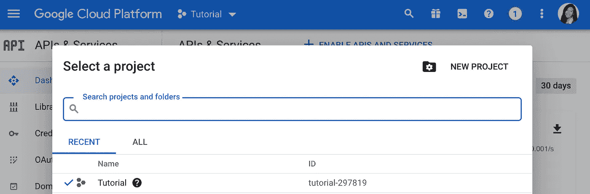
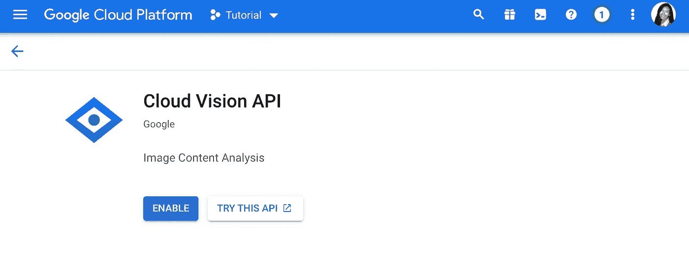
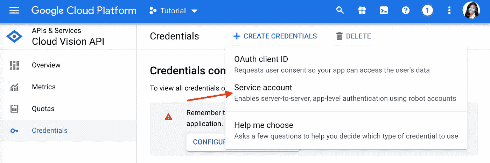
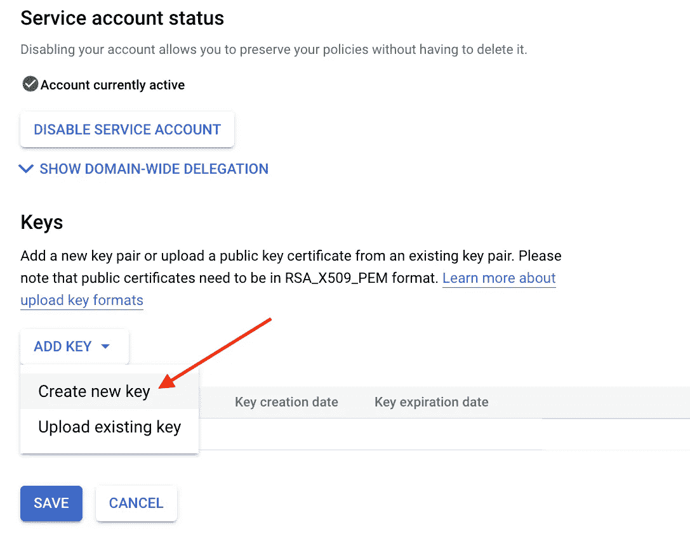
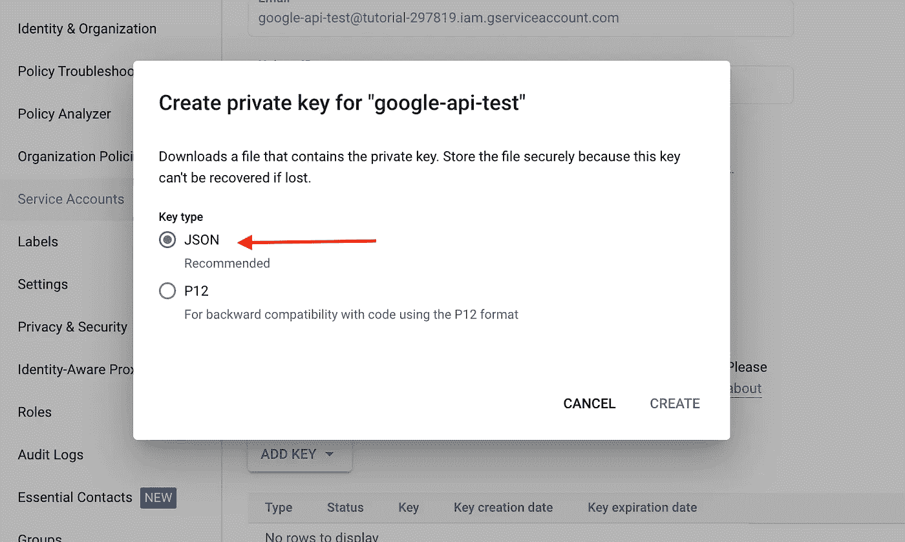
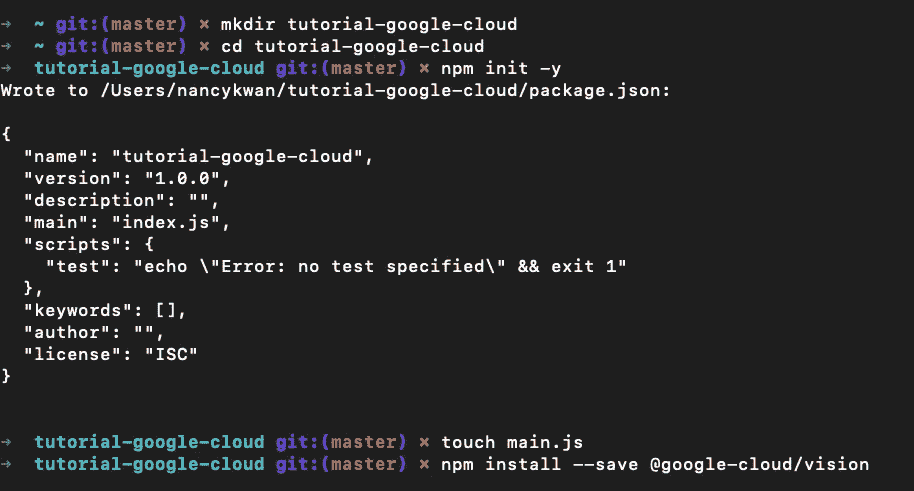
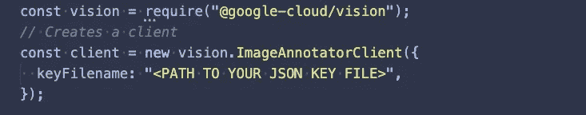
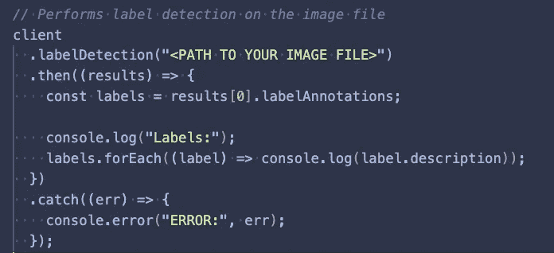
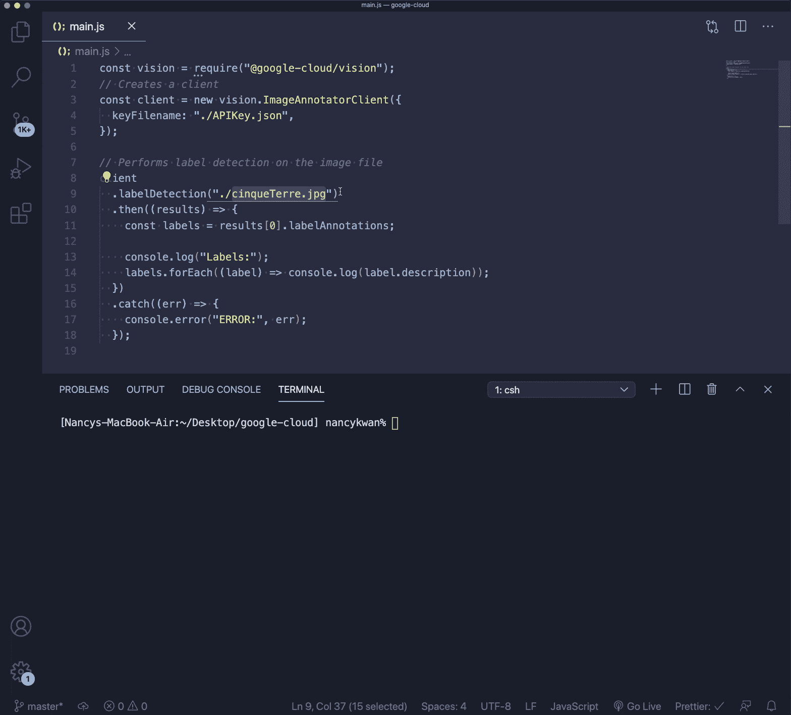

# 使用 Node.js 设置 Google Cloud Vision API

> 原文：<https://medium.com/analytics-vidhya/setting-up-google-cloud-vision-api-with-node-js-db29d1b6fbe2?source=collection_archive---------2----------------------->

大卫·特拉维斯的照片

关于设置身份验证以及如何使用 Node.js 中的 Google Cloud Vision API 构建简单应用程序的分步指南。

> 什么是 [**谷歌云视觉 API**](https://cloud.google.com/vision/) **？**

它允许开发人员轻松地将**视觉**检测功能集成到应用程序中，包括图像标记、面部和地标检测、光学字符识别(OCR)和明确内容的标记。

基本上，它让你上传一张图片并提取大量基于机器学习的信息。在这里试试****——**只需拖拽自己的图像。**

# **设置和认证**

> ***1。* *创建新的谷歌云平台项目* [***此处***](https://console.cloud.google.com/project) ***。*****

****

> ***2。启用***。****
> 
> ****3。启用谷歌云视觉 API* [***此处***](https://console.cloud.google.com/flows/enableapi?apiid=vision.googleapis.com) *。****

******

> ****4。在这里设置认证***。*****
> 
> *****5。从项目控制台生成一个 google-services.json 密钥文件。*****

********

> *****6。从下拉菜单中选择“创建新密钥”。*****

********

> *****7。确保选择了****JSON****，然后点击创建。*****
> 
> ****这将生成 json 文件，并注入到你的项目目录的根目录中。****

********

****确保选择 JSON，然后单击 CREATE****

# ****现在，让我们开始编码吧！****

*   ****在您的终端中，创建一个新项目并安装依赖项。****

********

****初始化新的 npm 项目****

*   ****将您的密钥 json 文件插入到您的根目录中。如果您愿意，可以缩短文件名。****
*   ****在我们之前创建的 **main.js** 中设置 [@google-cloud/vision](https://github.com/googleapis/nodejs-vision) 包。****

********

****设置 google cloud vision 并在 main.js 中创建一个客户端****

*   ****用您自己的密钥 json 文件路径替换 keyFilename。作为参考，我的是 ***。/APIKey.json*** ”。****
*   ****接下来，我们用名为 **labelDetection** 的方法调用客户端，设置我们想要处理和获取数据的图像。****

********

****图像文件标签检测方法****

# ****测试一下！****

********

****[杰克沃德](https://unsplash.com/@jackward?utm_source=medium&utm_medium=referral)在 [Unsplash](https://unsplash.com?utm_source=medium&utm_medium=referral) 上拍照****

*   ****选择您最喜欢的图像****
*   ****传递图像路径("。/cinqueTerre ")放入 labelDetection 并运行它****

********

*   ****瞧啊。恭喜你。运行代码给了我们预期的结果🎉****

# ****谁在使用谷歌视觉 API？****

****好吧，对你的宠物照片进行分类和识别地标是很有趣的，但是有人在生产中真正使用谷歌视觉吗？是啊！以下是一些现实生活中的例子:****

*   ****[迪士尼](https://cloud.google.com/blog/products/gcp/finding-petes-dragon-with-google-cloud-vision-api):寻宝游戏中的标签检测****
*   ****[Realtor.com](https://cloud.google.com/blog/products/gcp/announcing-google-cloud-video-intelligence-api-and-more-cloud-machine-learning-updates):视觉 API 对“待售”标牌的 OCR****
*   ****[空中客车](https://cloud.google.com/blog/products/gcp/google-cloud-machine-learning-now-open-to-all-with-new-professional-services-and-education-programs):使用机器学习来自动检测和纠正卫星图像的过程，这些图像包含瑕疵，例如云的形成****

# ****结论****

****到目前为止，我们只触及了 [@google-cloud/vision](https://github.com/googleapis/nodejs-vision) 的表面。我希望这有助于指导您完成繁琐的设置和验证阶段。现在，您已经准备好探索 Google Vision 的有趣部分了！****