# 在 Ubuntu Server 20.04 和/或 Ubuntu Desktop 20.04 上设置具有多个节点的 Hadoop 3.2.1 集群

> 原文：<https://medium.com/analytics-vidhya/setting-up-hadoop-3-2-1-d5c58338cba1?source=collection_archive---------1----------------------->

__________________________________________________________________

D *大数据让你害怕吗？您是否正在寻找一个关于 Hadoop 和分布式系统的小而快速的介绍？您可能想要通过在主/主要机器上运行命令来计算不同机器(节点)之间的 Pi 的估计值吗？别担心。在这里，我将向您展示一种快速简单的方法，根据您的喜好在 Ubuntu Server 和/或 Ubuntu Desktop 上安装 Hadoop。这当然不是第一个 Hadoop 教程，它们都是相对相同的，但是让我们试一试。*


# 这些术语是什么？他们是做什么的？快速词汇表:

**Hadoop**:*Apache Hadoop*是一组开源软件实用程序，有助于使用由许多计算机组成的网络来解决涉及大量数据和计算的问题。它为分布式系统(集群文件系统)和使用 MapReduce 处理大数据提供了一个软件框架。Hadoop 最初是为从普通硬件构建的计算机集群而设计的。此后，它也在高端硬件集群上得到了应用。Hadoop 中的所有模块都是基于一个基本假设设计的，即硬件故障是经常发生的，应该由框架自动处理。
**Yarn:***Hadoop Yarn*(2012 年推出)是一个平台，负责管理集群中的计算资源，并使用它们来调度用户的应用；
**HDFS:** *Hadoop 分布式文件系统(HDFS)* 是一个在商用机器上存储数据的分布式文件系统，提供跨集群的非常高的聚合带宽； **MapReduce:***Hadoop MapReduce*是针对大规模数据处理的 MapReduce 编程模型的实现。
**大数据:** *大数据*是一个处理方法的领域，用于分析、系统地从中提取信息，或者处理太大或太复杂而无法由传统数据处理软件处理的数据集。因此，大数据通常包括大小超过传统软件在可接受的时间和*值内处理能力的数据。* **计算机集群:***计算机集群*是一组松散或紧密连接的计算机，它们一起工作，因此在许多方面，它们可以被视为一个单一的系统。计算机集群将每个节点设置为执行相同的任务，由主节点上的软件控制和调度。 **主/从(或主次，现代呼唤递进！):***主/主要*节点只不过是主计算机或机器，它将允许您向集群中执行相同任务的每个其他节点发送命令，这些节点称为*从/从*ie。 **节点:***节点*就是我们的计算机集群中的每一台计算机或设备。它们包含数据并链接到所有其他节点。 **SSH:Secure Shell**(**SSH**)是一种加密网络协议，用于在不安全的网络上安全地运行网络服务。典型的应用程序包括远程命令行、登录和远程命令执行，但是任何网络服务都可以使用 SSH 来保护。SSH 的标准 TCP 端口是 22。 **PDSH:***pdsh*工具可以说是最流行的并行 shells 之一。它允许您仅使用 SSH 在多个节点上运行命令，因此数据传输是加密的。只有客户端节点需要安装 *ssh* ，这对于 HPC 系统来说非常典型。但是，您需要能够 *ssh* 到任何没有密码的节点(即无密码 *ssh* )。 **虚拟机:**在计算中，*虚拟机(VM)* 是一个计算机系统的仿真。虚拟机基于计算机体系结构，并提供物理计算机的功能。它们的实现可能涉及专门的硬件、软件或其组合。 **Ubuntu: Ubuntu** 是基于 Debian 的 *Linux* 发行版。它可以单独在计算机上运行，也可以在虚拟机上运行。Ubuntu 的默认桌面是 Gnome，从 17.10 版本开始。

# 我需要什么？一个非常小的购物清单的要求(包括下载链接！):

**Ubuntu Server 20.04/Ubuntu Desktop 20.04:**在本指南中，我将从使用 Ubuntu Server 20.04 开始。稍后，为了向您展示更好的可视化表示，我切换到了桌面，但这实际上并不需要，因为所有的命令和步骤在两种环境中都是完全相同的。你是使用服务器还是桌面完全取决于你，你可以使用任何你喜欢的，甚至两者都用，这真的只取决于你的需要。

**Ubuntu Server 20.04 下载链接:**[https://ubuntu.com/download/server](https://ubuntu.com/download/server)
**和/或**
**Ubuntu 桌面 20.04 下载链接:**[https://ubuntu.com/download/desktop](https://ubuntu.com/download/desktop)

**VirtualBox / VMWare:** 我将使用 VirtualBox，因为我对它最熟悉，但据我所知，大多数虚拟机软件的外观或功能都差不多，这还是取决于您，但我确实使用 VirtualBox，VMWare 是一个很好的替代产品。

**VirtualBox 的下载链接:**[https://www.virtualbox.org/wiki/Downloads](https://www.virtualbox.org/wiki/Downloads)
**或
VMWare 的下载链接:**[https://www . VMWare . com/products/workstation-player/workstation-player-evaluation . html](https://www.vmware.com/products/workstation-player/workstation-player-evaluation.html)

其他的东西，比如 Java 更新，Hadoop，和其他的都会在我们的步骤中下载，所以不需要预先下载任何东西。

# 因此，我们开始:

在这里，我假设你已经安装了 VirtualBox，并运行了一个装有你选择的 Ubuntu 的虚拟机。这真的不难，只需单击 new，为它创建一个虚拟磁盘映像，为它分配 RAM 使用量(1GB 也可以，但您可以根据您的计算机硬件来选择)和磁盘使用量(每台计算机 10GB 也可以，但我们最终将每台计算机 10GB 总共 30GB)并选择。你事先下载的 ISO 跑起来嘣！搞定了。接下来，它会问你一些简单的问题，比如用户名、密码，这是全新操作系统的常见问题。

**步骤 1:让我们的 Ubuntu 访问我们计算机的网络适配器** 非常简单，只需打开 VirtualBox，右键单击我们的虚拟机，进入“设置”,选择“网络”,将我们的适配器设置为“桥接”,选择我们计算机的适配器(大多数 PC 只有一个选项),并设置混杂模式，如果我们通过电缆连接到互联网，则允许所有和电缆连接。

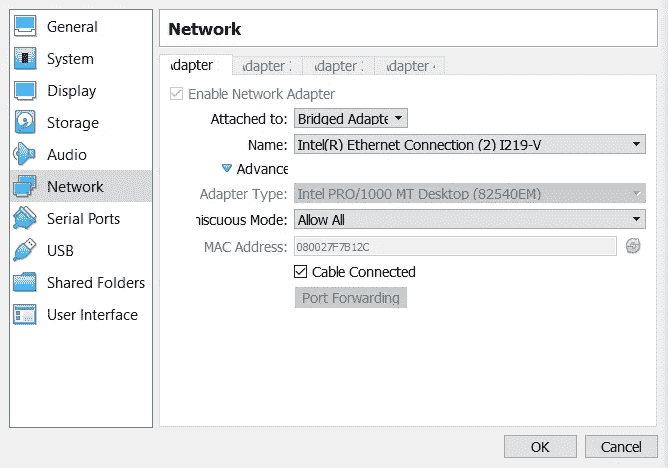

我们虚拟机的网络设置页面

**第二步:安装 SSH** 现在，当我们的 Ubuntu 正在运行时(我是从 Server 开始的，所以视觉表现相当简单和原始，但是命令对于两个版本都是一样的，记得吗？)，编写以下命令:

```
sudo apt install ssh
```


如何安装 SSH 的可视化表示。

完成后，进入下一步。

**步骤 3:安装 PDSH
与上一步相同，但我们将通过以下命令安装 PDSH，而不是 SSH:**

```
sudo apt install pdsh
```


如何安装 PDSH 的可视化表示。

**步骤 4:设置 PDSH 环境和访问权限以使用 SSH:**

首先，编写以下命令:

```
sudo nano .bashrc
```


如何访问？Bashrc 文件。

然后在文件末尾写下:

```
export PDSH_RCMD_TYPE=ssh
```

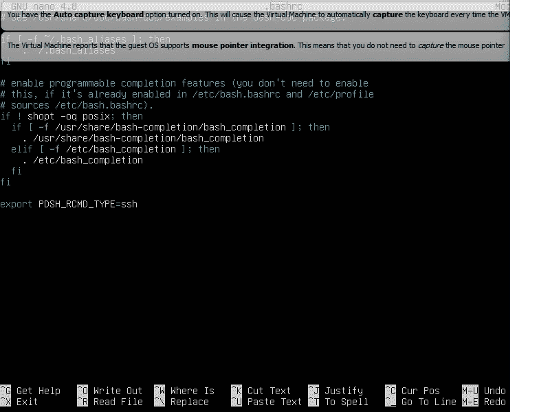

的可视化表示形式。bashrc 文件和编写的 pdsh 命令。

如果你不知道如何保存和退出，按 Control+O，然后按 Control+X，或者更简单一点，只需要按 Control+X，按照提示操作就可以了(就是两次回车)。

## 步骤 5:生成 SSH 密钥

同样，只是一个简单的命令。为了允许 SSH 访问这台机器，我们将生成我们自己的 SSH 密钥。


生成 SSH 密钥的命令的可视化表示。

这一次，我们得到了一个有趣的矩形，里面有一堆字符。这是我们自己的 SSH 密钥。请记住，每个人看起来都不一样:

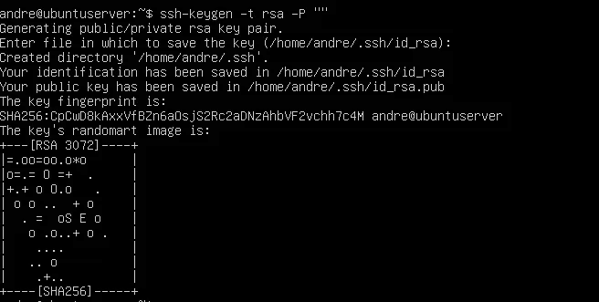

我们的 SSH 密钥和生成屏幕的可视化表示

## 步骤 6:将 SSH 密钥复制到另一个文件夹中

在这一步中，我们将把 SSH 密钥复制到另一个文件夹中。这个命令的目标是允许我们稍后访问我们的密钥，这样我们所有的机器将共享相同的 SSH 密钥和权限。
编写以下命令:

```
cat ~/.ssh/id_rsa.pub >> ~/.ssh/authorized_keys
```


如何复制我们的钥匙的可视化表示。

为了确保一切正常，让我们试着通过 SSH 访问我们自己的虚拟机，看看会显示什么，写下:

```
ssh localhost
```

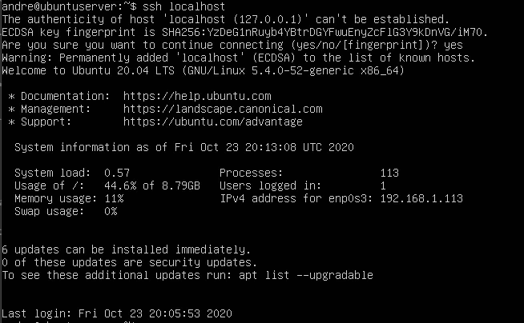

我们自己的虚拟机应该是什么样子的可视化表示

## 步骤 7:安装 Java

再说一次，超级简单。只需运行下一个命令:

```
sudo apt install openjdk-8-jdk
```


安装 Java 的命令的可视化表示

为了确保有效，请写下:

```
java -version
```

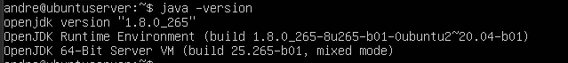

我们 Java 8 的可视化表示，这是我的版本的样子。

# 步骤 8:下载(并安装)Hadoop

现在，我们需要安装 Hadoop。请记住，这是一个相当大的下载，所以它可能需要一些时间，这取决于您的连接。在你等待的时候，喝杯热咖啡，打开一些文章，看看你的宠物，或者在社交媒体上阅读。命令是:

```
sudo wget -P ~ [https://mirrors.sonic.net/apache/hadoop/common/hadoop-3.2.1/hadoop-3.2.1.tar.gz](https://mirrors.sonic.net/apache/hadoop/common/hadoop-3.2.1/hadoop-3.2.1.tar.gz)
```

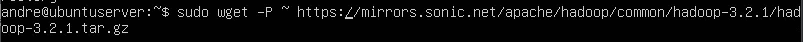

为我们下载 Hadoop 的命令的可视化表示

现在，确保提取它:

```
tar xzf hadoop-3.2.1.tar.gz
```


如何提取我们的 hadoop tar 的可视化表示。这次没有华而不实的屏幕。

接下来，我们将重命名新提取的文件夹。这只是为了使我们的生活更简单，避免每次都写数字，它真的不会改变任何事情，但我强烈建议在我们运行其他命令时避免问题。

```
mv hadoop-3.2.1 hadoop
```

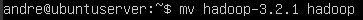

如何重命名我们的新文件夹的可视化表示

# 步骤 9:设置我们全新的 Hadoop

我能说什么呢？只是更简单的命令。我们将首先使用 nano 访问 Hadoop 环境文件。万一有什么问题，和须藤一起跑。

```
nano ~/hadoop/etc/hadoop/hadoop-env.sh
```

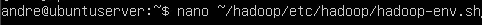

如何访问 Hadoop 环境文件的可视化表示

我们的文件将看起来像下一个图像。在下一个命令行中添加。为了避免任何复杂性，您可以将它放在注释的#JAVA_HOME 或我写它的地方，但是由于所有的行都被注释了，所以只要它在这个区域附近，就不会有太大的区别。

```
export JAVA_HOME=/usr/lib/jvm/java-8-openjdk-amd64/
```

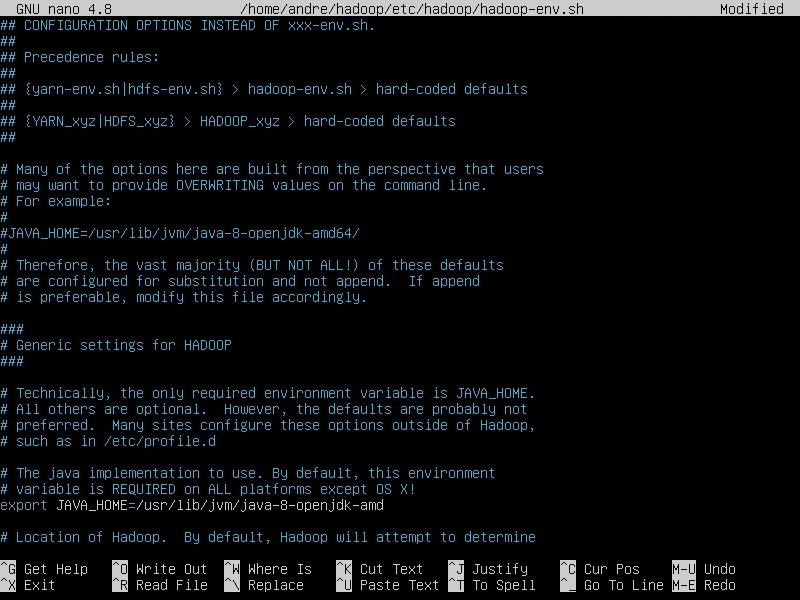

更改后 Hadoop 环境文件的可视化表示

## 步骤 10:将 Hadoop 移动到本地用户目录

现在，是我们移动文件夹的时候了。顺便说一下，这就是我们之前重命名该文件夹的原因。当我们不需要写下数字和特殊字符时，事情就简单多了。使用 sudo 运行以避免问题。

```
sudo mv hadoop /usr/local/hadoop
```


我们将如何移动文件夹的可视化表示。

# 步骤 11:设置 Hadoop 路径和 Java Home 路径

现在，我们将需要设置 Hadoop 路径(这是一个很长的行，所以如果你使用桌面版本，我希望你已经在虚拟机上的 Firefox 中打开了教程，以便你可以复制粘贴所有这些命令！).首先，访问我们的环境文件:

```
sudo nano /etc/environment
```

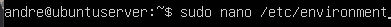

如何访问环境文件的可视化表示。

然后写长行，确保用回车符分隔它们:

```
PATH="/usr/local/sbin:/usr/local/bin:/usr/sbin:/usr/bin:/sbin:/bin:/usr/games:/usr/local/games:/usr/local/hadoop/bin:/usr/local/hadoop/sbin"
JAVA_HOME="/usr/lib/jvm/java-8-openjdk-amd64/jre"
```

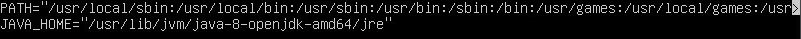

我们的文件应该是什么样子的可视化表示。

# 步骤 12:创建 Hadoop 用户

我们需要在我们的虚拟机上创建一个用户，该用户稍后将被其他节点用于 Hadoop。如果有任何问题，请和 sudo 一起运行，就像您应该做的那样:

```
sudo adduser hadoopuser
```


如何添加新用户的可视化表示

只需一次一个地完成下面的提示。具体的信息提示完全是可选的，因此您可以将其留空。

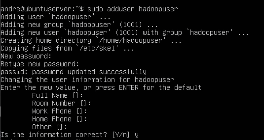

新用户注册的可视化表示

现在，我们需要给我们的新用户一些权限，sudo 以及对 hadoop 文件夹的 root 访问权限:

```
sudo usermod -aG hadoopuser hadoopuser
sudo chown hadoopuser:root -R /usr/local/hadoop/
sudo chmod g+rwx -R /usr/local/hadoop/
sudo adduser hadoopuser sudo
```

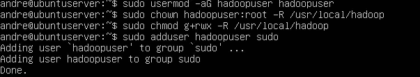

如何给我们的新用户一堆权限的可视化表示。

# 步骤 12:检查我们的 IP 地址并记下主机

现在，我们应该检查我们机器的 IP 地址，并把它写在记事本或纸上。如果您已经为我们的每台机器计划了 IP，您可以完全完成这一步。如果您事先没有准备好 IPs，您将需要稍后为每个克隆的机器重新访问这一步骤。不管怎样，事情是这样的:

```
ip addr
```


如何检查 ip 地址的可视化表示。

我们需要在主机文件中记下 IP 地址。

```
sudo nano /etc/hosts
```


如何访问主机文件的可视化表示。

在 hosts 文件中，添加我们机器的 IP 地址，然后添加主机名。
添加之前的 IP，然后添加主机名 hadoop-master。稍后，您将对每台机器重复这一步骤。
在我的例子中，我已经知道了我要给的所有 IP 和主机名，所以我只需填写。
请记住，根据你的网络，每个人的 IP 都会改变，所以不要复制 IP，使用你自己的 IP！

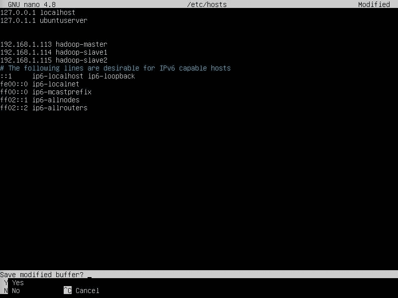

完全填充的主机文件的可视化表示

# 步骤 13:克隆我们的主/主要机器来创建从/次要机器

我们需要从属/辅助节点。为此，我们将克隆我们的主节点/主要节点，这样我们就不需要重新做任何事情。每个克隆可能需要一段时间才能完成，所以赶紧吃点零食或喝点饮料吧。
这个过程很简单，只需右键单击我们的机器，然后单击“克隆”。

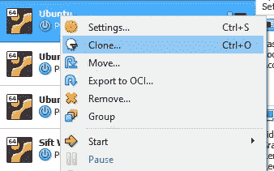

如何访问克隆页面的可视化表示

填入你喜欢的任何名字。为了简单起见，我只将下一台机器标记为 Slave1 和 Slave2。
**确保选择为所有网络适配器生成新的 MAC 地址。**

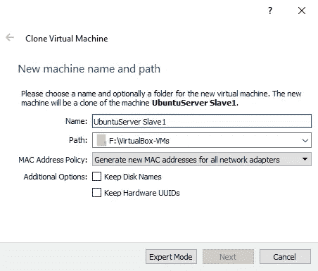

克隆页面的可视化表示。

选择完整克隆:

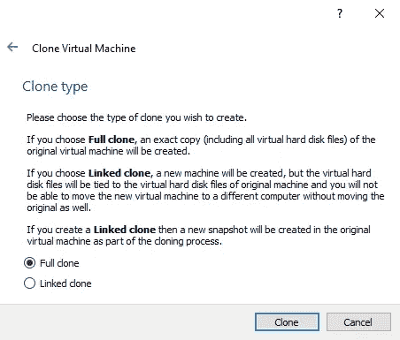

克隆类型页面的可视化表示

嘣！完成了，我们有了第一个克隆人！**现在只需重复同样的步骤来制作一个 Slave2。**

**一旦准备好，你就可以在每台机器上完成第 12 步，这非常重要。**

# 步骤 14:更改每台机器的主机名

相当容易和快速的步骤。**打开我们制作的每个节点**(主节点/主要节点和从节点/次要节点)并写入:

```
sudo nano /etc/hostname
```


如何访问主机名文件的直观表示

对于 master/primary，在文件中写入(注意:您可以用您想要的任何名称调用所有这些机器，但是您需要更正 hosts 文件，但是为了避免问题，让它保持简单):

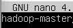

主节点主机名文件的可视化表示

在 Slave1:

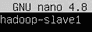

第一个从节点的主机名文件的可视化表示

在从属服务器 2 上:


第二个节点的主机名文件的可视化表示

记住控制+X 我们改变的每个文件。
现在，重启所有机器，这样配置就可以更改了。

```
sudo reboot
```

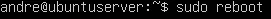

如何重启 Ubuntu 机器的可视化表示

# 步骤 15:为 Hadoopuser 创建新的 SSH 密钥

在 hosts 文件上标识和配置了我们所有的机器，并且配置了我们的新用户之后，我们需要为它创建一个 SSH 密钥。首先换成用户:

```
su - hadoopuser
```


如何变成另一个用户的可视化表示

您还记得 SSH 密钥生成命令吗？这是:

```
ssh-keygen -t rsa
```


如何生成 SSH 密钥的可视化表示

# 步骤 16:与我们的其他机器共享密钥

我们需要将主/主节点中的 hadoopuser SSH 密钥复制(共享)到所有其他节点，以便它们使用相同的密钥，这样它们就不需要密码，但这仍然是一种安全的方式。毕竟，你需要访问所有的机器并共享密钥。命令如下:

```
ssh-copy-id hadoopuser@hadoop-master
```

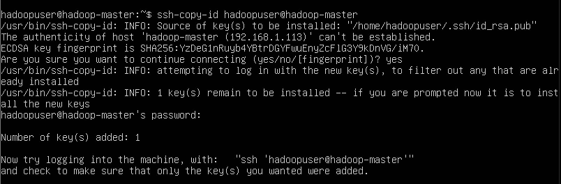

如何在主节点上复制 SSH 密钥的可视化表示

```
ssh-copy-id hadoopuser@hadoop-slave1
```

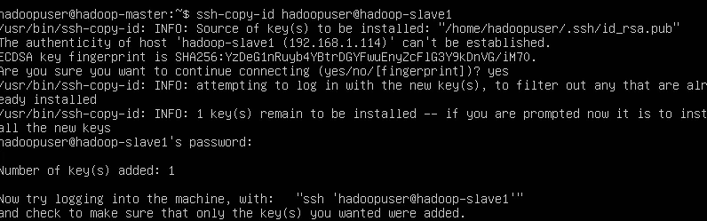

如何在第一个从节点上复制 SSH 密钥的直观表示

```
ssh-copy-id hadoopuser@hadoop-slave2
```

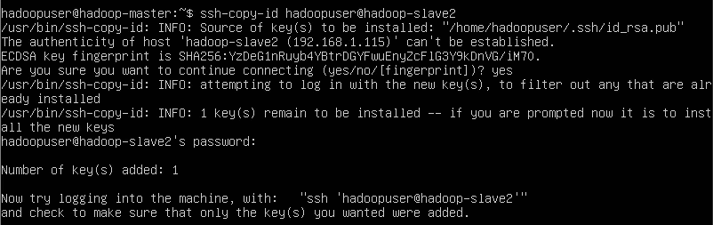

如何在第二个从属节点上复制 SSH 密钥的直观表示

# 步骤 17:配置 Hadoop 端口(仅限主/主)

这一步只能在主/主节点上完成。我们需要配置 Hadoop 端口并编写更多的配置文件。命令如下:

```
sudo nano /usr/local/hadoop/etc/hadoop/core-site.xml
```

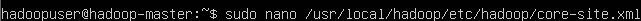

如何访问 hadoop 核心站点配置文件的可视化表示。

然后，在文件的配置段中，写入:

```
<property>
<name>fs.defaultFS</name>
<value>hdfs://hadoop-master:9000</value>
</property>
```

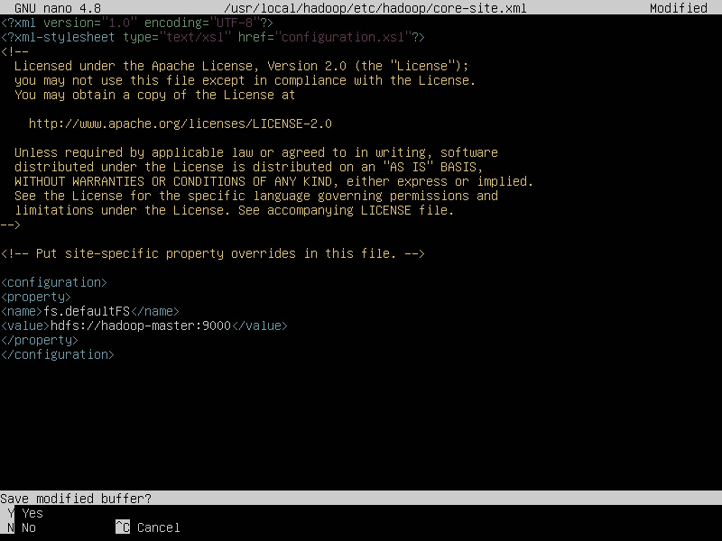

核心站点文件外观的可视化表示。

# 步骤 18:配置 HDFS(仅主/主)

这一次我们将只在主节点上配置 HDFS，**！**的
命令是:

```
sudo nano /usr/local/hadoop/etc/hadoop/hdfs-site.xml
```

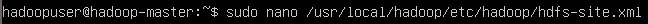

hdfs 站点文件命令的可视化表示

同样，在配置段的文件中，写入:

```
<property>
<name>dfs.namenode.name.dir</name><value>/usr/local/hadoop/data/nameNode</value>
</property>
<property>
<name>dfs.datanode.data.dir</name><value>/usr/local/hadoop/data/dataNode</value>
</property>
<property>
<name>dfs.replication</name>
<value>2</value>
</property>
```

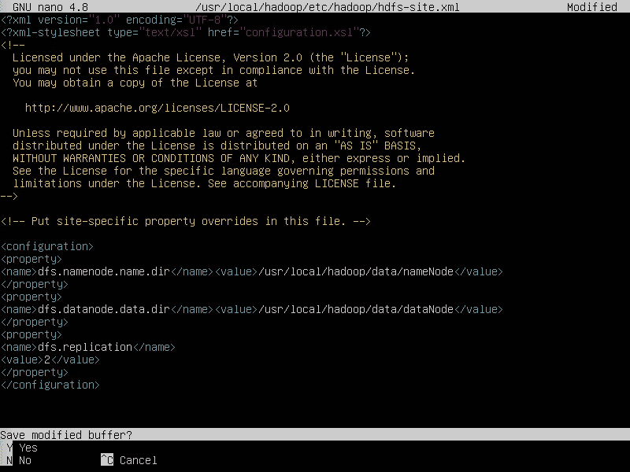

HDFS 文件的可视化表示

# 步骤 19:标记辅助节点(仅主节点)

让我们标记我们的工作(辅助/从属)节点，以便 Hadoop 知道让谁工作。命令是:

```
sudo nano /usr/local/hadoop/etc/hadoop/workers
```


如何访问工人文件的可视化表示。

在文件中，写入我们的从属/辅助节点的名称。由于我们只有两个，所以只需要写两个名字。

```
hadoop-slave1
hadoop-slave2
```

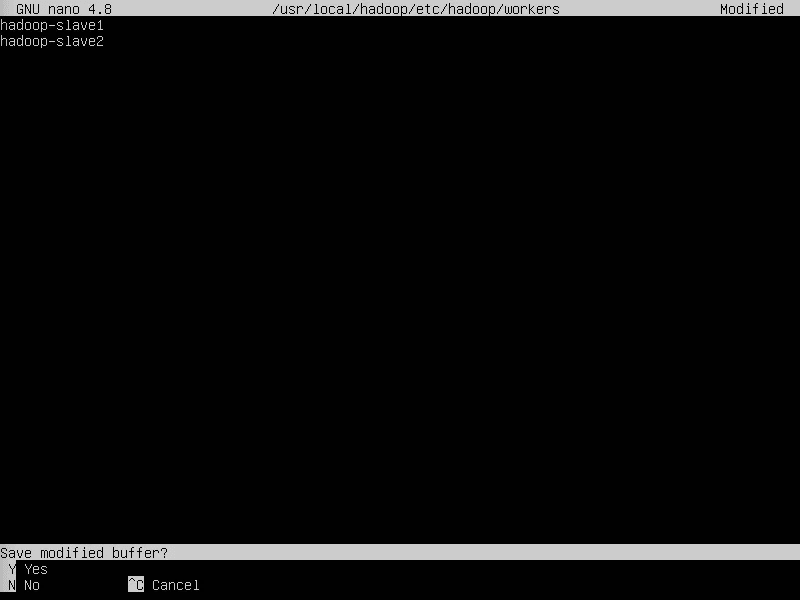

工人文件外观的可视化表示。

# 步骤 20:将文件从主服务器/主服务器复制到从服务器/辅助服务器

很简单的一步。只需将整个子目录复制到其他机器上，它们需要运行。我们不需要密码或任何东西，因为它们使用相同的 SSH 密钥，记得吗？

```
scp /usr/local/hadoop/etc/hadoop/* hadoop-slave1:/usr/local/hadoop/etc/hadoop/
```

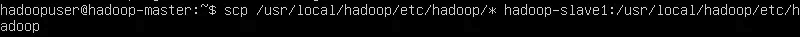

将文件复制到第一台从属/辅助机器的命令的可视化表示。这幅画的结尾少了一个/

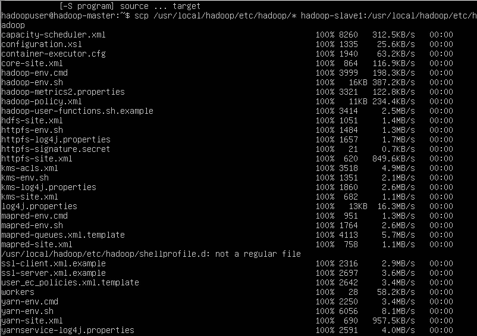

远程拷贝过程的可视化表示。

```
scp /usr/local/hadoop/etc/hadoop/* hadoop-slave2:/usr/local/hadoop/etc/hadoop/
```

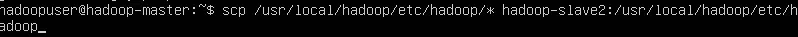

将文件复制到第二台从属/辅助机器的命令的可视化表示。这幅画的结尾少了一个/

# 步骤 21:保存配置并格式化/启动 HDFS(仅主/主)

让我们保存我们在主机上所做的一切。命令:

```
source /etc/environment
```

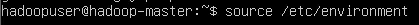

如何保存环境文件的可视化表示。

现在，格式化 HDFS 系统:

```
hdfs namenode -format
```

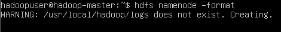

如何格式化 HDFS 的可视化表示。

它看起来会像这样:

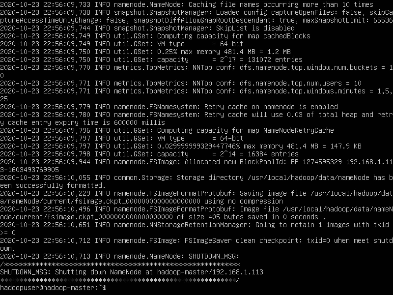

HDFS 格式的可视化表示。

现在，启动 hdfs:

```
start-dfs.sh
```


如何启动 HDFS 系统的可视化表示。

如果您在这里遇到了问题，请查看本文底部的故障排除部分。有一些解决方案可能会有所帮助，但如果您确实需要进行故障诊断，请确保保留这些机器的备份(其他克隆)。

要确保一切都在运行，请编写:

```
jps
```

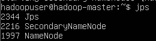

主机上 jps 的可视化表示。

在辅助/从属节点机器上，您也可以运行 jps。看起来差不多，但是只有 jps 和 datanode 会出现。

**注意:**在这一点上，为了视觉清晰起见，我确实从 Ubuntu 服务器换成了 Ubuntu 桌面。没有必要这样做，但我想指出的是，您可以从机器内部访问以下步骤(只要有一个可以运行浏览器的图形环境。否则，您可以通过桌面浏览器访问以下步骤。
不管 Ubuntu 的版本是什么，完成的步骤和之前的完全一样。如果一切顺利，没有什么不同。

# 步骤 22:通过管理站点工具访问节点

**对于 Ubuntu 服务器版本:您需要通过桌面上的浏览器或同一网络上具有可视界面或浏览器的机器来访问主/主要机床。您可以通过在端口后插入主/主 IP 来访问该工具。在我的例子中，它将是 192.168.1.113:9870。用您的主/主要 IP 替换 IP。**

**对于 Ubuntu 桌面版:你只需要在你的主/主 Ubuntu 桌面虚拟机上的浏览器上做 hadoop-master:9870 即可。这是我为了你的缘故想通过交换版本使它更容易理解和使用，但是你根本不需要这样做。**

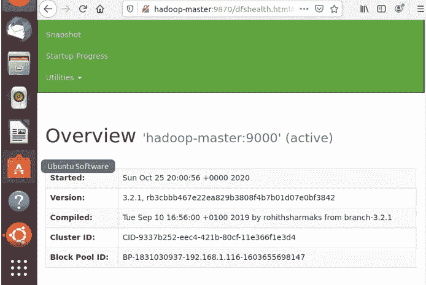

Hadoop 管理工具的可视化表示

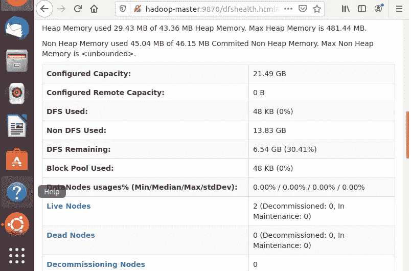

Hadoop 管理工具的可视化表示

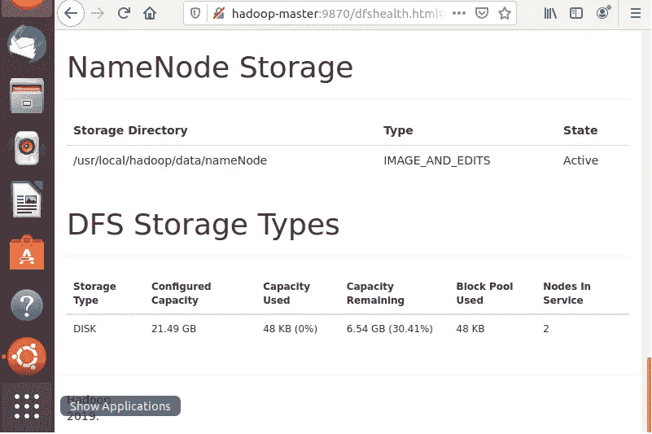

Hadoop 管理工具的可视化表示。

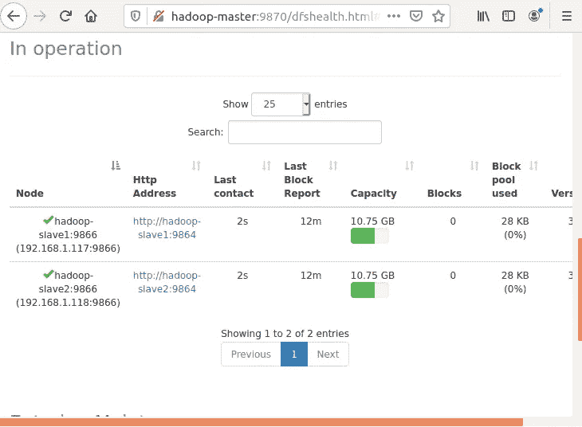

Hadoop 管理工具的可视化表示。

慢慢浏览所有页面。这里有很多工具和选项可供您使用。有你需要的一切的图表和视觉帮助。

# 步骤 23:导出路径和文件(仅主/主)

导出主服务器/主服务器上的所有路径和文件。这很简单，但是需要编写一些命令:

```
export HADOOP_HOME="/usr/local/hadoop"
export HADOOP_COMMON_HOME=$HADOOP_HOME
export HADOOP_CONF_DIR=$HADOOP_HOME/etc/hadoop
export HADOOP_HDFS_HOME=$HADOOP_HOME
export HADOOP_MAPRED_HOME=$HADOOP_HOME
export HADOOP_YARN_HOME=$HADOOP_HOME
```

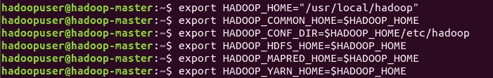

如何导出这些路径和文件的可视化表示

# 步骤 24:配置纱线工具和文件(仅限从属/辅助)

我们已经接近终点了，只需轻轻一推。让我们只在从属/辅助节点上配置 Yarn 工具和文件。一定要对所有人都这样做。如果有任何错误，请尝试用 hadoopuser 来代替。

```
sudo nano /usr/local/hadoop/etc/hadoop/yarn-site.xml
```


如何在第一个从属/辅助节点上访问纱线站点的直观表示。


如何在第二个从属/辅助节点上访问纱线站点的直观表示。

然后在配置段中写入:

```
<property>
<name>yarn.resourcemanager.hostname</name>
<value>hadoop-master</value>
</property>
```

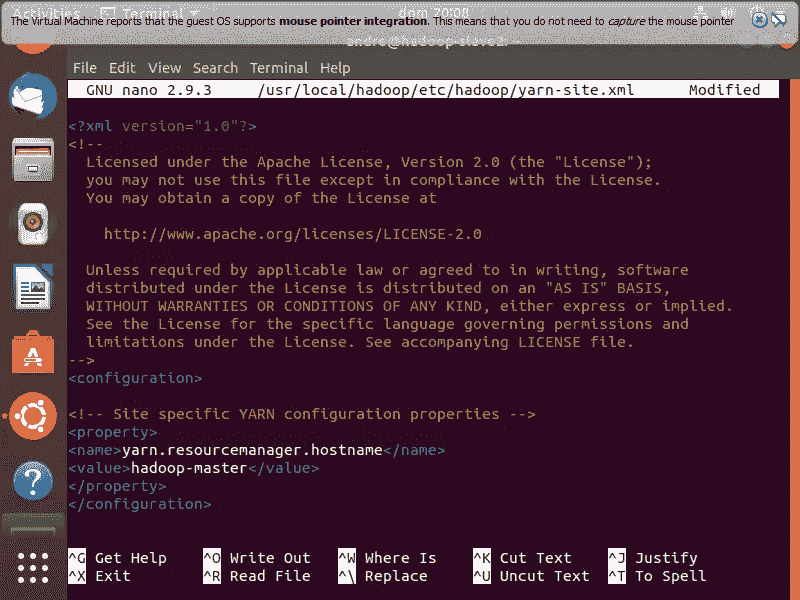

你的纱线站点文件应该是什么样子的可视化表示。

# 第 25 步:开始纱线(仅主纱线)

真的很直白，就写:

```
start-yarn.sh
```

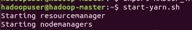

如何使用成功提示启动纱线服务的可视化表示。

如果一切正常，你可以通过下面的步骤来检查它是否正常工作。出于某种原因，我的虚拟机的分辨率有点搞砸了视觉格式，但没有区别。我相信你的会更好看！

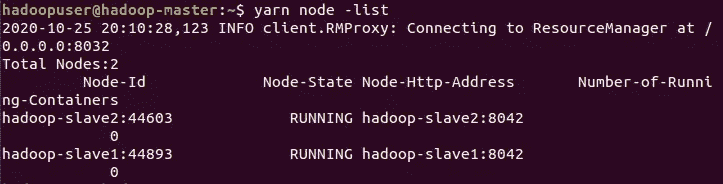

纱线节点列表的可视化表示。

现在，如果您想访问纱线服务管理工具，它与步骤 22 相同，但使用端口 8088。我还是要提醒你怎么做:
**对于 Ubuntu 服务器版本:通过你的实际桌面或同一网络上的设备访问浏览器，然后写下带有端口 8088 的主/主要 IP 地址。我的例子:192.168.1.113:8088。换到你的 IP。
对于 Ubuntu 桌面版本:你可以在你的主/主要 Ubuntu 桌面虚拟机上的浏览器上运行 hadoop-master:8088。**

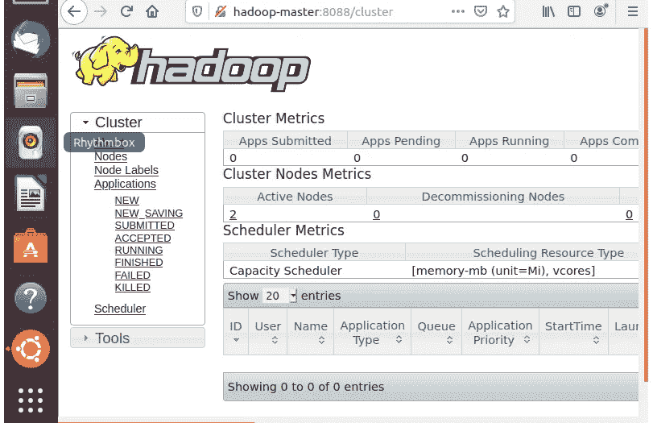

通过 Hadoop 的纱线管理工具的可视化表示。

# 第 26 步:最终测试和确认(仅主/主)

为了再次确认是否一切正常，并完成我们所有的功能，让我们从主机向所有机器发送一个命令，并检查 Pi 的估计值。它将显示各种计算和连接命令，这将需要几秒钟(或更长时间，取决于您的连接和机器)。
在你的 hadoop-master 上写 hadoopuser:

```
yarn jar /usr/local/hadoop/share/hadoop/mapreduce/hadoop-mapreduce-examples-3.2.1.jar pi 16 1000
```

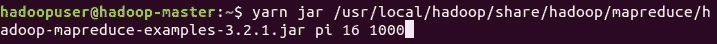

如何让你的其他节点计算圆周率的可视化表示。

这是我们估计的圆周率值！一切正常，万岁！！


计算后 Pi 估计值的直观表示

**你已经完成了！希望您喜欢阅读，并且您不必阅读故障排除部分！**

# **故障排除:**

如果有些东西不工作…我有这个部分进行少量的故障排除。我确实在 Ubuntu Server 和 Ubuntu Desktop 中遇到了不同的错误。我把下面的部分作为完全可选的，希望你做的所有步骤都完美地工作。如果没有，也许接下来的命令会起作用。

我发现大多数问题都围绕着 PDSH 以及它如何处理与 HDFS 的关系。

确保使用 sudo 运行每个主要命令。尤其是那些访问根目录、将文件复制到其他机器以及通常处理可能需要 sudo root 访问的事情的应用程序。

**注意所有的/，间隔或者我们正在对哪个用户运行命令。有时，前一个命令可能要求您更改用户，而您不记得切换回下一个需要的用户。**

**保持事情简单，避免事情复杂化，远离指南。用你自己的名字、IP、不同的 linux 发行版来学习东西是好的，也是值得的，但是这可能会增加意想不到的困难。**

**我建议谷歌一下你的具体问题，看看 StackOverflow 和帮助论坛。我将只展示我不得不做的小故障排除。**

**如果您在启动 HDFS 系统时遇到错误，请写下:**

```
echo "ssh" | sudo tee /etc/pdsh/rcmd_default ssh
```

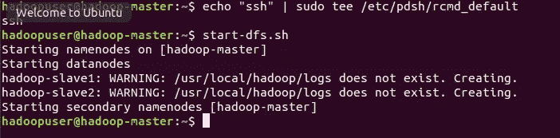

**如果你想试着去掉 PDSH，然后启动 HDFS(让 SSH 更快、更有价值真的很重要，但我已经读到过，它并不真的需要让一切都工作，所以在最后一种情况下尝试一下):**

```
sudp apt-get remove pdsh
```


**这就是我遇到的一切。我个人在不同的环境下尝试了这个项目大约 4 次，所以有一些尝试和错误，所以一定要保留备份。希望你不需要这么做。希望你喜欢！**