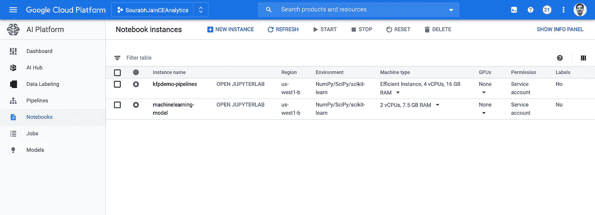
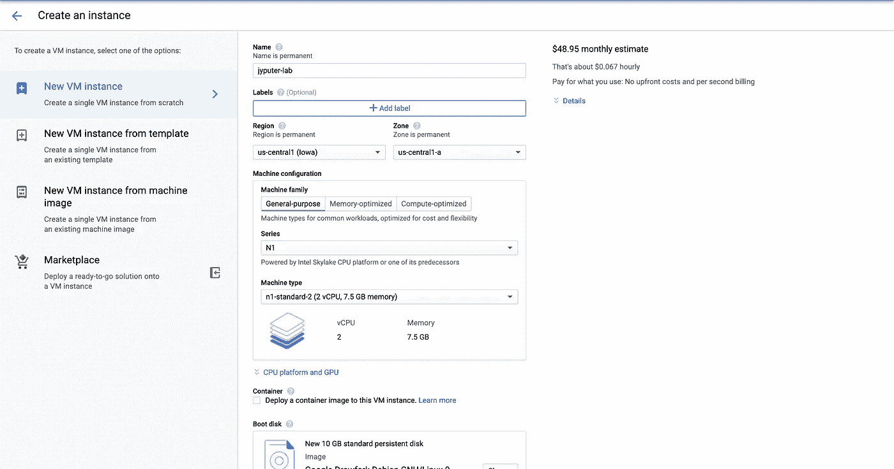
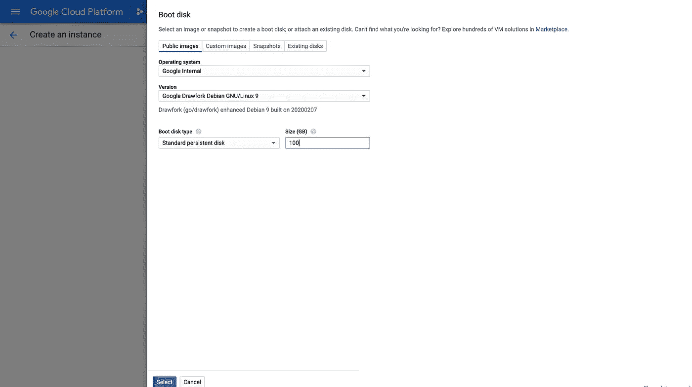
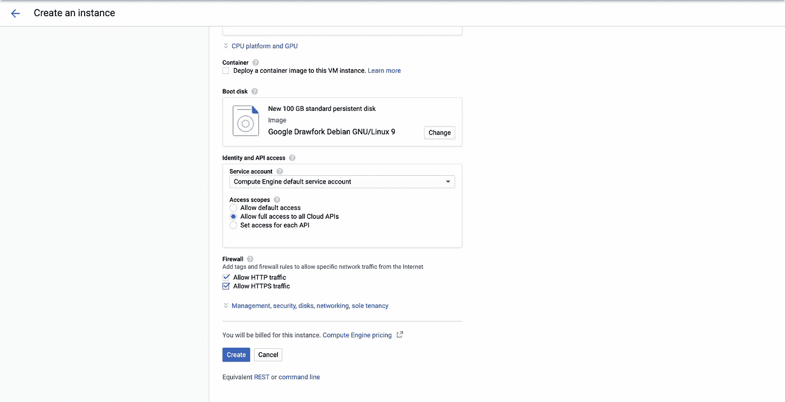
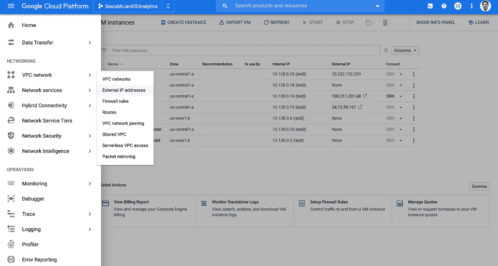
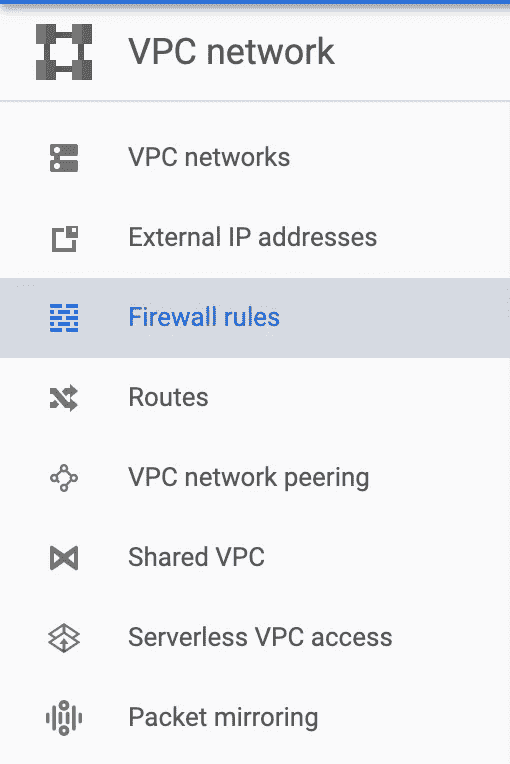
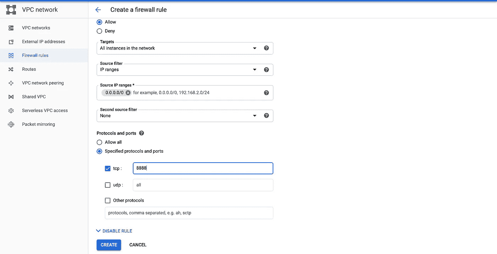
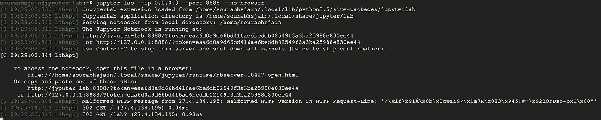
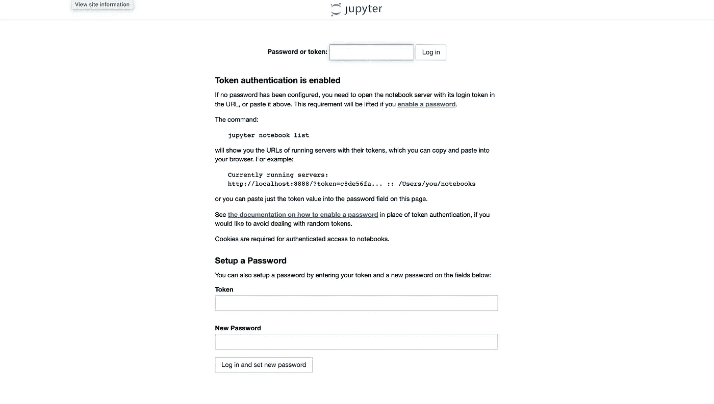
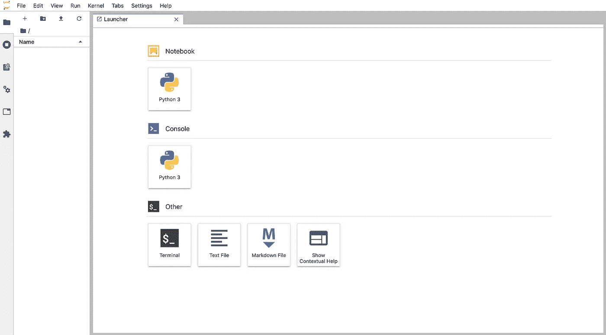

# 在 Google 云平台上建立 Jupyter 实验室实例

> 原文：<https://medium.com/analytics-vidhya/setting-up-jupyter-lab-instance-on-google-cloud-platform-3a7acaa732b7?source=collection_archive---------1----------------------->


朱皮特

谷歌云平台通过谷歌云的人工智能平台访问 Jupyter 实验室实例非常简单。



谷歌云 AI 平台下的笔记本

但是，目前 Jupyter Lab 实例并不适用于所有地区。到目前为止，在撰写本文时，无法为孟买地区(亚洲-南方 1)创建实例，这导致了挑战，因为需要分析的数据位于孟买地区(亚洲-南方 1)。因此，我们有两个选择，即要么在附近区域创建笔记本电脑并承担出口成本，要么在我们想要的区域创建普通虚拟机实例并在其上安装 Jupyter lab。我们今天将探讨第二种方法。

转到谷歌云平台[https://console.cloud.google.com/](https://console.cloud.google.com/)并访问 Compute - >计算引擎。


创建虚拟机实例

单击“创建实例”创建一个新的虚拟机实例。这将是我们部署 jupyter 实验室的实例。并非所有地区都有 GPU。因此，如果您计划立即或在不久的将来使用 GPU，请确保选择适当的地区和区域。提供适当的名称、地区、区域和机器类型。



提供虚拟机详细信息

将引导磁盘大小增加到 100GB。



启动盘详细信息

将访问范围设置为“允许对所有云 API 的完全访问”，并启用“允许 HTTP 流量”和“允许 HTTPS 流量”。提供所需的详细信息后，单击“Create”创建实例。



虚拟机实例详细信息

转到网络-> VPC 网络->外部 IP 地址



外部 IP 地址

转到实例，将类型从“Ephimeral”更改为“Static”。提供一个合适的名称，然后点击“预订”。


将类型更改为静态

单击左侧菜单中的防火墙规则。



防火墙规则

点击“创建防火墙规则”。

提供适当的名称。将目标设置为“网络中的所有实例”，将源过滤器设置为“IP 范围”，将源 IP 范围设置为“0.0.0.0/0”。启用 tcp 复选框，并将值设置为 8888。点击创建。



创建防火墙规则

返回主页->计算引擎->虚拟机实例。选择我们的虚拟机实例，并单击 SSH 以连接到该实例。


使用 SSH 连接

连接到实例后，执行下面的命令集。

```
sudo apt update
sudo apt upgrade **#Provide Y/yes as input when prompted.**
sudo apt install python3-pipsudo pip3 install jupyterlab
exit
```

这将在您的机器上安装 jupyterlab。通过 SSH 重新连接到机器，并执行下面的命令集。

```
sudo jupyter serverextension enable --py jupyterlab --sys-prefix
jupyter lab --ip 0.0.0.0 --port 8888 --no-browser
```

该服务将启动，您将看到如下输出。请记下这个令牌，因为我们下一步需要它。



正在启动服务

现在打开网页浏览器，输入网址 http:// < <static ip="" of="" vm="">>:8888。这将显示如下屏幕。</static>



Jupyter 实验室的第一页

提供之前捕获的令牌，并设置适当的密码。


设置密码

提供密码后，点击“登录并设置新密码”。你可以进入朱庇特实验室。



朱庇特实验室界面。

用户可以创建并保存作品。工作完成后，可以关闭虚拟机实例以节省成本。

我们还可以创建启动命令“jupyter lab-IP 0 . 0 . 0 . 0-port 8888-no-browser”作为启动服务，这样无论何时启动服务器，我们都不必再次运行启动命令。