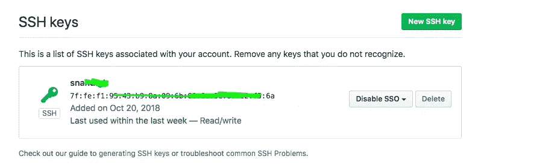

# 建立本地 Spark 开发环境

> 原文：<https://medium.com/analytics-vidhya/setting-up-local-spark-development-environment-41fc6e91b426?source=collection_archive---------17----------------------->


萨法尔·萨法罗夫在 [Unsplash](https://unsplash.com?utm_source=medium&utm_medium=referral) 上拍摄的照片

本文档描述了如何在本地机器上设置数据工程师的开发环境，以便在不需要任何云基础设施的情况下进行本地数据开发和测试。

**1。安装和配置智能集成开发环境:**

从[https://www.jetbrains.com/idea/download/](https://www.jetbrains.com/idea/download/)下载 IntelliJ 社区版，复制到一个像~/software/这样的文件夹。

使用所有默认设置安装下载的 IntelliJ 软件。出现提示时，将软件移至“应用程序”(适用于 Mac 安装)

## 2.安装和配置 git:

对于 Mac 用户来说，安装 git 最简单的方法是使用“自制”软件包管理器。

```
brew install git
```

否则 git 软件可以从[www.git-scm.com](http://www.git-scm.com/)安装并手动安装。

## 3.为 github 配置 SSH 密钥对:

Github(或 Stash/Gitlab 等。)可以用作 git 的存储库管理器。Git 库可以在 https://github.com/xxx/[查看。但是要从 github 克隆或拉一个存储库到本地，需要建立一个 SSH 隧道。也可以使用带有 https 的 Git 存储库链接，但这需要在每次与 github 交互时进行身份验证，这很烦人。](https://github.com/xxx/)

下面是创建 SSH 密钥对并将其添加到~/的步骤。ssh 文件夹。这将创建一个 ssh 密钥对、一个私钥文件(id_rsa)和一个公钥文件(id_rsa.pub)

```
ssh-keygen -t rsa -C “your_email@xxx.com”ssh-add ~/.ssh/id_rsa
```



从 id_rsa.pub 复制公钥，粘贴到 [github](https://github.com/settings/keys) 中，如下图所示。

## 4.下载 Apache Spark:

从[https://spark.apache.org/downloads.html](https://spark.apache.org/downloads.html)下载 Apache Spark 版本 2.0.2(或更高版本)，使用选项“为 Apache Hadoop 2.7 和更高版本预构建”。

使用 Mac 终端解压缩下载的文件

```
tar -xzvf spark-2.0.2-bin-hadoop2.7.tgz
```

将提取的文件夹复制到如下位置:~/software/

## 5.下载并安装 Java SDK:

从[http://www . Oracle . com/tech network/Java/javase/downloads/JDK 8-downloads-2133151 . html](http://www.oracle.com/technetwork/java/javase/downloads/jdk8-downloads-2133151.html)下载并安装 Java SDK 8

选择合适的操作系统。

## 6.下载并安装 Hadoop:

从[https://archive.apache.org/dist/hadoop/core/hadoop-2.7.2/](https://archive.apache.org/dist/hadoop/core/hadoop-2.7.2/)下载 Apache Hadoop 构建版本(二进制)

将提取的文件夹复制到如下位置:~/software/

## 7.下载并安装配置单元:

从 https://archive.apache.org/dist/hive/hive-1.2.1/[下载 Apache Hive 构建版本(二进制)](https://archive.apache.org/dist/hive/hive-1.2.1/)

将提取的文件夹复制到如下位置:~/software/

## 8.配置 bash 配置文件、主目录和路径:

转到主目录，将下面的命令添加到。bash_profile 文件。根据需要更改下面的路径。

```
export HADOOP_HOME=/Users/xxx/Softwares/hadoop-2.7.2
export JAVA_HOME=/Library/Java/JavaVirtualMachines/jdk1.8.0_161.jdk/Contents/Home
export SPARK_HOME=/Users/xxx/Softwares/spark-2.0.2-bin-hadoop2.7
export PYTHONPATH=${SPARK_HOME}/python:${PYTHONPATH}
export HIVE_HOME=/Users/xxx/Softwares/apache-hive-1.2.1-bin
export PATH=${HADOOP_HOME}/bin:${SPARK_HOME}/bin:${HIVE_HOME}/bin:${PATH}
```

可以用来查找 JAVA SDK 的安装位置，并将路径显式设置为 JAVA_HOME

```
echo $(/usr/libexec/java_home)
```

一旦添加了这些命令。bash_profile 文件需要源代码。

```
source .bash_profile
```

## 9.验证安装:

此时，java、hadoop、git、hive 和 spark 应该可以在本地 Mac 终端的任何位置正常工作。如果有错误，请核实并采取纠正措施。

## 10.创建 git 分支并克隆一个存储库:

由于 SSH 隧道是在步骤 3 中建立的，所以可以使用来自本地终端的 git 克隆将存储库克隆到特定的分支。

特定项目的 Git SSH url 可以在 github 中找到(例如 git clone—recurse-sub modules git @ github . com:XXX/XXX . git)

导航到将要克隆存储库的特定目录，并发出一个 git 克隆。

这将把代码从 git 下载到本地。此时，需要为变更跟踪创建一个单独的“分支”。一旦本地的变更被提交，该变更可以被合并到更高顺序的分支。

在本地 git 存储库目录中，发出下面的命令来创建并签出一个新的分支。

```
git checkout mastergit remote update -pgit pull origin mastergit checkout -b example_branch
```

这将首先使本地 git 主分支与远程同步，并从那里创建一个新分支。这样做是为了确保所有新的开发工作都是在最新的主副本之上开始的。

## 11.创建虚拟环境并安装项目需求:[](https://ghdocs.grubhub.com/architecture/systems/Data/marketingdataintegration-docs/installation/#11-create-virtual-environment-and-install-project-requirements)

需要为项目创建一个虚拟环境，其中可以安装项目特定的 python 包。这特别有帮助，因为大多数时候用户可能没有 root 权限来将包添加到基本 python 安装中，这也有助于保持基本安装的整洁和独立。

可以从 IntelliJ 或 Mac 终端创建虚拟环境。

从 IntelliJ 转到项目结构→ SDK，然后单击+号创建虚拟环境并将其分配给项目。

要从终端创建和激活虚拟环境，请发出以下命令:

`pip install virtualenvvirtualenv venvsource ./venv/bin/activate`

此时，项目可能需要一些额外的 python 包或依赖项。对于源代码和测试代码，它们可能已经在 requirement.txt 和 test_requirements.txt 文件中列出(或者以不同的名称列出)

来安装这些-

```
pip install -r requirements.txtpip install -r test_requirements.txt
```

这将安装所有的项目和测试需求。检查是否有任何错误，如果有，请解决这些错误。

## 12.安装 git 自动完成

安装 git autocomplete 可能是个好主意，这样可以节省发出完整 git 命令的时间。

对于 MacOs，可以按如下方式安装，如果已经安装了 git，请删除“git ”:

```
brew install git bash-completion
```

## 13.在中添加别名。bash_profile

创建经常发出的命令、EMR/EC ssh 命令等的别名。in ~/。bash_profile。这些非常方便，让我们不必记住特定的 ip 地址，发出完整的命令等等。

一些例子是:

```
alias azkaband=’sshpass -p {password} ssh xxx@dev-azkaban.xxx.com -o “StrictHostKeyChecking no”’alias azkabanp=’sshpass -p {password} ssh xxx@azkaban.xxx.com -o “StrictHostKeyChecking no”’alias foxy_d_gedid=’sshpass -p {password} ssh -ND 8157 xxx@dev-xxx.xxx.com’
```

非常基本的指令集，但是在设置新的开发环境时非常方便！