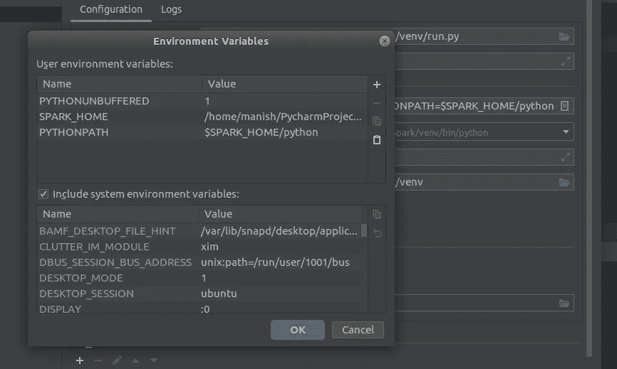

# 在 PyCharm IDE 上设置 PySpark 2.4 开发环境

> 原文：<https://medium.com/analytics-vidhya/setting-up-pyspark-2-4-development-environment-on-pycharm-ide-b32393f415b5?source=collection_archive---------11----------------------->

下面的文章将帮助您在 PyCharm IDE 中设置最新的 spark 开发环境。

最近 Python 包索引([https://pypi.org/](https://pypi.org/))中增加了 PySpark，因此 PyCharm 上的 PySpark 设置变得相当容易。按照下面的步骤，Spark 应该可以在 PyCharm 上正常工作。

首先我们需要从 Jetbrains 网站安装 PyCharm IDE。社区版可以免费下载。

 [## 下载 py charm:JetBrains 为专业开发人员提供的 Python IDE

### PyCharm 现在也可以作为快照包使用。如果你使用的是 Ubuntu 16.04 或更高版本，你可以从…

www.jetbrains.com](https://www.jetbrains.com/pycharm/download/#section=linux) 

随后遵循以下步骤。

1.  创建一个示例新项目，并将其命名为“Spark”。
    文件- >新建项目。

2.接下来我们需要从 PyPi 安装 PySpark 包到您本地安装的 PyCharm 上。
a .打开设置。文件- >设置。
b .在搜索栏中键入“项目解释器”并打开解释器。
c .点击表示添加包的“+”号。新窗口将弹出。
d .在搜索栏中键入“pyspark”并点击“安装包”按钮。这将把 pyspark 安装到您的本地 PyCharm 上。

3.如下创建一个样本 spark 作业来读取 csv 文件。此外，为这个示例创建一个示例 csv 文件，文件头和分隔符为“|”。

4.添加两个新的环境变量来运行 PySpark 作业。
a .打开“运行”选项卡，点击“编辑配置”。
b .根据您的选择命名运行配置，并将其指向我们之前创建的样本 spark 作业。

c.创建两个环境变量。
**SPARK _ HOME**=/<py charm 安装路径>/SPARK/venv/lib/python 3.6/site-packages/py SPARK
**python Path**= $ SPARK _ HOME/python

5.运行火花作业。如果它在控制台中显示如下快照所示的输出，我们可以确认已经安装了 spark。

6.享受星火发展。