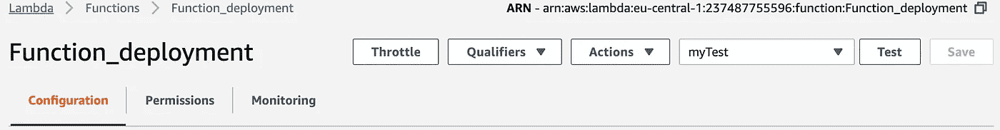

# 将 Python 脚本及其包设置为 Amazon Lambda 函数的 9 个步骤

> 原文：<https://medium.com/analytics-vidhya/setting-up-python-script-and-its-package-as-an-amazon-lambda-function-16f14d11d365?source=collection_archive---------12----------------------->

这是一个关于如何将 Python 脚本及其相关包设置为 Amazon Lambda 函数的文档。改编自*派尔宁*在【https://youtu.be/rDbxCeTzw_k】T2 的清晰解说。

**我有什么？**
- MacBook OS 的终端

我在努力实现什么？我只想建立一个可行的 Python 脚本，它使用一个特定的包作为 Amazon Lambda 函数。

这是使用 AWS Lambda 中的函数完成的。

**第一步:** 在自己的机器上创建一个文件夹。在这种情况下，我在我的 MacBook Pro 中创建了一个名为“AWS_Deployment”的应用程序。

在您的机器上创建一个文件夹。

**步骤 2:**
导航到终端中的 AWS_Deployment 文件夹，运行以下代码安装 python 包*请求*。“requests”只是一个例子，你可以用你想要的包名替换单词 *requests* 来安装其他的包。

然后它会自动下载必要的文件。

检查您自己计算机上的 AWS_Deployment 文件夹。曾经空的文件夹现在有了一些新的文件夹，里面有必要的文件。

**第三步:压缩文件夹** 选择 AWS_Deployment 文件夹中的所有内容，创建归档 Zip 文件。Archive.zip 是我们用来上传到 Amazon Lambda 的。

**第四步:在 AWS 创建亚马逊 Lambda 功能** 此时我们打开 AWS 账户，进入亚马逊 Lambda 功能页面。创建一个函数，并给它命名。选择 *Python* ，因为我们正致力于 Python 微服务。
这里的函数名是 Function_deployment。
点击*创建功能*并等待其被创建。

**第五步:上传 zip 文件** 页面重新加载后，选择*代码录入类型*下的上传 zip 文件选项，上传刚刚创建的 *Archive.zip* 。

点击*保存*后，您应该会看到下面的文件夹视图。

**第六步:创建要使用的 Python 函数**
接下来，创建保存要使用的函数的 Python 脚本。显然，这个函数将使用我们刚刚加载为 zip 文件的*请求*包。

改编来自 PyLenin 的代码，我要求代码执行对 GitHub 网站的 get 请求。

> 导入请求
> 
> def call_github(event=None，context = None):
> r = requests . get("[https://www.github.com](https://www.github.com)")
> 如果 r.status_code == 200:
> 返回"成功"

我们将把它保存为 *test.py* (作为 Functional_deployment 文件夹中的一个文件)，应该如下所示:

**第 7 步:更改右上角的处理程序信息** ，将处理程序信息(下图右上角)更改为 *test.call_github。
test* 来自 *test.py* ，call_github 是 *test.py* 内的函数(在 *test.py* 文件中寻找。)

**步骤 8:配置测试事件** 保存后点击 *Test，*需要创建测试事件，我称之为 *myTest* 。内容简单{}如下图。

在您点击 *Create* 之后，我们准备好测试代码，看看*请求*包是否被成功调用和使用。

第九阶段:测试它！
点击*测试。*确保 *myTest* 被选中。

我们应该看到绿色！和文本“它是成功的”。

就是这样。尝试使用您需要使用的其他软件包。