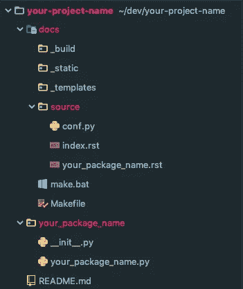
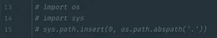
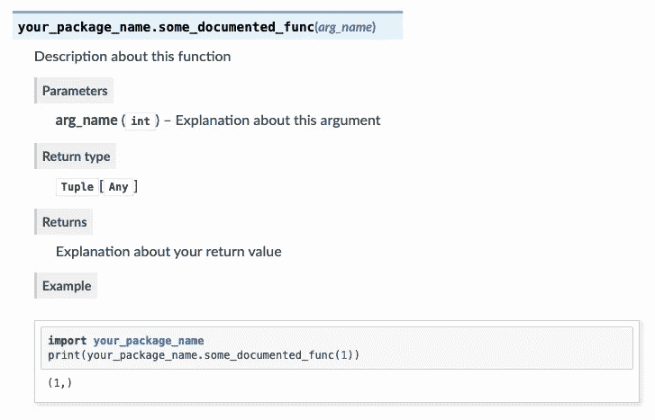
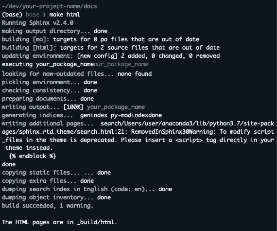
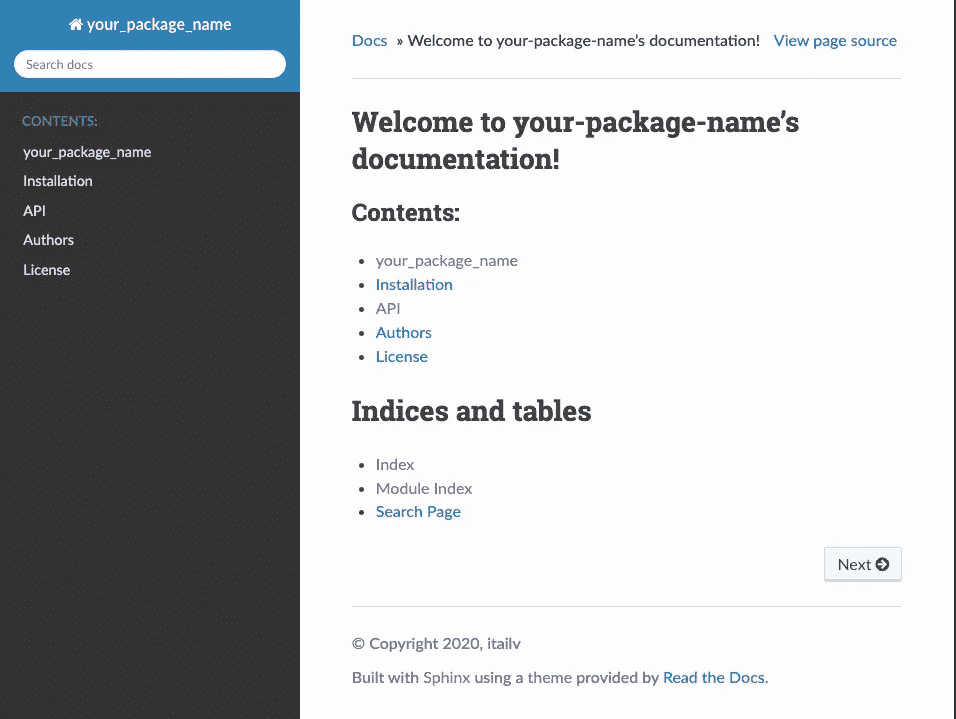
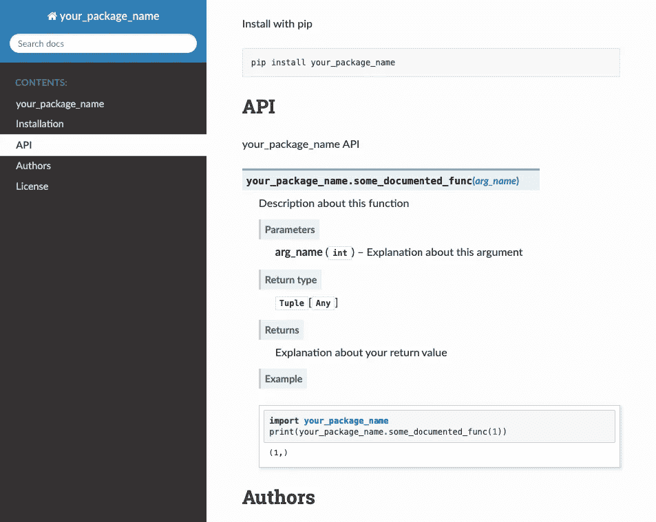

# 为 Python(\w typing)项目设置 ReadTheDocs & Jupyter-Execute。

> 原文：<https://medium.com/analytics-vidhya/setting-up-readthedocs-jupyter-execute-for-your-python-w-typing-project-b7e7858739e5?source=collection_archive---------9----------------------->

在本文中，我们将介绍如何从 Python 代码中自动生成文档。具体来说，使用 **Sphinx** 框架，ReadTheDocs theme &用于显示执行示例的 Jupyter-Execute 插件。

# 1:安装 Sphinx

## 用`pip`安装

Sphinx 是用 Python 写的，支持 Python 3.6+。

直接从 *PyPi* 安装

```
$ pip install -U sphinx
```

或者，从源安装

```
$ git clone [https://github.com/sphinx-doc/sphinx](https://github.com/sphinx-doc/sphinx)
$ cd sphinx
$ pip install .
```

## 用不同的软件包管理器安装

**Debiant/Ubuntu**

```
$ apt-get install python3-sphinx
```

如果它还没有出现，这将为您安装 Python。

**RHEL，CentOS**

使用 **yum** 安装`python-sphinx`:

```
$ yum install python-sphinx
```

**苹果电脑**

使用 **brew** 安装`python-sphinx`:

```
$ brew install sphinx-doc
```

# 2.初始化您的项目

如果还没有，我们将从为 python 项目创建一个基本的文件夹树开始。

```
$ mkdir your-project-name
$ cd your-project-name# Create another folder with the same name, where the python code will go. and this will be counted as the actual python package.
$ mkdir your_package_name
$ touch your_package_name/__init__.py
$ touch your_package_name/your_package_name.py$ touch README.md
```

Sphinx 为我们提供了名为`sphinx-quickstart`的命令行 util，它将为我们的项目文档初始化并生成一个配置。

我们将把我们的文档放在项目根目录下一个名为`docs`的文件夹中。将您自己置于`docs`并运行`sphinx-quickstart`，它将询问一些有默认值回答的问题，只需按 enter 键，让它做它的事情。

```
$ mkdir docs
$ cd docs
$ sphinx-quickstart
```

完成 sphinx-quickstart 后，创建一个`source`文件夹，并将两个`conf.py` & `index.rst`移动到其中。然后在其中创建一个 your_package_name `.rst`文件。

```
$ mkdir source
$ mv conf.py source
$ mv index.rst
$ touch source/your_package_name.rst
```

完成后，您的项目目录应该看起来像这样:



文件夹树示例

# 3.配置您的项目

在设置了有效构建所需的所有文件之后。我们需要开始改变一些配置。

**配置您的包的位置**

`conf.py`文件将包含这几个注释行。



会议. py

用这些行替换它们:

```
*import* os
*import* sys
sys.path.insert(0, os.path.abspath('../../'))
package_path = os.path.abspath('../..')
os.environ['PYTHONPATH'] = ':'.join((package_path, os.environ.get('PYTHONPATH', '')))
```

**向 Sphinx 扩展的添加扩展**

为了添加你的函数文件串，我们需要`sphinx.ext.autodoc`和`sphinx_autodoc_typehints`。

为了执行 jupyter 代码，我们将需要`jupyter_sphinx.execute`。

将这些添加到`extensions`列表后，它应该看起来像这样:

```
extensions = ['sphinx.ext.autodoc', 'sphinx_autodoc_typehints', 'jupyter_sphinx.execute']
```

**设置 ReadTheDocs 主题**

只需改变`html_theme`

```
html_theme = 'sphinx_rtd_theme'
```

**更改静态文件夹相对路径**

将`html_static_path`改为指向我们的`static`文件夹。

```
html_static_path = ['../_static/']
```

**改变源目录相对路径**

在`Makefile`中，将`SOURCEDIR`改为`source`

```
SOURCEDIR=source
```

在`make.bat`中，也进行更改

```
*set* SOURCEDIR=source
```

# 4.建立我们的。rst 文件

## `index.rst`

我们将从简单地向`index.rst`添加一行开始，它应该看起来像这样:

```
Welcome to your-package-name's documentation!
========================================

.. *toctree::
   :maxdepth:* 2
   *:caption:* Contents:

   your_package_name

Indices and tables
==================

* *:ref:*`genindex`
* *:ref:*`search`
```

这里我们只是添加到 Sphinx 为我们创建的简单框架中，通过在`toctree`之后添加`your_package_name`，我们确保 Sphinx 将索引它并在我们的文档中显示它。

**你的 _ 包 _ 名. rst**

这是我们所有文档创建和索引的地方，在这里你可以记录诸如如何安装你的包，许可证，作者等等。假设您已经有了文档的基本框架，如下所示:

```
your_package_name
------------------

.. *image::* your-package-logo.png

your package's description here

Installation
-----------------

Install with pip::

    pip install your_package_name
Authors
----------

Your name here

License
---------------

The package is released under the `MIT
License <https://opensource.org/licenses/MIT>`__.
```

现在，让我们进入最重要的部分，记录你的代码！

只需将这些行添加到`your_package_name.rst`文件中:

```
API
----

.. *automodule::* your_package_name
   *:members:*
```

这几行基本上会告诉我们的`sphix.ext.autodoc`扩展递归地记录包的所有成员(类、函数、异常),如果它们提供了 docstring 的话。

最终，`your_package_name.rst`应该是这样的:

```
your_package_name
------------------

your package's description here

Installation
-----------------

Install with pip

::

    pip install your_package_name

API
----

.. *automodule::* your_package_name
   *:members:* Authors
----------

Your name here

License
---------------

The package is released under the `MIT
License <https://opensource.org/licenses/MIT>`__.
```

# 5.编写文档字符串

现在我们需要开始使用 docstrings 记录我们的函数。目前我们告诉 sphinx 为文档索引我们的主包文件。

下面是一个如何通过键入来记录函数的示例:

对于每个参数，只需包含这一行

```
:param arg_name: Explanation about this argument
```

对于返回值:

```
:return: Explanation about your return value
```

为了显示带有`jupyter-execute`的示例，它看起来是这样的:

```
:example:    
.. jupyter-execute::

   import your_package_name        
   print(your_package_name.some_documented_func(1,2,3))
```

**综合起来，应该是这样的:**

```
"""    
Description about this function  

:param arg_name: Explanation about this argument   
:return: Explanation about your return value
:example:    
.. jupyter-execute::

   import your_package_name       
   print(your_package_name.some_documented_func(1))
"""
```

每个包含这个文档字符串和这个模板的函数都将被`autodoc`和`autodoc.typehints`解析，然后呈现在 API 部分。

现在，我们需要在我们的`__init__.py`文件中导出这些函数:看起来应该是这样的:

```
*"""your_package_name API
"""

from* .your_package_name *import* (some_documented_func)

__all__ = ["some_documented_func"]
```

这将确保选定的函数被导出，并且可以被 Sphinx 读取。

这将最终看起来像这样:



注意自动映射到我们的 docstring 的 typehints，还有 jupyter 执行块，多棒啊！

# 6。生成您的文档

最后也是最重要的一步，生成您的文档！

就这样做:

```
$ cd docs
$ make html
```

如果您正确执行了第 3 步，它应该会在您的`docs/build`文件夹中生成一个构建，命令输出应该如下所示:



然后，要打开您的文档，只需运行`open _build/html/index.html`，您应该会看到类似这样的内容:



当按下`API`进入时，你应该会看到你记录的功能:



这就对了。你得到了一些值得骄傲的文件。

您可以在我的 github 上的这个资源库中找到所有文件和一个示例项目:

[](https://github.com/itailv/sphinx-rtd-example) [## itailv/sphinx-RTD-示例

### 使用 Sphinx，ReadTheDocs & Autodoc 来记录您的项目- itailv/sphinx-rtd-example

github.com](https://github.com/itailv/sphinx-rtd-example)