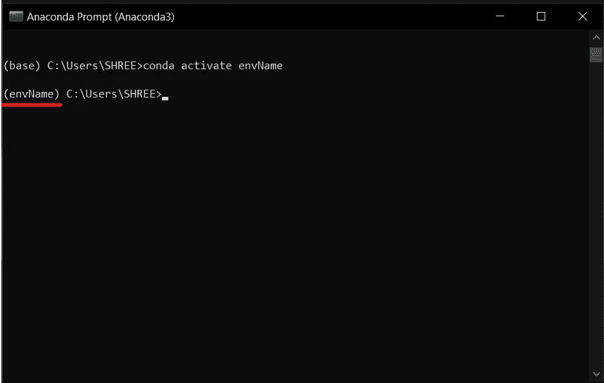

# 为机器学习建立工作环境。

> 原文：<https://medium.com/analytics-vidhya/setting-up-working-environment-for-machine-learning-a1b7affddc91?source=collection_archive---------9----------------------->


[自由股](https://unsplash.com/@freestocks?utm_source=medium&utm_medium=referral)在 [Unsplash](https://unsplash.com?utm_source=medium&utm_medium=referral) 上的照片

要从事机器学习项目，以正确的方式设置您的计算机非常重要。这篇文章将介绍什么是 Anaconda，什么是 Minconda，什么是 conda，以及如果你是 ML 从业者，为什么你应该了解它们。

无论你是独自工作还是在一个基于机器学习、深度学习的项目中团队工作，这些工具都为一致的体验提供了基础设施。

Anaconda、Miniconda 和 conda 为您提供了共享您的实验基础的能力，同时确保如果其他人想要复制您的工作，他们将拥有与您相同的工具。

Anaconda 和 Miniconda 是软件发行版。Anaconda 提供了超过 150 个数据科学包，你能想到的都有，而 Miniconda 提供了一些你需要的东西。

康达是一名包装经理。它通过处理安装、更新和删除来帮助你管理不同的包。

包是别人编写的一段代码，它可以运行，通常有特定的用途。包是有帮助的，因为没有它们，你将不得不写更多的代码来完成你需要做的事情。

## 设置环境:

1.  进入 [**蟒蛇分布页面**](https://www.anaconda.com/products/individual) 。


你会在 Anaconda 发行页面上找到什么。为您的机器选择正确的发行版。

2.为您的计算机下载合适的 Anaconda 发行版。除非你有特定的原因，否则下载最新版本是个好主意。就我而言，我下载了 Windows Python 3.8 64 位图形安装程序。

3.下载完成后，双击下载文件来完成设置步骤，一切保持默认。这将在您的计算机上安装 Anaconda。这可能需要几分钟的时间，并且您需要多达 3 GB 的可用空间。

4.要检查安装，从开始菜单打开 Anaconda 提示符。如果成功，您会看到`(base)`出现在您的名字旁边。


要查看您刚刚安装的所有工具(包)，请键入代码`conda list`并按回车键。

您应该看到的是四列。名称、版本、内部版本和频道。

**名称**是包的名称。记住，包是别人写的代码的集合。

**版本**是这个包的版本号，而**版本**是这个包的 Python 版本。现在，我们不会担心这些，但是你应该知道一些项目需要特定的版本和内部版本号。

通道是包来自的 Anaconda 通道，没有通道意味着默认通道。


## 环境创建:

为每个新项目创建一个新环境是一个很好的实践。要创建新环境，您可以键入:


```
conda create --name envName python
```

*   现在创建了一个名为 envName 的新环境
*   这样(在命令中没有提到 python 版本)，就创建了一个 python 最新版本的环境。
*   但是如果你需要一个特定的 python 版本，比如说 2.7，使用下面的命令。

```
conda create --name envName python=2.7
```

## 环境激活:

*   现在，您已经根据自己的需要创建了环境。
*   要在那种环境下工作，你需要 ***激活*** 它。
*   使用以下命令。

```
conda activate envName
```



好了，现在我们知道已经安装了 Anaconda，让我们在这个环境中使用`conda install PackageName`安装特定于您的项目的包

在做了一些研究之后，您发现您需要的工具(包)是:

*   [Jupyter 笔记本](https://jupyter.org/)——用于编写 Python 代码、运行实验以及与他人交流您的工作。
*   [熊猫](https://pandas.pydata.org/)——用于探索和操纵数据。
*   [NumPy](https://numpy.org/) —用于对数据进行数值运算。
*   [Matplotlib](https://matplotlib.org/) —用于创建您的发现的可视化。
*   sci kit-learn——也称为 sklearn，用于构建和分析机器学习模型。

如果你以前从未用过这些，不要担心。重要的是要知道，如果您按照上面的步骤安装了 Anaconda，那么这些包也已经安装了。Anaconda 自带了许多现成的最流行和最有用的数据科学工具。上面的也不例外。


使用`conda env list`命令，您可以找到创建的所有环境的列表。您可以通过在列表中看到星号(' * ')来区分活动环境。

要了解当前环境的详细信息，我们可以使用以下命令。


```
conda info
```

## 使应用程序依赖关系在不同的环境中可用:

当处理一个团队项目时，为了在你的队友系统上执行项目，你需要相同的依赖关系。在这种情况下，您可以创建一个 requirements.txt 文件。

今天最常用的 python 包管理器是 **pip，**用于安装和管理 Python 软件包，可以在 [Python 包索引](http://pypi.python.org/pypi)中找到。Pip 帮助我们，python 开发者，毫不费力地“手动”控制从他们的在线存储库中可公开获得的 Python 包的安装和生命周期。

操作将类似于下面的操作:

*   创建虚拟环境
*   使用`$pip install <package>`命令安装软件包。
*   用`pip freeze > requirements.txt.`保存文件中的所有包，记住在这种情况下，requirements.txt 文件将列出环境中已经安装的所有包，不管它们来自哪里。
*   如果你打算与世界其他地方共享这个项目，你需要通过运行`$pip install -r requirements.txt`来安装依赖项

# 环境停用:

*   如果您希望 ***取消激活*** 当前环境，使用以下命令。

```
conda deactivate
```

*   执行上述命令后，当前环境被停用，基础环境被激活。

> 注意:停用不会删除环境。

# 环境移除:

*   如果要 ***删除*** 一个环境，使用以下命令。

```
conda env remove — name envName
```

*   使用上述命令可以删除`envName`环境。为了让这个命令发挥作用，`envName`不应该成为活跃的环境。

对于 Anaconda、Miniconda 和 conda，您还可以做更多的事情，本文只是触及了皮毛。

如果你想了解更多，我建议[查阅文档](https://docs.anaconda.com/)。通读它帮助我写了这篇文章。

我希望这可能有助于您对 Anaconda 环境的基本理解和实现。欢迎在下面评论。

谢谢:)