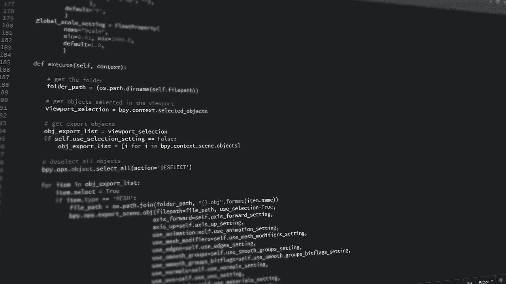
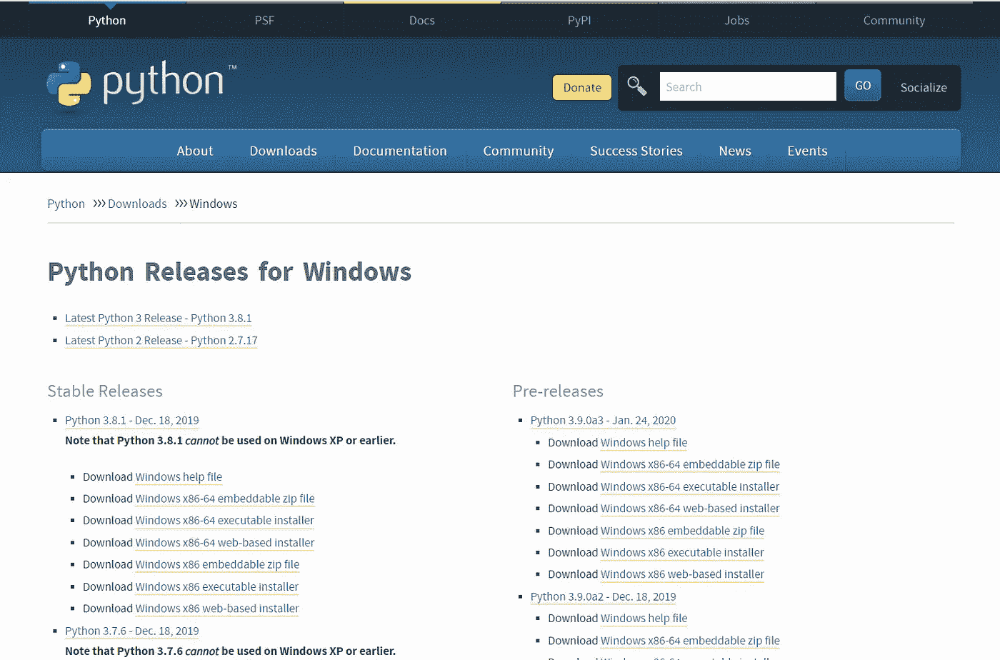
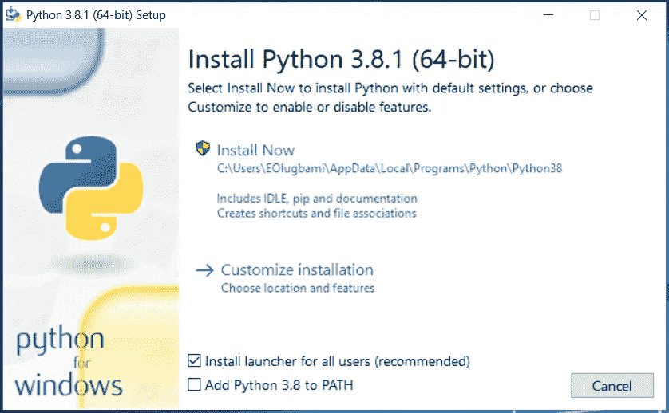
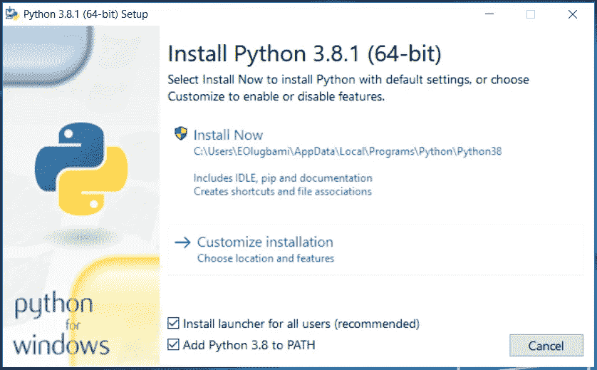
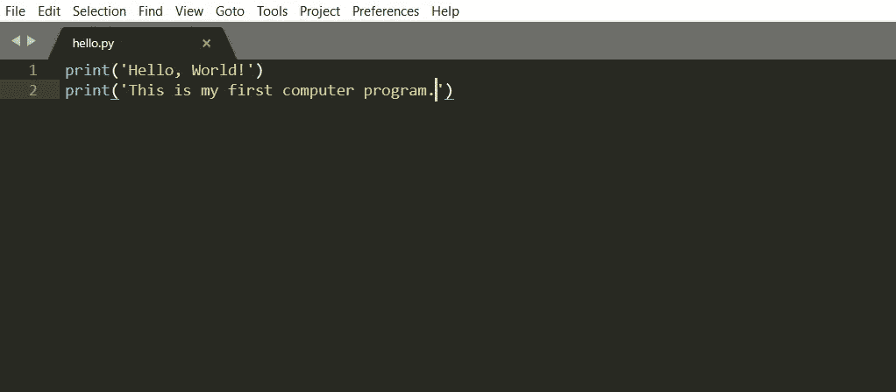
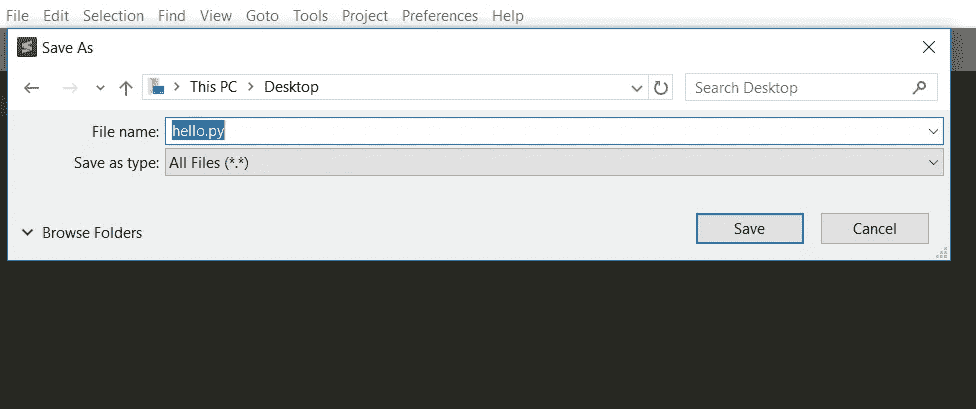
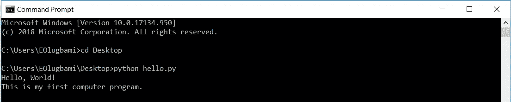

# 在 Windows 上设置 Python 开发环境

> 原文：<https://medium.com/analytics-vidhya/setting-up-your-python-3-development-environment-on-windows-26d912da9d2f?source=collection_archive---------12----------------------->



> 你有没有想过怎样才能成为一名电脑程序员？

嗯，成为一名计算机程序员有时会被证明是一项艰巨的任务/旅程，你可能会认为你需要成为某种类型的天才或者参加一些昂贵的硕士课程来学习。虽然情况可能是这样，但有时，总会有例外。使用 python 和其他类似的编程语言，您可以在两到三天内掌握基本知识。

使用任何编程语言时，您需要做的一件关键事情是建立一个允许您编写和执行代码的开发环境。你的 python 开发环境的核心是 **python 解释器；一个读取并执行你的代码的程序。在这篇文章中，我将向你展示如何建立你的 Python 开发环境，并帮助你编写你的第一个计算机程序。完成这篇文章是你朝着正确方向迈出的第一步。**

# **安装 Python 3**

几个操作系统都安装了 python 其他的提供了一个包管理器，可以运行它来安装 python。另一种方法是建立网站，允许您在线访问 python 解释器，而无需在本地机器上安装。

不管是哪种情况，如果你必须自己建立你的编程环境，那么这个指南会有很大的帮助。

在你的 windows 机器上安装 python 就像从官方 python 网站[python.org](https://www.python.org/downloads/windows/)下载安装程序并运行它一样简单。

*   在浏览器中，导航至[python.org](https://www.python.org/downloads/windows/)。在这里，您可以选择您喜欢的 python 版本或下载最新版本。为了演示，我们将坚持使用 windows 的最新版本。滚动到稳定版本部分，在这里您可以根据系统的处理器选择 32 位或 64 位安装程序。如果你不确定选择哪个版本，就用[Windows x86–64 可执行安装程序](https://www.python.org/ftp/python/3.8.1/python-3.8.1-amd64.exe)。



从 python.org 下载 python 3 安装程序

*   一旦你决定了哪个版本并下载了安装程序，继续运行安装程序。你应该有这样的东西:



安装 python 3

```
Make sure to check the box to Add Python 3.x to PATH; this ensures that the python interpreter is in your execution path.
```



安装 python 3

最后，点击“立即安装”,等待安装完成。您现在在本地机器上有了一个可以工作的 Python 3。

# **安装代码编辑器**

在成功安装了您选择的 python 版本后，您将需要一个文本编辑器来编写脚本。有几种选择，但我会建议崇高的文本；这是一个简单但超快的跨平台源代码编辑器，天真地支持许多编程语言和标记语言。

> Microsoft Word 不是文本/代码编辑器，而是文字处理器，它不支持计算机程序的编写和执行。

使用 sublime text 很容易。在你的浏览器中导航到 [Sublime Text 3](https://www.sublimetext.com/3) 主页，下载安装程序，并按照安装程序进行。

# **写你的第一个剧本**

此时，您的计算机应该已经正确设置好了，python 也在安装过程中添加到了您的 path 变量中，让我们验证一下一切都正常工作。

打开崇高的文本，键入一个“你好，世界！”消息如下:



写你的第一个剧本

继续用一个您能记住的名称保存文件，并保存到一个易于导航的位置。为了演示，我将把我的保存到我的桌面上，命名为`hello.py`



保存 python 脚本

最后，启动您的终端(命令提示符)并将目录`cd` 切换到该目录，并运行:

```
python hello.py
```

您应该在您的终端上看到与我相同的输出。



运行 python 脚本

恭喜你，你成为 python 程序员的旅程才刚刚开始。